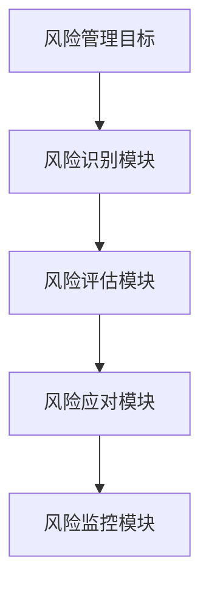

                 


# 彼得·林奇如何看待公司的风险管理

> 关键词：风险管理，彼得·林奇，投资理念，风险管理框架，数学模型，系统架构

> 摘要：本文从彼得·林奇的投资理念出发，详细探讨了他在公司风险管理中的独特见解。通过分析风险管理的核心概念、策略与方法，结合数学模型和系统架构，提供了一套完整的风险管理理论体系，并通过实际案例展示了如何将这些理论应用于企业实践中。

---

## 目录

### 第一部分: 引言

#### 第1章: 风险管理的重要性

##### 1.1 风险管理的定义与背景
- 1.1.1 风险的定义
  - 风险是未来结果的不确定性，通常表现为损失的可能性。
- 1.1.2 风险管理的核心概念
  - 风险识别、评估、应对和监控。
- 1.1.3 彼得·林奇与风险管理的联系
  - 彼得·林奇以其成功的投资策略和风险管理方法闻名。

##### 1.2 彼得·林奇的投资理念
- 1.2.1 彼得·林奇的生平简介
  - 他是一位著名投资经理，以管理富达麦哲伦基金而闻名。
- 1.2.2 彼得·林奇的投资哲学
  - 他强调长期投资和价值发现。
- 1.2.3 彼得·林奇与风险管理的关系
  - 他将风险管理视为投资成功的关键因素。

##### 1.3 本书的核心目标
- 1.3.1 理解彼得·林奇的风险管理方法
- 1.3.2 应用风险管理理论于企业实践
- 1.3.3 提供风险管理的实战指南

### 第二部分: 风险管理的核心概念

#### 第2章: 风险管理的基本框架

##### 2.1 风险管理的框架体系
- 2.1.1 风险识别
  - 识别潜在风险源，如市场风险、信用风险等。
- 2.1.2 风险评估
  - 量化风险的影响程度和发生概率。
- 2.1.3 风险应对
  - 制定应对策略，如分散投资、对冲等。

##### 2.2 风险管理的工具与方法
- 2.2.1 风险评估矩阵
  - 使用矩阵分析风险的严重性和可能性。
- 2.2.2 风险量化模型
  - 利用VaR（在险价值）等模型量化风险。
- 2.2.3 风险对冲工具
  - 使用衍生品对冲风险。

##### 2.3 风险管理的数学模型
- 2.3.1 风险值（VaR）的计算公式
  $$ VaR = \mu + z \cdot \sigma $$
  - 其中，$\mu$ 是平均回报率，$z$ 是标准正态分布的分位数，$\sigma$ 是标准差。
- 2.3.2 风险调整后的回报（RAROC）公式
  $$ RAROC = \frac{ROE}{VaR} $$
  - 其中，ROE 是风险调整后的收益，VaR 是在险价值。

### 第三部分: 风险管理的策略与方法

#### 第3章: 风险管理的防御性策略

##### 3.1 风险规避
- 3.1.1 风险规避的定义
  - 完全避免投资于高风险资产。
- 3.1.2 风险规避的适用场景
  - 当风险过高时，选择不投资。
- 3.1.3 彼得·林奇的风险规避案例
  - 例如，避免投资于高波动性的科技股。

##### 3.2 风险分散
- 3.2.1 分散投资的概念
  - 将资金分散投资于不同的资产类别以降低风险。
- 3.2.2 分散投资的风险降低原理
  - 根据现代资产组合理论，分散投资可以降低非系统性风险。
- 3.2.3 彼得·林奇的分散投资策略
  - 他倾向于投资于多个行业的公司以分散风险。

##### 3.3 风险对冲
- 3.3.1 对冲的定义与原理
  - 使用衍生品来抵消潜在损失。
- 3.3.2 对冲基金的运作模式
  - 利用做多和做空策略对冲市场风险。
- 3.3.3 彼得·林奇对对冲策略的看法
  - 他认为对冲策略可以有效降低风险，但需要谨慎选择对冲工具。

### 第四部分: 风险管理的系统架构

#### 第4章: 风险管理系统设计

##### 4.1 风险管理系统概述
- 4.1.1 系统目标
  - 实时监控和管理公司风险。
- 4.1.2 系统架构
  - 包括数据采集、风险评估、风险应对和报告模块。
- 4.1.3 系统功能模块
  - 数据采集模块、风险评估模块、风险应对模块和风险报告模块。

##### 4.2 风险管理系统架构图


##### 4.3 系统功能设计
- 4.3.1 风险识别模块
  - 通过数据分析和市场研究识别潜在风险。
- 4.3.2 风险评估模块
  - 使用VaR等模型量化风险影响。
- 4.3.3 风险应对模块
  - 制定和执行风险应对策略。
- 4.3.4 风险监控模块
  - 实时监控风险变化并调整应对策略。

### 第五部分: 项目实战

#### 第5章: 风险管理的项目实施

##### 5.1 环境安装
- 5.1.1 安装必要的软件和工具
  - 如Python、Jupyter Notebook、Mermaid工具等。
- 5.1.2 安装风险管理相关的库
  - 如Pandas、NumPy、Scipy等用于数据分析。

##### 5.2 系统核心实现源代码
- 5.2.1 风险评估模型的实现
```python
import numpy as np
import pandas as pd

def calculate VaR(returns, confidence_level=0.95):
    sorted_returns = np.sort(returns)
    threshold = (1 - confidence_level) * len(sorted_returns)
    VaR = -sorted_returns[int(threshold)]
    return VaR
```

##### 5.3 代码应用解读与分析
- 5.3.1 风险评估模型的应用
  - 使用历史收益率数据计算VaR值，以评估潜在损失。
- 5.3.2 系统架构的应用
  - 实现模块化设计，确保各功能模块协同工作。

##### 5.4 实际案例分析和详细讲解剖析
- 5.4.1 案例分析
  - 例如，分析一家公司的财务数据，识别和评估其主要风险，制定应对策略。
- 5.4.2 详细讲解剖析
  - 从数据采集、风险识别、评估、应对到监控，全面展示风险管理的实施过程。

##### 5.5 项目小结
- 5.5.1 项目总结
  - 强调风险管理在企业运营中的重要性。
- 5.5.2 实践中的注意事项
  - 提醒读者在实际操作中需注意数据质量和模型的适用性。

### 第六部分: 结论

#### 第6章: 结论与展望

##### 6.1 本书的核心内容总结
- 彼得·林奇的风险管理理念和方法。
- 风险管理的核心概念和数学模型。
- 系统架构和项目实战经验。

##### 6.2 未来的研究方向
- 6.2.1 新兴风险管理工具的研究
  - 如人工智能在风险管理中的应用。
- 6.2.2 风险管理的国际化趋势
  - 探讨全球化背景下风险管理的新挑战。

##### 6.3 最佳实践 tips
- 6.3.1 风险管理的关键步骤
  - 定期评估和调整风险管理策略。
- 6.3.2 小结
  - 强调风险管理在企业长期成功中的作用。
- 6.3.3 注意事项
  - 提醒读者在实际应用中需结合具体情境灵活调整策略。
- 6.3.4 拓展阅读
  - 推荐其他风险管理相关的书籍和资源。

---

### 作者：AI天才研究院/AI Genius Institute & 禅与计算机程序设计艺术/Zen And The Art of Computer Programming

