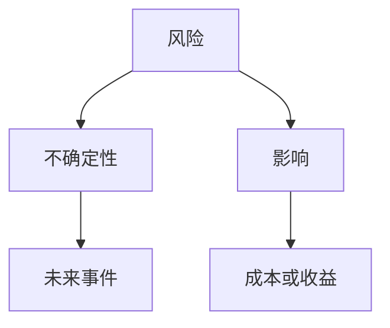
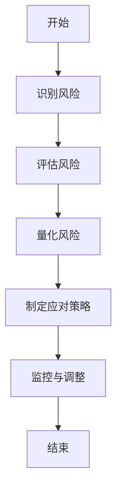
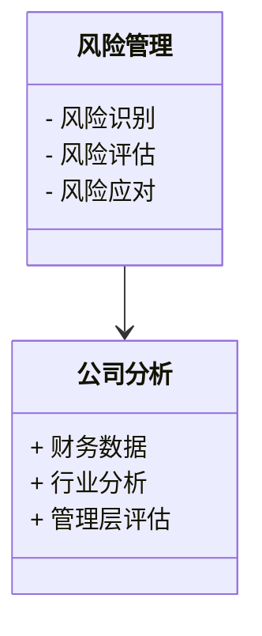
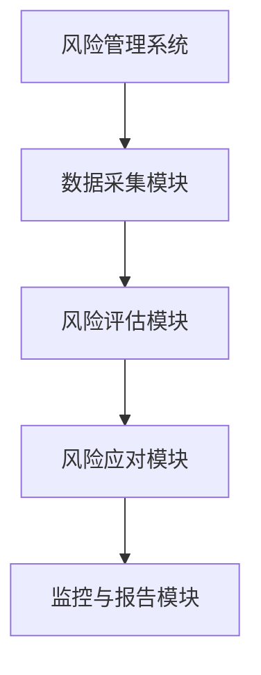
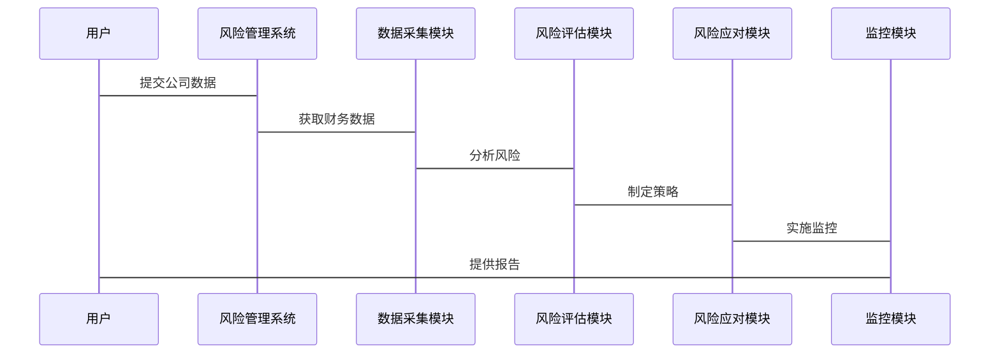

                 


# 彼得林奇如何看待公司的风险管理策略

## 关键词：风险管理，彼得·林奇，投资哲学，公司分析，风险管理框架

## 摘要：  
彼得·林奇作为一位传奇的投资经理，他的成功不仅源于对市场的深刻理解，更在于他对风险管理的高度重视。本文将从风险管理的核心概念、彼得·林奇的独特视角、数学模型与算法原理、系统架构设计、项目实战案例以及最佳实践等多个维度，全面分析彼得·林奇的风险管理策略。通过详细讲解风险管理的原理和应用，结合实际案例，为读者提供深刻的见解和实用的指导。

---

## 第一部分：风险管理的核心概念与框架

### 第1章：风险管理的基本概念

#### 1.1 风险管理的定义与重要性
- **风险管理的定义**：风险管理是指识别、评估和应对可能影响企业目标的不确定性因素的过程。  
- **风险管理的重要性**：它是企业稳健运营的核心，能够帮助企业降低损失、抓住机会，并在复杂环境中保持竞争力。  

#### 1.2 彼得·林奇与风险管理
- **彼得·林奇的简介**：彼得·林奇是富达投资的传奇经理，以管理麦哲伦基金并实现卓越回报而闻名。  
- **彼得·林奇的投资哲学**：他强调基本面分析和长期投资，认为风险管理是投资成功的关键。  

#### 1.3 风险管理的背景与问题背景
- **当前企业风险管理的现状**：随着市场的不确定性增加，企业风险管理变得越来越重要。  
- **企业风险管理中的常见问题**：包括风险识别不全、量化不足、应对措施不及时等。  
- **风险管理的边界与外延**：风险管理不仅涉及财务风险，还包括操作风险、市场风险等。  
- **风险管理的核心要素**：包括风险识别、评估、应对和监控。

---

### 第2章：风险管理的核心概念与联系

#### 2.1 风险管理的核心概念原理
- **风险的来源与分类**：市场风险、信用风险、操作风险、流动性风险等。  
- **风险的度量与评估**：使用VaR（风险价值）等指标量化潜在损失。  
- **风险的控制与应对策略**：包括风险规避、转移、减轻和接受。  

#### 2.2 核心概念属性特征对比表
| 风险类型       | 特征                       |
|----------------|----------------------------|
| 市场风险       | 受市场波动影响较大         |
| 信用风险       | 与债务相关，涉及还款能力   |
| 操作风险       | 由内部流程或人为错误引起   |
| 流动性风险       | 资产转化为现金的能力受限     |

#### 2.3 风险管理的ER实体关系图


---

## 第三部分：彼得·林奇的风险管理方法

### 第3章：彼得·林奇的风险管理方法

#### 3.1 彼得·林奇的投资策略
- **价值投资的核心理念**：寻找被市场低估的公司，长期持有，等待价值回归。  
- **风险管理在价值投资中的地位**：林奇强调，风险管理是投资成功的关键，避免重大损失比追求高收益更重要。  

#### 3.2 彼得·林奇的风险管理框架
- **风险识别与评估**：通过基本面分析识别潜在风险，如财务健康状况、行业竞争环境等。  
- **风险分析与量化**：使用财务指标（如市盈率、市净率）和行业基准进行风险量化。  
- **风险应对与控制**：通过分散投资、设定止损点等方法控制风险。  

#### 3.3 彼得·林奇的公司分析方法
- **财务健康状况评估**：关注公司的盈利能力、负债情况和现金流。  
- **行业地位与竞争优势**：分析公司在行业中的地位和核心竞争力。  
- **管理层能力评估**：信任有能力且诚信的管理层。  

---

## 第四部分：风险管理的数学模型与算法原理

### 第4章：风险管理的数学模型与算法原理

#### 4.1 风险评估的数学模型
- **风险价值（VaR）模型**：计算在一定置信水平下的潜在损失。  
  $$ \text{VaR} = \mu + z \cdot \sigma $$  
  其中，$\mu$ 是平均损失，$z$ 是标准正态分布的分位数，$\sigma$ 是标准差。  
- **风险调整后的收益（RAROC）模型**：衡量风险调整后的收益。  
  $$ \text{RAROC} = \frac{\text{净利润}}{\text{风险资本}} $$  

#### 4.2 风险管理的算法流程图


#### 4.3 风险管理的Python代码实现
```python
import numpy as np
import pandas as pd

# 示例数据：历史收益率
returns = np.array([0.05, -0.02, 0.03, 0.01, -0.04])

# 计算VaR
mu = np.mean(returns)
sigma = np.std(returns)
z = 1.96  # 95%置信水平
VaR = mu + z * sigma

print(f"VaR at 95% confidence level: {VaR}")
```

---

## 第五部分：系统分析与架构设计

### 第5章：系统分析与架构设计

#### 5.1 领域模型类图


#### 5.2 系统架构图


#### 5.3 系统交互序列图


---

## 第六部分：项目实战

### 第6章：项目实战

#### 6.1 环境安装
- 安装Python和必要的库（如NumPy、Pandas、Matplotlib）。  

#### 6.2 核心实现代码
```python
import numpy as np

def calculate VaR(data, confidence_level=0.95):
    mu = np.mean(data)
    sigma = np.std(data)
    z = np.percentile(np.random.standard_normal(10000), confidence_level * 100)
    VaR = mu + z * sigma
    return VaR

# 示例数据
data = np.array([0.05, -0.02, 0.03, 0.01, -0.04])
print(f"VaR: {calculate_VaR(data)}")
```

#### 6.3 代码应用解读与分析
- 上述代码计算了在95%置信水平下的VaR值，展示了如何量化市场风险。  

#### 6.4 案例分析
- 以某公司为例，分析其财务状况、行业地位和管理层能力，应用彼得·林奇的方法评估其风险，并制定相应的风险管理策略。

---

## 第七部分：总结与最佳实践

### 第7章：总结与最佳实践

#### 7.1 小结
- 彼得·林奇的风险管理策略强调基本面分析、分散投资和稳健操作。  

#### 7.2 注意事项
- 风险管理需要结合定量分析和定性判断，避免过于依赖单一模型。  

#### 7.3 未来趋势
- 随着大数据和人工智能的发展，风险管理将更加智能化和精准化。  

#### 7.4 拓展阅读
- 推荐阅读《彼得·林奇的投资哲学》和《风险管理与金融创新》。

---

## 作者信息
作者：AI天才研究院/AI Genius Institute  
联系邮箱：contact@aicourse.com  

--- 

通过以上内容，我们详细探讨了彼得·林奇的风险管理策略，并结合理论与实践，为读者提供了全面的指导。希望这篇文章能帮助您更好地理解和应用风险管理的方法。

