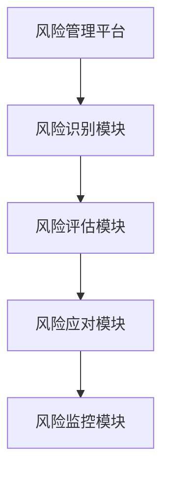
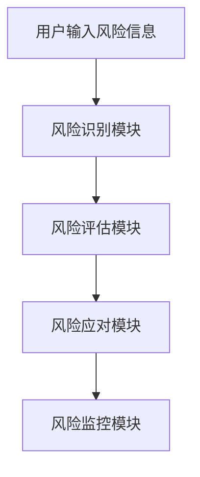
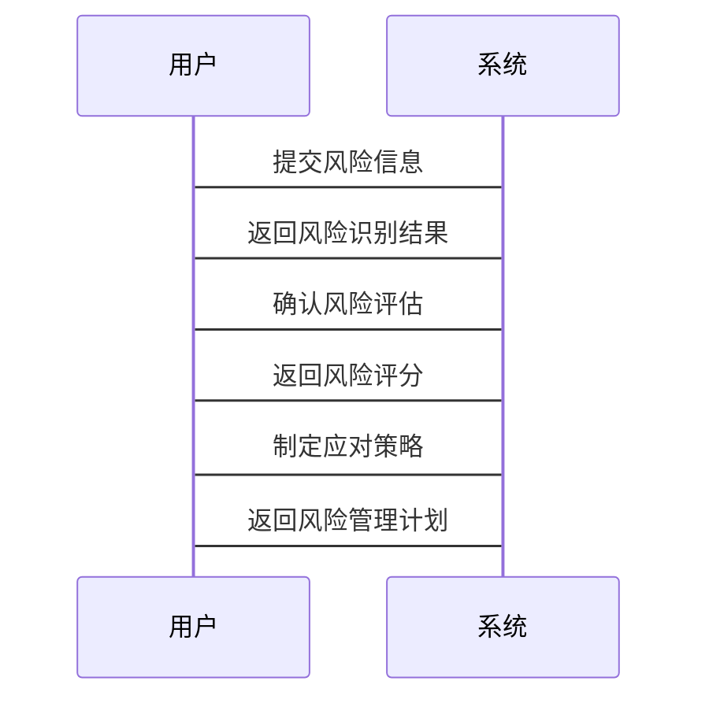

                 


# 彼得·林奇如何看待公司的风险管理能力

## 关键词：风险管理，彼得·林奇，投资策略，风险评估，风险应对，企业风险管理

## 摘要：  
本文深入探讨了彼得·林奇对风险管理的独到见解，分析了公司在风险管理中的核心能力。文章从风险管理的基本概念入手，结合彼得·林奇的投资理念，详细阐述了风险管理的核心要素、系统架构与实现，以及如何在实际项目中应用风险管理策略。通过丰富的实例和系统的分析，文章旨在为读者提供全面的理论指导和实践建议。

---

## 第1章：风险管理的核心概念

### 1.1 风险管理的基本概念

#### 1.1.1 风险的定义与特征
- 风险是指在特定条件下，某事件发生可能导致的损失或收益的不确定性。
- 风险具有普遍性、客观性、可测性和可控性特征。

#### 1.1.2 风险管理的内涵与外延
- 风险管理是通过识别、评估和应对风险，以降低其负面影响的过程。
- 外延涵盖企业战略、运营、财务等多个方面。

#### 1.1.3 风险管理的核心要素与组成
- 风险识别：发现潜在风险。
- 风险评估：量化风险的可能性和影响。
- 风险应对：制定应对策略。
- 风险监控：持续跟踪风险状态。

### 1.2 彼得·林奇的视角

#### 1.2.1 彼得·林奇的投资理念
- 林奇强调长期投资和价值投资，注重企业的基本面分析。
- 他提倡分散投资，以降低特定风险。

#### 1.2.2 风险管理在投资中的重要性
- 风险管理是投资成功的关键因素之一。
- 林奇认为，成功的投资不在于预测市场，而在于管理风险。

#### 1.2.3 林奇的风险管理框架
- 通过分散投资降低非系统性风险。
- 选择具有强大财务状况和良好管理团队的企业。

### 1.3 风险管理的重要性

#### 1.3.1 风险管理对企业的价值
- 降低企业损失，保障企业稳健运营。
- 提高企业的抗风险能力，增强市场竞争力。

#### 1.3.2 风险管理与企业可持续发展
- 有效管理风险是企业长期发展的基石。
- 风险管理促进企业战略的顺利实施。

#### 1.3.3 风险管理与企业价值的关系
- 良好的风险管理能力可以提升企业价值。
- 风险管理是企业价值评估的重要组成部分。

---

## 第2章：风险管理的核心要素分析

### 2.1 风险识别

#### 2.1.1 风险识别的方法与工具
- 定性分析：通过经验判断识别风险。
- 定量分析：利用数据和模型识别风险。
- 问卷调查和访谈法：收集内部和外部反馈。

#### 2.1.2 风险识别的关键步骤
- 确定目标：明确识别范围和目的。
- 收集信息：全面收集相关信息。
- 分析风险：整理和分类风险。

#### 2.1.3 彼得·林奇的风险识别策略
- 通过企业基本面分析识别行业风险。
- 关注管理层的诚信和能力。

### 2.2 风险评估

#### 2.2.1 风险评估的指标与模型
- 风险概率：风险发生的可能性。
- 风险影响：风险对企业的影响程度。
- 风险评分模型：综合评估风险等级。

#### 2.2.2 风险概率与影响分析
- 使用概率树模型进行定量分析。
- 结合定性和定量方法综合评估。

#### 2.2.3 彼得·林奇的风险评估框架
- 评估企业的财务健康状况。
- 分析行业周期和市场环境。

### 2.3 风险应对

#### 2.3.1 风险应对的策略与方法
- 风险规避：避免高风险投资。
- 风险减轻：采取措施降低风险影响。
- 风险转移：通过保险或合同转移风险。
- 风险接受：在可接受范围内承担风险。

#### 2.3.2 彼得·林奇的风险应对原则
- 通过分散投资降低市场风险。
- 选择具有强大护城河的企业。

### 2.4 风险监控

#### 2.4.1 风险监控的流程与工具
- 建立风险监控机制，定期评估风险状态。
- 使用KPI和预警指标进行实时监控。

#### 2.4.2 风险指标与预警机制
- 设定关键风险指标（KRI），如财务指标和市场指标。
- 建立预警机制，及时发现和应对风险。

#### 2.4.3 彼得·林奇的风险监控实践
- 定期评估投资组合的风险状况。
- 根据市场变化调整投资策略。

---

## 第3章：风险管理的系统架构与实现

### 3.1 系统功能设计

#### 3.1.1 风险识别模块
- 收集和分析潜在风险因素。
- 提供风险清单和初步评估结果。

#### 3.1.2 风险评估模块
- 计算风险的概率和影响。
- 生成风险评分和优先级排序。

#### 3.1.3 风险应对模块
- 提供多种应对策略建议。
- 制定风险管理计划和行动方案。

#### 3.1.4 风险监控模块
- 实时跟踪风险状态。
- 提供风险变化的预警信息。

### 3.2 系统架构设计

#### 3.2.1 系统功能架构图


#### 3.2.2 系统数据流图


### 3.3 系统接口设计

#### 3.3.1 风险识别接口
- 输入：企业基本面数据。
- 输出：风险识别结果。

#### 3.3.2 风险评估接口
- 输入：风险概率和影响数据。
- 输出：风险评分和优先级。

### 3.4 系统交互设计

#### 3.4.1 风险管理流程图


---

## 第4章：风险管理的项目实战

### 4.1 项目环境搭建

#### 4.1.1 工具安装
- 安装Python和相关库（如Pandas、Matplotlib）。
- 配置开发环境（如Jupyter Notebook）。

#### 4.1.2 数据准备
- 收集企业财务数据和市场数据。
- 整理和清洗数据。

### 4.2 核心实现

#### 4.2.1 风险识别实现
```python
import pandas as pd

# 数据加载
data = pd.read_csv('risk_factors.csv')

# 风险识别
def identify_risk(data):
    risk_factors = data[data['score'] > 0.7]
    return risk_factors

identified_risks = identify_risk(data)
print(identified_risks)
```

#### 4.2.2 风险评估实现
```python
import numpy as np

# 计算风险概率和影响
def assess_risk(data):
    probabilities = np.random.dirichlet(np.ones(len(data['risk_factors'])), size=1)
    impacts = np.random.normal(0.5, 0.1, len(data['risk_factors']))
    return probabilities, impacts

probabilities, impacts = assess_risk(data)
print("风险概率:", probabilities)
print("风险影响:", impacts)
```

#### 4.2.3 风险应对实现
```python
def develop_plan(probabilities, impacts):
    plan = {}
    for i in range(len(probabilities)):
        if probabilities[i] > 0.6 or impacts[i] > 0.7:
            plan['应对策略'] = '转移风险'
        else:
            plan['应对策略'] = '接受风险'
    return plan

response_plan = develop_plan(probabilities, impacts)
print(response_plan)
```

### 4.3 实际案例分析

#### 4.3.1 案例背景
- 某科技公司面临市场竞争加剧的风险。
- 公司选择通过技术创新和成本控制应对风险。

#### 4.3.2 风险管理过程
- 识别风险：市场竞争加剧。
- 评估风险：高概率，高影响。
- 应对策略：技术创新和成本优化。

### 4.4 项目小结
- 通过系统化的方法，成功识别和应对了风险。
- 项目实施过程中，风险评分模型和监控机制发挥了重要作用。

---

## 第5章：总结与展望

### 5.1 总结

#### 5.1.1 核心内容回顾
- 彼得·林奇的风险管理理念。
- 风险管理的核心要素和系统架构。
- 项目实战的经验与教训。

#### 5.1.2 风险管理的关键点
- 风险识别和评估是基础。
- 风险应对和监控是关键。
- 系统化的方法是保障。

### 5.2 展望

#### 5.2.1 风险管理的未来趋势
- 数据驱动的风险管理。
- 人工智能在风险管理中的应用。
- 全球化背景下的风险管理挑战。

#### 5.2.2 对读者的建议
- 不断学习和更新风险管理知识。
- 结合实际情况制定风险管理策略。
- 注重风险管理的系统化和精细化。

---

## 附录

### 附录A：风险管理工具推荐
- 风险管理软件：JIRA、Axure、Trello。
- 数据分析工具：Excel、Python、R。

### 附录B：参考文献
- 彼得·林奇的著作：《彼得·林奇投资成功学》。
- 其他相关文献：风险管理的经典书籍和论文。

---

## 作者：AI天才研究院/AI Genius Institute & 禅与计算机程序设计艺术 /Zen And The Art of Computer Programming

