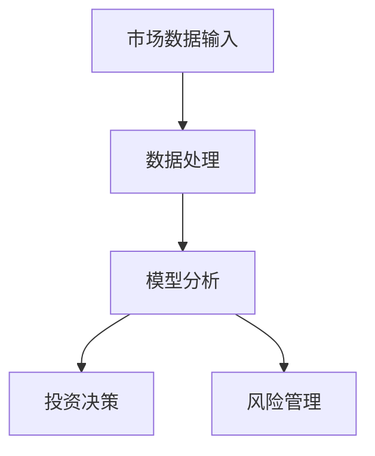
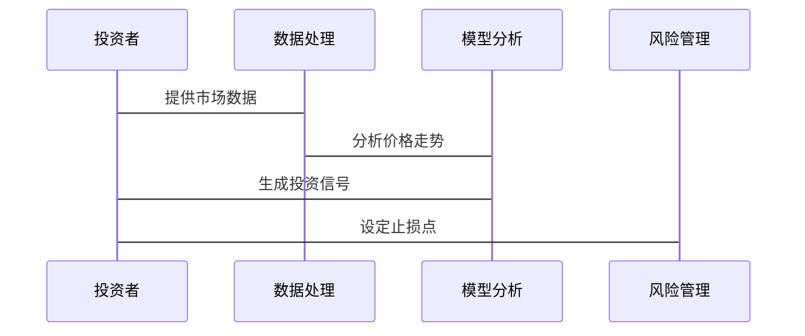

                 


# 彼得·林奇如何看待市场波动

---

## 关键词：
- 彼得·林奇
- 市场波动
- 投资策略
- 技术分析
- 风险管理

---

## 摘要：
彼得·林奇是全球著名的职业基金经理，以其独特的投资哲学和市场波动分析闻名。本文从彼得·林奇的投资理念出发，探讨他在市场波动中的应对策略，结合技术分析和系统架构，深入解析其投资方法。文章详细阐述了市场波动的定义、彼得·林奇的投资策略、技术分析的应用，以及系统架构在市场波动中的重要性，最后通过案例分析展示其投资策略的实际应用。

---

## 第一部分: 引言

### 第1章: 彼得·林奇与市场波动概述

#### 1.1 彼得·林奇的背景介绍

##### 1.1.1 彼得·林奇的生平简介
彼得·林奇（Peter Lynch）是美国著名的职业基金经理，1977年加入富达投资，管理麦哲伦基金长达14年，创造了年均29%的复合收益率，使其成为全球最成功的基金经理之一。他以对市场的深刻理解、对企业的深入分析和对投资者心理的敏锐洞察而闻名。

##### 1.1.2 彼得·林奇的投资理念与风格
彼得·林奇的投资风格以价值投资为核心，强调长期投资和企业基本面分析。他认为，市场波动为投资者提供了以合理价格买入优质股票的机会。他的投资策略注重分散投资、风险管理以及对市场波动的灵活应对。

##### 1.1.3 彼得·林奇的投资哲学
林奇认为，市场波动是投资的“朋友”，而非“敌人”。通过深入研究市场波动的原因和模式，投资者可以在波动中发现低估的股票，实现长期收益。

#### 1.2 市场波动的定义与特征

##### 1.2.1 市场波动的定义
市场波动是指股票价格或其他金融资产价格在短时间内频繁变动的现象，通常由市场参与者的心理、经济数据、公司公告等多重因素引起。

##### 1.2.2 市场波动的常见原因
市场波动的原因包括：
1. 经济数据：GDP、失业率、通胀数据等。
2. 公司公告：盈利报告、并购消息、管理层变动等。
3. 市场情绪：投资者情绪的波动会影响市场走势。
4. 外部事件：国际政治、自然灾害等不可预见事件。

##### 1.2.3 市场波动对投资者的影响
市场波动对投资者的影响是双刃剑：
- **正面影响**：波动提供了低价买入优质资产的机会。
- **负面影响**：过度波动可能导致投资者恐慌性抛售，错过长期收益。

#### 1.3 本章小结
本章介绍了彼得·林奇的背景及其投资哲学，强调市场波动是投资中的重要现象。市场波动既有积极的一面，也有消极的一面，关键在于如何利用波动获取长期收益。

---

## 第二部分: 彼得·林奇的投资策略

### 第2章: 彼得·林奇的核心投资理念

#### 2.1 长期投资与价值发现

##### 2.1.1 长期投资的重要性
林奇强调长期投资的重要性。他认为，短期波动不应影响长期投资决策，投资者应关注企业的长期增长潜力。

##### 2.1.2 价值投资的核心原则
价值投资的核心是寻找市场价格低于内在价值的股票。林奇通过深入分析企业的财务数据、行业地位和竞争优势，识别具有长期增长潜力的企业。

##### 2.1.3 如何识别具有长期增长潜力的公司
林奇通过以下方法识别具有长期增长潜力的公司：
1. **行业地位**：选择行业龙头股，这些企业具有竞争优势。
2. **财务健康状况**：关注企业的盈利能力、资产负债表和现金流。
3. **管理层能力**：优秀的管理层能够带领企业持续增长。

#### 2.2 市场波动中的投资机会

##### 2.2.1 市场波动带来的投资机会
市场波动往往导致股价的短期低估，为投资者提供了以合理价格买入优质股票的机会。

##### 2.2.2 如何在市场波动中找到低估的股票
林奇通过以下方法在市场波动中寻找低估股票：
1. **基本面分析**：分析企业的财务数据，寻找被市场忽视的优质企业。
2. **市场情绪分析**：利用市场恐慌情绪，寻找被市场错杀的股票。
3. **行业周期分析**：关注处于周期性低谷的行业，寻找具有转机的公司。

##### 2.2.3 市场波动中的风险管理
林奇强调风险管理的重要性，他通过以下方法控制风险：
1. **分散投资**：避免过度集中，降低投资组合的风险。
2. **止损策略**：设定止损点，防止亏损扩大。
3. **动态调整**：根据市场波动及时调整投资组合。

#### 2.3 彼得·林奇的投资组合管理

##### 2.3.1 投资组合的构建原则
林奇的投资组合构建原则包括：
1. **多样化**：投资多个行业和企业，降低风险。
2. **长期视角**：关注企业的长期增长潜力。
3. **定期审视**：定期评估投资组合的表现，及时调整。

##### 2.3.2 如何平衡风险与收益
林奇通过以下方法平衡风险与收益：
1. **分散投资**：通过投资不同行业的企业，降低特定行业风险。
2. **价值投资**：选择具有长期增长潜力的股票，追求稳定的收益。
3. **风险管理**：设定止损点，控制投资组合的波动风险。

##### 2.3.3 定期审视与调整投资组合
林奇强调定期审视投资组合的重要性，及时调整以适应市场变化。他建议投资者每年至少审视一次投资组合，根据市场波动和企业变化进行调整。

---

## 第三部分: 技术分析与市场波动

### 第3章: 技术分析在彼得·林奇投资中的应用

#### 3.1 技术分析的基本原理

##### 3.1.1 技术分析的定义与核心假设
技术分析是通过分析历史价格数据，预测未来价格走势的方法。其核心假设包括：
1. **价格反映信息**：市场价格反映所有相关信息。
2. **趋势延续性**：价格走势具有延续性。
3. **历史重复性**：价格走势具有重复性。

##### 3.1.2 技术分析与基本面分析的区别
- **技术分析**：基于价格和成交量数据，预测价格走势。
- **基本面分析**：基于企业的财务数据和行业状况，评估企业内在价值。

##### 3.1.3 技术分析在投资决策中的作用
技术分析可以帮助投资者识别价格趋势、确认买卖信号，并制定风险管理策略。

#### 3.2 彼得·林奇常用的技术分析工具

##### 3.2.1 趋势线与支撑位
- **趋势线**：用于识别价格趋势，帮助投资者判断价格的上涨或下跌趋势。
- **支撑位**：价格在下跌过程中遇到支撑，形成买点。

##### 3.2.2 成交量分析
成交量是价格变动的确认指标。高成交量通常表明价格变动具有持续性。

##### 3.2.3 技术指标（如RSI、MACD等）
- **RSI（相对强弱指数）**：用于判断价格是否超买或超卖。
- **MACD（移动平均收敛散度）**：用于判断价格趋势的强度和方向。

#### 3.3 技术分析在市场波动中的实战案例

##### 3.3.1 某行业龙头股的技术分析案例
假设某行业龙头股的价格走势如下：

```plaintext
价格：100元，成交量：1000手
价格：95元，成交量：1500手
价格：90元，成交量：2000手
价格：85元，成交量：2500手
价格：80元，成交量：3000手
```

通过技术分析，可以发现价格在连续下跌过程中成交量逐渐放大，可能表明有资金介入，价格可能即将反弹。

##### 3.3.2 如何通过技术分析识别买入信号
识别买入信号的方法包括：
1. **价格突破**：价格突破下降趋势线，表明趋势可能反转。
2. **技术指标信号**：RSI从超卖区域反弹，MACD出现金叉。

##### 3.3.3 如何通过技术分析控制投资风险
通过技术分析控制风险的方法包括：
1. **设定止损点**：根据技术分析确定止损点，防止亏损扩大。
2. **分批建仓**：根据技术信号分批买入，降低平均成本。

---

## 第四部分: 市场波动的系统分析

### 第4章: 市场波动的系统架构与模型

#### 4.1 市场波动的系统分析框架

##### 4.1.1 系统分析的定义与核心要素
系统分析是一种通过分析系统的各个组成部分及其相互关系，理解系统整体行为的方法。市场波动的系统分析框架包括：
1. **输入**：市场数据、经济指标、公司公告等。
2. **处理**：数据处理、模型分析、信号生成。
3. **输出**：投资决策、风险管理策略。

#### 4.2 市场波动的数学模型与公式

##### 4.2.1 市场波动的随机游走模型
随机游走模型假设价格变动是随机的，没有可预测的规律。其数学表达式为：
$$ P_{t} = P_{t-1} + \epsilon_{t} $$
其中，$\epsilon_{t}$ 是随机误差项。

##### 4.2.2 市场波动的均值回归模型
均值回归模型假设价格会回归其长期均值。其数学表达式为：
$$ P_{t} = \alpha + \beta P_{t-1} + \epsilon_{t} $$
其中，$\beta$ 是回归系数，通常小于1。

##### 4.2.3 市场波动的马尔可夫链模型
马尔可夫链模型用于描述市场状态的转移概率。其数学表达式为：
$$ P(S_{t} = s | S_{t-1} = s') = \theta_{s'}(s) $$

#### 4.3 市场波动的系统架构设计

##### 4.3.1 系统架构图


##### 4.3.2 系统接口设计
- **输入接口**：接收市场数据、经济指标等。
- **输出接口**：生成投资信号、风险管理策略。

##### 4.3.3 系统交互图


---

## 第五部分: 项目实战

### 第5章: 项目实战与案例分析

#### 5.1 项目背景与目标
目标是利用彼得·林奇的投资策略和技术分析方法，构建一个市场波动分析系统，帮助投资者识别投资机会和管理风险。

#### 5.2 系统实现

##### 5.2.1 环境安装
需要安装以下工具：
- Python编程语言
- 数据分析库（如Pandas、Matplotlib）
- 技术分析库（如TA-Lib）

##### 5.2.2 核心实现代码
以下是Python代码示例：
```python
import pandas as pd
import matplotlib.pyplot as plt
import talib as ta

# 加载数据
data = pd.read_csv('stock_data.csv')

# 计算技术指标
data['RSI'] = ta.RSI(data['close'], timeperiod=14)
data['MACD'], data['MACD_signal'], data['MACD_hist'] = ta.MACD(data['close'], fastperiod=12, slowperiod=26, signalperiod=9)

# 绘制图表
plt.figure(figsize=(12, 6))
plt.plot(data['close'], label='Close Price')
plt.plot(data['RSI'], label='RSI')
plt.plot(data['MACD'], label='MACD')
plt.legend()
plt.show()
```

##### 5.2.3 代码解读与分析
上述代码通过Pandas加载股票数据，使用TA-Lib计算RSI和MACD指标，并绘制价格走势和技术指标图表。投资者可以通过分析图表识别买卖信号。

#### 5.3 案例分析

##### 5.3.1 某股票的技术分析案例
假设某股票价格走势如下：
```plaintext
价格：100元，RSI：30，MACD：-2
价格：95元，RSI：25，MACD：-5
价格：90元，RSI：20，MACD：-8
价格：85元，RSI：15，MACD：-10
价格：80元，RSI：10，MACD：-12
```

通过技术分析，可以发现RSI处于超卖区域，MACD指标可能即将出现底背离，表明价格可能即将反弹。

#### 5.3.2 投资决策与风险管理
根据技术分析信号，投资者可以决定在价格接近支撑位时买入，并设定止损点。

#### 5.4 项目小结
通过项目实战，投资者可以将彼得·林奇的投资策略和技术分析方法结合起来，构建一个有效的市场波动分析系统，帮助做出科学的投资决策。

---

## 第六部分: 结论与展望

### 第6章: 结论与展望

#### 6.1 本章总结
彼得·林奇通过长期投资和价值发现，在市场波动中实现了卓越的投资业绩。技术分析和系统架构为投资者提供了科学的投资决策工具。

#### 6.2 对未来的展望
随着人工智能和大数据技术的发展，市场波动的分析将更加精准和高效。投资者可以利用新技术进一步优化投资策略，提高投资收益。

#### 6.3 最佳实践 tips
- **长期投资**：避免短期波动的干扰，关注企业的长期增长潜力。
- **风险管理**：设定止损点，控制投资风险。
- **持续学习**：保持对市场和投资策略的学习，提升自己的投资能力。

---

## 作者信息

作者：AI天才研究院/AI Genius Institute & 禅与计算机程序设计艺术 /Zen And The Art of Computer Programming

---

以上是完整的《彼得林奇如何看待市场波动》技术博客文章，希望对您有所帮助！

