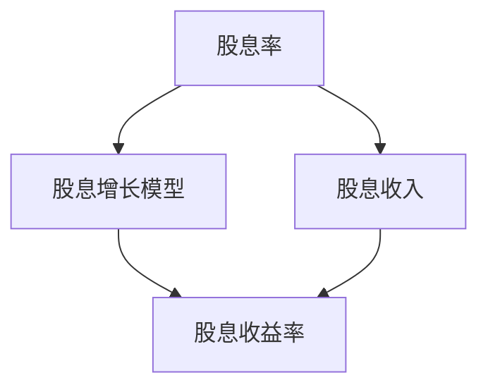
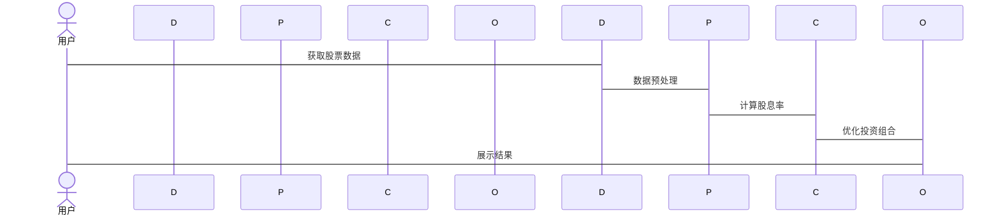

                 


```markdown
# 彼得·林奇如何看待股息投资

> 关键词：股息投资，彼得·林奇，股息率，股息增长模型，股息收益率，投资策略，风险管理

> 摘要：本文深入分析了股息投资的核心概念、数学模型、系统架构及实战应用，结合彼得·林奇的投资理念，探讨了如何通过股息率、股息增长模型和股息收益率等指标进行股票筛选和投资组合优化。文章还详细介绍了股息投资的算法实现、系统设计以及实际案例分析，最后总结了股息投资的最佳实践和风险管理策略。

---

# 第一部分: 股息投资的背景与核心概念

## 第1章: 股息投资的背景与定义

### 1.1 股息投资的定义与特点
- 股息的定义与分类
- 股息投资的核心特点：稳定性、收益性、防御性
- 股息投资与普通股票投资的区别

### 1.2 股息投资的历史与发展
- 股息投资的起源与演变
- 股息投资在不同时期的发展特点
- 股息投资在现代投资组合中的地位

### 1.3 彼得·林奇与股息投资的关系
- 彼得·林奇的投资理念与股息投资的契合点
- 股息投资在彼得·林奇策略中的应用实例
- 彼得·林奇对股息投资的独特见解

### 1.4 股息投资的优缺点分析
- 股息投资的优点：稳定收益、风险较低
- 股息投资的缺点：流动性差、受经济周期影响
- 股息投资的适用场景与目标投资者类型

### 1.5 本章小结
- 总结股息投资的基本概念与核心特点
- 强调彼得·林奇在股息投资中的重要性

---

## 第2章: 股息投资的核心概念与数学模型

### 2.1 股息率的计算与分析
- 股息率的定义与计算公式
$$股息率 = \frac{每股股息}{股价} \times 100\%$$
- 股息率的分析方法与应用

### 2.2 股息增长模型
- 股息增长模型的定义与数学公式
$$P = \frac{D_1}{r - g}$$
- 其中，$D_1$为第一年的股息，$r$为折现率，$g$为股息增长率

### 2.3 股息收益率与总回报率的对比
- 股息收益率的定义与计算
- 总回报率的定义与计算
- 两者对比分析

### 2.4 股息投资的核心指标对比表格
| 指标名称 | 定义 | 重要性 | 计算公式 |
|----------|------|--------|----------|
| 股息率   | 每股股息/股价 | 高股息率意味着较高的分红比例 | $$股息率 = \frac{每股股息}{股价} \times 100\%$$ |
| 股息增长模型 | 股息的未来增长 | 用于评估股票的内在价值 | $$P = \frac{D_1}{r - g}$$ |
| 股息收益率 | 股息收入/初始投资 | 用于衡量投资回报率 | $$股息收益率 = \frac{年股息}{初始投资} \times 100\%$$ |

### 2.5 股息投资的核心要素与关系图


---

## 第3章: 股息投资的算法原理与实现

### 3.1 股息投资的数学模型与算法
- 股息率计算算法
- 股息增长模型的应用算法
- 股息收益率的计算算法

### 3.2 股息投资的系统架构设计


### 3.3 股息投资的Python实现代码
```python
def calculate_dividend_yield(stock_price, dividend):
    return (dividend / stock_price) * 100

def calculate_dividend_growth(dividends):
    growth = []
    for i in range(1, len(dividends)):
        growth.append((dividends[i] - dividends[i-1]) / dividends[i-1])
    return growth

def calculate_dividend_yield_ratio(dividends, investment):
    return (sum(dividends) / investment) * 100

# 示例
stock_price = 50
dividend = 2.5
dividends = [2, 2.5, 3]

yield = calculate_dividend_yield(stock_price, dividend)
growth = calculate_dividend_growth(dividends)
yield_ratio = calculate_dividend_yield_ratio(dividends, 1000)

print(f"股息率: {yield}%")
print(f"股息增长率: {growth}")
print(f"股息收益率: {yield_ratio}%")
```

### 3.4 股息投资模型的假设与局限性
- 股息模型的假设前提
- 模型的局限性与改进方向

---

## 第4章: 股息投资的系统分析与架构设计

### 4.1 股息投资的系统功能设计
- 数据收集模块：收集股票价格、股息数据
- 股息率计算模块：计算股息率
- 股息增长模型评估模块：评估股息增长率
- 投资组合优化模块：优化投资组合

### 4.2 股息投资的系统架构设计


### 4.3 股息投资的系统接口设计
- 数据接口：数据获取与处理
- 计算接口：股息率、股息增长率计算
- 优化接口：投资组合优化

### 4.4 股息投资的系统交互流程图


---

## 第5章: 股息投资的项目实战与案例分析

### 5.1 股息投资的实际案例分析
- 案例一：如何筛选高股息率股票
- 案例二：如何评估股息增长率
- 案例三：如何构建股息投资组合

### 5.2 股息投资的代码实现与解读
```python
import pandas as pd

# 数据加载
data = pd.DataFrame({
    '股票代码': ['A', 'B', 'C'],
    '股价': [50, 60, 70],
    '股息': [2.5, 3.0, 3.5]
})

# 股息率计算
data['股息率'] = (data['股息'] / data['股价']) * 100

# 股息增长模型评估
def calculate_growth(dividends):
    growth = []
    for i in range(1, len(dividends)):
        growth.append((dividends[i] - dividends[i-1]) / dividends[i-1])
    return growth

data['股息增长率'] = calculate_growth(data['股息'])

# 投资组合优化
data.sort_values('股息率', ascending=False, inplace=True)
print(data)
```

### 5.3 股息投资的实际应用与注意事项
- 选择优质股息股票的技巧
- 股息投资的风险管理
- 股息投资的长期与短期策略

### 5.4 本章小结
- 总结股息投资的实际应用步骤
- 强调案例分析的重要性

---

## 第6章: 股息投资的最佳实践与风险管理

### 6.1 股息投资的最佳实践
- 选择优质公司的策略
- 分散投资的重要性
- 长期持有的优势

### 6.2 股息投资的风险管理
- 如何应对市场波动
- 股息投资的再平衡策略
- 风险控制的具体措施

### 6.3 股息投资的注意事项
- 股息率过高的风险
- 股息增长率不可持续的风险
- 经济周期对股息投资的影响

### 6.4 股息投资的未来展望
- 数字化工具在股息投资中的应用
- 人工智能在股息筛选中的潜力
- 股息投资的可持续性与创新

### 6.5 本章小结
- 总结股息投资的最佳实践
- 强调风险管理的重要性

---

## 第7章: 总结与展望

### 7.1 本文总结
- 回顾股息投资的核心概念与数学模型
- 总结系统架构设计与实战案例

### 7.2 股息投资的未来展望
- 新技术对股息投资的影响
- 股息投资策略的创新与发展

### 7.3 最终思考
- 股息投资的长期价值与风险平衡
- 投资者如何根据自身需求选择股息投资策略

---

## 参考文献
- 彼得·林奇的经典著作
- 相关学术论文与研究报告
- 股票分析工具与平台

---

## 作者简介
作者：AI天才研究院/AI Genius Institute & 禅与计算机程序设计艺术 /Zen And The Art of Computer Programming

---

以上是完整的大纲结构，涵盖了股息投资的各个方面，从基础概念到算法实现，再到实际应用与风险管理，结构清晰，内容详实。
```

