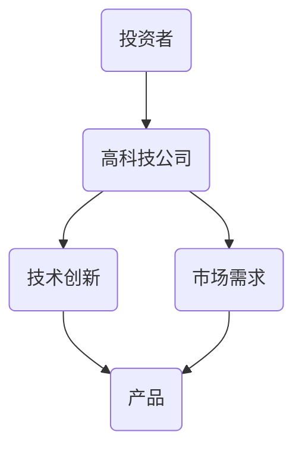
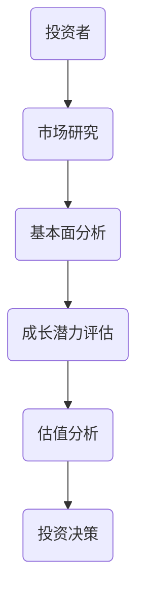
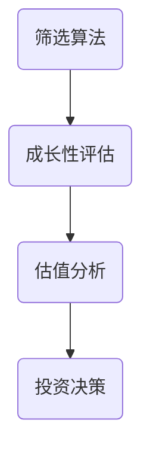
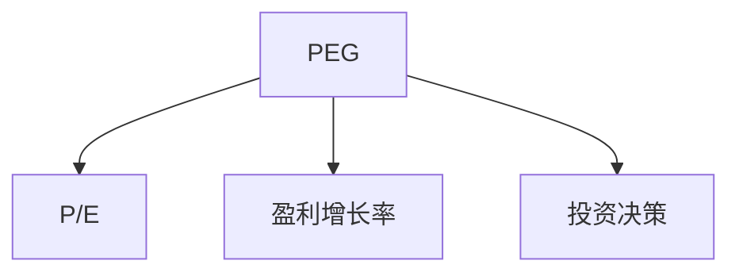
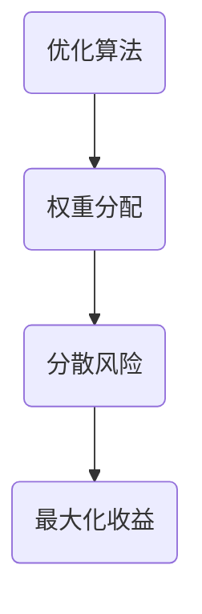
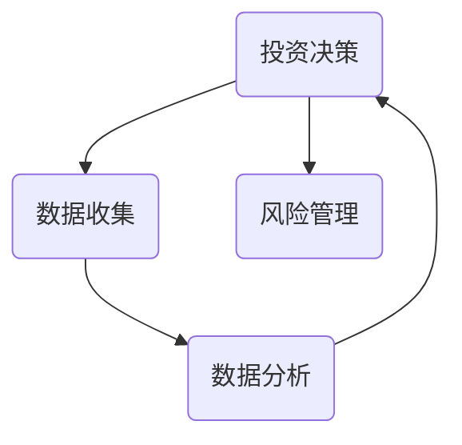
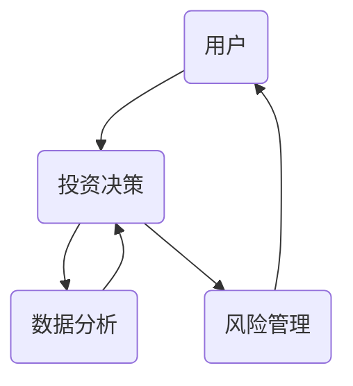
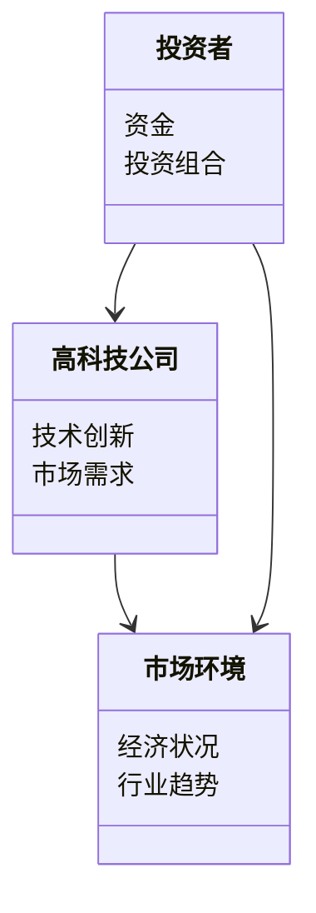

                 


# 彼得林奇如何看待高科技股投资

> 关键词：彼得·林奇，高科技股，投资策略，PEG比率，风险管理，价值投资

> 摘要：本文深入探讨了彼得·林奇对高科技股投资的独特见解，结合他的投资理念、选股标准、估值方法以及风险管理策略，通过详细的技术分析和系统设计，为读者提供一套完整的投资框架。

---

## 第1章: 彼得·林奇与高科技股投资的背景

### 1.1 彼得·林奇的投资理念概述

#### 1.1.1 彼得·林奇的生平简介
彼得·林奇（Peter Lynch）是美国著名的职业基金经理人，被誉为“股神”之一，曾在富达投资管理公司管理麦哲伦基金长达13年，创造了年均29%的复合回报率。他的投资理念以“价值投资”为核心，强调长期投资、深入研究和风险管理。

#### 1.1.2 林奇的投资哲学
林奇认为，成功的投资需要结合基本面分析和市场趋势，寻找那些具有持续增长潜力的公司。他强调：“如果一个公司每年能够保持10%的利润增长，那么它的股票价格也会每年增长10%。”这种成长与估值的平衡是林奇选股的核心。

#### 1.1.3 林奇对高科技股的特殊看法
林奇对高科技股持有谨慎乐观的态度。他认为，高科技行业是未来经济增长的核心驱动力，但同时也伴随着高风险。他倾向于投资那些具有强大护城河、高ROE（净资产收益率）和合理估值的高科技公司。

### 1.2 高科技股的定义与特点

#### 1.2.1 高科技股的定义
高科技股是指那些属于高科技行业的公司的股票，涵盖信息技术、生物技术、人工智能、半导体等领域。这些公司通常具有较高的创新能力和增长潜力。

#### 1.2.2 高科技股的核心特征
- **高增长性**：高科技公司往往具有较高的盈利增长率。
- **高波动性**：高科技股的价格波动较大，容易受到市场情绪和技术变革的影响。
- **高风险与高回报**：高科技股的风险较高，但潜在回报也更大。

#### 1.2.3 高科技股的市场表现
高科技股在牛市中表现尤为突出，但在熊市中也容易受到重挫。例如，互联网泡沫时期的高科技股崩盘就是一个典型案例。

### 1.3 高科技股投资的背景与动机

#### 1.3.1 高科技行业的快速发展
21世纪以来，信息技术和互联网的快速发展推动了高科技行业的繁荣，这也为高科技股的投资提供了巨大的机会。

#### 1.3.2 高科技股的高风险与高回报
高科技行业的技术变革快，市场竞争力强，投资者需要承担较高的风险，但潜在的回报也远高于传统行业。

#### 1.3.3 林奇投资高科技股的动机
林奇认为，高科技行业是未来经济的核心驱动力，投资高科技股可以分享行业的增长红利。同时，他也在寻找那些能够持续创新并保持竞争优势的公司。

---

## 第2章: 彼得·林奇的投资策略与方法

### 2.1 林奇的投资策略概述

#### 2.1.1 价值投资与成长投资的结合
林奇的投资策略是价值投资与成长投资的结合。他既关注公司的基本面（如盈利能力、财务状况），也关注公司的成长潜力（如盈利增长率、市场占有率）。

#### 2.1.2 高科技股的长期投资逻辑
林奇认为，高科技股的长期投资逻辑在于公司的技术创新和市场扩展能力。他倾向于投资那些能够持续推出新产品、占据市场份额的公司。

#### 2.1.3 林奇的选股标准
林奇选股的核心标准是：
- 公司具有强大的竞争优势（如技术壁垒、品牌影响力）。
- 公司具有较高的盈利增长率。
- 公司的估值合理（如PEG比率小于1）。

### 2.2 高科技股的估值方法

#### 2.2.1 市盈率与市净率的分析
市盈率（P/E）= 股价 / 每股净利润  
市净率（P/B）= 股价 / 每股净资产  

林奇认为，市盈率和市净率是衡量公司估值的重要指标，但单独使用这些指标并不足以全面评估高科技股的价值。

#### 2.2.2 盈利增长率的重要性
盈利增长率是衡量公司成长潜力的关键指标。林奇通常选择那些盈利增长率超过行业平均水平的公司。

#### 2.2.3 自由现金流的评估
自由现金流（Free Cash Flow）= 营业收入 - 付现成本 - 税费 - 投资支出  
林奇认为，自由现金流是衡量公司财务健康状况的重要指标，也是公司分红或再投资的重要来源。

### 2.3 林奇的投资组合管理

#### 2.3.1 高科技股在投资组合中的地位
林奇通常将高科技股作为投资组合中的重要部分，但也会配置其他行业的股票以分散风险。

#### 2.3.2 风险管理与资产配置
林奇强调风险管理的重要性。他通常会根据市场环境和公司基本面调整投资组合的配置比例。

#### 2.3.3 定期复盘与调整策略
林奇建议投资者定期复盘投资组合的表现，并根据市场变化和公司基本面调整投资策略。

---

## 第3章: 高科技股投资的核心概念与联系

### 3.1 核心概念原理

#### 3.1.1 高科技股的核心驱动因素
高科技股的核心驱动力是技术创新和市场需求。林奇认为，只有那些能够持续推出新产品、满足市场需求的公司才能实现长期增长。

#### 3.1.2 林奇的成长与估值平衡理论
林奇认为，投资需要在成长和估值之间找到平衡点。他通常选择那些具有较高成长潜力且估值合理的公司。

#### 3.1.3 高科技股的周期性与波动性
高科技股的周期性较强，容易受到行业周期和市场波动的影响。林奇建议投资者关注公司的长期发展趋势，而不是短期波动。

### 3.2 核心概念对比表

#### 3.2.1 高科技股与传统行业股的对比

| 对比维度 | 高科技股 | 传统行业股 |
|----------|----------|------------|
| 增长潜力 | 高       | 中低       |
| 风险水平 | 高       | 中低       |
| 市场波动 | 高       | 中低       |

#### 3.2.2 高科技股的PEG与P/E对比

| 对比维度 | PEG（市盈率相对盈利增长率） | P/E（市盈率） |
|----------|-------------------------------|----------------|
| 适用场景 | 评估成长股的估值合理性       | 评估整体估值   |
| 计算公式 | PEG = P/E / 盈利增长率         | P/E = 股价 / 每股净利润 |

#### 3.2.3 高科技股的风险与收益对比

| 对比维度 | 高风险 | 高收益 |
|----------|--------|---------|
| 高科技股 | 是     | 是      |
| 传统行业股 | 否     | 否      |

### 3.3 实体关系图

#### 3.3.1 高科技股投资的ER图


#### 3.3.2 投资决策的流程图


---

## 第4章: 投资决策算法与数学模型

### 4.1 投资决策算法

#### 4.1.1 高科技股的筛选算法


#### 4.1.2 林奇的PEG估值算法


#### 4.1.3 投资组合优化算法


### 4.2 数学模型与公式

#### 4.2.1 PEG=市盈率/盈利增长率
$$ PEG = \frac{P/E}{\text{盈利增长率}} $$

#### 4.2.2 自由现金流公式
$$ \text{自由现金流} = \text{营业收入} - \text{付现成本} - \text{税费} - \text{投资支出} $$

#### 4.2.3 投资组合收益计算公式
$$ \text{投资组合收益} = \sum (\text{权重} \times \text{收益率}) $$

### 4.3 算法实现与代码

#### 4.3.1 Python代码实现PEG计算
```python
def calculate_pe(stock):
    pe = stock.price / stock.net_profit
    return pe

def calculate_growth(stock):
    growth = (stock.current_profit - stock.previous_profit) / stock.previous_profit
    return growth

def calculate_peg(pe, growth):
    if growth == 0:
        return float('inf')
    peg = pe / growth
    return peg

# 示例
stock_pe = calculate_pe(stock)
stock_growth = calculate_growth(stock)
stock_peg = calculate_peg(stock_pe, stock_growth)
print(f"PEG: {stock_peg}")
```

---

## 第5章: 投资系统分析与架构设计

### 5.1 投资决策系统架构

#### 5.1.1 系统功能模块划分
- 数据收集模块
- 数据分析模块
- 投资决策模块
- 风险管理模块

#### 5.1.2 数据流与信息处理流程


#### 5.1.3 系统交互界面设计
用户可以通过界面输入股票信息，系统会自动计算PEG比率、分析公司基本面，并给出投资建议。

### 5.2 系统架构图

#### 5.2.1 高科技股投资的系统架构


#### 5.2.2 高科技股投资的领域模型


### 5.3 系统接口设计

#### 5.3.1 高科技股数据接口
- 输入：公司名称或股票代码
- 输出：公司基本面数据（如PE、PEG、ROE）

#### 5.3.2 投资决策接口
- 输入：股票代码、市场环境数据
- 输出：投资建议（如买入、持有、卖出）

### 5.4 系统交互流程图

#### 5.4.1 高科技股投资的交互流程


---

## 第6章: 项目实战与最佳实践

### 6.1 项目实战

#### 6.1.1 环境安装
安装Python和相关库（如pandas、numpy、scipy）。

#### 6.1.2 核心实现
编写代码实现高科技股的筛选和估值。

#### 6.1.3 代码应用
```python
import pandas as pd

def main():
    # 数据加载
    df = pd.read_csv('high-tech_stocks.csv')
    # 计算PEG
    df['PEG'] = df.apply(lambda x: x['PE'] / x['盈利增长率'], axis=1)
    # 筛选PEG < 1的股票
    selected = df[df['PEG'] < 1]
    print(selected)

if __name__ == '__main__':
    main()
```

#### 6.1.4 案例分析
以亚马逊为例，分析其PE、PEG和ROE，判断是否符合投资条件。

### 6.2 最佳实践

#### 6.2.1 投资建议
- 选择具有强大竞争优势和持续增长潜力的高科技公司。
- 保持投资组合的分散性，避免过度集中。
- 定期复盘投资组合的表现，并根据市场变化调整策略。

#### 6.2.2 小结
彼得·林奇的投资策略为高科技股投资者提供了宝贵的参考。通过深入分析公司的基本面和市场环境，结合合理的估值方法，投资者可以在高科技股市场中找到优质的投资标的。

#### 6.2.3 注意事项
- 高科技股的波动性较大，投资者需要具备较强的风险管理能力。
- 投资者需要持续关注公司的基本面变化和行业趋势。
- 避免盲目跟风，注重深入研究。

#### 6.2.4 拓展阅读
- 《彼得·林奇的成功投资》
- 《股票作手回忆录》
- 《价值投资实战》

---

## 作者：AI天才研究院/AI Genius Institute & 禅与计算机程序设计艺术 /Zen And The Art of Computer Programming

