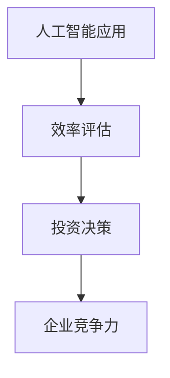
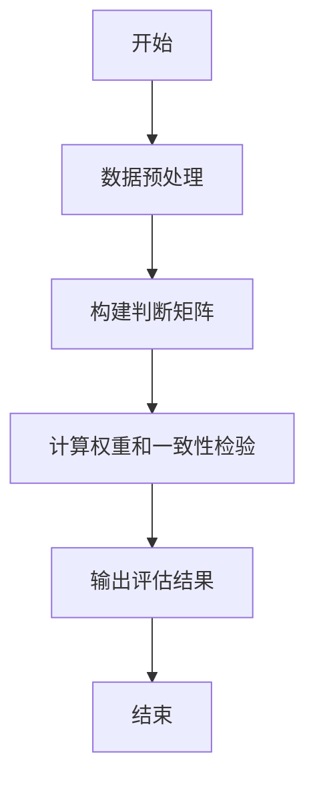
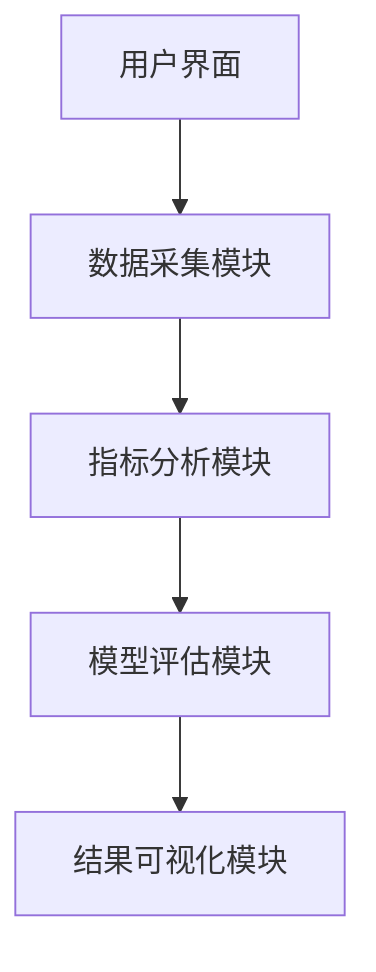
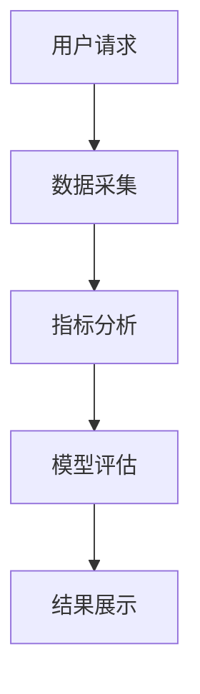
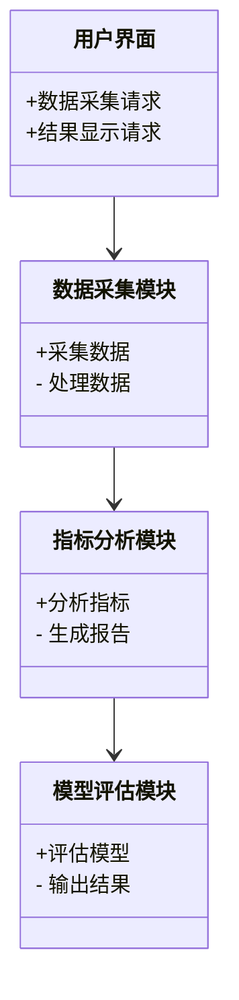
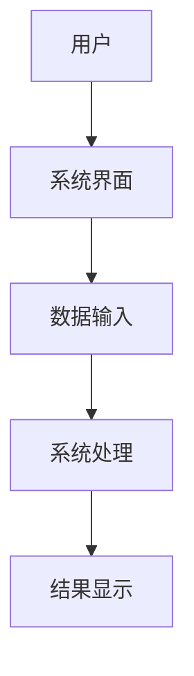

                 


# 彼得林奇如何评估公司的人工智能应用效率

## 关键词：人工智能，应用效率，投资评估，彼得·林奇，系统架构，算法原理

## 摘要：本文将探讨如何结合投资理念评估人工智能应用效率，从背景、核心概念、算法原理、系统架构到项目实战，逐步解析评估方法，并提供最佳实践和总结。

---

### 第1章: 引言

#### 1.1 人工智能的现状与挑战

##### 1.1.1 人工智能技术的发展背景
人工智能（AI）技术近年来发展迅速，广泛应用于各行业，从自然语言处理（NLP）到计算机视觉，AI正改变我们的生活方式和工作模式。

##### 1.1.2 人工智能在企业中的应用现状
许多企业将AI技术融入产品和服务中，提升效率和用户体验。然而，AI应用的效率评估成为企业优化投资的关键。

##### 1.1.3 人工智能应用效率的重要性
AI效率直接影响企业的投资回报率和竞争力，因此，评估AI应用效率对企业决策至关重要。

#### 1.2 彼得·林奇的投资理念与人工智能

##### 1.2.1 彼得·林奇的投资哲学
林奇强调深入研究和长期投资，注重基本面分析和价值评估，为投资决策提供依据。

##### 1.2.2 人工智能在投资中的应用
AI在数据处理、预测分析和投资决策中的应用日益增多，提升投资效率和准确性。

##### 1.2.3 评估人工智能应用效率的意义
通过评估AI应用效率，投资者可以优化资源配置，提升投资回报率，确保投资决策的科学性。

---

### 第2章: 人工智能应用效率评估的背景与目标

#### 2.1 人工智能应用效率的定义与内涵

##### 2.1.1 人工智能应用效率的定义
AI应用效率指AI系统在实现特定目标时的资源利用率和效果，综合考虑计算资源、数据质量和处理时间等因素。

##### 2.1.2 人工智能应用效率的核心要素
包括计算效率、数据效率、模型效率和时间效率，全面衡量AI系统的运行状态。

##### 2.1.3 人工智能应用效率的边界与外延
AI效率评估不仅关注技术层面，还涉及企业战略和投资回报，涵盖从数据准备到模型部署的全生命周期。

#### 2.2 人工智能应用效率评估的必要性

##### 2.2.1 企业投资决策中的效率评估
高效评估AI应用可优化资源配置，提升投资决策的准确性和及时性。

##### 2.2.2 人工智能应用效率对企业竞争力的影响
高效率AI应用能增强企业市场反应能力和创新能力，提升整体竞争力。

##### 2.2.3 人工智能应用效率评估的行业现状
当前AI应用效率评估尚不统一，存在方法多样化、标准不统一等问题，亟需建立统一评估体系。

---

### 第3章: 人工智能应用效率评估的核心概念与联系

#### 3.1 核心概念原理

##### 3.1.1 人工智能应用效率的数学模型
AI效率评估模型通常采用层次分析法（AHP），将各因素按权重排序，计算综合效率指数。

##### 3.1.2 人工智能应用效率的评估指标
主要指标包括处理速度、准确率、资源消耗等，需结合具体应用场景选择合适的评估维度。

##### 3.1.3 人工智能应用效率与投资回报的关系
高效率AI应用往往带来更高的投资回报，但需平衡初期投入与长期收益。

#### 3.2 核心概念属性特征对比

##### 3.2.1 人工智能应用效率与传统效率的对比
AI效率更注重数据处理能力和模型可解释性，而传统效率关注资源利用率。

##### 3.2.2 人工智能应用效率与投资效率的对比
AI效率评估需结合投资周期和风险因素，全面评估投资回报。

##### 3.2.3 人工智能应用效率与其他效率指标的对比
通过对比分析，明确AI效率的独特性，制定合理的评估策略。

#### 3.3 ER实体关系图


---

### 第4章: 人工智能应用效率评估的算法原理

#### 4.1 算法原理概述

##### 4.1.1 人工智能应用效率评估的基本原理
通过数据收集、特征提取和模型训练，分析AI系统的运行效率，建立数学模型进行评估。

##### 4.1.2 层次分析法（AHP）的原理
将评估指标分为多个层次，构建判断矩阵，计算权重并进行一致性检验，确定各指标的综合权重。

#### 4.2 算法实现步骤

##### 4.2.1 数据预处理
收集和清洗数据，确保数据质量和完整性，为后续分析奠定基础。

##### 4.2.2 构建判断矩阵
根据专家意见或数据分析，构建指标间的比较矩阵，量化各指标的重要性。

##### 4.2.3 计算权重和一致性检验
通过特征值法计算各指标权重，检查判断矩阵的一致性，确保结果的可靠性。

#### 4.3 Python代码实现

##### 4.3.1 环境安装
安装所需的Python库，如numpy和scipy，确保代码运行环境配置正确。

##### 4.3.2 代码实现
```python
import numpy as np
import scipy.cluster.hierarchy as hclust
from sklearn.metrics import pairwise_distances

# 示例数据：指标间的比较矩阵
matrix = np.array([
    [1, 3, 2],
    [1/3, 1, 2],
    [1/2, 1/2, 1]
])

# 计算权重
# 计算特征值和特征向量
# 这里省略详细计算步骤，实际操作需根据具体情况编写代码
```

##### 4.3.3 算法流程图


---

### 第5章: 人工智能应用效率评估的系统分析与架构设计

#### 5.1 系统分析

##### 5.1.1 问题场景介绍
企业希望通过AI技术提升运营效率，但缺乏有效的评估方法，导致投资回报率低。

##### 5.1.2 项目介绍
设计一个AI效率评估系统，帮助企业在AI应用中优化资源配置，提升投资回报。

##### 5.1.3 系统功能设计
包括数据采集、指标分析、模型评估和结果可视化等功能，支持企业进行AI效率管理。

#### 5.2 系统架构设计

##### 5.2.1 系统架构图


##### 5.2.2 数据流图


##### 5.2.3 类图


#### 5.3 接口设计

##### 5.3.1 API接口设计
定义RESTful API接口，提供数据采集、指标分析和结果查询等功能。

##### 5.3.2 接口交互流程
用户通过API发送请求，系统处理后返回评估结果，确保数据安全和高效传输。

#### 5.4 交互设计

##### 5.4.1 用户界面设计
设计直观的用户界面，便于用户操作，实时显示评估结果和分析报告。

##### 5.4.2 交互流程图


---

### 第6章: 人工智能应用效率评估的项目实战

#### 6.1 项目背景

##### 6.1.1 项目简介
评估一个NLP模型的应用效率，从数据准备到模型部署，全面分析效率问题。

##### 6.1.2 项目目标
通过实战项目，验证评估方法的有效性，优化AI应用效率。

#### 6.2 系统核心实现

##### 6.2.1 环境配置
安装Python、TensorFlow和相关库，配置开发环境。

##### 6.2.2 核心代码实现
实现NLP模型训练、评估和优化，记录各阶段效率数据。

##### 6.2.3 代码应用解读
分析代码实现，解释各部分的功能和作用，确保评估过程的准确性。

#### 6.3 实际案例分析

##### 6.3.1 案例介绍
选择一个NLP任务，如情感分析，进行效率评估。

##### 6.3.2 案例分析
收集数据、训练模型、评估效率，分析结果，找出瓶颈，提出优化建议。

#### 6.4 项目小结

##### 6.4.1 项目总结
通过项目实战，验证评估方法的有效性，优化AI应用效率。

##### 6.4.2 经验教训
总结项目中的经验教训，为未来项目提供参考。

---

### 第7章: 总结与展望

#### 7.1 总结

##### 7.1.1 核心内容回顾
本文系统探讨了如何结合投资理念评估AI应用效率，从背景、概念、算法到系统设计和项目实战，提供了全面的解决方案。

##### 7.1.2 主要结论
有效的AI效率评估方法能优化企业资源配置，提升投资回报率，是未来企业发展的重要方向。

#### 7.2 展望

##### 7.2.1 未来研究方向
进一步研究AI效率评估的动态模型，结合实时数据优化评估方法。

##### 7.2.2 技术发展趋势
AI技术的不断进步将推动效率评估方法的创新，提升评估的准确性和实时性。

#### 7.3 最佳实践 tips

##### 7.3.1 评估方法选择
根据企业需求和应用场景，选择合适的评估方法，确保评估结果的有效性。

##### 7.3.2 数据质量保障
重视数据质量，确保评估结果的可靠性和准确性。

##### 7.3.3 持续优化
定期评估和优化AI应用，保持系统的高效运行。

---

作者：AI天才研究院/AI Genius Institute & 禅与计算机程序设计艺术 /Zen And The Art of Computer Programming

---

本文通过系统的方法，结合投资理念，详细探讨了如何评估人工智能应用效率，从理论到实践，为企业的AI应用优化提供了有力指导。

