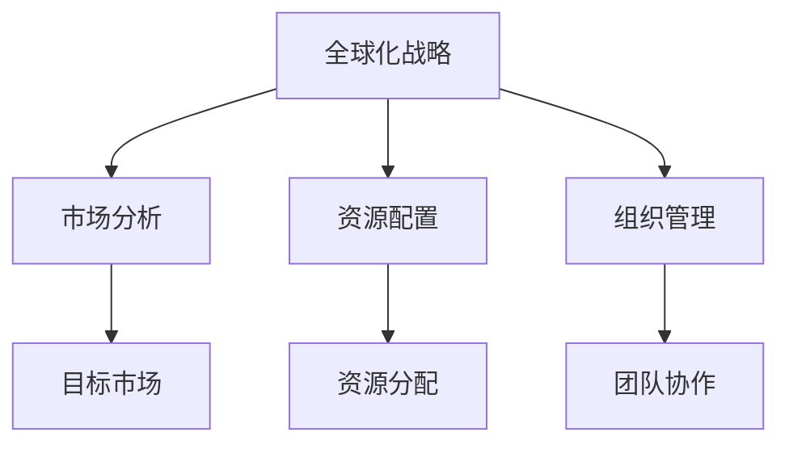
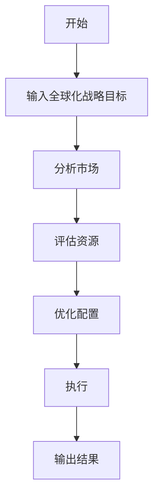

                 


# 彼得林奇如何评估公司的全球化战略执行力

> 关键词：彼得林奇，全球化战略，执行力，投资策略，战略评估

> 摘要：本文从彼得林奇的投资哲学出发，系统地探讨了如何评估公司的全球化战略执行力。文章首先介绍了全球化战略的重要性和彼得林奇的背景，然后详细分析了全球化战略的核心要素，接着提出了彼得林奇的评估方法与工具，构建了系统的评估模型，并通过实战案例展示了如何在实际中应用这些方法。最后，文章总结了最佳实践，为读者提供了全面的指导。

---

# 第一部分: 全球化战略执行力的背景与重要性

## 第1章: 全球化战略的背景与核心概念

### 1.1 全球化战略的定义与特点

全球化战略是指企业在全球范围内进行市场扩展、资源整合和价值创造的系统性计划。其核心特点包括：

- **全球视野**：超越单一市场的限制，关注全球市场的机会和挑战。
- **资源整合**：充分利用全球资源，优化配置，降低成本。
- **文化适应性**：在不同文化背景下灵活调整策略。

### 1.2 彼得林奇的背景与投资理念

彼得·林奇是全球著名投资专家，其投资哲学强调基本面分析和长期价值创造。他认为，企业的全球化战略是实现长期增长的关键，而执行力则是决定战略成功与否的核心因素。

### 1.3 全球化战略执行力的重要性

在现代商业环境中，全球化战略的执行力直接关系到企业的市场地位和盈利能力。彼得林奇认为，执行力不仅体现在战略的制定上，更在于战略的实施过程中。

---

## 第2章: 全球化战略执行力的核心要素

### 2.1 全球化战略的核心要素分析

#### 2.1.1 市场分析与定位

全球化战略的成功依赖于对目标市场的深入了解，包括市场规模、竞争格局、消费者行为等因素。

#### 2.1.2 资源配置与整合

资源的合理配置和整合是实现全球化战略的关键。企业需要在全球范围内优化资源配置，降低成本，提高效率。

#### 2.1.3 组织结构与管理

全球化战略的执行需要高效的组织结构和管理机制，包括跨文化团队的协作、全球供应链的管理等。

### 2.2 彼得林奇视角下的执行力评估维度

#### 2.2.1 战略目标的清晰度

彼得林奇强调，战略目标必须清晰明确，否则执行力将难以实现。

#### 2.2.2 执行团队的能力与凝聚力

团队的能力和凝聚力是执行力的关键因素。彼得林奇认为，优秀的团队能够克服全球化战略中的各种挑战。

#### 2.2.3 资源分配的合理性

资源分配的合理性直接影响到全球化战略的执行效果。彼得林奇主张根据市场潜力和战略目标合理分配资源。

### 2.3 全球化战略与公司文化的关系

#### 2.3.1 公司文化的定义与影响

企业文化是企业价值观和行为准则的总和，直接影响员工的行为和企业的执行力。

#### 2.3.2 全球化战略对公司文化的挑战

全球化战略要求企业具备跨文化适应能力，文化冲突和管理风格差异是主要挑战。

#### 2.3.3 彼得林奇对文化与战略关系的见解

彼得林奇认为，企业文化是全球化战略成功的关键因素之一。企业需要在保持核心价值观的同时，适应不同市场的文化差异。

---

## 第3章: 彼得林奇全球化战略执行力评估方法

### 3.1 全球化战略执行力的评估维度

#### 3.1.1 战略目标的实现程度

通过分析企业的实际表现与战略目标的差距，评估战略执行的效果。

#### 3.1.2 资源分配的效率与效果

评估资源分配是否合理，是否达到了预期的效果。

#### 3.1.3 执行团队的协作与能力

通过团队协作和能力评估，判断执行团队是否具备实现战略目标的能力。

### 3.2 彼得林奇的评估工具与指标

#### 3.2.1 财务指标分析

- 净利润增长率
- 营业收入增长率
- 投资回报率

#### 3.2.2 市场表现评估

- 市场份额
- 品牌影响力
- 客户满意度

#### 3.2.3 管理团队评估

- 团队能力
- 团队凝聚力
- 团队适应性

### 3.3 全球化战略执行力的定性与定量分析

#### 3.3.1 定性分析

- 战略目标的清晰度
- 管理团队的执行力
- 组织文化的适应性

#### 3.3.2 定量分析

- 财务指标
- 市场表现
- 资源分配效率

---

## 第4章: 全球化战略执行力的系统分析与架构设计

### 4.1 全球化战略执行力的系统分析

#### 4.1.1 问题场景介绍

全球化战略执行过程中可能面临的问题包括市场风险、资源分配不均、团队协作障碍等。

#### 4.1.2 系统功能设计

- 领域模型设计：展示全球化战略中的核心要素及其关系。
- 系统架构设计：展示系统各模块之间的关系和数据流。

#### 4.1.3 系统架构图



### 4.2 全球化战略执行力的算法原理

#### 4.2.1 算法流程图



#### 4.2.2 算法数学模型

$$
\text{执行效果} = \alpha \times \text{资源分配} + \beta \times \text{团队能力}
$$

其中，$\alpha$ 和 $\beta$ 是权重系数，表示资源分配和团队能力对执行效果的影响程度。

---

## 第5章: 全球化战略执行力的项目实战

### 5.1 项目环境安装

- 安装Python和相关库（如Pandas、Matplotlib）。

### 5.2 核心代码实现

```python
import pandas as pd
import matplotlib.pyplot as plt

# 数据加载
data = pd.read_csv('global_strategy.csv')

# 数据分析
data['执行效果'] = data['资源分配'] * 0.6 + data['团队能力'] * 0.4

# 可视化
plt.plot(data['执行效果'])
plt.title('全球化战略执行效果')
plt.show()
```

### 5.3 代码解读与分析

- 数据加载：从CSV文件中读取全球化战略相关数据。
- 数据分析：计算执行效果，权重系数分别为0.6和0.4。
- 可视化：绘制执行效果曲线，分析趋势。

### 5.4 实际案例分析

以某跨国公司为例，分析其全球化战略的执行效果，通过数据可视化展示执行过程中的问题和改进方向。

---

## 第6章: 全球化战略执行力的最佳实践

### 6.1 小结

彼得林奇的全球化战略执行力评估方法为企业提供了系统的指导，强调战略目标的清晰性、资源分配的合理性以及团队的协作能力。

### 6.2 注意事项

- 注重跨文化管理
- 加强风险管理
- 定期评估与优化

### 6.3 拓展阅读

推荐相关书籍和文献，帮助读者深入理解全球化战略和执行力评估。

---

## 作者

作者：AI天才研究院/AI Genius Institute & 禅与计算机程序设计艺术 /Zen And The Art of Computer Programming

