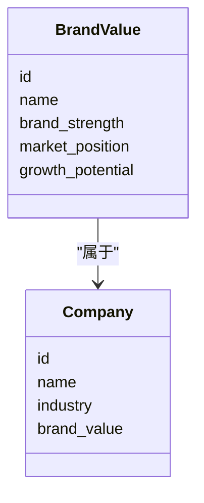
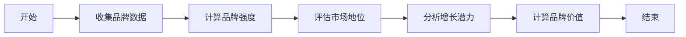
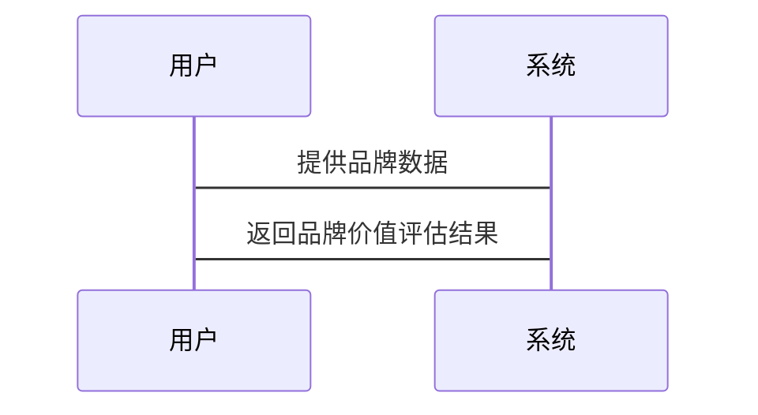

                 


# 彼得林奇如何评估公司的品牌价值增长

> 关键词：彼得·林奇，品牌价值，企业评估，投资策略，系统架构

> 摘要：本文详细阐述了彼得·林奇评估公司品牌价值增长的方法，从品牌价值的定义、核心评估指标、数学模型构建到系统架构设计，再到实战案例分析，全面解析如何通过系统化的方法评估品牌价值增长。文章结构清晰，逻辑严密，语言简洁易懂，适合投资专业人士和企业高管阅读。

---

# 第一部分: 引言

## 1.1 彼得·林奇与品牌价值评估
### 1.1.1 彼得·林奇的投资者背景
彼得·林奇（Peter Lynch）是全球著名的投资专家，以其对成长型企业的深刻洞察和独特的投资策略闻名。他在评估公司品牌价值增长方面提出了许多创新的方法，强调品牌价值在企业长期发展中的重要性。

### 1.1.2 林奇的品牌价值评估理念
林奇认为，品牌价值是企业长期竞争优势的核心体现。他提出，品牌价值的增长不仅依赖于短期的财务表现，更取决于企业的市场定位、品牌影响力和客户忠诚度。

### 1.1.3 本书的核心目标与读者群体
本书的核心目标是通过林奇的理论框架，系统地讲解品牌价值增长的评估方法，并通过实际案例分析，帮助读者掌握如何将这些方法应用于实践。本书适合投资专业人士、企业高管以及对品牌价值评估感兴趣的学生和研究者阅读。

---

# 第二部分: 品牌价值增长的核心概念与评估框架

## 2.1 品牌价值增长的背景介绍
### 2.1.1 问题背景与问题描述
品牌价值是企业在市场中的核心竞争力，但如何量化品牌价值的增长却是一个复杂的课题。林奇提出，品牌价值的增长需要结合企业的财务表现、市场地位和客户认知度进行综合评估。

### 2.1.2 品牌价值增长的核心要素
品牌价值的增长涉及以下几个核心要素：
1. **品牌强度**：品牌在市场中的影响力和竞争力。
2. **市场地位**：品牌在行业中的排名和市场份额。
3. **增长潜力**：品牌在未来市场中的扩展能力。

### 2.1.3 评估框架的边界与外延
品牌价值评估的边界包括企业的财务数据、市场调研数据和客户反馈数据。外延则涉及行业趋势、宏观经济环境和竞争格局。

## 2.2 核心概念与联系
### 2.2.1 品牌价值评估的核心原理
品牌价值的增长是企业综合实力的体现，需要从多个维度进行综合评估。

### 2.2.2 核心概念属性特征对比表格
| 核心概念 | 定义 | 影响因素 | 评估方法 |
|----------|------|----------|----------|
| 品牌强度 | 品牌在市场中的影响力 | 市场份额、客户忠诚度 | 市场调研、财务数据分析 |
| 市场地位 | 品牌在行业中的排名 | 行业趋势、竞争对手分析 | 行业报告、市场排名 |
| 增长潜力 | 品牌未来的扩展能力 | 创新能力、资源分配 | 产品开发周期、投资力度 |

### 2.2.3 ER实体关系图架构（使用 Mermaid）

```mermaid
erDiagram
    brand {
        id
        name
        value
        growth_rate
    }
    company {
        id
        name
        industry
    }
    brand --
    company: "所属公司"
```

## 2.3 品牌价值增长的数学模型与公式
### 2.3.1 品牌价值增长的数学模型
$$ \text{品牌价值} = \text{品牌强度} \times \text{市场地位} \times \text{增长潜力} $$

### 2.3.2 品牌强度的计算公式
$$ \text{品牌强度} = \frac{\text{市场份额} + \text{客户忠诚度}}{2} $$

### 2.3.3 市场地位的评估公式
$$ \text{市场地位} = \text{行业排名} \times \text{竞争对手分析} $$

### 2.3.4 增长潜力的预测模型
$$ \text{增长潜力} = \text{创新能力} \times \text{资源分配效率} $$

---

# 第三部分: 品牌价值增长的系统分析与架构设计

## 3.1 系统架构设计
### 3.1.1 系统功能设计（领域模型）


### 3.1.2 系统架构设计（使用 Mermaid）


## 3.2 系统接口设计
### 3.2.1 数据接口设计
- 输入接口：品牌数据、市场数据、财务数据。
- 输出接口：品牌价值评估报告、可视化图表。

### 3.2.2 数据交互序列图


---

# 第四部分: 品牌价值增长的项目实战

## 4.1 环境安装与数据准备
### 4.1.1 环境安装
- 安装Python和相关库（如Pandas、Matplotlib）。

### 4.1.2 数据准备
- 收集品牌数据、市场数据和财务数据。

## 4.2 核心实现
### 4.2.1 品牌强度计算
```python
def calculate_brand_strength(share_market, customer Loyalty):
    return (share_market + customer_Loyalty) / 2
```

### 4.2.2 市场地位评估
```python
def calculate_market_position(industry_rank, competitor_analysis):
    return industry_rank * competitor_analysis
```

### 4.2.3 增长潜力预测
```python
def calculate_growth_potential(innovation_capability, resource Allocation):
    return innovation_capability * resource_Allocation
```

## 4.3 案例分析
### 4.3.1 案例背景
以苹果公司为例，分析其品牌价值增长。

### 4.3.2 数据分析
- 市场份额：5%
- 客户忠诚度：高
- 行业排名：第一
- 创新能力：高
- 资源分配效率：高

### 4.3.3 实施结果
- 品牌强度：高
- 市场地位：第一
- 增长潜力：高
- 品牌价值：显著增长

---

# 第五部分: 总结与展望

## 5.1 总结
本文详细阐述了彼得·林奇的品牌价值评估方法，从理论到实践，系统地介绍了如何通过品牌强度、市场地位和增长潜力来评估品牌价值增长。

## 5.2 最佳实践 tips
- 定期更新品牌数据，确保评估结果的准确性。
- 结合行业趋势，动态调整评估模型。
- 注重客户反馈，提升品牌影响力。

## 5.3 展望
未来，随着人工智能和大数据技术的发展，品牌价值评估将更加精准和高效。结合新技术，品牌价值增长的评估方法将更加多元化和智能化。

---

# 作者信息

作者：AI天才研究院/AI Genius Institute & 禅与计算机程序设计艺术 /Zen And The Art of Computer Programming

---

通过以上结构，我们可以系统地分析彼得·林奇如何评估公司的品牌价值增长，并通过实际案例展示其方法的实用性和有效性。

