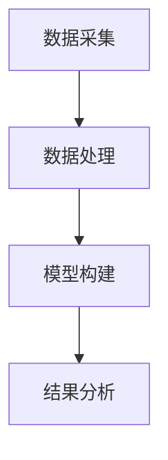
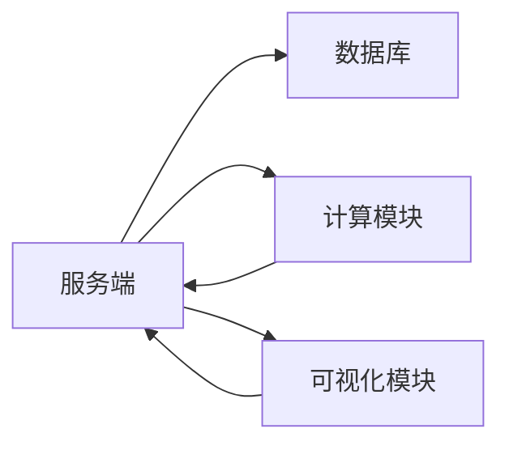

                 


# 彼得·林奇如何评估公司的品牌忠诚度

> 关键词：品牌忠诚度，彼得·林奇，投资评估，因子分析，系统架构

> 摘要：本文详细探讨了彼得·林奇如何评估公司的品牌忠诚度，从品牌忠诚度的定义与内涵、彼得·林奇的品牌忠诚度评估方法、品牌忠诚度评估的数学模型与算法、品牌忠诚度评估的系统架构与实现等方面进行了全面分析。通过理论与实践相结合的方式，本文为投资者提供了如何通过品牌忠诚度评估来优化投资决策的深度解析。

---

## 第一部分: 品牌忠诚度与投资评估的背景介绍

### 第1章: 品牌忠诚度的核心概念

#### 1.1 品牌忠诚度的定义与内涵

##### 1.1.1 品牌忠诚度的定义
品牌忠诚度是指消费者对某一品牌长期偏好并持续购买该品牌产品或服务的程度。它不仅是消费者行为的核心驱动因素，也是公司竞争优势的重要来源。

##### 1.1.2 品牌忠诚度的内涵与外延
品牌忠诚度的内涵包括品牌认知、品牌情感、品牌信任等多个维度，而其外延则涵盖了消费者行为、市场竞争环境、公司战略等多个方面。

##### 1.1.3 品牌忠诚度的核心要素
- 品牌认知度
- 品牌情感
- 品牌信任
- 品牌满意度

#### 1.2 品牌忠诚度与投资评估的关系

##### 1.2.1 品牌忠诚度对投资价值的影响
品牌忠诚度高的公司通常具有更强的市场竞争力和更高的客户保留率，这直接关系到公司的盈利能力和发展潜力。

##### 1.2.2 品牌忠诚度与公司竞争优势的关联
品牌忠诚度是公司竞争优势的重要组成部分，它反映了公司在市场中的地位和消费者的认可程度。

##### 1.2.3 品牌忠诚度在投资决策中的作用
通过评估品牌忠诚度，投资者可以更好地判断公司的长期发展潜力和抗风险能力。

---

### 第2章: 彼得·林奇的品牌忠诚度评估方法

#### 2.1 彼得·林奇投资理念概述

##### 2.1.1 彼得·林奇的投资哲学
彼得·林奇强调长期投资、价值投资和深入研究企业的基本面，他认为品牌忠诚度是企业长期成功的重要因素。

##### 2.1.2 彼得·林奇的成功投资案例
通过分析可口可乐、迪士尼等公司的投资案例，可以看出彼得·林奇对品牌忠诚度的高度重视。

##### 2.1.3 彼得·林奇对品牌忠诚度的重视
彼得·林奇认为，品牌忠诚度是企业持续增长的核心驱动力。

#### 2.2 彼得·林奇品牌忠诚度评估的核心指标

##### 2.2.1 品牌忠诚度的量化标准
- 市场占有率
- 客户保留率
- 品牌知名度
- 品牌美誉度

##### 2.2.2 品牌忠诚度评估的维度分解
- 品牌认知度
- 品牌情感
- 品牌信任
- 品牌满意度

##### 2.2.3 品牌忠诚度与公司财务表现的结合
通过分析公司的财务数据，结合品牌忠诚度的评估指标，可以更全面地评估公司的投资价值。

---

### 第3章: 品牌忠诚度评估的理论基础

#### 3.1 品牌忠诚度的形成机制

##### 3.1.1 品牌认知与品牌态度
品牌认知是品牌忠诚度的基础，而品牌态度则直接影响消费者的购买行为。

##### 3.1.2 品牌情感与品牌行为的关系
品牌情感是品牌忠诚度的核心驱动力，而品牌行为则是品牌忠诚度的外在表现。

##### 3.1.3 品牌忠诚度的动态变化过程
品牌忠诚度会随着市场环境、消费者需求和公司战略的变化而动态调整。

#### 3.2 品牌忠诚度的测量模型

##### 3.2.1 品牌忠诚度的测量维度
- 品牌认知度
- 品牌情感
- 品牌信任
- 品牌满意度

##### 3.2.2 品牌忠诚度的测量方法
- 调查问卷法
- 行为观察法
- 数据分析法

##### 3.2.3 品牌忠诚度的测量工具
- 市场调研工具
- 数据分析工具
- 行为监测工具

---

## 第二部分: 品牌忠诚度评估的数学模型与算法

### 第4章: 品牌忠诚度的因子分析模型

#### 4.1 品牌忠诚度因子分析的理论基础

##### 4.1.1 因子分析的基本原理
因子分析是一种统计方法，用于将多个变量归类为少数几个公共因子。

##### 4.1.2 品牌忠诚度因子分析的适用性
品牌忠诚度的评估涉及多个维度，因子分析可以有效地将这些维度进行降维处理。

##### 4.1.3 品牌忠诚度因子分析的步骤
1. 数据收集
2. 数据预处理
3. 因子分析
4. 结果解释

#### 4.2 品牌忠诚度因子分析的数学模型

##### 4.2.1 因子分析的数学公式
$$ X = A \cdot F + \epsilon $$
其中，$X$ 是观测变量，$A$ 是因子载荷矩阵，$F$ 是因子变量，$\epsilon$ 是误差项。

##### 4.2.2 因子载荷矩阵的计算
因子载荷矩阵反映了变量与因子之间的相关性。

##### 4.2.3 因子得分的计算方法
因子得分可以通过主成分分析法或其他方法计算。

#### 4.3 品牌忠诚度因子分析的实现

##### 4.3.1 数据预处理
- 数据清洗
- 数据标准化

##### 4.3.2 因子分析的实现步骤
1. 确定因子个数
2. 计算相关系数矩阵
3. 提取因子
4. 计算因子载荷矩阵
5. 解释因子

##### 4.3.3 代码实现
```python
import pandas as pd
from sklearn.decomposition import FactorAnalysis

# 数据预处理
data = pd.DataFrame([...])  # 输入数据

# 标准化数据
data_normalized = (data - data.mean()) / data.std()

# 因子分析
fa = FactorAnalysis(n_components=3)
fa.fit_transform(data_normalized)
```

---

### 第5章: 品牌忠诚度评估的算法实现

#### 5.1 品牌忠诚度评估算法的选择

##### 5.1.1 常见的品牌忠诚度评估算法
- 因子分析
- 聚类分析
- 回归分析

##### 5.1.2 算法选择的依据与标准
- 数据特征
- 业务需求
- 算法性能

##### 5.1.3 算法的优缺点对比
| 算法 | 优点 | 缺点 |
|------|------|------|
| 因子分析 | 降维效果好 | 解释性较差 |
| 聚类分析 | 适合分群 | 需要人工干预 |
| 回归分析 | 解释性强 | 易受多重共线性影响 |

#### 5.2 品牌忠诚度评估算法的实现

##### 5.2.1 算法实现的步骤
1. 数据收集与预处理
2. 选择合适的算法
3. 模型训练
4. 模型评估
5. 模型应用

##### 5.2.2 算法实现的代码示例
```python
import numpy as np
import pandas as pd
from sklearn.metrics.pairwise import pairwise_distances

# 数据预处理
data = pd.DataFrame([...])  # 输入数据

# 聚类分析
distance_matrix = pairwise_distances(data)
# 聚类结果
clusters = [...]  # 聚类结果
```

##### 5.2.3 算法实现的注意事项
- 数据的特征工程
- 模型的调参优化
- 结果的解释与验证

---

## 第三部分: 品牌忠诚度评估的系统架构与实现

### 第6章: 品牌忠诚度评估系统的功能设计

#### 6.1 系统功能模块划分

##### 6.1.1 数据采集模块
负责收集品牌相关数据，包括消费者行为数据、市场数据等。

##### 6.1.2 数据处理模块
对数据进行清洗、标准化等预处理。

##### 6.1.3 模型构建模块
实现品牌忠诚度的因子分析或其他算法。

##### 6.1.4 结果分析模块
对模型结果进行解读和可视化。

#### 6.2 系统功能流程图


---

### 第7章: 品牌忠诚度评估系统的架构设计

#### 7.1 系统架构设计的总体思路

##### 7.1.1 问题场景介绍
通过系统架构设计，解决品牌忠诚度评估中的数据处理和模型构建问题。

##### 7.1.2 系统功能设计
- 数据采集
- 数据处理
- 模型构建
- 结果分析

##### 7.1.3 系统架构设计


---

## 小结

通过本文的分析，我们可以看出，彼得·林奇的品牌忠诚度评估方法不仅是一种投资策略，更是一种系统化的分析方法。从理论到实践，从算法到系统架构，我们详细探讨了如何通过品牌忠诚度评估来优化投资决策。

---

## 注意事项

- 数据的准确性和完整性是品牌忠诚度评估的基础。
- 模型的选择和优化需要根据具体业务需求进行调整。
- 结果的解释和验证是品牌忠诚度评估的重要环节。

---

## 拓展阅读

- 彼得·林奇的《投资之道》
- 《品牌管理》
- 《因子分析与聚类分析》

---

作者：AI天才研究院/AI Genius Institute & 禅与计算机程序设计艺术 /Zen And The Art of Computer Programming

