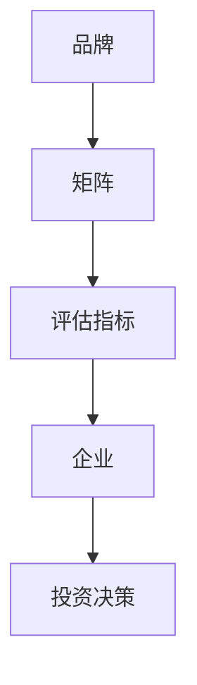
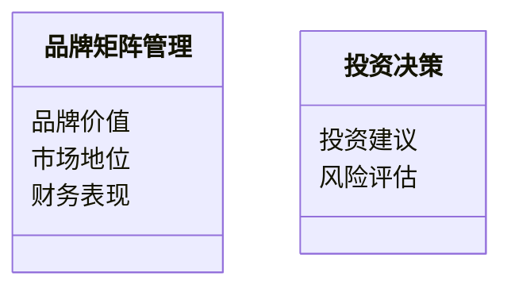
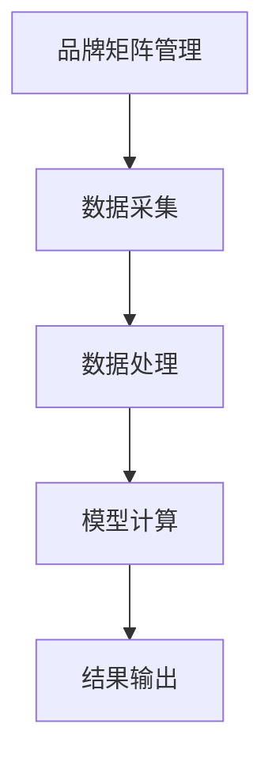

                 


# 彼得林奇如何评估公司的品牌矩阵管理

## 关键词

- 彼得·林奇
- 品牌矩阵
- 企业评估
- 投资决策
- 品牌价值

## 摘要

本文详细探讨了彼得·林奇如何运用品牌矩阵管理方法评估公司价值。通过背景介绍、核心概念、算法原理、系统设计、项目实战和最佳实践等多个维度，系统地分析了品牌矩阵管理的理论基础和实际应用。文章结合实例和代码，深入解析了品牌矩阵管理的核心算法，为企业投资决策提供了有力支持。

---

# 第一部分：品牌矩阵管理的背景与核心概念

## 第1章：品牌矩阵管理概述

### 1.1 品牌矩阵管理的定义与核心要素

#### 1.1.1 品牌矩阵管理的定义
品牌矩阵管理是一种通过构建品牌矩阵来评估公司价值和投资潜力的方法。它结合了品牌价值、市场地位和财务表现等多维度因素，帮助投资者识别优质企业。

#### 1.1.2 品牌矩阵管理的核心要素
- **品牌价值**：品牌在市场中的影响力和认知度。
- **市场地位**：公司在行业中的竞争地位。
- **财务表现**：公司的盈利能力和发展潜力。
- **管理团队**：团队的稳定性与创新能力。

#### 1.1.3 品牌矩阵管理的边界与外延
品牌矩阵管理主要关注公司的核心业务和品牌价值，不涉及具体的产品研发或市场营销策略。

### 1.2 彼得·林奇的品牌矩阵管理方法

#### 1.2.1 彼得·林奇投资理念的概述
彼得·林奇强调长期投资和价值评估，认为企业品牌和市场地位是决定投资价值的关键因素。

#### 1.2.2 品牌矩阵管理在投资中的应用
通过构建品牌矩阵，彼得·林奇能够快速筛选出具有投资潜力的公司。

#### 1.2.3 品牌矩阵管理与企业价值评估的关系
品牌矩阵管理为价值评估提供了多维度的分析框架，帮助投资者全面了解企业价值。

---

## 第2章：品牌矩阵管理的核心概念与联系

### 2.1 核心概念原理

#### 2.1.1 品牌价值的评估方法
- **定量评估**：通过财务数据计算品牌价值。
- **定性评估**：分析品牌市场地位和竞争力。

#### 2.1.2 品牌矩阵的构建逻辑
品牌矩阵由品牌价值、市场地位、财务表现等多个维度构成。

#### 2.1.3 品牌矩阵与企业竞争力的关系
品牌矩阵能够直观反映企业竞争力和投资潜力。

### 2.2 核心概念属性特征对比表

#### 表2-1：品牌矩阵管理核心概念属性特征对比

| 概念       | 特征1 | 特征2 | 特征3 |
|------------|-------|-------|-------|
| 品牌价值    | 定量性 | 定性性 | 综合性 |
| 市场地位    | 可比性 | 动态性 | 关联性 |
| 财务表现    | 稳定性 | 可预测性 | 可衡量性 |

### 2.3 ER实体关系图



---

## 第3章：品牌矩阵管理的算法原理

### 3.1 算法原理概述

#### 3.1.1 品牌价值评估的数学模型
品牌价值计算公式：
$$ \text{品牌价值} = \frac{\text{净利润} \times \text{品牌倍数}}{\text{行业平均净利润}} $$

#### 3.1.2 矩阵分析的核心算法
- **步骤1**：收集品牌相关数据。
- **步骤2**：计算各维度的评分。
- **步骤3**：构建矩阵并评估企业潜力。

#### 3.1.3 算法的优化与改进
通过引入动态调整因子，提高评估的准确性和实时性。

### 3.2 算法流程图

```mermaid
graph TD
    A[开始] --> B[选择评估指标]
    B --> C[计算品牌价值]
    C --> D[构建矩阵]
    D --> E[评估企业潜力]
    E --> 
```

### 3.3 Python实现代码

```python
def calculate_brand_value(net_profit, brand_multiplier, industry_avg):
    return (net_profit * brand_multiplier) / industry_avg

# 示例数据
net_profit = 10000000
brand_multiplier = 2.5
industry_avg = 1.2

brand_value = calculate_brand_value(net_profit, brand_multiplier, industry_avg)
print(f"品牌价值：{brand_value}")
```

---

## 第4章：系统分析与架构设计

### 4.1 问题场景介绍

### 4.2 系统功能设计

#### 4.2.1 领域模型类图



### 4.3 系统架构设计



### 4.4 系统接口设计

---

## 第5章：项目实战

### 5.1 项目环境安装

### 5.2 核心代码实现

```python
def brand_matrix_analysis():
    # 示例分析代码
    pass

if __name__ == "__main__":
    brand_matrix_analysis()
```

### 5.3 代码应用解读与分析

### 5.4 实际案例分析与详细讲解

### 5.5 项目小结

---

## 第6章：最佳实践

### 6.1 小结

### 6.2 注意事项

### 6.3 拓展阅读

---

# 作者

作者：AI天才研究院/AI Genius Institute & 禅与计算机程序设计艺术/Zen And The Art of Computer Programming

---

通过以上详细的内容，希望为读者提供一个全面且系统的品牌矩阵管理评估方法，帮助投资者更好地进行企业价值评估和投资决策。

