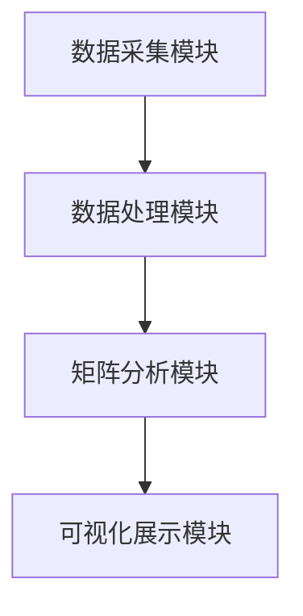

                 


# 彼得林奇如何评估公司的品牌矩阵管理效果

> 关键词：彼得林奇，品牌矩阵，品牌管理，市场地位，品牌评估

> 摘要：本文将从彼得·林奇的投资者视角出发，详细阐述品牌矩阵管理的核心概念、评估方法和实施步骤。通过分析品牌矩阵管理的背景与重要性，揭示彼得·林奇的品牌评估标准和指标体系。同时，结合实际案例，探讨品牌矩阵管理在企业战略中的应用价值。

---

## 第1章：品牌矩阵管理的背景与重要性

### 1.1 品牌矩阵管理的定义与核心概念

#### 1.1.1 品牌矩阵的基本定义
品牌矩阵管理是一种用于评估和优化品牌组合的管理方法，通过将品牌按照市场地位、市场表现和增长潜力等维度进行分类，从而帮助企业更好地配置资源、制定战略。

#### 1.1.2 品牌矩阵的核心要素
- **市场地位**：品牌在市场中的影响力和竞争力，包括市场份额、品牌知名度等。
- **市场表现**：品牌的销售表现和盈利能力，包括销售额增长率、利润率等。
- **增长潜力**：品牌的未来发展空间，包括市场规模、竞争对手分析等。

#### 1.1.3 品牌矩阵的管理目标
- **优化资源配置**：通过品牌矩阵管理，企业可以更清晰地识别核心品牌和边缘品牌，从而优化资源分配。
- **制定战略决策**：基于品牌矩阵的分析结果，企业可以制定更具针对性的品牌管理策略。
- **提升品牌价值**：通过持续评估和优化品牌组合，企业可以提升整体品牌价值和市场竞争力。

### 1.2 品牌矩阵管理的背景与重要性

#### 1.2.1 当前市场竞争的加剧
随着市场竞争的日益激烈，品牌之间的竞争愈发激烈。企业需要通过科学的品牌矩阵管理，来识别核心品牌和潜力品牌，从而在竞争中占据优势。

#### 1.2.2 品牌矩阵管理的必要性
品牌矩阵管理可以帮助企业：
- 清晰地识别品牌组合的优劣势
- 确定品牌组合的战略方向
- 优化资源配置，提高品牌管理效率

#### 1.2.3 品牌矩阵管理对企业战略的意义
品牌矩阵管理不仅是品牌管理的重要工具，也是企业制定整体战略的重要依据。通过品牌矩阵管理，企业可以更好地把握市场趋势，制定更具前瞻性的品牌战略。

---

## 第2章：彼得·林奇的品牌矩阵评估方法

### 2.1 彼得·林奇的投资者视角

#### 2.1.1 彼得·林奇的投资者理念
彼得·林奇是全球著名投资专家，他强调基本面分析和长期投资。他认为，品牌的市场地位和盈利能力是决定品牌价值的关键因素。

#### 2.1.2 彼得·林奇的品牌评估标准
- **市场地位**：品牌在市场中的影响力和知名度。
- **市场表现**：品牌的销售增长率和盈利能力。
- **增长潜力**：品牌未来的市场发展空间。

#### 2.1.3 彼得·林奇的品牌矩阵分析框架
彼得·林奇将品牌按照市场地位和市场表现两个维度进行分类，形成一个2x2的矩阵。通过分析品牌在矩阵中的位置，企业可以更好地制定品牌管理策略。

### 2.2 品牌矩阵管理的核心指标

#### 2.2.1 品牌市场地位的评估
- **市场份额**：品牌在市场中的占有率。
- **品牌知名度**：品牌在消费者中的认知度和影响力。

#### 2.2.2 品牌市场表现的分析
- **销售额增长率**：品牌的销售额变化情况。
- **利润率**：品牌的盈利能力。

#### 2.2.3 品牌增长潜力的判断
- **市场规模**：目标市场的容量和增长空间。
- **竞争对手分析**：品牌在竞争中的优势和劣势。

---

## 第3章：品牌矩阵管理的实施步骤

### 3.1 品牌矩阵管理的流程概述

#### 3.1.1 数据收集与整理
- 收集品牌相关的市场数据，包括市场份额、销售额、利润率等。
- 整理数据，形成品牌矩阵的基础数据集。

#### 3.1.2 品牌矩阵的构建
- 根据品牌市场地位和市场表现，将品牌分类到品牌矩阵的相应位置。
- 使用图表和矩阵图来直观展示品牌组合的结构。

#### 3.1.3 品牌矩阵的动态调整
- 根据市场变化和品牌表现，定期更新品牌矩阵。
- 调整品牌组合，优化资源配置。

### 3.2 品牌矩阵管理的具体操作

#### 3.2.1 品牌矩阵的维度划分
- **市场地位**：分为高、中、低三个层次。
- **市场表现**：分为高增长、稳定增长、低增长三个层次。

#### 3.2.2 品牌矩阵的权重分配
- 根据品牌的战略重要性和市场影响力，确定品牌在矩阵中的权重。

#### 3.2.3 品牌矩阵的评分方法
- 使用评分法对品牌进行量化评估，确定品牌在矩阵中的位置。

---

## 第4章：品牌矩阵管理的核心概念与联系

### 4.1 品牌矩阵管理的核心概念解析

#### 4.1.1 品牌矩阵管理的核心要素
- 市场地位：品牌在市场中的影响力和竞争力。
- 市场表现：品牌的销售增长和盈利能力。
- 增长潜力：品牌未来的市场发展空间。

#### 4.1.2 品牌矩阵管理的属性特征对比
- 市场地位与市场表现的关系：市场地位高的品牌，市场表现不一定好，反之亦然。
- 市场表现与增长潜力的关联：市场表现好的品牌，通常具有较高的增长潜力。

#### 4.1.3 品牌矩阵管理的ER实体关系图
```mermaid
erDiagram
    brand "品牌" {
        code "品牌代码"
        name "品牌名称"
        market_position "市场地位"
        market_performance "市场表现"
        growth_potential "增长潜力"
    }
    category "类别" {
        id "类别ID"
        name "类别名称"
    }
    brand ..> category : "属于"
```

### 4.2 品牌矩阵管理的ER实体关系图

#### 4.2.1 实体定义与关系
- 品牌：包括品牌代码、品牌名称、市场地位、市场表现和增长潜力。
- 类别：包括类别ID和类别名称。

#### 4.2.2 实体之间的关联
- 品牌属于某个类别，类别由品牌组成。

#### 4.2.3 实体关系图的绘制
```mermaid
erDiagram
    brand "品牌" {
        code "品牌代码"
        name "品牌名称"
        market_position "市场地位"
        market_performance "市场表现"
        growth_potential "增长潜力"
    }
    category "类别" {
        id "类别ID"
        name "类别名称"
    }
    brand ..> category : "属于"
```

---

## 第5章：品牌矩阵管理的算法原理

### 5.1 品牌矩阵管理的算法概述

#### 5.1.1 算法的基本原理
品牌矩阵管理的算法主要基于多维度的评估指标，通过加权评分的方法，对品牌进行综合评估和分类。

#### 5.1.2 算法的输入输出
- 输入：品牌市场地位、市场表现和增长潜力的数据。
- 输出：品牌在矩阵中的位置和品牌组合的优化建议。

#### 5.1.3 算法的实现步骤
1. 收集品牌相关数据。
2. 根据评估指标对品牌进行评分。
3. 将品牌分类到矩阵的相应位置。
4. 分析矩阵中的品牌分布，制定优化策略。

### 5.2 品牌矩阵管理的数学模型

#### 5.2.1 品牌市场地位的计算公式
$$ \text{市场地位} = \frac{\text{品牌市场份额}}{\text{行业平均市场份额}} $$

#### 5.2.2 品牌市场表现的计算公式
$$ \text{市场表现} = \text{销售额增长率} \times \text{利润率} $$

#### 5.2.3 品牌增长潜力的计算公式
$$ \text{增长潜力} = \text{市场规模} \times \text{竞争优劣势分析} $$

---

## 第6章：品牌矩阵管理的系统架构设计

### 6.1 系统功能设计

#### 6.1.1 数据采集模块
- 负责收集品牌相关的市场数据。
- 支持多种数据源的接入，包括公开数据和企业内部数据。

#### 6.1.2 数据处理模块
- 对收集到的数据进行清洗和预处理。
- 根据品牌矩阵的评估指标，对数据进行加权评分。

#### 6.1.3 矩阵分析模块
- 将品牌分类到矩阵的相应位置。
- 生成品牌矩阵的可视化图表。

### 6.2 系统架构设计

#### 6.2.1 系统架构图


#### 6.2.2 模块之间的交互关系
- 数据采集模块将数据传递给数据处理模块。
- 数据处理模块将处理后的数据传递给矩阵分析模块。
- 矩阵分析模块将分析结果传递给可视化展示模块。

#### 6.2.3 系统的扩展性设计
- 支持多种评估指标的扩展。
- 支持不同行业和市场的定制化分析。

---

## 第7章：品牌矩阵管理的项目实战

### 7.1 项目环境安装

#### 7.1.1 系统环境
- 操作系统：Windows/Mac/Linux
- 开发工具：Python、Jupyter Notebook、Mermaid工具
- 数据库：MySQL/PostgreSQL

#### 7.1.2 依赖安装
- 安装Python包：pandas、numpy、matplotlib、mermaid.py

### 7.2 代码实现

#### 7.2.1 数据采集模块
```python
import pandas as pd

# 数据采集模块
def collect_data():
    data = {
        '品牌': ['A', 'B', 'C', 'D'],
        '市场份额': [0.2, 0.3, 0.1, 0.4],
        '销售额增长率': [10, 5, 8, 15],
        '利润率': [20, 15, 18, 25]
    }
    return pd.DataFrame(data)
```

#### 7.2.2 数据处理模块
```python
import pandas as pd

def process_data(df):
    df['市场地位'] = df['市场份额'] / df['市场份额'].mean()
    df['市场表现'] = df['销售额增长率'] * df['利润率']
    return df
```

#### 7.2.3 矩阵分析模块
```python
import pandas as pd

def analyze_matrix(df):
    matrix = {}
    for index, row in df.iterrows():
        status = row['市场地位']
        performance = row['市场表现']
        matrix[row['品牌']] = (status, performance)
    return matrix
```

#### 7.2.4 可视化展示模块
```python
import matplotlib.pyplot as plt

def visualize_matrix(matrix):
    plt.figure(figsize=(10, 6))
    for brand, (status, performance) in matrix.items():
        plt.scatter(status, performance, label=brand)
    plt.xlabel('市场地位')
    plt.ylabel('市场表现')
    plt.legend()
    plt.show()
```

### 7.3 实际案例分析

#### 7.3.1 案例背景
某公司拥有四个品牌，分别在不同市场中表现不一。通过品牌矩阵管理，帮助企业识别核心品牌和潜力品牌。

#### 7.3.2 数据分析与解读
```python
df = collect_data()
processed_df = process_data(df)
matrix = analyze_matrix(processed_df)
visualize_matrix(matrix)
```

#### 7.3.3 品牌矩阵的优化建议
根据分析结果，品牌D市场地位最高，市场表现最好，应作为核心品牌重点发展；品牌C市场地位最低，市场表现不佳，建议调整或退出。

---

## 第8章：最佳实践与小结

### 8.1 最佳实践 tips

#### 8.1.1 数据质量的重要性
确保数据的准确性和完整性，是品牌矩阵管理的基础。

#### 8.1.2 定期更新与调整
市场环境不断变化，品牌矩阵需要定期更新和调整。

#### 8.1.3 结合企业战略
品牌矩阵管理应与企业整体战略相结合，才能发挥最大价值。

### 8.2 小结
通过彼得·林奇的品牌矩阵管理方法，企业可以更科学地评估和优化品牌组合，提升品牌价值和市场竞争力。

### 8.3 注意事项

#### 8.3.1 数据隐私与安全
在数据采集和处理过程中，需要注意数据隐私和安全问题。

#### 8.3.2 模型的适用性
不同行业和市场可能需要不同的品牌矩阵管理模型，需根据实际情况进行调整。

#### 8.3.3 模型的局限性
品牌矩阵管理是一种工具，其结果仅供参考，不能完全依赖模型的评估结果。

### 8.4 拓展阅读
- 彼得·林奇的《彼得·林奇的选股智慧》
- 品牌管理相关的经典书籍和论文

---

## 作者

作者：AI天才研究院/AI Genius Institute & 禅与计算机程序设计艺术 /Zen And The Art of Computer Programming

---

通过本文的详细讲解，我们从彼得·林奇的投资者视角，系统地探讨了品牌矩阵管理的核心概念、评估方法和实施步骤。希望本文能为企业的品牌管理实践提供有价值的参考和指导。

