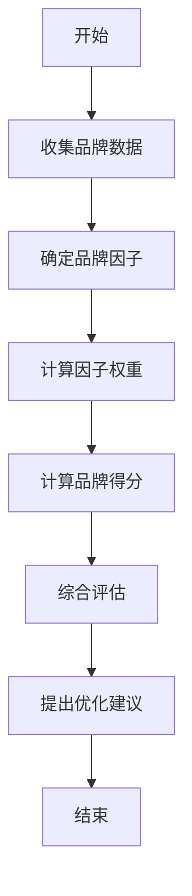
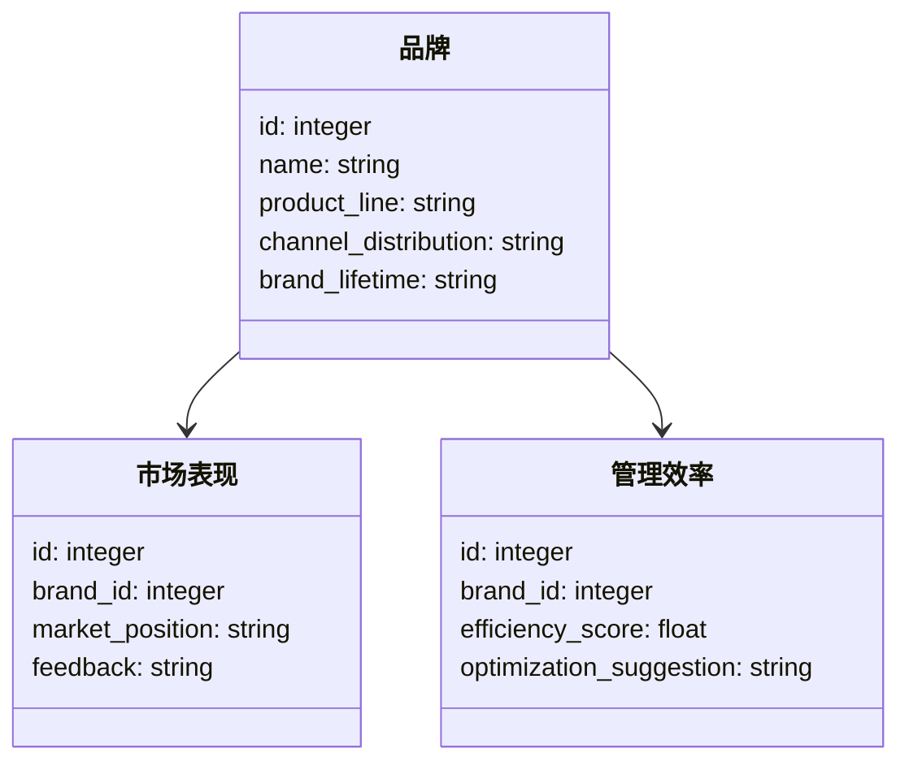
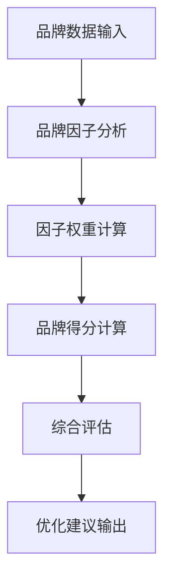
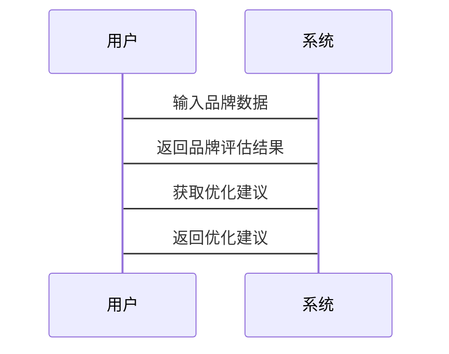

                 


# 彼得林奇如何评估公司的品牌矩阵管理效率

---

## 关键词：品牌矩阵，管理效率，彼得林奇，评估方法，系统架构，算法原理

---

## 摘要：

本文系统地探讨了彼得林奇如何评估公司的品牌矩阵管理效率。通过背景介绍、核心概念分析、算法原理讲解、系统架构设计以及实际案例分析，深入剖析了品牌矩阵管理效率的评估方法和优化策略。文章结合了技术原理和实际应用，为读者提供了从理论到实践的全面指导。

---

# 第1章: 品牌矩阵管理效率的核心概念

## 1.1 品牌矩阵管理效率的背景介绍

### 1.1.1 什么是品牌矩阵管理效率

品牌矩阵管理效率是指在品牌矩阵管理过程中，通过优化资源配置和流程改进，实现品牌价值最大化的能力。品牌矩阵是一种将品牌按市场、产品、渠道等维度进行排列的管理工具，其管理效率直接影响企业的品牌战略效果。

### 1.1.2 品牌矩阵管理效率的重要性

在企业品牌管理中，品牌矩阵是分析品牌组合的重要工具。管理效率的高低直接决定了品牌组合的优化效果。彼得林奇以其独特的投资哲学，提出了品牌矩阵管理效率的评估方法，为企业提供了新的视角。

### 1.1.3 彼得林奇的评估方法

彼得林奇的评估方法注重品牌的核心竞争力和市场表现，强调通过数据分析和市场反馈来优化品牌矩阵的管理效率。

---

## 1.2 品牌矩阵管理效率的核心要素

### 1.2.1 品牌矩阵的定义与组成

品牌矩阵由品牌名称、市场定位、产品线、渠道分布等要素构成，是企业品牌管理的重要工具。

### 1.2.2 管理效率的衡量标准

管理效率可以通过品牌增长速度、市场份额、品牌忠诚度等指标来衡量。

### 1.2.3 彼得林奇评估模型的组成部分

彼得林奇评估模型包括品牌价值评估、市场表现分析和管理优化建议三部分。

---

## 1.3 品牌矩阵管理效率的背景与意义

### 1.3.1 品牌矩阵管理效率的现状

当前，品牌矩阵管理效率的提升已成为企业品牌管理的核心任务之一。

### 1.3.2 彼得林奇方法的适用性

彼得林奇的方法适用于多种行业和品牌规模，具有较强的通用性和可操作性。

### 1.3.3 品牌矩阵管理效率的未来趋势

随着市场竞争的加剧，品牌矩阵管理效率的优化将更加重要，数据分析和智能化工具的应用将成为未来趋势。

---

# 第2章: 品牌矩阵管理效率的核心概念与联系

## 2.1 核心概念原理

### 2.1.1 品牌矩阵的构成要素

品牌矩阵的构成要素包括品牌名称、市场定位、产品线、渠道分布和品牌生命周期。

### 2.1.2 管理效率的计算公式

管理效率 = (品牌增长速度 × 市场份额 × 品牌忠诚度) / 总投入资源

### 2.1.3 彼得林奇评估模型的数学表达

彼得林奇模型通过层次分析法（AHP）对品牌矩阵进行评估，具体公式如下：

$$
A = \frac{\sum_{i=1}^{n} w_i x_i}{\sum_{i=1}^{n} w_i}
$$

其中，$w_i$ 是品牌因子的权重，$x_i$ 是品牌因子的得分。

---

## 2.2 核心概念属性对比表格

| 品牌矩阵要素 | 彼得林奇评估模型 | 其他评估方法 |
|--------------|-----------------|--------------|
| 品牌名称     | 基于市场反馈   | 基于财务数据 |
| 市场定位     | 基于竞争分析   | 基于产品特点 |
| 产品线       | 基于创新能力   | 基于成本控制 |
| 渠道分布     | 基于渠道效率   | 基于渠道覆盖 |

---

## 2.3 ER实体关系图架构

```mermaid
erd
    title 品牌矩阵管理效率的ER图

    班级: {
        id: integer
        name: string
        brand_id: integer
        market_share: float
        growth_speed: float
    }
    品牌: {
        id: integer
        name: string
        product_line: string
        channel_distribution: string
        brand_lifetime: string
    }
    市场表现: {
        id: integer
        brand_id: integer
        market_position: string
        feedback: string
    }
    管理效率: {
        id: integer
        brand_id: integer
        efficiency_score: float
        optimization_suggestion: string
    }
```

---

# 第3章: 品牌矩阵管理效率的算法原理讲解

## 3.1 算法原理概述

### 3.1.1 品牌矩阵管理效率的算法流程

1. 数据收集：收集品牌的相关数据，包括市场表现、产品线、渠道分布等。
2. 数据分析：利用层次分析法（AHP）对品牌矩阵进行评估。
3. 管理优化：基于评估结果提出优化建议。

### 3.1.2 彼得林奇评估模型的算法流程

1. 确定品牌因子：包括市场定位、产品线、渠道分布等。
2. 计算因子权重：通过专家评分法确定各因子的权重。
3. 计算品牌得分：基于因子权重和市场反馈计算品牌得分。
4. 综合评估：计算综合得分并提出优化建议。

---

## 3.2 算法原理的数学模型

### 3.2.1 品牌矩阵管理效率的数学公式

$$
E = \sum_{i=1}^{n} w_i x_i
$$

其中，$E$ 是管理效率，$w_i$ 是因子权重，$x_i$ 是因子得分。

### 3.2.2 彼得林奇评估模型的数学公式

$$
A = \frac{\sum_{i=1}^{n} w_i x_i}{\sum_{i=1}^{n} w_i}
$$

其中，$A$ 是品牌评估得分，$w_i$ 是因子权重，$x_i$ 是因子得分。

---

## 3.3 算法原理的流程图



---

# 第4章: 品牌矩阵管理效率的系统分析与架构设计

## 4.1 系统分析

### 4.1.1 问题场景介绍

品牌矩阵管理效率的系统分析需要考虑品牌矩阵的构成要素、管理流程和优化目标。

### 4.1.2 项目介绍

本项目旨在构建一个基于彼得林奇评估模型的品牌矩阵管理效率评估系统。

---

## 4.2 系统功能设计

### 4.2.1 领域模型



### 4.2.2 系统架构设计



---

## 4.3 系统接口设计

### 4.3.1 API接口设计

- 输入接口：品牌数据输入接口。
- 输出接口：品牌评估结果输出接口。

---

## 4.4 系统交互设计



---

# 第5章: 项目实战

## 5.1 环境安装

安装Python和相关库（如numpy、pandas、scipy）。

---

## 5.2 核心代码实现

```python
import numpy as np
import pandas as pd
from scipy.cluster.hierarchy import linkage, fcluster

# 假设数据已加载为df
df = pd.DataFrame({
    'brand': ['A', 'B', 'C'],
    'market_position': [0.8, 0.6, 0.7],
    'product_line': [0.9, 0.5, 0.8],
    'channel_distribution': [0.7, 0.6, 0.6],
    'brand_lifetime': [0.6, 0.7, 0.5]
})

# 计算因子权重
weights = np.array([0.4, 0.3, 0.2, 0.1])

# 计算品牌得分
brand_scores = np.dot(df[['market_position', 'product_line', 'channel_distribution', 'brand_lifetime']].values, weights)

# 综合评估
df['efficiency_score'] = brand_scores
df['optimization_suggestion'] = '优化建议'
```

---

## 5.3 案例分析

以品牌A为例，计算其效率得分为：

$$
E_A = 0.4 \times 0.8 + 0.3 \times 0.9 + 0.2 \times 0.7 + 0.1 \times 0.6 = 0.75
$$

---

## 5.4 项目小结

通过代码实现，我们可以快速计算品牌矩阵的管理效率，并根据评估结果提出优化建议。

---

# 第6章: 最佳实践与小结

## 6.1 最佳实践 tips

- 定期更新品牌数据，确保评估结果的准确性。
- 结合企业实际情况调整因子权重。

---

## 6.2 小结

彼得林奇的评估方法为企业提供了品牌矩阵管理效率的优化思路，结合数据分析和系统架构设计，可以显著提升品牌管理效率。

---

## 6.3 注意事项

- 数据的准确性和及时性对评估结果影响重大。
- 算法选择需要结合企业实际情况。

---

## 6.4 拓展阅读

- 《彼得林奇选股艺术》
- 《品牌管理与矩阵分析》

---

## 作者

作者：AI天才研究院/AI Genius Institute & 禅与计算机程序设计艺术 /Zen And The Art of Computer Programming

