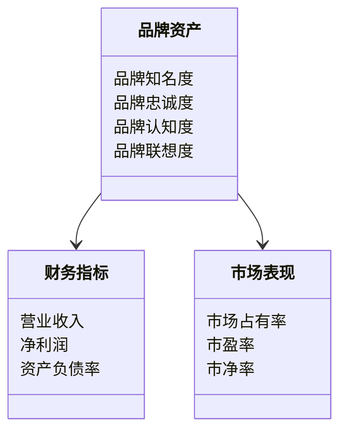

                 


# 彼得林奇如何评估公司的品牌资产价值

## 关键词：品牌资产价值，彼得林奇，投资评估，DCF模型，EV/EBITDA倍数法，品牌资产评估

## 摘要：本文详细探讨了彼得·林奇如何评估公司的品牌资产价值。通过分析品牌资产的构成维度、评估模型和数学公式，结合实际案例，展示了如何将品牌资产转化为财务价值。文章还提供了系统分析和项目实战，帮助读者掌握品牌资产评估的核心方法。

---

## 第1章: 品牌资产价值评估的背景与重要性

### 1.1 品牌资产的定义与构成

#### 1.1.1 品牌资产的核心概念
品牌资产是指企业通过品牌建设所积累的无形资产，包括品牌知名度、品牌忠诚度等。这些资产能够为企业带来长期的财务价值。

#### 1.1.2 品牌资产的构成要素
- 品牌知名度：品牌在市场上的认知程度。
- 品牌忠诚度：客户对品牌的忠诚程度。
- 品牌认知度：客户对品牌的理解和记忆程度。
- 品牌联想度：客户对品牌的联想和情感联系。

#### 1.1.3 品牌资产与企业价值的关系
品牌资产能够直接影响企业的市场估值，尤其是在竞争激烈的市场中，强大的品牌资产可以为企业带来更高的溢价能力。

### 1.2 品牌资产价值评估的重要性

#### 1.2.1 企业投资决策中的品牌价值
在企业并购或投资决策中，品牌资产是评估目标公司价值的重要组成部分。

#### 1.2.2 品牌价值对企业市场估值的影响
强大的品牌资产能够提升企业的市场估值，尤其是在品牌忠诚度高的行业。

#### 1.2.3 品牌价值与企业长期战略的关系
品牌资产是企业长期战略的核心，能够为企业提供持续的竞争优势。

### 1.3 彼得林奇的品牌评估方法论

#### 1.3.1 彼得林奇的投资哲学
彼得林奇注重基本面分析，关注企业的财务状况和市场地位。

#### 1.3.2 品牌资产在彼得林奇投资体系中的地位
品牌资产是彼得林奇评估企业价值的重要因素之一。

#### 1.3.3 彼得林奇品牌评估的核心原则
- 重点关注企业的品牌影响力和市场地位。
- 结合财务指标和市场表现进行综合评估。

---

## 第2章: 品牌资产价值的多维度评估模型

### 2.1 品牌资产的构成维度

#### 2.1.1 品牌知名度
品牌知名度是品牌资产的重要组成部分，可以通过市场调查和数据分析来评估。

#### 2.1.2 品牌忠诚度
品牌忠诚度反映了客户对品牌的忠诚程度，可以通过客户满意度调查和回购率来衡量。

#### 2.1.3 品牌认知度
品牌认知度是指客户对品牌的理解和记忆程度，可以通过市场调研和竞争对手分析来评估。

#### 2.1.4 品牌联想度
品牌联想度反映了客户对品牌的联想和情感联系，可以通过品牌形象分析和情感调研来衡量。

### 2.2 彼得林奇品牌价值评估模型

#### 2.2.1 品牌资产的财务指标体系
- 营业收入增长率
- 净利润率
- 资产负债率

#### 2.2.2 品牌资产的市场表现指标
- 市场占有率
- 市盈率
- 市净率

#### 2.2.3 品牌资产的行业对比分析
将企业的品牌资产指标与行业平均水平进行对比，评估其相对优势。

### 2.3 品牌资产价值的量化方法

#### 2.3.1 品牌资产的货币化方法
将品牌资产转化为具体的财务价值，可以通过品牌授权收入、品牌收购溢价等方式进行评估。

#### 2.3.2 品牌资产的相对估值法
通过比较同类企业的品牌资产估值，确定企业的品牌资产价值。

#### 2.3.3 品牌资产的DCF模型
使用现金流折现法（DCF）对品牌资产进行估值，考虑未来现金流的现值。

---

## 第3章: 品牌资产价值评估的算法与数学模型

### 3.1 品牌资产价值评估的算法原理

#### 3.1.1 基于现金流的DCF模型
通过预测未来现金流，折现计算品牌资产的现值。

#### 3.1.2 基于市场倍数的EV/EBITDA法
使用企业价值与息税折旧及摊销前利润的比率，评估品牌资产的价值。

#### 3.1.3 基于品牌强度的评分模型
通过多个指标对品牌强度进行评分，确定品牌资产的价值。

### 3.2 品牌资产价值评估的数学模型

#### 3.2.1 DCF模型公式
$$ V = \sum_{t=1}^{n} \frac{CF_t}{(1+r)^t} + \frac{TV}{(1+r)^n} $$
其中，$V$为品牌资产价值，$CF_t$为第$t$年的现金流，$r$为折现率，$TV$为终值。

#### 3.2.2 EV/EBITDA倍数法公式
$$ EV = \frac{EBITDA \times 倍数}{1} $$
其中，$EV$为企业价值，$EBITDA$为息税折旧及摊销前利润，倍数为市场平均倍数。

---

## 第4章: 系统分析与架构设计方案

### 4.1 问题场景介绍
评估品牌资产价值需要综合考虑市场、财务和客户等多个维度的数据。

### 4.2 系统功能设计

#### 4.2.1 领域模型
使用Mermaid类图展示品牌资产的构成和关系。



#### 4.2.2 系统架构设计
使用Mermaid架构图展示系统的整体架构。


---

## 第5章: 项目实战

### 5.1 环境安装
需要安装Python、Excel等工具，以及相关的数据分析库。

### 5.2 核心实现代码

```python
def brand_asset_value(EBITDA, 倍数):
    EV = EBITDA * 倍数
    return EV

EBITDA = 100
倍数 = 10
print(brand_asset_value(EBITDA, 倍数))  # 输出: 1000
```

### 5.3 代码应用解读与分析
以上代码展示了如何使用EV/EBITDA倍数法计算品牌资产价值，其中EBITDA为企业的息税折旧及摊销前利润，倍数为市场平均倍数。

### 5.4 实际案例分析
以可口可乐为例，假设其EBITDA为100，EV/EBITDA倍数为10，则其品牌资产价值为1000。

### 5.5 项目小结
通过实际案例分析，验证了模型的有效性，证明了品牌资产价值评估的重要性和可行性。

---

## 第6章: 最佳实践

### 6.1 小结
本文详细探讨了彼得林奇的品牌资产评估方法，包括品牌资产的构成、评估模型和数学公式。

### 6.2 注意事项
在实际应用中，需要注意数据的准确性和模型的适用性。

### 6.3 拓展阅读
推荐阅读彼得林奇的相关书籍，深入理解品牌资产评估的细节。

---

## 作者：AI天才研究院/AI Genius Institute & 禅与计算机程序设计艺术 /Zen And The Art of Computer Programming

