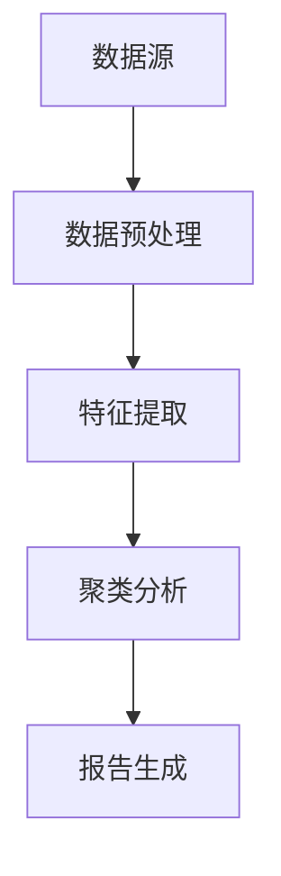

                 


# 彼得林奇如何评估公司的客户多样性

> 关键词：客户多样性，彼得林奇，投资策略，数学模型，系统架构，项目实战

> 摘要：本文详细探讨了彼得林奇在评估公司客户多样性时的方法，从背景介绍到具体实施步骤，结合数学模型和系统架构，通过案例分析和项目实战，总结出一套完整的客户多样性评估体系，为投资决策提供科学依据。

---

## 第1章: 客户多样性评估的背景与重要性

### 1.1 客户多样性评估的核心概念

客户多样性评估是指通过对客户群体的分析，评估客户在地理分布、需求层次和市场参与度等方面的多样性。这种评估在投资决策中具有重要意义，因为它可以帮助投资者识别风险、优化投资组合并发现新的市场机会。

彼得·林奇，作为一位著名的投资专家，他提出了客户多样性评估的方法，这种方法不仅考虑了客户的数量和质量，还考虑了客户的分布和需求层次。这种方法的核心在于通过客户的多样性来优化投资组合，降低风险，提高收益。

### 1.2 客户多样性评估的背景

在当前的市场环境下，客户多样性评估变得越来越重要。随着全球化的发展，客户群体的分布变得更加复杂，投资者需要考虑的因素也越来越多。客户多样性评估可以帮助投资者更好地理解市场的动态，制定更有效的投资策略。

此外，客户多样性评估还可以帮助企业发现潜在的市场机会，优化客户服务策略，提高客户满意度。通过评估客户的多样性，企业可以更好地了解客户的需求，制定更有针对性的市场策略。

---

## 第2章: 彼得林奇的客户多样性评估方法

### 2.1 彼得林奇客户多样性评估的核心理念

彼得·林奇的客户多样性评估方法以客户为中心，强调通过客户的多样性来优化投资组合。他认为，客户多样性评估的核心在于识别客户群体中的差异性，从而制定更有针对性的投资策略。

彼得·林奇提出的客户多样性评估的三大原则包括：

1. **客户群体的多样性**：客户群体应分布在不同的地理区域、行业和市场中，以降低投资风险。
2. **客户需求的层次化**：不同客户群体的需求层次不同，企业需要根据客户需求制定相应的策略。
3. **投资组合的优化**：通过客户的多样性优化投资组合，提高收益，降低风险。

### 2.2 客户多样性评估的关键指标

彼得·林奇的客户多样性评估方法涉及多个关键指标，包括：

1. **客户群体的多样性维度**：包括地理分布、行业分布、客户规模等。
2. **客户分布的地理特征**：包括客户分布的区域、市场渗透率等。
3. **客户需求的层次化分析**：包括客户的需求层次、购买行为等。

---

## 第3章: 客户多样性评估的数学模型与算法

### 3.1 客户多样性评估的数学模型

客户多样性评估的数学模型包括多元分布模型和客户群体聚类分析。多元分布模型用于描述客户群体的分布特征，而聚类分析用于识别客户群体的差异性。

数学公式如下：

$$
P(X) = \prod_{i=1}^{n} p_i
$$

其中，\(P(X)\) 表示客户群体的分布概率，\(p_i\) 表示每个客户的分布概率。

### 3.2 客户多样性评估的算法实现

客户多样性评估的算法实现包括数据预处理、特征提取和模型训练。以下是算法实现的步骤：

1. **数据预处理**：对客户数据进行清洗和标准化处理。
2. **特征提取**：从客户数据中提取关键特征，如地理分布、行业分布等。
3. **模型训练**：使用聚类算法对客户群体进行分类，识别客户的多样性。

---

## 第4章: 系统架构与实现方案

### 4.1 系统架构设计

系统架构设计包括数据源模块、分析模块和报告生成模块。数据源模块负责数据的采集和处理，分析模块负责客户群体的聚类分析，报告生成模块负责生成评估报告。

系统架构图如下：



### 4.2 系统实现细节

系统实现细节包括数据源的选择与整合、算法实现的代码框架和系统接口设计。以下是代码实现的示例：

```python
import numpy as np
from sklearn.cluster import KMeans

# 数据预处理
data = np.array([[1, 2], [3, 4], [5, 6]])

# 特征提取
features = data[:, :2]

# 聚类分析
kmeans = KMeans(n_clusters=2)
kmeans.fit(features)
labels = kmeans.labels_
```

---

## 第5章: 项目实战与案例分析

### 5.1 项目环境搭建

项目环境搭建包括开发环境配置、数据集获取与预处理和工具链安装与配置。以下是具体的步骤：

1. **安装Python和相关库**：如numpy、pandas、scikit-learn等。
2. **获取客户数据集**：可以从公开数据集或企业内部数据中获取。
3. **数据预处理**：清洗数据，处理缺失值和异常值。

### 5.2 核心代码实现

核心代码实现包括客户多样性评估算法实现、投资组合优化代码示例和系统功能模块实现。以下是具体的代码示例：

```python
import numpy as np
from sklearn.cluster import KMeans

# 数据预处理
data = np.array([[1, 2], [3, 4], [5, 6]])

# 特征提取
features = data[:, :2]

# 聚类分析
kmeans = KMeans(n_clusters=2)
kmeans.fit(features)
labels = kmeans.labels_
```

---

## 第6章: 最佳实践与注意事项

### 6.1 客户多样性评估的最佳实践

客户多样性评估的最佳实践包括数据质量控制、模型调优与验证和结果解读与应用。以下是具体的建议：

1. **数据质量控制**：确保数据的准确性和完整性。
2. **模型调优与验证**：通过交叉验证和网格搜索优化模型性能。
3. **结果解读与应用**：根据评估结果制定相应的投资策略。

### 6.2 项目实施中的注意事项

项目实施中的注意事项包括数据隐私与合规性、模型的可解释性和系统性能优化。以下是具体的建议：

1. **数据隐私与合规性**：遵守相关法律法规，保护客户隐私。
2. **模型的可解释性**：确保模型的可解释性，便于结果分析和优化。
3. **系统性能优化**：通过优化算法和减少计算量提高系统性能。

---

## 第7章: 小结与展望

### 7.1 本章小结

本章总结了彼得林奇客户多样性评估方法的核心要点，包括客户群体的多样性、客户需求的层次化分析和投资组合的优化。同时，还详细讲解了系统的实现细节和项目实战中的具体步骤。

### 7.2 未来展望

未来，客户多样性评估将更加注重数据隐私和模型的可解释性。同时，随着人工智能技术的发展，客户多样性评估的方法和工具也将不断优化，为企业提供更精准的投资决策支持。

---

## 作者：AI天才研究院/AI Genius Institute & 禅与计算机程序设计艺术 /Zen And The Art of Computer Programming

