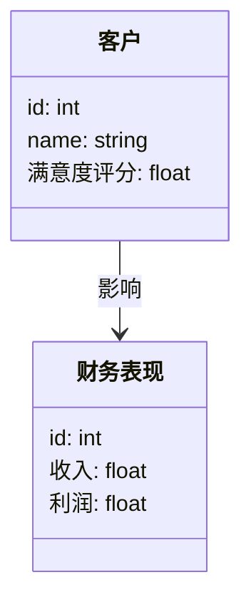

                 


# 彼得林奇如何评估公司的客户满意度与财务表现关系

## 关键词：客户满意度、财务表现、彼得林奇、投资分析、商业分析、客户价值、企业财务

## 摘要：本文探讨彼得林奇如何通过客户满意度评估公司的财务表现。通过背景介绍、核心概念对比、算法原理、系统架构分析和项目实战，揭示客户满意度对财务健康度的影响。本文适合IT领域技术博客读者，帮助他们理解如何将客户满意度与财务表现结合，提升企业价值。

---

# 第一部分: 客户满意度与财务表现的核心概念与背景

# 第1章: 客户满意度与财务表现的基本概念

## 1.1 客户满意度的定义与衡量

### 1.1.1 客户满意度的定义

客户满意度是指客户对产品或服务的实际体验与预期之间的差距，通常通过调查问卷、反馈收集等方式量化。

### 1.1.2 客户满意度的衡量指标

常用的指标包括净推荐值（NPS）、客户满意度指数（CSI）和客户忠诚度指数（CL）。

### 1.1.3 客户满意度的核心维度

包括产品质量、服务响应时间、客户支持效率等。

## 1.2 财务表现的关键指标

### 1.2.1 收入与利润的关系

收入是企业核心收入来源，利润是收入减去成本后的净收益。

### 1.2.2 财务健康度的评估标准

包括净利润率、毛利率、资产负债率等。

### 1.2.3 财务表现的驱动因素

包括销售收入、成本控制、资产周转率等。

## 1.3 客户满意度与财务表现的关系

### 1.3.1 客户满意度对财务表现的影响路径

高客户满意度通常带来更高的收入和更低的客户流失率。

### 1.3.2 财务表现对客户满意度的反馈机制

财务健康公司能更好地投资于客户体验，从而提升客户满意度。

### 1.3.3 两者关系的边界与外延

在不同行业和企业规模下，客户满意度与财务表现的关系可能不同。

## 1.4 本章小结

---

# 第二部分: 客户满意度与财务表现的核心概念与联系

# 第2章: 核心概念的原理与对比

## 2.1 客户满意度的属性特征

### 2.1.1 客户满意度的可测量性

通过调查问卷和数据分析量化。

### 2.1.2 客户满意度的时间敏感性

需要定期收集和更新。

### 2.1.3 客户满意度的主观性

受客户个人体验影响。

## 2.2 财务表现的属性特征

### 2.2.1 财务表现的可量化性

通过财务报表数据量化。

### 2.2.2 财务表现的稳定性

受宏观经济和行业环境影响。

### 2.2.3 财务表现的客观性

基于财务数据，具有客观性。

## 2.3 客户满意度与财务表现的对比分析

### 2.3.1 核心概念对比表格

| 概念       | 属性               | 描述                                   |
|------------|--------------------|----------------------------------------|
| 客户满意度 | 主观性             | 基于客户体验的主观评价                 |
| 财务表现   | 客观性             | 基于财务数据的客观指标                 |

### 2.3.2 ER实体关系图

```mermaid
erDiagram
    customer[客户] {
        +int id
        +string name
        +float satisfaction_score
    }
    financial_performance[财务表现] {
        +int id
        +float revenue
        +float profit
    }
    relationship {
        customer -> financial_performance : 影响
    }
```

---

# 第三部分: 客户满意度与财务表现的算法原理

# 第3章: 算法原理讲解

## 3.1 客户满意度的量化方法

### 3.1.1 净推荐值（NPS）公式

$$ NPS = (\text{推荐客户比例} - \text{反对客户比例}) \times 100 $$

### 3.1.2 客户满意度指数（CSI）公式

$$ CSI = \frac{\text{满意客户比例} + 2 \times \text{非常满意客户比例} - (\text{一般满意客户比例} + 2 \times \text{不满意客户比例})}{总样本数} $$

## 3.2 财务表现的量化模型

### 3.2.1 收入与利润的关系

$$ 利润 = 收入 - 成本 $$

## 3.3 客户满意度与财务表现的回归分析

### 3.3.1 回归模型公式

$$ Y = \beta_0 + \beta_1 X + \epsilon $$

其中，$Y$ 是利润，$X$ 是客户满意度得分。

### 3.3.2 回归分析流程图

```mermaid
graph TD
    A[开始] -> B[收集数据]
    B -> C[选择模型]
    C -> D[进行回归分析]
    D -> E[得出结果]
    E -> F[结束]
```

---

# 第四部分: 客户满意度与财务表现的系统分析

# 第4章: 系统分析与架构设计方案

## 4.1 系统功能设计

### 4.1.1 领域模型类图



## 4.2 系统架构设计

### 4.2.1 系统架构图


## 4.3 系统接口设计

### 4.3.1 接口设计

- 输入接口：接收客户满意度数据。
- 输出接口：生成财务表现报告。

---

# 第五部分: 客户满意度与财务表现的项目实战

# 第5章: 项目实战

## 5.1 环境安装

安装Python和相关库：

```bash
pip install numpy pandas scikit-learn
```

## 5.2 核心实现源代码

### 5.2.1 数据处理代码

```python
import pandas as pd
from sklearn.linear_model import LinearRegression

data = pd.DataFrame({
    '客户满意度': [85, 90, 75, 80],
    '收入': [100, 120, 80, 90],
    '利润': [20, 25, 15, 20]
})

X = data[['客户满意度']]
y = data['利润']

model = LinearRegression()
model.fit(X, y)
```

### 5.2.2 模型预测代码

```python
print(model.predict([[88]]))  # 输出预测利润
```

## 5.3 案例分析

### 5.3.1 案例分析

假设客户满意度提升10%，预测收入和利润的变化。

## 5.4 项目小结

---

# 第六部分: 最佳实践与总结

# 第6章: 最佳实践

## 6.1 关键点总结

- 定期收集客户反馈，分析客户满意度。
- 建立数据驱动的财务表现评估机制。

## 6.2 小结

通过客户满意度分析，可以有效预测和提升公司的财务表现。

## 6.3 注意事项

- 数据质量影响分析结果。
- 模型需定期更新和校准。

## 6.4 拓展阅读

推荐书籍：《彼得林奇的投资哲学》、《客户价值管理》。

---

# 作者：AI天才研究院/AI Genius Institute & 禅与计算机程序设计艺术 /Zen And The Art of Computer Programming

