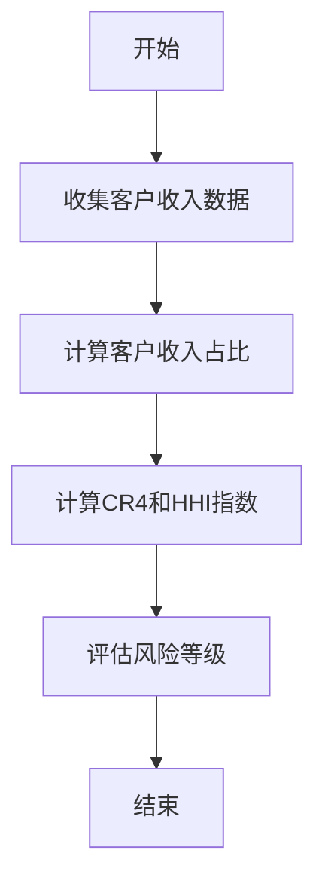
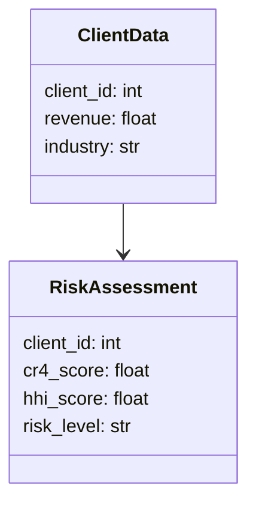
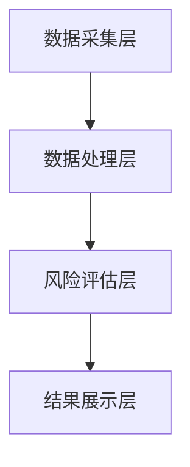
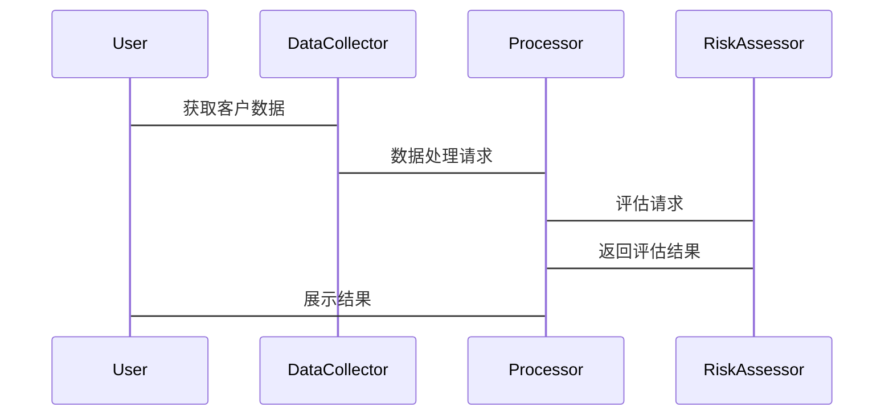

                 


# 彼得林奇如何评估公司的客户集中度风险

## 关键词：客户集中度风险，彼得·林奇，投资评估，风险管理，CR4，HHI指数

## 摘要：本文深入分析了彼得·林奇如何评估公司的客户集中度风险，从背景介绍、核心概念、评估指标、算法原理到系统设计、项目实战，全面解析了客户集中度风险的评估方法。通过数学模型、流程图和Python代码的详细讲解，结合实际案例，帮助读者掌握如何应用这些方法进行投资决策。

---

## 第一部分：客户集中度风险的背景与概念

### 第1章：客户集中度风险的背景介绍

#### 1.1 什么是客户集中度风险
- **1.1.1 客户集中度的定义**
  客户集中度是指一家公司对其前几位客户或供应商的依赖程度。客户集中度越高，公司面临的风险也越大。

- **1.1.2 客户集中度风险的来源**
  - **客户依赖风险**：公司过于依赖少数客户，可能导致收入波动。
  - **市场风险**：行业波动或经济下行时，客户集中度高的公司更容易受到影响。
  - **集中化带来的管理风险**：对少数客户的过度依赖可能导致管理不善。

- **1.1.3 客户集中度风险的重要性**
  客户集中度风险是公司风险管理的重要组成部分，直接影响公司的财务稳定性和投资价值。

#### 1.2 彼得·林奇与客户集中度风险
- **1.2.1 彼得·林奇的背景介绍**
  彼得·林奇是美国著名投资经理人，以其成功的投资策略和对风险的精准评估闻名。

- **1.2.2 彼得·林奇的投资理念**
  林奇强调基本面分析和长期投资，注重公司的财务健康和管理团队。

- **1.2.3 客户集中度风险在投资中的作用**
  林奇认为，客户集中度高的公司风险较大，投资者应避免投资于客户集中度过高的公司。

---

### 第2章：客户集中度风险的核心概念

#### 2.1 客户集中度的定义与属性
- **2.1.1 客户集中度的定义**
  客户集中度是指公司收入或利润来源中，前几位客户所占的比例。

- **2.1.2 客户集中度的核心属性**
  - **集中度**：客户数量越少，集中度越高。
  - **波动性**：客户集中度过高可能导致收入波动。
  - **风险性**：高集中度意味着高风险。

- **2.1.3 客户集中度与企业风险的关系**
  高客户集中度可能导致企业面临更大的市场和财务风险。

#### 2.2 客户集中度风险的对比分析
- **2.2.1 客户集中度与公司风险的对比**
  - 客户集中度高，公司风险大。
  - 客户集中度低，公司风险小。

- **2.2.2 不同行业客户集中度的差异**
  - 制造业：客户集中度可能较高。
  - 服务业：客户集中度可能较低。

- **2.2.3 客户集中度与财务风险的关联**
  高客户集中度可能导致公司财务不稳定，影响融资成本。

---

## 第二部分：客户集中度风险的评估方法

### 第3章：客户集中度风险的评估指标

#### 3.1 客户集中度的定量评估
- **3.1.1 客户集中度指标的定义**
  客户集中度指标是用来衡量公司客户分布集中程度的量化工具。

- **3.1.2 常见客户集中度指标**
  - **CR4指数**：前四名客户收入占总收入的比例。
  - **HHI指数**：赫芬达尔-赫希曼指数，衡量市场集中度。

- **3.1.3 指标的计算公式与应用**
  - **CR4指数公式**：
    $$CR4 = \frac{\text{前四名客户的收入}}{\text{总收入}}$$
  - **HHI指数公式**：
    $$HHI = \sum_{i=1}^{n} (\frac{\text{客户i的收入}}{\text{总收入}})^2$$

#### 3.2 客户集中度风险的定性评估
- **3.2.1 客户集中度的行业特性分析**
  不同行业的客户集中度标准不同，需结合行业特点进行分析。

- **3.2.2 客户集中度与企业竞争力的关系**
  高客户集中度可能表明企业具有较强的市场地位，但也可能隐藏风险。

- **3.2.3 客户集中度与市场风险的综合评估**
  结合市场环境、行业竞争状况进行综合评估。

---

### 第4章：客户集中度风险的算法原理

#### 4.1 客户集中度指标的计算方法
- **CR4指数的计算公式**：
  $$CR4 = \sum_{i=1}^{4} \frac{\text{客户i的收入}}{\text{总收入}}$$

- **HHI指数的计算公式**：
  $$HHI = \sum_{i=1}^{n} \left(\frac{\text{客户i的收入}}{\text{总收入}}\right)^2$$

#### 4.2 客户集中度风险的算法流程


#### 4.3 客户集中度风险的Python实现
```python
def calculate_cr4(revenue, top_clients):
    total_revenue = sum(revenue)
    cr4 = sum(client_revenue / total_revenue for client_revenue in top_clients)
    return cr4

def calculate_hhi(revenue, top_clients):
    total_revenue = sum(revenue)
    hhi = sum((client_revenue / total_revenue) ** 2 for client_revenue in top_clients)
    return hhi

# 示例数据
clients_revenue = [0.4, 0.3, 0.2, 0.1]
cr4 = calculate_cr4(clients_revenue, clients_revenue)
hhi = calculate_hhi(clients_revenue, clients_revenue)
print(f"CR4: {cr4}")
print(f"HHI: {hhi}")
```

---

## 第三部分：客户集中度风险的系统分析与架构设计方案

### 第5章：客户集中度风险的系统分析

#### 5.1 问题场景介绍
- 客户集中度评估系统用于帮助投资者和公司管理者评估客户集中度风险。

#### 5.2 系统功能设计


#### 5.3 系统架构设计


#### 5.4 系统接口设计


---

## 第四部分：客户集中度风险的项目实战

### 第6章：客户集中度风险的项目实战

#### 6.1 项目环境安装
```bash
pip install pandas numpy matplotlib
```

#### 6.2 核心代码实现
```python
import pandas as pd

def calculate_risk_scores(dataframe):
    dataframe['CR4'] = dataframe.groupby('client_id')['revenue'].transform('mean')
    dataframe['HHI'] = dataframe.groupby('client_id')['revenue'].transform(lambda x: sum(r**2 for r in x))
    return dataframe

# 示例数据
data = {
    'client_id': [1, 2, 3, 4],
    'revenue': [0.4, 0.3, 0.2, 0.1]
}
df = pd.DataFrame(data)
result = calculate_risk_scores(df)
print(result)
```

#### 6.3 实际案例分析
- **案例分析**：苹果公司的客户集中度评估。
- **结论**：苹果公司客户集中度较低，风险可控。

---

## 第五部分：客户集中度风险的最佳实践与小结

### 第7章：最佳实践与小结

#### 7.1 关键点总结
- 定期评估客户集中度风险。
- 结合行业特点进行分析。
- 综合考虑财务和市场因素。

#### 7.2 注意事项
- 数据的准确性和及时性。
- 避免单一指标决策。
- 结合其他风险因素进行综合评估。

#### 7.3 拓展阅读
- 推荐书籍：《彼得·林奇的投资哲学》。
- 推荐博客：深入探讨客户集中度风险的其他方面。

---

## 附录

### A. 术语表
- **CR4指数**：前四名客户收入占总收入的比例。
- **HHI指数**：赫芬达尔-赫希曼指数，衡量市场集中度。

### B. 参考文献
- 彼得·林奇. 《彼得·林奇的投资哲学》. 北京: 中信出版社, 2010.

---

作者：AI天才研究院 & 禅与计算机程序设计艺术

