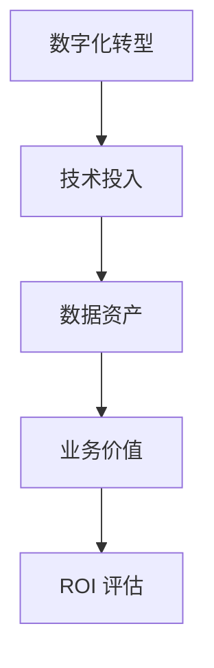
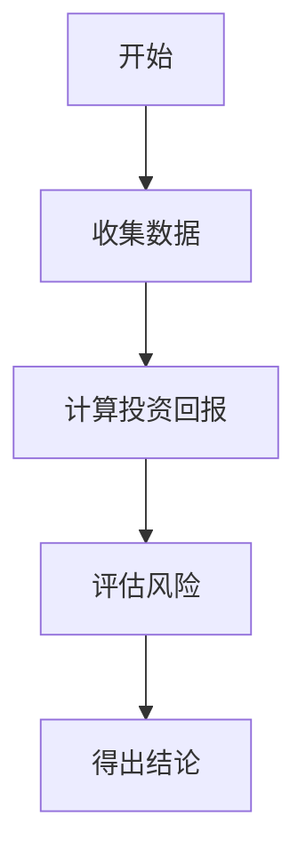
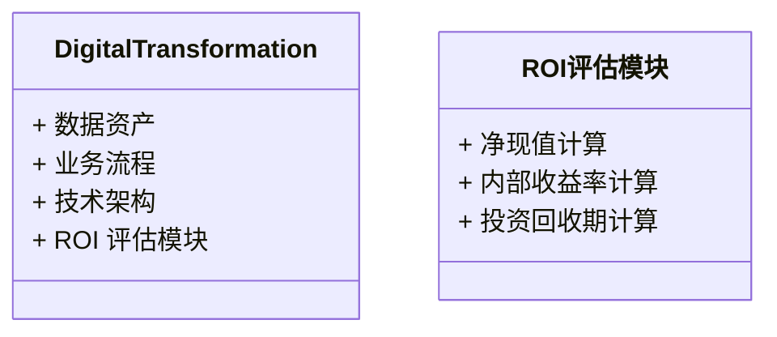
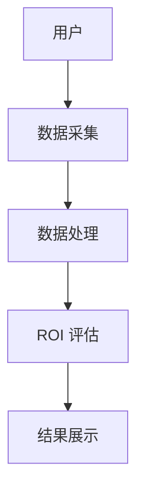
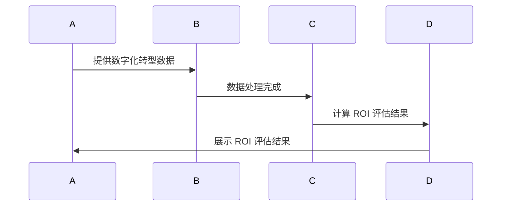

                 


# 彼得林奇如何评估公司的数字化转型ROI

## 关键词：数字化转型, ROI 评估, 彼得·林奇, 投资回报, 数字化创新, 技术驱动

## 摘要：  
数字化转型已成为现代企业发展的核心驱动力，而如何评估其投资回报（ROI）是企业在实施过程中面临的关键挑战。本文将结合投资大师彼得·林奇的 ROI 评估方法，深入探讨数字化转型中的 ROI 分析与优化策略。通过系统性地分析数字化转型的核心概念、数学模型和实际案例，本文旨在为企业提供一套科学、实用的 ROI 评估框架，帮助企业更好地规划和实施数字化转型。

---

## 第一部分：数字化转型与 ROI 评估的背景与核心概念

### 第1章：数字化转型的背景与挑战

#### 1.1 数字化转型的定义与内涵
- **数字化转型的定义**：数字化转型是指企业利用数字技术（如人工智能、大数据、云计算等）重构商业模式、业务流程和客户体验的过程。  
- **数字化转型的核心特征**：
  - 数据驱动：以数据为决策依据，而非传统经验。
  - 技术赋能：通过技术手段提升效率和创新能力。
  - 用户-centric：以客户为中心，打造个性化体验。
- **数字化转型与企业创新的关系**：数字化转型不仅是技术创新，更是商业模式的创新。它通过技术手段实现业务的持续优化和增长。

#### 1.2 数字化转型的 ROI 评估问题
- **传统 ROI 评估的局限性**：
  - 传统 ROI 评估方法多基于财务指标，难以衡量数字化转型的长期价值。
  - 忽视了数据资产的价值。
- **数字化转型 ROI 的独特性**：
  - 数字化转型 ROI 的计算需要考虑技术投入的周期性和数据资产的复用性。
  - 数字化转型 ROI 的实现往往需要较长时间，且效果难以量化。
- **彼得·林奇的 ROI 评估方法概述**：
  - 彼得·林奇强调长期价值和数据驱动的决策。
  - 他主张通过数据分析和趋势预测来评估投资的可行性。

### 第2章：数字化转型的核心概念与联系

#### 2.1 核心概念原理
- **数字化转型的系统性特征**：
  - 数字化转型是一个系统性工程，涉及技术、流程和组织的全面变革。
  - 它不仅仅是技术的升级，更是企业文化的转变。
- **技术驱动与业务价值的结合**：
  - 技术是手段，业务价值是目标。
  - 数字化转型的核心在于通过技术手段实现业务价值的最大化。
- **数据在 ROI 评估中的作用**：
  - 数据是数字化转型的基石，也是 ROI 评估的关键依据。
  - 数据驱动的 ROI 评估能够帮助企业更精准地预测投资回报。

#### 2.2 核心概念对比分析
- **传统 ROI 与数字化转型 ROI 的对比**：
  | 对比维度         | 传统 ROI 评估       | 数字化转型 ROI 评估     |
  |------------------|--------------------|-------------------------|
  | 评估对象         | 财务指标           | 数据资产与业务价值     |
  | 评估周期         | 短期              | 长期                   |
  | 评估方法         | 财务模型           | 数据分析与趋势预测     |
- **技术投入与业务收益的对比**：
  - 技术投入：初期成本高，但长期收益显著。
  - 业务收益：数字化转型能够为企业创造新的收入来源和竞争优势。
- **短期收益与长期价值的对比**：
  - 短期收益：数字化转型可能在短期内看不到明显收益。
  - 长期价值：数字化转型能够为企业带来持续的竞争优势和增长潜力。

#### 2.3 实体关系图


---

## 第二部分：数字化转型 ROI 评估的算法与数学模型

### 第3章：数字化转型 ROI 评估的数学模型

#### 3.1 净现值（NPV）模型
- **净现值的定义与公式**：
  $$ NPV = \sum_{t=1}^{n} \frac{C_t}{(1+r)^t} $$
  其中，\( C_t \) 表示第 \( t \) 年的现金流，\( r \) 表示折现率。
- **数字化转型中的 NPV 应用**：
  - 将数字化转型的投资视为一个项目，计算其未来现金流的净现值。
  - NPV > 0 表示项目具有投资价值。

#### 3.2 内部收益率（IRR）模型
- **内部收益率的定义与公式**：
  $$ IRR 是使 NPV=0 的折现率 $$
- **数字化转型中的 IRR 应用**：
  - 通过计算 IRR，企业可以评估数字化转型项目的投资回报率。
  - IRR 越高，项目的盈利能力越强。

#### 3.3 投资回收期（Payback Period）模型
- **投资回收期的定义与公式**：
  $$ 回收期 = \frac{初始投资}{年均净现金流} $$
- **数字化转型中的回收期应用**：
  - 计算数字化转型项目的投资回收期，评估其资金回笼速度。
  - 回收期越短，项目的资金风险越小。

### 第4章：彼得·林奇 ROI 评估算法

#### 4.1 算法原理


#### 4.2 算法实现
```python
def peterson_roi_assessment(data):
    # 计算净现值
    def calculate_npv(data, discount_rate):
        return sum(c / (1 + discount_rate)**t for t, c in enumerate(data))

    # 计算内部收益率
    def calculate_irr(data):
        return np.irr(data)

    # 评估风险
    def assess_risk(data):
        return "低风险" if max(data) > 0 else "高风险"

    # 主逻辑
    npv = calculate_npv(data, 0.1)
    irr = calculate_irr(data)
    risk = assess_risk(data)
    return {"NPV": npv, "IRR": irr, "Risk": risk}
```

---

## 第三部分：数字化转型 ROI 评估的系统架构与实战

### 第5章：系统架构设计

#### 5.1 问题场景介绍
- **问题场景**：某企业计划实施数字化转型，但对其 ROI 评估缺乏信心。
- **项目介绍**：通过彼得·林奇的 ROI 评估方法，帮助企业评估数字化转型的可行性。

#### 5.2 系统功能设计


#### 5.3 系统架构设计


#### 5.4 系统接口设计
- **输入接口**：企业数字化转型数据（如投资金额、预期收益等）。
- **输出接口**：NPV、IRR 和投资回收期的评估结果。

#### 5.5 系统交互设计


### 第6章：项目实战

#### 6.1 环境安装
- **工具安装**：安装 Python 和相关库（如 NumPy、Pandas）。
- **数据准备**：收集企业的数字化转型相关数据。

#### 6.2 核心实现
```python
import numpy as np

def calculate_roi(data):
    npv = np.npv(0.1, data)
    irr = np.irr(data)
    return npv, irr

data = [-100, 50, 50, 50, 50]
npv, irr = calculate_roi(data)
print(f"NPV: {npv}, IRR: {irr}")
```

#### 6.3 案例分析
- **案例背景**：某企业计划投资 100 万元进行数字化转型，预计未来五年的收益分别为 50 万元、50 万元、50 万元、50 万元和 50 万元。
- **计算结果**：
  - NPV ≈ 5.25 万元
  - IRR ≈ 25%
- **结论**：项目具有较高的投资回报率，值得实施。

---

## 第四部分：最佳实践与小结

### 第7章：最佳实践与小结

#### 7.1 彼得·林奇方法论总结
- **数据驱动**：基于数据进行 ROI 评估，而非主观判断。
- **长期视角**：关注数字化转型的长期价值，而非短期收益。
- **风险评估**：通过数据分析和趋势预测，降低投资风险。

#### 7.2 小结
- 数字化转型 ROI 评估是一个复杂但重要的过程。
- 彼得·林奇的 ROI 评估方法为企业提供了一种科学的评估框架。
- 企业应结合自身实际情况，灵活运用这些方法，实现数字化转型的最优投资回报。

#### 7.3 注意事项
- 数据质量是 ROI 评估的基础，确保数据的准确性和完整性。
- ROI 评估是一个动态过程，需要持续跟踪和优化。
- 数字化转型 ROI 评估的结果应与企业战略目标相结合。

#### 7.4 拓展阅读
- 彼得·林奇的《投资之道》
- 数字化转型相关的学术论文和行业报告

---

## 作者：AI天才研究院/AI Genius Institute & 禅与计算机程序设计艺术 /Zen And The Art of Computer Programming

