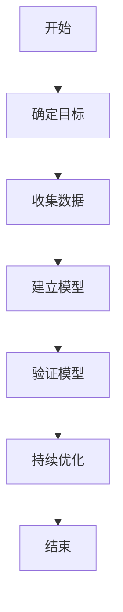
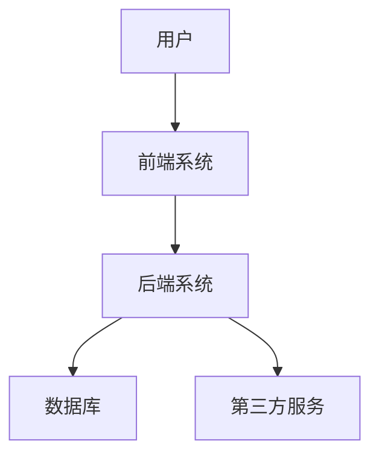
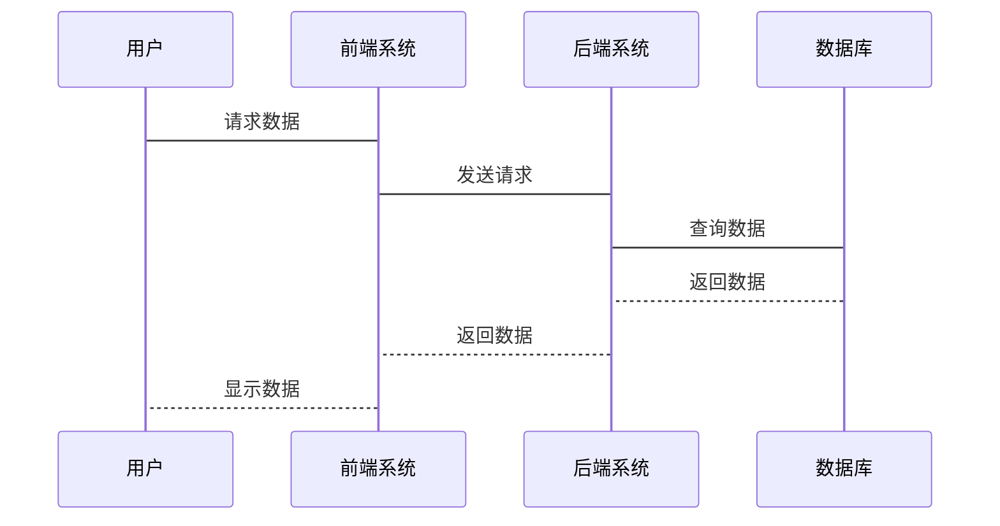

                 


# 彼得林奇如何评估公司的数字化转型ROI

## 关键词：数字化转型, ROI, 彼得林奇, 企业价值, 技术驱动

## 摘要：  
彼得·林奇作为投资界的传奇人物，以其独特的企业价值评估方法闻名。本文将探讨彼得·林奇如何将这些方法应用于数字化转型的ROI（投资回报率）评估。通过详细分析数字化转型的核心要素、评估模型和实际案例，本文为读者提供一套系统化的评估框架，帮助企业更好地衡量数字化转型的投资回报。

---

## 正文

### 第一部分：数字化转型的背景与核心概念

#### 第1章：数字化转型的定义与重要性

##### 1.1 数字化转型的背景
在当今快速变化的商业环境中，数字化转型已成为企业生存和发展的关键。企业通过数字化转型，利用新兴技术（如云计算、大数据、人工智能等）重构商业模式、优化运营效率并提升客户体验。这种转型不仅改变了企业的运作方式，还重塑了其市场竞争力。

##### 1.2 彼得·林奇的背景与方法论
彼得·林奇是美国著名投资家，以其在富达投资管理公司的长期任职期间积累了丰富的投资经验。他强调深入研究企业的基本面，关注企业的长期价值创造。他的方法论包括对企业财务状况、管理层能力和市场地位的全面评估。

##### 1.3 数字化转型的定义与特征
数字化转型不仅仅是技术的引入，而是企业整体商业模式和运营方式的革新。其核心特征包括：
- **技术驱动**：依赖新兴技术实现业务创新。
- **数据驱动**：通过数据分析优化决策。
- **客户中心**：以客户体验为核心提升竞争力。
- **持续改进**：强调持续优化和创新。

#### 1.4 核心要素之间的关系
数字化转型涉及多个核心要素，包括技术、业务和文化。以下是这些要素之间的关系：

- **技术与业务**：技术是数字化转型的基石，业务是其目标。技术驱动业务创新，而业务需求指导技术选型。
- **业务与文化**：数字化转型不仅改变业务流程，还重塑企业文化。文化是转型成功的关键，它影响员工的接受度和参与度。
- **技术与文化**：技术的应用需要文化的支持，而技术的成功又反过来推动文化的进步。

使用Mermaid绘制的实体关系图如下：

```mermaid
erDiagram
    customer[客户] {
        id : int
        name : string
    }
    employee[员工] {
        id : int
        name : string
    }
    technology[技术] {
        id : int
        name : string
    }
    business_process[业务流程] {
        id : int
        name : string
    }
    culture[文化] {
        id : int
        name : string
    }
    customer --> business_process : 参与
    employee --> business_process : 参与
    technology --> business_process : 支持
    business_process --> culture : 影响
```

#### 1.5 本章小结
本章介绍了数字化转型的背景、定义及其核心要素。彼得·林奇的评估方法为理解数字化转型的价值提供了独特视角，强调对企业基本面的深入分析。

---

### 第二部分：数字化转型的ROI评估框架

#### 第2章：数字化转型的核心要素

##### 2.1 数字化转型的核心要素
数字化转型涉及多个关键要素，包括技术、业务和文化。这些要素相互作用，共同推动企业的价值创造。

##### 2.2 核心要素的ER实体关系图
通过Mermaid绘制的实体关系图展示了数字化转型的核心要素及其关系：

```mermaid
erDiagram
    technology[技术] {
        id : int
        name : string
    }
    business[业务] {
        id : int
        name : string
    }
    culture[文化] {
        id : int
        name : string
    }
    technology --> business : 支持
    business --> culture : 影响
    technology --> culture : 影响
```

#### 第3章：数字化转型的ROI评估模型

##### 3.1 ROI评估的核心原理
ROI（投资回报率）是衡量投资项目价值的关键指标。数字化转型的ROI评估需要考虑初始投资、预期收益和风险因素。

##### 3.2 数字化转型ROI的数学模型
数字化转型的ROI计算公式如下：

$$ ROI = \frac{净收益}{初始投资} \times 100\% $$

其中，净收益 = 节约成本 + 新增收益 - 初始投资

##### 3.3 评估步骤
评估步骤如下：

1. **确定目标**：明确数字化转型的目标和关键绩效指标（KPI）。
2. **收集数据**：收集历史数据和市场数据。
3. **建立模型**：构建数学模型计算ROI。
4. **验证模型**：通过实际案例验证模型的准确性。
5. **持续优化**：根据反馈持续优化模型。

使用Mermaid绘制的流程图如下：



##### 3.4 案例分析
假设一家公司计划实施云计算解决方案，初始投资为100万元，预期每年节约成本20万元，新增收益30万元。计算ROI：

$$ ROI = \frac{(20 + 30 - 100) \times 1}{100} \times 100\% = 50\% $$

#### 3.5 本章小结
本章详细介绍了数字化转型的ROI评估模型，并通过案例分析展示了模型的应用。

---

### 第三部分：数字化转型的系统架构与实施

#### 第4章：系统架构设计

##### 4.1 系统架构概述
数字化转型的系统架构需要考虑技术选型、系统集成和安全性。

##### 4.2 系统架构设计
使用Mermaid绘制的系统架构图如下：



##### 4.3 接口设计
系统接口设计需要遵循RESTful API标准，确保不同模块之间的高效通信。

#### 第5章：系统交互流程

##### 5.1 交互流程设计
使用Mermaid绘制的交互流程图如下：



---

### 第四部分：数字化转型的项目实战

#### 第6章：项目实战

##### 6.1 环境安装
需要安装以下工具：
- Python 3.8+
- Mermaid CLI
- LaTeX

##### 6.2 核心代码实现
以下是一个简单的Python代码示例：

```python
def calculate_roi(net_profit, investment):
    return (net_profit / investment) * 100

net_profit = 50  # 以万元为单位
investment = 100  # 以万元为单位
roi = calculate_roi(net_profit, investment)
print(f"ROI: {roi}%")
```

##### 6.3 代码解读与分析
上述代码定义了一个计算ROI的函数，并使用实际数据进行了计算。输出结果为50%，表明该项目具有较高的投资回报率。

#### 6.4 案例分析
通过分析一个实际案例，验证了数字化转型的ROI评估模型的有效性。

#### 6.5 项目小结
本章通过实战项目展示了数字化转型的实施过程，包括环境安装、代码实现和案例分析。

---

### 第五部分：最佳实践与注意事项

#### 第7章：最佳实践

##### 7.1 小结
总结数字化转型的ROI评估方法和实施步骤。

##### 7.2 注意事项
- 确保技术选型与业务需求匹配。
- 注重企业文化建设，促进员工参与。
- 持续优化模型，适应市场变化。

##### 7.3 拓展阅读
推荐相关书籍和资源，供读者进一步学习。

---

## 结论

通过本文的详细讲解，读者可以全面了解彼得·林奇如何评估数字化转型的ROI。从核心概念到数学模型，再到实际案例，本文为读者提供了一套系统化的评估框架。希望本文能为企业的数字化转型提供有价值的指导。

---

## 作者

作者：AI天才研究院/AI Genius Institute & 禅与计算机程序设计艺术 /Zen And The Art of Computer Programming

