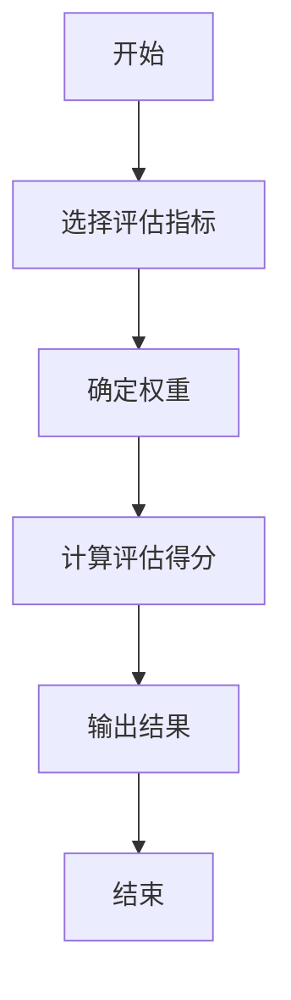
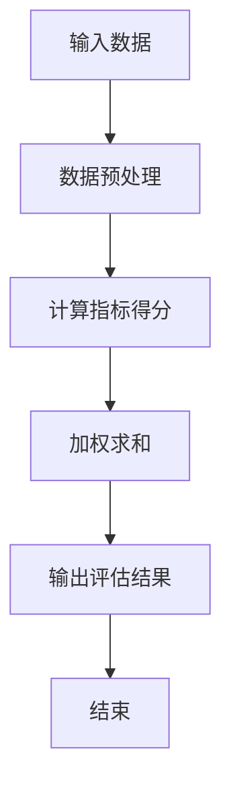
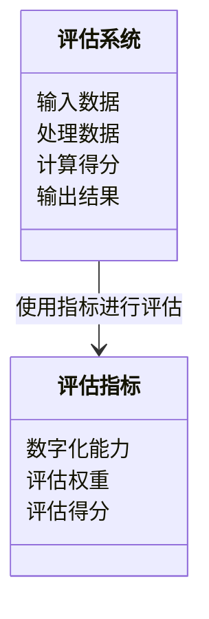

                 


# 彼得林奇如何评估公司的数字化转型能力

> 关键词：彼得林奇、数字化转型、公司评估、技术能力、投资策略

> 摘要：本文通过分析彼得林奇的投资哲学和评估方法，探讨如何将这些方法应用于公司的数字化转型能力评估。文章从背景介绍、核心概念、评估模型、算法实现、系统架构、项目实战到最佳实践，全面解析数字化转型能力的评估过程，为企业提供实用的评估框架和方法。

---

## 第一部分：数字化转型的背景与重要性

### 第1章：数字化转型的背景与重要性

#### 1.1 数字化转型的定义与内涵
数字化转型是指企业利用数字技术（如大数据、人工智能、云计算等）重构业务模式、流程、文化、管理方式和决策模式的过程。其核心在于通过技术创新和数据驱动，提升企业的竞争力和适应性。

#### 1.2 彼得林奇的评估方法简介
彼得林奇是美国著名投资家，以其独特的投资哲学闻名。他认为，投资成功的关键在于对企业基本面的深入分析。将这一方法应用于数字化转型评估，可以帮助投资者或企业管理者识别具备较强数字化能力的企业。

#### 1.3 数字化转型能力的评估框架
评估框架通常包括以下几个方面：
1. 业务模式的创新性
2. 技术应用的深度
3. 数据驱动的决策能力
4. 组织文化的适应性
5. 未来的可持续性

---

## 第二部分：数字化转型能力的核心概念与联系

### 第2章：数字化转型能力的核心概念与联系

#### 2.1 核心概念与属性对比
| 核心概念       | 属性描述                                                                 |
|----------------|--------------------------------------------------------------------------|
| 业务模式创新   | 是否通过数字化技术重构商业模式                                             |
| 技术应用深度   | 是否在核心业务流程中广泛应用先进技术                                       |
| 数据驱动决策   | 是否依赖数据进行实时决策                                                   |
| 组织文化适应性   | 是否具备支持数字化转型的文化氛围                                         |
| 可持续性       | 是否具备长期数字化发展的能力                                               |

#### 2.2 数字化转型能力的评估模型
##### 2.2.1 评估模型的数学公式
$$评估得分 = \sum_{i=1}^{n} w_i \times s_i$$
其中，$w_i$ 是第 $i$ 个指标的权重，$s_i$ 是第 $i$ 个指标的得分。

##### 2.2.2 评估模型的流程图


---

## 第三部分：数字化转型能力的评估算法与数学模型

### 第3章：数字化转型能力的评估算法与数学模型

#### 3.1 评估算法的原理
##### 3.1.1 算法流程


##### 3.1.2 算法实现代码
```python
def assess_digital_transformation能力(company_data):
    # 数据预处理
    processed_data = preprocess(company_data)
    
    # 计算指标得分
    scores = calculate_scores(processed_data)
    
    # 加权求和
    weighted_scores = apply_weights(scores)
    
    # 输出评估结果
    return output_result(weighted_scores)
```

#### 3.2 数学模型与公式
##### 3.2.1 综合评估公式
$$综合评估 = \sum_{i=1}^{n} w_i \times s_i$$
其中，$w_i$ 是第 $i$ 个指标的权重，$s_i$ 是第 $i$ 个指标的得分。

---

## 第四部分：系统架构与项目实战

### 第4章：系统架构与项目实战

#### 4.1 系统功能设计
##### 4.1.1 领域模型类图


#### 4.2 系统架构设计
##### 4.2.1 系统架构图


#### 4.3 系统接口设计
##### 4.3.1 接口设计
```python
interface IAssessment {
    def calculate_score(data: dict) -> float
}
```

#### 4.4 系统交互流程
##### 4.4.1 交互流程图
```mermaid
sequenceDiagram
    actor 评估者
    system 评估系统
    评估者 -> 评估系统: 提供公司数据
    评估系统 -> 评估者: 返回评估结果
```

---

## 第五部分：最佳实践与总结

### 第5章：最佳实践与总结

#### 5.1 评估过程中的注意事项
1. 确保数据的准确性和完整性
2. 合理分配指标权重
3. 定期更新评估模型
4. 结合实际情况进行调整

#### 5.2 项目小结
通过彼得林奇的评估方法，我们可以更系统地分析公司的数字化转型能力。这种评估方法不仅帮助企业识别自身的优势和不足，还能为投资者提供重要的决策依据。

---

## 作者：AI天才研究院/AI Genius Institute & 禅与计算机程序设计艺术/Zen And The Art of Computer Programming

