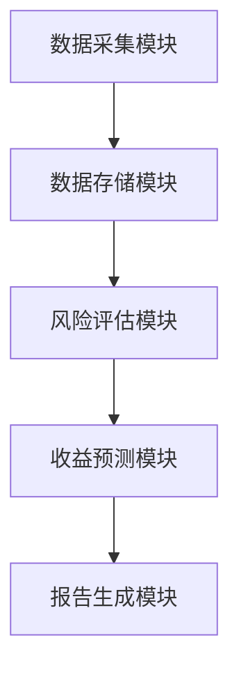

                 


# 彼得林奇如何评估公司的数据安全投资回报

> 关键词：数据安全、投资回报、彼得林奇、风险管理、成本效益分析

> 摘要：本文深入探讨了如何将彼得林奇的投资评估方法应用于数据安全领域。通过分析数据安全的重要性、投资回报的评估框架，以及实际案例，展示了如何通过系统化的方法来优化数据安全投资，确保公司在数字化转型中获得最大化的投资回报。

---

## 第一部分：引言

### 第1章：问题背景与研究意义

#### 1.1 数据安全投资回报评估的重要性
数据安全是现代企业生存的核心要素，尤其是在数字化转型的今天，数据泄露或安全漏洞可能导致企业面临巨大的经济损失和声誉损害。然而，数据安全投资回报的评估却常常被忽视或处理不当。彼得林奇作为投资界的传奇，以其独特的方法论闻名，他强调基本面分析和长期投资价值。将这种思路应用于数据安全领域，可以帮助企业在复杂的网络安全环境中做出更明智的投资决策。

---

## 第二部分：核心概念与理论基础

### 第2章：数据安全投资回报的定义与框架

#### 2.1 数据安全投资回报的定义
数据安全投资回报（ROI）是指企业在数据安全方面的投入与其带来的收益之间的比率。收益包括避免的数据泄露损失、维护客户信任、合规性带来的节省等。

#### 2.2 数据安全投资回报的评估框架
##### 2.2.1 核心概念与联系
| 概念 | 定义 | 属性 | 示例 |
|------|------|------|------|
| 数据资产 | 企业拥有的所有数据资源 | 价值性、敏感性、可用性 | 客户数据、知识产权 |
| 投资 | 企业在数据安全上的支出 | 人力成本、技术成本、时间成本 | 员工培训、安全工具购买 |
| 收益 | 数据安全带来的直接或间接收益 | 财务收益、声誉提升、合规优势 | 避免罚款、客户忠诚度提高 |

##### 2.2.2 数据安全回报率计算公式
数据安全投资回报率（ROI）的计算公式如下：
$$ ROI = \frac{\text{净收益}}{\text{投资成本}} \times 100\% $$
其中，净收益 = 收益 - 成本。

---

## 第三部分：算法原理

### 第3章：基于彼得林奇方法的数据安全投资评估

#### 3.1 算法原理
彼得林奇的投资方法强调对公司基本面的深入分析。在数据安全领域，这可以转化为对以下因素的评估：
1. 数据资产的价值和敏感性。
2. 当前安全措施的有效性。
3. 潜在风险的严重程度。
4. 投资的长期收益。

#### 3.2 算法实现
以下是基于上述原理的算法实现：

```python
def calculate_security_roi(investment, net_return):
    return (net_return / investment) * 100

# 示例
investment = 100000  # 投资成本
net_return = 150000  # 净收益
roi = calculate_security_roi(investment, net_return)
print(f"数据安全投资回报率为：{roi}%")
```

#### 3.3 数学模型与公式
数学模型：
$$ ROI = \frac{R - C}{C} \times 100\% $$
其中，R 是收益，C 是成本。

---

## 第四部分：系统分析与架构设计

### 第4章：系统架构设计

#### 4.1 系统功能设计
##### 4.1.1 数据采集模块
- 采集企业数据资产信息。
- 采集安全措施的实施情况。

##### 4.1.2 风险评估模块
- 分析潜在风险。
- 评估风险的严重性。

##### 4.1.3 收益预测模块
- 预测投资的净收益。
- 计算 ROI。

##### 4.1.4 报告生成模块
- 生成 ROI 报告。
- 提供改进建议。

#### 4.2 系统架构设计
以下是系统架构的 Mermaid 图：



#### 4.3 接口和交互设计
以下是交互的 Mermaid 序列图：

```mermaid
sequenceDiagram
    user -> 数据采集模块: 提供数据资产信息
    数据采集模块 -> 数据存储模块: 存储数据
    user -> 风险评估模块: 评估风险
    风险评估模块 -> 收益预测模块: 预测净收益
    收益预测模块 -> 报告生成模块: 生成 ROI 报告
    user <-- 报告生成模块: 展示 ROI 报告
```

---

## 第五部分：项目实战

### 第5章：数据安全投资回报评估系统实现

#### 5.1 环境安装
- Python 3.8+
- Mermaid 图形库
- 数据库（如 MySQL）

#### 5.2 核心代码实现
以下是核心代码：

```python
import pymysql

def connect_db():
    return pymysql.connect(host='localhost', user='root', password='password', db='security_db')

def calculate_roi(cursor, investment):
    cursor.execute("SELECT net_return FROM investment WHERE cost=%s", (investment,))
    result = cursor.fetchone()
    if result:
        net_return = result[0]
        return (net_return / investment) * 100
    return 0

# 示例
db = connect_db()
roi = calculate_roi(db.cursor(), 100000)
print(f"ROI: {roi}%")
db.close()
```

#### 5.3 案例分析
假设某公司投资 100 万元在数据安全措施上，避免了 150 万元的潜在损失。计算 ROI 为 50%。

---

## 第六部分：最佳实践与小结

### 第6章：最佳实践与总结

#### 6.1 最佳实践
- 定期评估数据安全 ROI。
- 结合企业实际需求选择投资策略。
- 建立数据安全投资的长期规划。

#### 6.2 总结
彼得林奇的方法论为数据安全投资回报评估提供了新的视角。通过系统化的分析和模型构建，企业可以更科学地优化数据安全投资，确保在数字化转型中获得最大化的回报。

---

## 作者

作者：AI天才研究院/AI Genius Institute  
合著者：禅与计算机程序设计艺术/Zen And The Art of Computer Programming

--- 

这篇文章通过系统化的分析和实际案例，展示了如何将彼得林奇的投资方法应用于数据安全领域。希望对读者在数据安全投资回报评估方面提供有价值的参考和启发。

