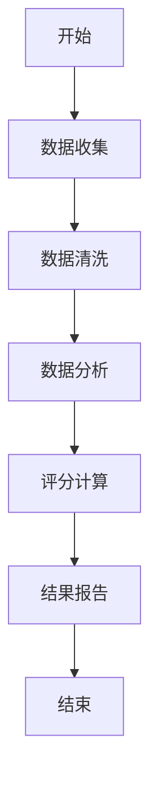

                 


# 彼得林奇如何评估公司的数据治理能力

## 关键词：数据治理，彼得·林奇，评估方法，企业数据管理，投资分析

## 摘要：  
本文详细探讨了彼得·林奇在评估公司数据治理能力方面的方法和策略。通过分析数据治理的核心概念、算法原理、系统架构设计以及项目实战，本文为读者提供了从理论到实践的全面指导，帮助读者理解如何有效评估和提升企业的数据治理能力。

---

## 第一部分：数据治理概述

### 第1章：数据治理的基本概念

#### 1.1 数据治理的定义  
数据治理是指对数据的全生命周期进行管理，确保数据的完整性、准确性、一致性和安全性。它涉及数据的收集、存储、处理、分析和使用等各个环节。

#### 1.2 数据治理的重要性  
在当今数据驱动的时代，数据治理是企业成功的关键因素之一。有效的数据治理可以帮助企业提高数据质量，降低数据风险，增强数据的可信度，并为决策提供可靠的支持。

#### 1.3 彼得·林奇的背景介绍  
彼得·林奇是美国著名的投资经理人，以其在富达投资的长期优异表现而闻名。他注重基本面分析，尤其是对公司管理、财务状况和行业地位的深入研究。

#### 1.4 数据治理在投资中的作用  
对于投资者来说，数据治理是评估公司价值的重要部分。良好的数据治理能力表明公司能够有效管理数据资产，从而为投资者提供可靠的信息基础。

---

### 第2章：数据治理的核心概念与联系

#### 2.1 数据治理的核心概念  
- **数据质量**：数据的准确性、完整性、一致性。  
- **数据安全**：保护数据不被未经授权的访问或泄露。  
- **数据合规性**：遵循相关法律法规和行业标准。

#### 2.2 数据治理的实体关系图  
```mermaid
er
    actor 投资者
    actor 数据管理者
    actor 数据用户
    entity 数据资产
    entity 数据治理政策
    entity 数据安全措施
    relationship 投资者 -> 数据资产: 评估
    relationship 数据管理者 -> 数据资产: 管理
    relationship 数据用户 -> 数据资产: 使用
    relationship 数据治理政策 -> 数据资产: 指导
    relationship 数据安全措施 -> 数据资产: 保护
```

---

## 第二部分：数据治理评估的算法原理

### 第3章：数据治理评估的步骤

#### 3.1 数据收集与清洗  
- 数据收集：通过API、数据库等方式获取数据。  
- 数据清洗：去除重复数据、处理缺失值、纠正错误数据。

#### 3.2 数据分析与评分  
- 数据分析：使用统计方法和机器学习模型对数据进行评估。  
- 数据评分：基于多个维度（如数据质量、安全）对数据进行评分。

#### 3.3 结果报告与建议  
- 生成报告：总结评估结果，提出改进建议。

#### 3.4 数据治理评估的流程图  


---

### 第4章：数据治理评估的数学模型

#### 4.1 数据治理评分公式  
$$ \text{总分} = \sum_{i=1}^{n} w_i \cdot s_i $$  
其中，$w_i$ 是第 $i$ 个维度的权重，$s_i$ 是第 $i$ 个维度的评分。

#### 4.2 数据质量评分示例  
假设某公司数据质量评分为85，数据安全评分为90，权重分别为0.4和0.6。  
$$ \text{总分} = 0.4 \times 85 + 0.6 \times 90 = 34 + 54 = 88 $$

---

### 第5章：数据治理评估的系统架构设计

#### 5.1 系统功能设计  
- **数据收集模块**：负责数据的采集和预处理。  
- **数据处理模块**：执行数据清洗和转换。  
- **数据分析模块**：进行数据评估和评分。  
- **报告生成模块**：输出评估报告。

#### 5.2 系统架构图  


---

### 第6章：项目实战

#### 6.1 环境安装  
- 安装Python、Pandas、NumPy等库。  
  ```bash
  pip install pandas numpy
  ```

#### 6.2 核心代码实现  
```python
import pandas as pd
import numpy as np

# 数据清洗
def data_cleaning(df):
    df.dropna(inplace=True)
    df.drop_duplicates(inplace=True)
    return df

# 数据评分
def calculate_scores(data_quality, data_security):
    weight_quality = 0.4
    weight_security = 0.6
    total_score = weight_quality * data_quality + weight_security * data_security
    return total_score

# 主函数
def main():
    # 数据收集
    df = pd.read_csv('data.csv')
    # 数据清洗
    cleaned_data = data_cleaning(df)
    # 数据评分
    quality_score = 85
    security_score = 90
    total_score = calculate_scores(quality_score, security_score)
    print(f"数据治理总分为：{total_score}")

if __name__ == "__main__":
    main()
```

#### 6.3 案例分析  
以某公司为例，分析其数据治理能力，展示如何通过代码实现评估，并提出改进建议。

---

## 第三部分：总结与最佳实践

### 7.1 最佳实践  
- 定期进行数据治理评估，确保数据质量。  
- 采用自动化工具提高数据处理效率。  
- 建立数据治理团队，明确责任分工。

### 7.2 小结  
本文详细介绍了彼得·林奇如何评估公司的数据治理能力，从核心概念到算法原理，再到系统设计和实战案例，为读者提供了全面的指导。

### 7.3 注意事项  
- 数据治理是一个持续的过程，需要长期关注。  
- 在评估过程中，确保数据的准确性和安全性。

### 7.4 拓展阅读  
- 《数据治理：原则与实践》  
- 彼得·林奇的投资策略分析

---

## 作者：  
**AI天才研究院/AI Genius Institute**  
**禅与计算机程序设计艺术/Zen And The Art of Computer Programming**

