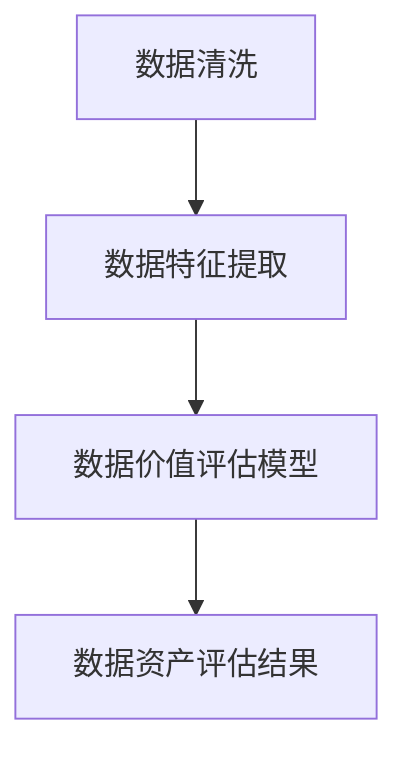
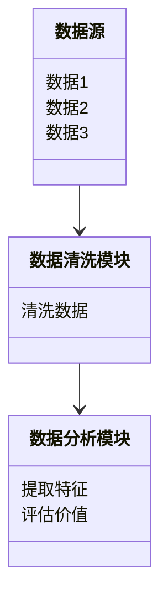
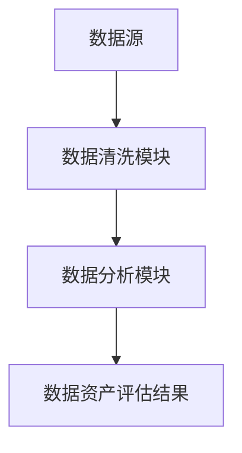
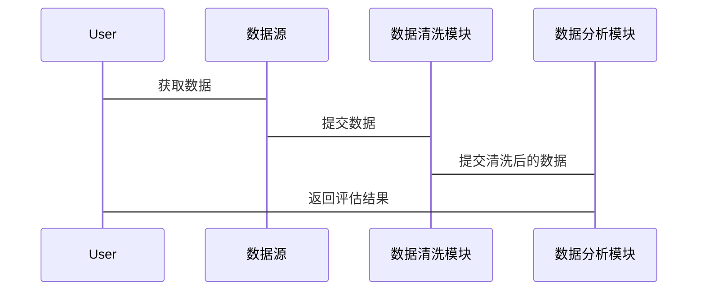

                 


# 彼得林奇如何评估公司的数据资产价值

> 关键词：数据资产，彼得·林奇，投资评估，数据价值，资产评估方法

> 摘要：本文详细介绍了彼得·林奇如何评估公司的数据资产价值。从数据资产的定义、重要性到具体评估方法和算法，结合实际案例分析，深入探讨了数据资产在投资决策中的应用。

---

# 第一部分：数据资产评估的背景与重要性

## 第1章：数据资产的价值与评估背景

### 1.1 数据资产的定义与重要性

#### 1.1.1 数据资产的定义

数据资产是指企业在经营过程中积累的、能够为企业创造价值的数据资源。这些数据资源可以是结构化的（如数据库中的表格）或非结构化的（如文档、图像），并且可以通过分析和利用为企业带来竞争优势。

$$\text{数据资产价值} = \text{数据的可用性} \times \text{数据的准确性}$$

#### 1.1.2 数据资产在企业中的重要性

数据资产是企业核心竞争力的重要组成部分。通过数据资产，企业可以优化运营、提升客户体验、发现市场机会，并在竞争中占据优势地位。

- 数据资产可以用于：
  - 客户画像分析
  - 市场趋势预测
  - 运营效率优化

#### 1.1.3 数据资产价值的衡量标准

数据资产的价值可以通过以下几个方面进行衡量：
- 数据的完整性
- 数据的准确性
- 数据的可用性
- 数据的稀缺性

### 1.2 彼得·林奇的投资方法论

#### 1.2.1 彼得·林奇的投资者背景

彼得·林奇是美国著名投资家，曾任富达麦哲伦基金的经理。他以分析企业的基本面著称，尤其擅长通过对企业数据的分析来评估其投资价值。

#### 1.2.2 彼得·林奇的核心投资理念

彼得·林奇的投资理念强调对企业基本面的深入分析，尤其是企业的财务数据和市场数据。他认为，数据资产是企业价值的重要组成部分，尤其是在数字经济时代。

#### 1.2.3 数据资产在投资中的应用

彼得·林奇在其投资实践中，非常重视对企业数据资产的评估。他认为，数据资产的质量和可用性直接关系到企业的未来盈利能力。

### 1.3 数据资产价值评估的必要性

#### 1.3.1 企业数字化转型的需求

随着数字化转型的推进，数据资产逐渐成为企业的重要资产。企业需要通过数据资产评估，了解其数据资产的真正价值。

#### 1.3.2 数据资产在投资决策中的作用

数据资产的价值评估是企业投资决策的重要依据。通过对数据资产的评估，投资者可以更好地理解企业的潜在价值。

#### 1.3.3 数据资产价值评估的挑战

数据资产价值评估的挑战主要体现在：
- 数据的多样性和复杂性
- 数据的动态变化
- 数据的安全性和隐私性

---

# 第二部分：数据资产评估的核心概念与方法

## 第2章：数据资产评估的核心概念

### 2.1 数据资产的特征与分类

#### 2.1.1 数据资产的特征分析

数据资产具有以下特征：
- 可衡量性：数据资产可以通过量化指标进行评估。
- 可变性：数据资产的价值会随着时间变化。
- 可操作性：数据资产可以通过分析和利用为企业创造价值。

#### 2.1.2 数据资产的分类

数据资产可以分为以下几类：
- 结构化数据：如数据库中的表格。
- 非结构化数据：如文档、图像。
- 半结构化数据：如JSON格式的数据。

#### 2.1.3 数据资产生命周期

数据资产的生命周期包括：
1. 数据生成
2. 数据存储
3. 数据处理
4. 数据分析
5. 数据应用

### 2.2 数据资产评估的关键指标

#### 2.2.1 数据的完整性

数据的完整性是指数据的全面性和准确性。完整性越高的数据，其价值越大。

#### 2.2.2 数据的准确性

数据的准确性是指数据反映真实情况的程度。准确的数据是进行有效分析的基础。

#### 2.2.3 数据的可用性

数据的可用性是指数据能够被方便地访问和使用。可用性高的数据可以更快地为企业创造价值。

### 2.3 数据资产评估的边界与外延

#### 2.3.1 数据资产的边界

数据资产的边界包括：
- 数据的范围
- 数据的用途
- 数据的所有权

#### 2.3.2 数据资产的外延

数据资产的外延包括：
- 数据的衍生价值
- 数据的应用场景
- 数据的潜在价值

#### 2.3.3 数据资产与其他资产的关系

数据资产与其他资产（如固定资产、无形资产）密切相关。数据资产可以与这些资产共同为企业创造价值。

---

# 第三部分：数据资产评估的算法与模型

## 第3章：数据资产评估的算法原理

### 3.1 数据资产评估的核心算法

#### 3.1.1 数据清洗与预处理

数据清洗是数据资产评估的第一步。通过去除噪声数据、填补缺失值等方法，可以提高数据的质量。

#### 3.1.2 数据特征提取

数据特征提取是指从数据中提取具有代表性的特征，以便更好地进行数据评估。

#### 3.1.3 数据价值评估模型

数据价值评估模型是数据资产评估的核心。通过建立数学模型，可以量化数据的价值。

### 3.2 数据资产评估的数学模型

#### 3.2.1 数据质量评估的数学公式

$$\text{数据质量} = \frac{\text{有效数据量}}{\text{总数据量}} \times 100\%$$

#### 3.2.2 数据价值的量化方法

数据价值可以通过以下公式进行量化：

$$\text{数据价值} = \text{数据的可用性} \times \text{数据的准确性} \times \text{数据的稀缺性}$$

#### 3.2.3 数据资产评估的综合模型

综合模型可以将多个因素综合起来，进行数据资产评估。

$$\text{综合评估价值} = \alpha \times \text{数据的可用性} + \beta \times \text{数据的准确性} + \gamma \times \text{数据的稀缺性}$$

其中，$\alpha$、$\beta$、$\gamma$是权重系数，根据具体情况而定。

### 3.3 数据资产评估的算法实现

#### 3.3.1 算法流程图



#### 3.3.2 Python代码示例

```python
def data_asset_assessment(data):
    # 数据清洗
    cleaned_data = data.dropna()
    # 数据特征提取
    features = cleaned_data[['feature1', 'feature2', 'feature3']]
    # 数据价值评估模型
    value = (features['feature1'].mean() +
             features['feature2'].mean() +
             features['feature3'].mean()) / 3
    return value
```

---

# 第四部分：数据资产评估的系统分析与架构设计

## 第4章：数据资产评估的系统架构

### 4.1 问题场景介绍

企业在进行数据资产评估时，需要考虑数据的来源、存储、处理和分析等多个方面。

### 4.2 系统功能设计

#### 4.2.1 领域模型



#### 4.2.2 系统架构



### 4.3 接口设计

系统接口设计包括：
- 数据源接口
- 数据清洗模块接口
- 数据分析模块接口

### 4.4 交互流程图



---

# 第五部分：数据资产评估的项目实战

## 第5章：数据资产评估的项目实战

### 5.1 环境安装

安装必要的软件和工具，例如Python、Pandas、NumPy等。

### 5.2 核心代码实现

```python
import pandas as pd
import numpy as np

def data_asset_assessment(data):
    # 数据清洗
    cleaned_data = data.dropna()
    # 数据特征提取
    features = cleaned_data[['feature1', 'feature2', 'feature3']]
    # 数据价值评估模型
    value = (features['feature1'].mean() +
             features['feature2'].mean() +
             features['feature3'].mean()) / 3
    return value

# 示例数据
data = pd.DataFrame({
    'feature1': [1, 2, 3, 4, 5],
    'feature2': [6, 7, 8, 9, 10],
    'feature3': [11, 12, 13, 14, 15]
})

# 评估数据资产价值
print(data_asset_assessment(data))
```

### 5.3 案例分析

以某公司为例，分析其数据资产的价值，并展示评估过程和结果。

### 5.4 项目小结

总结项目实施的经验和教训，提出改进建议。

---

# 第六部分：数据资产评估的最佳实践

## 第6章：数据资产评估的最佳实践

### 6.1 小结

数据资产评估是企业数字化转型的重要环节。通过科学的评估方法，可以更好地利用数据资产，为企业创造更大的价值。

### 6.2 注意事项

在进行数据资产评估时，需要注意数据的隐私和安全问题，确保数据的合法性和合规性。

### 6.3 拓展阅读

推荐相关的书籍和资源，帮助读者进一步学习和深入理解数据资产评估的方法和技巧。

---

# 作者：AI天才研究院/AI Genius Institute & 禅与计算机程序设计艺术 /Zen And The Art of Computer Programming

