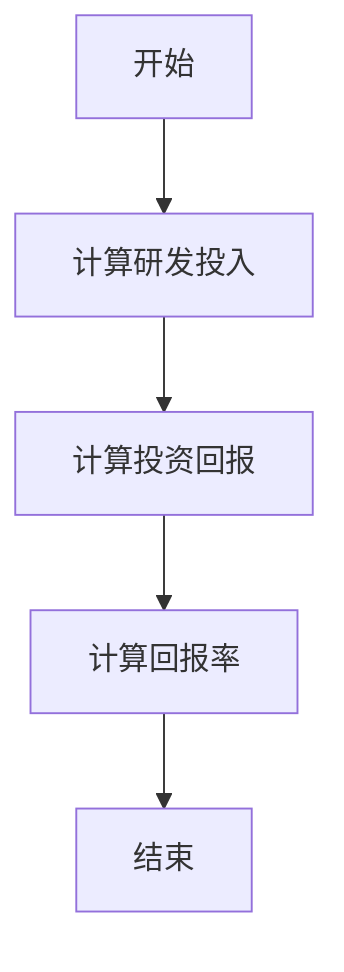
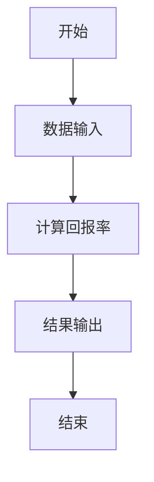
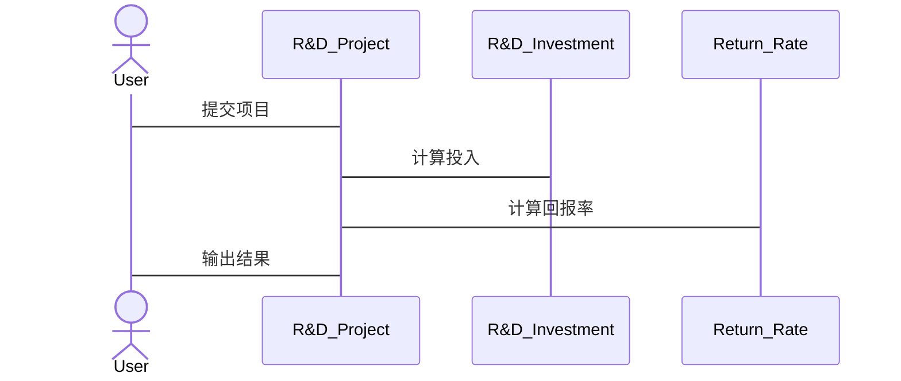

                 


# 彼得林奇如何评估公司的研发投入回报率

## 关键词：研发投入回报率、彼得·林奇、投资评估、研发管理、财务分析

## 摘要：本文详细探讨了彼得·林奇在评估公司研发投入回报率方面的独特方法和见解。通过分析研发投入回报率的定义、计算方法、系统架构、项目实战以及最佳实践，本文为读者提供了全面的指导，帮助他们在实际投资决策中更有效地评估研发项目的回报率。

---

### 第一部分: 公司研发投入回报率评估概述

#### 第1章: 研发投入回报率的核心概念与背景

##### 1.1 研发投入回报率的定义与背景
- 1.1.1 研发投入回报率的基本定义  
  研发投入回报率（R&D ROI）是衡量公司研发投入与其所带来的收益之间关系的重要指标。  
- 1.1.2 研发投入回报率的重要性  
  研发投入是企业创新的核心驱动力，但如何评估其回报率是投资者和管理者关注的焦点。  
- 1.1.3 彼得·林奇对研发投入回报率的重视  
  彼得·林奇认为，评估研发投入回报率是判断公司长期竞争力的关键因素。

##### 1.2 研发投入回报率的计算与评估指标
- 1.2.1 研发投入回报率的计算公式  
  $$ ROI = \frac{净收益}{研发投入} \times 100\% $$  
- 1.2.2 与研发投入相关的财务指标对比  
  - 净现值（NPV）：衡量项目未来现金流的现值。  
  - 内部收益率（IRR）：衡量项目投资的回报率。  
  - 投资回收期（Payback Period）：衡量项目回收初始投资所需的时间。  
- 1.2.3 研发投入回报率的评估维度  
  - 短期回报与长期回报的平衡。  
  - 行业特性对回报率的影响。  

##### 1.3 研发投入回报率的现状与挑战
- 1.3.1 研发投入回报率的行业差异  
  - 高 tech 行业通常具有较高的研发投入回报率，而传统行业可能较低。  
- 1.3.2 研发投入回报率评估中的常见问题  
  - 数据获取的困难性。  
  - 回报的延迟性。  
  - 行业竞争的影响。  
- 1.3.3 彼得·林奇的视角与独特见解  
  彼得·林奇强调，研发投入回报率不仅要看数字，还要结合公司战略和行业趋势进行综合评估。

---

### 第二部分: 研发投入回报率的核心概念与联系

#### 第2章: 研发投入回报率的核心概念与联系

##### 2.1 研发投入回报率的核心概念
- 2.1.1 研发投入的构成与分类  
  - 基础研究：探索性研究，不确定性高。  
  - 应用研究：目标明确，注重实用性。  
  - 开发阶段：从原型到量产。  
- 2.1.2 投资回报率的计算逻辑  
  - 投资回报率是衡量投资效率的核心指标。  
- 2.1.3 研发投入回报率的动态变化  
  - 随着时间和项目的推进，回报率可能波动较大。  

##### 2.2 研发投入回报率与相关指标的对比分析
- 2.2.1 研发投入回报率与净现值的对比  
  - NPV 更注重未来现金流的折现值，而 ROI 更注重回报与投入的比率。  
- 2.2.2 研发投入回报率与内部收益率的对比  
  - IRR 更适合评估独立项目，而 ROI 更适合跨项目比较。  
- 2.2.3 研发投入回报率与投资回收期的对比  
  - Payback Period 更关注资金回收的速度，而 ROI 更关注回报的幅度。  

##### 2.3 研发投入回报率的ER实体关系图
```mermaid
erDiagram
    R&D_Investment {
        key id : int
        amount : float
        project_id : int
        date : date
    }
    Return_Rate {
        key id : int
        rate : float
        project_id : int
        date : date
    }
    R&D_Project {
        key id : int
        name : string
        description : string
        status : string
    }
    R&D_Investment --|{n} Return_Rate : 计算关系
```

---

### 第三部分: 研发投入回报率的算法原理与数学模型

#### 第3章: 研发投入回报率的算法原理与数学模型

##### 3.1 研发投入回报率的计算算法


##### 3.2 研发投入回报率的数学模型
$$ ROI = \frac{净收益}{研发投入} \times 100\% $$

##### 3.3 算法实现与代码示例
```python
def calculate_return_rate(revenue, cost):
    net_profit = revenue - cost
    return_rate = (net_profit / cost) * 100
    return return_rate
```

---

### 第四部分: 研发投入回报率的系统分析与架构设计

#### 第4章: 研发投入回报率的系统分析与架构设计

##### 4.1 系统功能设计（领域模型）
```mermaid
classDiagram
    class R&D_Project {
        id : int
        name : string
        description : string
        status : string
    }
    class R&D_Investment {
        id : int
        amount : float
        date : date
    }
    class Return_Rate {
        id : int
        rate : float
        date : date
    }
    R&D_Project --> R&D_Investment : 计算投入
    R&D_Project --> Return_Rate : 计算回报率
```

##### 4.2 系统架构设计


##### 4.3 系统交互设计


---

### 第五部分: 研发投入回报率的项目实战

#### 第5章: 研发投入回报率的项目实战

##### 5.1 环境安装与数据准备
- 安装 Python 和必要的库（如 pandas、numpy）。  
- 准备研发投入和收益数据。

##### 5.2 系统核心实现
```python
import pandas as pd

def calculate_return_rate(revenue, cost):
    net_profit = revenue - cost
    return_rate = (net_profit / cost) * 100
    return return_rate

# 示例数据
data = {
    '项目ID': [1, 2, 3],
    '研发投入': [100, 150, 200],
    '净收益': [150, 200, 250]
}

df = pd.DataFrame(data)

# 计算回报率
df['回报率'] = df.apply(lambda row: calculate_return_rate(row['净收益'], row['研发投入']), axis=1)

print(df)
```

##### 5.3 数据输入与结果分析
- 数据输入：  
  ```
  项目ID | 投入研发 | 净收益
  1      | 100     | 150
  2      | 150     | 200
  3      | 200     | 250
  ```
- 计算结果：  
  ```
  项目ID | 投入研发 | 净收益 | 回报率
  1      | 100     | 150    | 150%
  2      | 150     | 200    | 133.33%
  3      | 200     | 250    | 125%
  ```

##### 5.4 项目小结
- 通过实际案例分析，展示了如何利用 Python 实现研发投入回报率的计算。  
- 结果表明，项目1的回报率最高，说明其研发投入效率最佳。

---

### 第六部分: 研发投入回报率的最佳实践与小结

#### 第6章: 研发投入回报率的最佳实践与小结

##### 6.1 评估中的注意事项
- 确保数据的准确性和完整性。  
- 结合行业特点和公司战略进行综合评估。  
- 考虑短期和长期回报的平衡。  

##### 6.2 最佳实践 tips
- 使用工具（如 Excel、Python）自动化计算。  
- 定期跟踪和更新评估结果。  
- 结合其他指标（如 NPV、IRR）进行综合分析。  

##### 6.3 小结
通过本文的详细分析和实战案例，读者可以掌握如何有效地评估公司的研发投入回报率。彼得·林奇的方法为我们提供了一个全新的视角，帮助我们在投资决策中更加科学和理性。

---

### 作者：AI天才研究院/AI Genius Institute & 禅与计算机程序设计艺术 /Zen And The Art of Computer Programming

