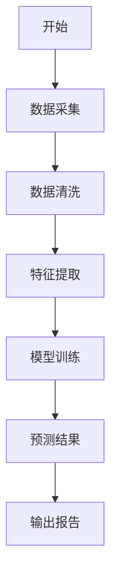
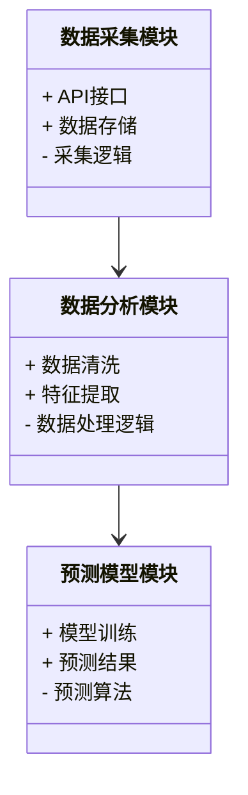
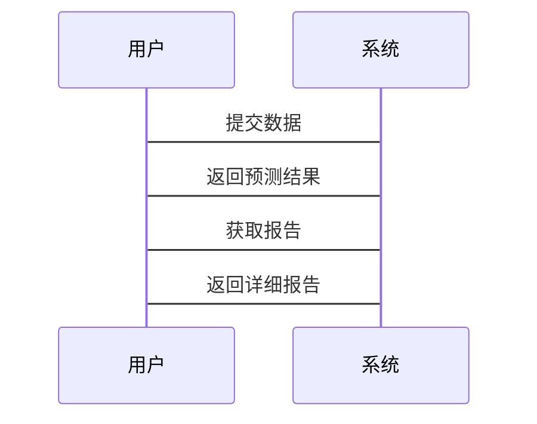

                 


# 彼得林奇如何评估公司的社交媒体影响力转化为销售的能力

> 关键词：彼得林奇，社交媒体影响力，销售能力，影响力评估，数据分析，投资策略

> 摘要：本文深入探讨了彼得林奇如何通过评估社交媒体影响力来预测和提升公司的销售能力。文章从社交媒体影响力的核心概念出发，结合数学模型和实际案例，详细分析了影响力转化为销售能力的逻辑、方法和系统设计，最终提出了可行的实施策略和最佳实践。

---

## 第一部分: 背景介绍

### 第1章: 社交媒体影响力概述

#### 1.1 什么是社交媒体影响力
社交媒体影响力指的是企业在社交媒体平台上通过内容发布、互动和传播所获得的关注度和信任度。这种影响力可以转化为企业的品牌价值和销售能力，是现代市场营销的重要组成部分。

#### 1.2 彼得林奇的评估方法
彼得林奇是美国著名的投资专家，他在评估公司价值时，非常注重社交媒体影响力对销售能力的影响。他认为，社交媒体不仅是品牌推广的工具，更是用户与企业互动、建立信任的重要渠道。

---

### 第2章: 影响力评估的核心概念

#### 2.1 影响力评估的关键指标
- 关注者数量：衡量品牌在社交媒体上的基础影响力。
- 互动频率：包括点赞、评论、分享等，反映用户与品牌之间的互动程度。
- 内容传播率：内容被转发和传播的频率，体现内容的吸引力和影响力。

#### 2.2 影响力与销售能力的关联
- 影响力直接影响用户的购买决策。
- 高度互动的用户更容易转化为忠实的客户。
- 社交媒体的口碑效应可以显著提升品牌知名度和销售转化率。

---

## 第二部分: 核心概念与联系

### 第3章: 影响力评估的数学模型

#### 3.1 影响力指数计算公式
影响力指数是一个综合指标，用于量化社交媒体上的影响力。公式如下：

$$
影响力指数 = \frac{关注者数量 \times 互动频率 \times 内容传播率}{总粉丝数}
$$

#### 3.2 情感分析模型
情感分析用于判断用户对品牌的情感倾向，公式如下：

$$
情感得分 = \sum_{i=1}^{n} (w_i \times s_i)
$$

其中，$w_i$ 是词语权重，$s_i$ 是词语情感值。

#### 3.3 用户行为分析模型
用户行为分析模型用于预测用户的购买行为，公式如下：

$$
用户活跃度 = \frac{评论数 + 分享数 + 点赞数}{关注者数量}
$$

---

### 第4章: 算法原理讲解

#### 4.1 算法流程图



#### 4.2 代码实现

```python
import pandas as pd
from sklearn.metrics import accuracy_score

# 数据采集
def collect_data():
    # 从社交媒体API获取数据
    pass

# 数据清洗
def clean_data(data):
    # 删除无效数据
    pass

# 特征提取
def extract_features(data):
    # 提取关注者数量、互动频率等特征
    pass

# 模型训练
def train_model(features, labels):
    # 使用机器学习模型训练
    pass

# 预测结果
def predict_sales(features, model):
    return model.predict(features)

# 主函数
def main():
    data = collect_data()
    cleaned_data = clean_data(data)
    features = extract_features(cleaned_data)
    labels = cleaned_data['label']
    model = train_model(features, labels)
    predictions = predict_sales(features, model)
    print(f"预测准确率: {accuracy_score(labels, predictions)}")
```

---

### 第5章: 系统分析与架构设计

#### 5.1 系统功能设计



#### 5.2 系统交互流程



---

### 第6章: 项目实战

#### 6.1 环境安装
安装必要的库：
```bash
pip install pandas numpy scikit-learn
```

#### 6.2 代码实现
```python
import pandas as pd
from sklearn.model_selection import train_test_split
from sklearn.linear_model import LinearRegression

# 数据加载
data = pd.read_csv('social_media_data.csv')

# 特征与标签分离
X = data[['关注者数量', '互动频率', '内容传播率']]
y = data['销售转化率']

# 数据分割
X_train, X_test, y_train, y_test = train_test_split(X, y, test_size=0.2)

# 模型训练
model = LinearRegression()
model.fit(X_train, y_train)

# 预测结果
y_pred = model.predict(X_test)
print('预测准确率:', model.score(X_test, y_test))
```

#### 6.3 案例分析
以一家公司为例，分析其社交媒体数据，评估影响力指数，并制定销售策略。

---

## 第三部分: 最佳实践与总结

### 第7章: 最佳实践
- 定期更新内容，保持用户的活跃度。
- 结合情感分析，优化内容策略。
- 使用数据分析工具，持续监控和评估影响力。

### 第8章: 小结
本文详细介绍了彼得林奇如何评估社交媒体影响力，并将其转化为销售能力的方法。通过数学模型和系统设计，展示了如何在实际中应用这些方法。

### 第9章: 注意事项
- 数据隐私和安全问题需要注意。
- 模型需要定期更新，以适应市场变化。

### 第10章: 拓展阅读
推荐相关书籍和论文，供读者深入学习。

---

# 作者：AI天才研究院 & 禅与计算机程序设计艺术

