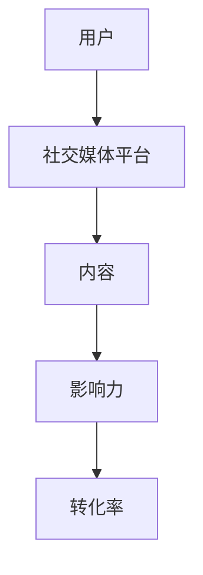
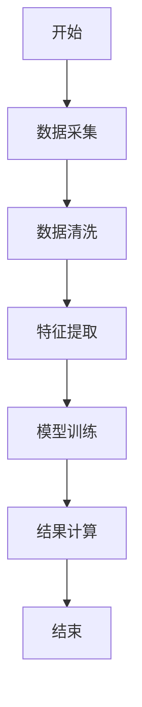
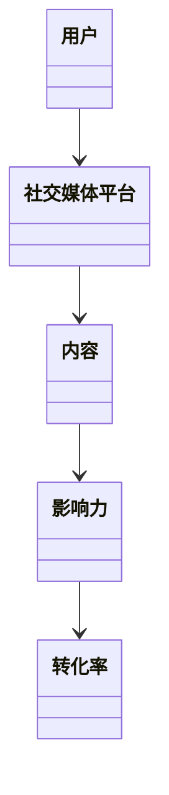
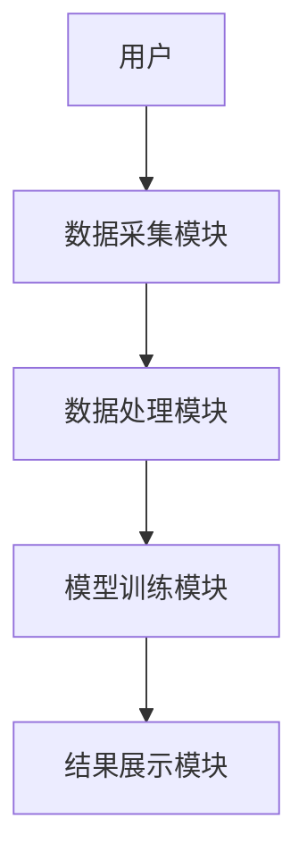
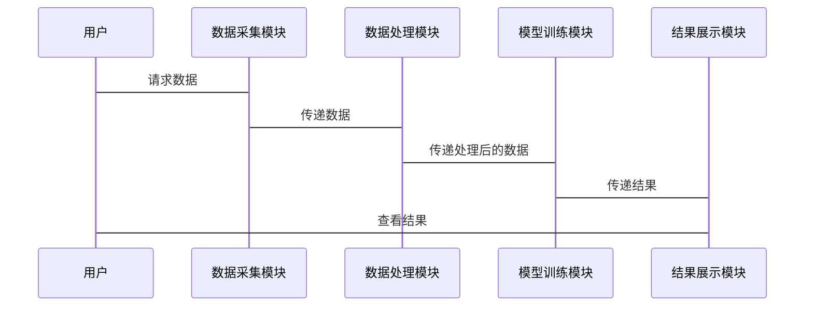

                 


# 彼得·林奇如何评估公司的社交媒体影响力转化率

> 关键词：彼得·林奇，社交媒体影响力，转化率，投资评估，数据分析

> 摘要：本文详细探讨了彼得·林奇如何利用社交媒体影响力转化率来评估公司的投资价值。通过分析社交媒体数据、构建评估模型、设计算法流程、系统架构以及项目实战，结合最佳实践，帮助读者全面理解如何将社交媒体影响力转化为实际的投资决策。

---

## 第一章：社交媒体影响力评估概述

### 1.1 社交媒体在投资分析中的重要性

#### 1.1.1 社交媒体数据的定义与特征
社交媒体数据包括用户生成的内容（UGC）、评论、点赞、分享、关注数、转发量等。这些数据反映了用户对品牌、产品或公司的态度和行为。

#### 1.1.2 社交媒体在投资决策中的作用
社交媒体作为信息传播的重要渠道，可以帮助投资者快速了解市场动态、用户反馈和公司形象。通过分析社交媒体数据，投资者可以识别潜在的投资机会和风险。

#### 1.1.3 彼得·林奇的投资理念与社交媒体分析的结合
彼得·林奇强调基本面分析和对公司管理层的信任。结合社交媒体分析，投资者可以更全面地评估公司的市场影响力和用户基础。

### 1.2 影响力转化率的核心概念

#### 1.2.1 影响力转化率的定义
影响力转化率是指社交媒体上的互动行为（如点赞、评论、分享）转化为实际购买或其他目标行为的比例。

#### 1.2.2 影响力转化率的计算公式
$$影响力转化率 = \frac{转化行为数}{总互动数} \times 100\%$$

#### 1.2.3 影响力转化率与投资决策的关系
高影响力转化率意味着社交媒体上的互动能够有效转化为实际的销售或投资行为，这通常被视为公司具有较强的市场影响力和品牌价值。

### 1.3 社交媒体影响力分析的背景与现状

#### 1.3.1 社交媒体的普及与影响力分析的兴起
随着社交媒体的普及，越来越多的公司利用这些平台进行品牌推广和用户互动。影响力分析成为衡量公司市场表现的重要指标。

#### 1.3.2 影响力转化率分析的行业现状
当前，影响力转化率分析在电商、金融等领域得到广泛应用。投资者通过分析社交媒体数据，评估公司的市场影响力和投资潜力。

#### 1.3.3 影响力转化率分析的未来趋势
随着人工智能和大数据技术的发展，影响力转化率分析将更加精准和智能化，成为投资决策的重要工具。

### 1.4 本章小结
本章介绍了社交媒体在投资分析中的重要性，定义了影响力转化率，并探讨了其在投资决策中的应用和未来发展趋势。

---

## 第二章：社交媒体影响力评估的核心概念与联系

### 2.1 核心概念原理

#### 2.1.1 社交媒体数据的分类与特征
社交媒体数据可以分为文本数据（如评论、帖子）、行为数据（如点赞、分享）和用户数据（如关注数、粉丝数）。

#### 2.1.2 影响力转化率的计算方法
影响力转化率的计算需要考虑转化行为的定义。例如，将购买行为视为转化行为，计算其占总社交媒体互动的比例。

#### 2.1.3 影响力转化率与投资回报的关系
高影响力转化率通常意味着公司具有较强的市场影响力和用户黏性，这可能带来更高的投资回报。

### 2.2 核心概念属性对比表格

| **属性**         | **社交媒体数据**       | **影响力转化率**      |
|------------------|------------------------|-----------------------|
| 数据类型         | 文本、行为、用户        | 比例                   |
| 计算公式         | -                      | $$影响力转化率 = \frac{转化行为数}{总互动数} \times 100\%$$ |
| 应用场景         | 品牌推广、用户互动      | 投资评估、市场分析     |

### 2.3 ER实体关系图架构



### 2.4 本章小结
本章通过对比分析社交媒体数据和影响力转化率的核心概念，构建了实体关系图，为后续分析奠定了基础。

---

## 第三章：社交媒体影响力转化率的算法原理讲解

### 3.1 算法原理概述

#### 3.1.1 影响力转化率的计算模型
影响力转化率的计算模型通常包括数据采集、清洗、特征提取和模型训练四个阶段。

#### 3.1.2 算法的基本思想与流程
- 数据采集：从社交媒体平台获取相关数据。
- 数据清洗：去除无效数据，处理异常值。
- 特征提取：提取关键特征，如用户活跃度、内容相关性。
- 模型训练：使用机器学习算法（如逻辑回归、随机森林）训练模型。

### 3.2 算法流程图



### 3.3 算法数学模型与公式

#### 3.3.1 影响力转化率计算公式
$$影响力转化率 = \frac{转化行为数}{总互动数} \times 100\%$$

#### 3.3.2 案例分析与举例说明
假设某公司在社交媒体上的总互动数为10000次，其中转化为实际购买的行为有1200次，那么影响力转化率为：
$$影响力转化率 = \frac{1200}{10000} \times 100\% = 12\%$$

### 3.4 本章小结
本章详细讲解了影响力转化率的计算模型和算法流程，为后续系统设计奠定了基础。

---

## 第四章：系统分析与架构设计方案

### 4.1 问题场景介绍

#### 4.1.1 项目介绍
构建一个社交媒体影响力转化率分析系统，帮助投资者评估公司的市场影响力。

#### 4.1.2 系统功能设计
- 数据采集模块：从社交媒体平台获取数据。
- 数据处理模块：清洗和预处理数据。
- 模型训练模块：训练影响力转化率预测模型。
- 结果展示模块：可视化分析结果。

#### 4.1.3 领域模型类图



#### 4.1.4 系统架构设计



#### 4.1.5 系统接口设计
系统接口包括数据采集接口、模型训练接口和结果展示接口。

#### 4.1.6 系统交互序列图



### 4.2 本章小结
本章设计了一个完整的社交媒体影响力转化率分析系统，包括功能设计、架构设计和接口设计。

---

## 第五章：项目实战

### 5.1 环境安装与配置

#### 5.1.1 环境搭建
- 安装Python、Pandas、Scikit-learn、Matplotlib等库。

#### 5.1.2 数据集准备
获取社交媒体数据，包括用户行为和互动数据。

### 5.2 系统核心实现源代码

#### 5.2.1 数据采集模块
```python
import pandas as pd

def collect_data():
    # 示例代码，从社交媒体API获取数据
    data = pd.DataFrame({'用户': [1, 2, 3], '互动行为': ['点赞', '评论', '分享']})
    return data

if __name__ == '__main__':
    collect_data()
```

#### 5.2.2 数据处理模块
```python
def process_data(data):
    # 数据清洗和特征提取
    processed_data = data.dropna()
    return processed_data

if __name__ == '__main__':
    processed_data = process_data(data)
```

#### 5.2.3 模型训练模块
```python
from sklearn.model

