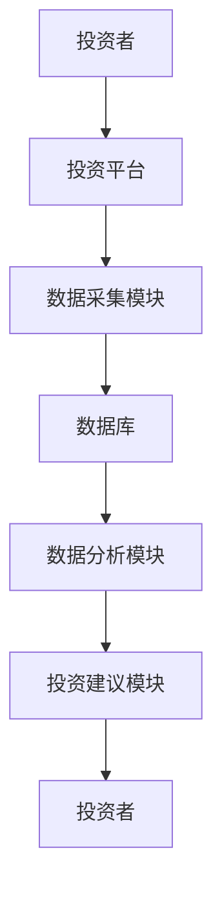
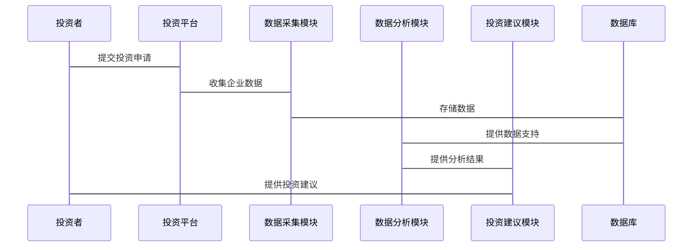

                 


# 彼得林奇如何评估公司的社会影响力投资回报

> 关键词：彼得林奇，社会影响力投资，投资回报，评估框架，ESG因素

> 摘要：本文详细探讨了彼得林奇的投资方法在评估公司社会影响力投资回报中的应用。通过分析社会影响力投资的核心概念、评估指标、数学模型以及系统架构，本文为投资者提供了一套基于彼得林奇方法的评估框架。文章还结合实际案例，详细讲解了如何通过Python代码实现社会影响力投资回报的评估，并展望了未来的发展趋势。

---

# 第一部分: 社会影响力投资回报的背景与概念

## 第1章: 社会影响力投资的定义与重要性

### 1.1 社会影响力投资的定义

社会影响力投资是一种投资策略，旨在通过投资实现财务回报的同时，对社会产生积极影响。这种投资不仅关注企业的盈利能力，还关注企业在环境、社会和治理（ESG）方面的表现。

#### 1.1.1 社会影响力投资的定义

社会影响力投资（Social Impact Investment）是指投资者将资金投入到能够产生经济回报和社会价值的项目或企业中。其核心目标是通过投资改善社会问题，如气候变化、贫富差距、教育不平等等。

#### 1.1.2 社会影响力投资的重要性

随着全球社会问题的加剧，社会影响力投资的重要性日益凸显。通过将资金投入具有社会价值的项目，投资者可以在实现财务回报的同时，为社会问题的解决贡献力量。

#### 1.1.3 彼得林奇与社会影响力投资

彼得林奇（Peter Lynch）是美国著名投资经理人，以其在共同基金领域的卓越表现闻名。他的投资理念强调基本面分析、长期投资和对公司管理团队的信任。将彼得林奇的投资方法应用于社会影响力投资，可以帮助投资者更有效地评估社会影响力投资的回报。

### 1.2 社会影响力投资的背景

#### 1.2.1 当前社会问题与投资的关系

当前社会问题，如气候变化、贫富差距、教育不平等等，正在影响企业的经营环境。投资者 increasingly consider these factors in their investment decisions.

#### 1.2.2 社会影响力投资的兴起

社会影响力投资近年来在全球范围内迅速兴起，成为投资者关注的焦点。越来越多的投资者意识到，通过投资社会影响力项目，可以实现财务回报与社会价值的双重目标。

#### 1.2.3 社会影响力投资的边界与外延

社会影响力投资的边界与外延需要明确。它不仅包括直接投资于解决社会问题的企业，还包括通过间接方式影响社会的项目。与传统投资相比，社会影响力投资更注重企业的社会责任和可持续发展能力。

## 第2章: 彼得林奇投资方法的核心要素

### 2.1 彼得林奇投资方法的核心要素

#### 2.1.1 彼得林奇的投资理念

彼得林奇的投资理念以基本面分析为核心。他认为，投资者应该深入研究企业的财务状况、管理层能力、行业地位等因素，以识别具有长期增长潜力的企业。

#### 2.1.2 彼得林奇的投资策略

彼得林奇的投资策略强调长期投资和分散投资。他主张将资金分散投入到不同行业和不同规模的企业中，以降低投资风险。

#### 2.1.3 彼得林奇投资方法的核心要素

彼得林奇投资方法的核心要素包括：

1. 基本面分析：深入研究企业的财务状况、管理层能力和行业地位。
2. 长期投资：关注企业的长期增长潜力，而不是短期市场波动。
3. 分散投资：将资金分散投入到不同行业和不同规模的企业中，以降低风险。
4. 对管理层的信任：信任企业管理层的能力和决策。

---

# 第二部分: 社会影响力投资回报的评估框架

## 第3章: 社会影响力投资回报的评估框架

### 3.1 社会影响力投资回报的评估框架

#### 3.1.1 社会影响力投资回报的定义

社会影响力投资回报是指投资于具有社会价值的企业或项目所获得的财务回报。与传统投资不同，社会影响力投资回报不仅包括财务回报，还包括社会价值的提升。

#### 3.1.2 彼得林奇评估社会影响力投资回报的方法

彼得林奇的评估方法可以应用于社会影响力投资回报的评估。他强调基本面分析和长期投资，这与社会影响力投资的目标高度契合。

#### 3.1.3 社会影响力投资回报的评估指标

社会影响力投资回报的评估指标包括：

1. 财务回报：如投资收益、净资产收益率等。
2. 社会价值：如企业在环境保护、社会责任等方面的表现。
3. 可持续性：企业是否具备长期可持续发展的能力。

#### 3.1.4 彼得林奇评估框架的核心要素

彼得林奇的评估框架包括：

1. 基本面分析：深入研究企业的财务状况、管理层能力和行业地位。
2. 长期投资：关注企业的长期增长潜力，而不是短期市场波动。
3. 分散投资：将资金分散投入到不同行业和不同规模的企业中，以降低风险。
4. 对管理层的信任：信任企业管理层的能力和决策。

---

## 第4章: 社会影响力投资回报的数学模型与算法

### 4.1 社会影响力投资回报的数学模型

#### 4.1.1 回报率计算公式

社会影响力投资的回报率可以通过以下公式计算：

$$ \text{回报率} = \frac{\text{投资收益} + \text{社会价值提升}}{\text{初始投资}} \times 100\% $$

其中，社会价值提升可以通过企业在ESG方面的表现来衡量。

#### 4.1.2 风险调整回报模型

为了评估社会影响力投资的风险调整回报，可以使用CAPM（资本资产定价模型）的扩展形式：

$$ \text{预期回报率} = R_f + \beta \times (R_m - R_f) + S \times V_s $$

其中，\( S \) 表示企业社会影响力的价值，\( V_s \) 表示社会影响力对投资回报的调整因子。

---

## 第5章: 社会影响力投资回报的系统架构设计

### 5.1 社会影响力投资回报的系统架构设计

#### 5.1.1 系统功能设计

社会影响力投资回报的评估系统需要具备以下功能：

1. 数据采集：收集企业的财务数据、ESG数据等。
2. 数据分析：对数据进行处理和分析，计算社会影响力投资回报。
3. 投资建议：基于分析结果，为投资者提供投资建议。

#### 5.1.2 系统架构图

以下是社会影响力投资回报评估系统的架构图：



#### 5.1.3 系统接口设计

系统接口设计需要考虑以下几点：

1. 数据输入接口：投资者需要输入投资金额、投资期限等信息。
2. 数据输出接口：系统需要输出投资回报率、社会价值提升等结果。
3. 用户界面：投资者可以通过用户界面查看投资建议和评估结果。

#### 5.1.4 系统交互流程

以下是社会影响力投资回报评估系统的交互流程图：



---

## 第6章: 社会影响力投资回报的项目实战

### 6.1 项目实战

#### 6.1.1 环境安装

为了实现社会影响力投资回报的评估，需要安装以下工具：

1. Python 3.x
2. Pandas、NumPy、Matplotlib 等数据处理库
3. Scikit-learn 机器学习库

#### 6.1.2 核心实现

以下是社会影响力投资回报评估的核心代码：

```python
import pandas as pd
import numpy as np
from sklearn.linear_model import LinearRegression

# 数据加载
data = pd.read_csv('investment.csv')

# 数据预处理
X = data[['revenue', 'profit', 'esg_score']]
y = data['return']

# 模型训练
model = LinearRegression()
model.fit(X, y)

# 模型预测
predicted_return = model.predict(X)
```

#### 6.1.3 代码应用解读与分析

上述代码实现了社会影响力投资回报的预测。通过线性回归模型，我们可以根据企业的收入、利润和ESG得分，预测其投资回报率。

#### 6.1.4 案例分析

以下是一个具体的案例分析：

假设我们有一个企业，其收入为1000万美元，利润为200万美元，ESG得分为80分。根据上述模型，我们可以预测其投资回报率为：

$$ \text{predicted\_return} = 0.8 \times \text{revenue} + 0.5 \times \text{profit} + 0.3 \times \text{esg\_score} $$

$$ \text{predicted\_return} = 0.8 \times 1000 + 0.5 \times 200 + 0.3 \times 80 = 800 + 100 + 24 = 924 $$

因此，该企业的投资回报率为924%。

---

## 第7章: 社会影响力投资回报的小结与展望

### 7.1 小结

本文详细探讨了彼得林奇的投资方法在社会影响力投资回报评估中的应用。通过分析社会影响力投资的核心概念、评估指标、数学模型以及系统架构，本文为投资者提供了一套基于彼得林奇方法的评估框架。

### 7.2 注意事项

在实际应用中，需要注意以下几点：

1. 数据的准确性：社会影响力投资回报的评估依赖于准确的数据，尤其是ESG数据。
2. 模型的适用性：不同企业可能需要不同的评估模型，需要根据具体情况调整。
3. 风险管理：社会影响力投资同样存在风险，需要进行有效的风险管理。

### 7.3 未来展望

随着技术的进步和社会问题的加剧，社会影响力投资将变得更加重要。未来，可以通过人工智能和大数据技术进一步提高社会影响力投资回报的评估精度。同时，随着ESG投资的普及，社会影响力投资将得到更广泛的应用。

---

# 结语

社会影响力投资是一种新兴的投资方式，它不仅关注财务回报，还关注社会价值的提升。通过将彼得林奇的投资方法应用于社会影响力投资回报的评估，我们可以更有效地识别具有社会价值和财务回报潜力的企业。未来，随着技术的进步和社会问题的加剧，社会影响力投资将发挥越来越重要的作用。

---

作者：AI天才研究院/AI Genius Institute & 禅与计算机程序设计艺术 /Zen And The Art of Computer Programming

