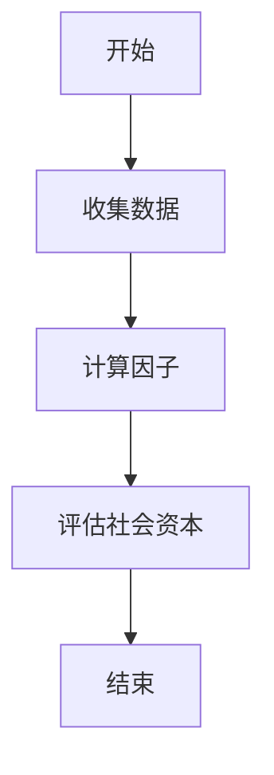
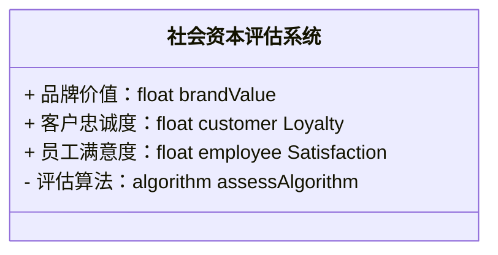
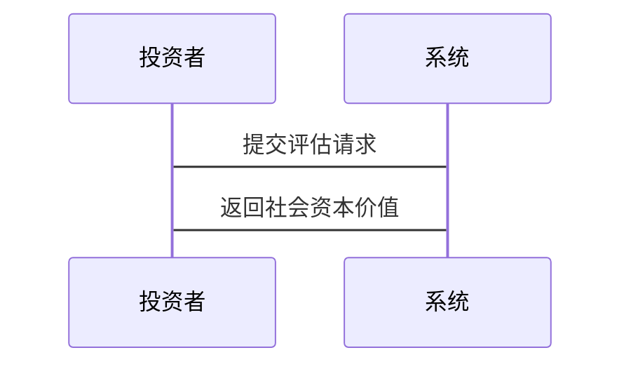

                 


# 彼得林奇如何评估公司的社会资本

## 关键词：彼得林奇、社会资本、投资评估、品牌价值、客户忠诚度

## 摘要：  
本文深入探讨了彼得林奇如何评估公司的社会资本，从社会资本的定义、核心概念、评估方法到实际应用，结合数学模型和系统架构，全面分析社会资本在投资决策中的重要性。通过案例分析和实战指导，帮助读者掌握如何将社会资本评估融入投资策略中。

---

## 第1章：社会资本的定义与重要性

### 1.1 社会资本的定义与内涵  
社会资本是指企业通过长期经营积累的无形资产，包括品牌价值、客户关系、员工忠诚度等。这些资产能够为企业创造持续的竞争优势，是企业价值的重要组成部分。

### 1.2 彼得林奇的投资理念  
彼得林奇强调长期投资，注重企业的基本面分析。他认为，社会资本是企业长期盈利能力的关键因素，尤其是在品牌建设和客户忠诚度方面。

---

## 第2章：社会资本的核心概念与理论基础

### 2.1 社会资本的类型  
1. **人力资本**：员工的知识、技能和经验。  
2. **组织资本**：企业的文化和制度。  
3. **关系资本**：与客户、供应商的关系。  

### 2.2 社会资本的评估维度  
1. **品牌价值**：品牌的知名度和美誉度。  
2. **客户忠诚度**：客户对企业产品的依赖程度。  
3. **员工满意度**：员工对企业的认可度。  

### 2.3 社会资本的评估模型  
通过因子分析模型，我们可以量化社会资本的各维度对整体价值的贡献。  

**概念属性特征对比表格**：  
| 类型    | 核心要素         | 评估维度         |
|---------|------------------|------------------|
| 人力资本 | 员工技能、经验    | 员工满意度、稳定性 |
| 组织资本 | 企业文化和制度    | 员工忠诚度、创新性 |
| 关系资本 | 客户关系、供应商关系 | 客户忠诚度、合作稳定性 |

**ER实体关系图架构的 Mermaid 流程图**：  


---

## 第3章：彼得林奇的社会资本评估方法

### 3.1 彼得林奇的评估框架  
彼得林奇通过以下步骤评估社会资本：  
1. **品牌价值分析**：评估企业的品牌影响力。  
2. **客户关系分析**：了解客户对企业的依赖程度。  
3. **员工稳定性分析**：评估员工的忠诚度和稳定性。  

### 3.2 评估模型的数学基础  
因子分析模型通过主成分分析（PCA）提取关键因子。  

**因子分析的数学公式**：  
$$
F = \sum_{i=1}^{n} \lambda_i X_i
$$  
其中，$F$ 是因子，$\lambda_i$ 是因子载荷，$X_i$ 是观测变量。  

---

## 第4章：社会资本的量化与评估

### 4.1 量化方法的数学模型  
社会资本的量化可以通过加权平均法实现：  

$$
\text{社会资本价值} = \sum_{i=1}^{m} w_i V_i
$$  
其中，$w_i$ 是各维度的权重，$V_i$ 是各维度的评估值。  

### 4.2 评估流程的 Mermaid 流程图  


---

## 第5章：社会资本评估的系统架构与实现

### 5.1 系统功能设计  
系统功能包括数据采集、因子分析、结果展示等。  

**领域模型的 Mermaid 类图**：  


### 5.2 系统接口与交互  
系统接口包括数据输入、评估请求、结果输出等。  

**系统交互的 Mermaid 序列图**：  


---

## 第6章：项目实战与案例分析

### 6.1 环境安装与配置  
安装Python、Pandas、Scikit-learn等工具。  

### 6.2 核心代码实现  
```python
import pandas as pd
from sklearn.decomposition import PCA

# 数据预处理
data = pd.DataFrame({
    '品牌价值': [85, 90, 88],
    '客户忠诚度': [90, 85, 87],
    '员工满意度': [88, 82, 86]
})

# 因子分析
pca = PCA(n_components=1)
pca.fit(data)
```

### 6.3 案例分析与解读  
以某公司为例，通过因子分析模型计算其社会资本价值。  

---

## 第7章：总结与最佳实践

### 7.1 本章小结  
社会资本是企业价值的重要组成部分，彼得林奇的方法为我们提供了有效的评估工具。

### 7.2 最佳实践 Tips  
1. 定期评估社会资本，及时调整策略。  
2. 关注品牌建设和客户关系管理。  
3. 采用量化模型提高评估准确性。  

### 7.3 未来展望  
随着技术进步，社会资本评估将更加智能化和精准化。

---

## 作者：AI天才研究院/AI Genius Institute & 禅与计算机程序设计艺术 /Zen And The Art of Computer Programming

