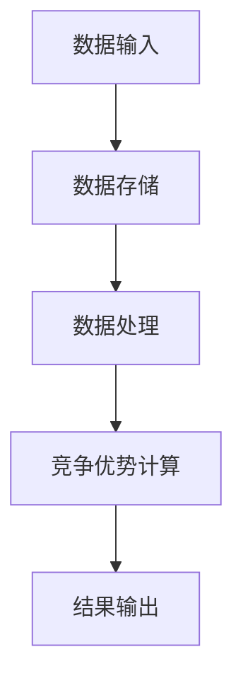

                 


# 彼得林奇如何评估公司的竞争优势

## 关键词：竞争优势、彼得·林奇、投资策略、企业评估、核心竞争力

## 摘要：  
彼得·林奇是全球闻名的投资专家，他在评估公司的竞争优势方面提出了许多独特的见解。本文将详细介绍彼得·林奇的竞争优势评估方法，从核心概念到实际应用，逐步分析其理论和实践的细节。通过本文，读者将能够掌握如何系统地评估公司的竞争优势，并将其应用到实际投资决策中。

---

# 第一部分: 背景介绍

## 第1章: 评估公司竞争优势的重要性

### 1.1 竞争优势的核心概念

#### 1.1.1 什么是竞争优势  
竞争优势是指一家公司在市场中相对于竞争对手的独特优势。这些优势可以是成本优势、技术优势、品牌优势、资源优势等，能够使公司在竞争中占据有利地位。

#### 1.1.2 竞争优势的重要性  
竞争优势是公司长期成功的关键。具备竞争优势的公司能够在市场中获得更高的市场份额、更强的盈利能力，并在面对挑战时更具灵活性。

#### 1.1.3 竞争优势的分类  
竞争优势可以分为以下几类：  
1. **成本优势**：公司以更低的成本生产产品或服务。  
2. **技术优势**：公司在技术开发或创新方面具有领先地位。  
3. **品牌优势**：公司拥有强大的品牌影响力，能够吸引更多的消费者。  
4. **资源优势**：公司拥有独特的资源或原材料供应。  
5. **服务优势**：公司在售后服务或客户支持方面表现优异。  

### 1.2 彼得·林奇的竞争优势评估方法

#### 1.2.1 彼得·林奇的投资者背景  
彼得·林奇是富达投资的传奇基金经理，以其卓越的投资业绩闻名。他的投资哲学强调深入研究公司基本面，寻找具有持续竞争优势的公司。

#### 1.2.2 彼得·林奇的竞争优势评估框架  
彼得·林奇提出了“护城河”理论，认为公司必须具备某种难以被竞争对手复制的核心竞争力。这种护城河可以是技术、品牌、成本或其他形式的壁垒。

#### 1.2.3 竞争优势评估的目标与边界  
- **目标**：识别公司在市场中的独特优势，并预测其长期盈利能力。  
- **边界**：竞争优势评估不涉及短期市场波动，而是关注公司内在的、可持续的优势。

---

## 第2章: 竞争优势评估的背景与问题描述

### 2.1 当前市场竞争的复杂性  
现代市场竞争日益激烈，公司必须具备独特的竞争优势才能生存和发展。竞争对手的模仿和创新使得竞争优势难以持久。

### 2.2 传统竞争优势评估的局限性  
传统的方法往往关注财务指标，而忽视了公司的核心竞争力和长期发展潜力。

### 2.3 彼得·林奇方法的创新性  
彼得·林奇通过深入分析公司的基本面和行业地位，提出了一套系统化的竞争优势评估方法，强调公司内在的“护城河”。

---

## 第3章: 竞争优势的核心要素分析

### 3.1 核心竞争力的定义  
核心竞争力是指公司能够为客户创造独特价值的能力，是竞争优势的来源。

### 3.2 竞争优势的属性特征对比

| 竞争优势属性 | 特征描述 | 示例 |
|---------------|----------|------|
| 可量性        | 可以通过指标量化 | 市场占有率、利润率 |
| 可持续性      | 能够长期维持 | 技术创新、品牌忠诚度 |
| 可扩展性      | 可以在不同市场或产品中应用 | 全球化品牌、标准化技术 |

### 3.3 竞争优势的核心要素组成  
竞争优势的核心要素包括：  
1. **市场定位**：公司如何在目标市场中定位自身。  
2. **资源与能力**：公司拥有的资源和能力是否独特。  
3. **客户价值**：公司为客户创造的价值是否显著。  
4. **创新能力**：公司是否能够持续创新并保持竞争优势。  

---

## 第4章: 竞争优势的ER实体关系图

### 4.1 实体关系图的构建  
以下是竞争优势的ER实体关系图：

```mermaid
erDiagram
    company {
        id : integer
        name : string
        industry : string
        market_share : float
        profit_margin : float
    }
    competitor {
        id : integer
        name : string
        industry : string
        market_share : float
        profit_margin : float
    }
    advantage {
        id : integer
        type : string
        strength : integer
        company_id : integer
    }
    relation1 : company -- advantage
    relation2 : competitor -- advantage
```

### 4.2 竞争优势的结构化分析  
通过ER图可以看出，竞争优势是公司与竞争对手之间的关系，涉及市场占有率和利润率等关键指标。

---

## 第5章: 竞争优势评估的数学模型

### 5.1 竞争优势指数公式  
竞争优势指数（CAI）的计算公式为：  
$$ \text{CAI} = \frac{\text{市场占有率} + \text{利润率} + \text{创新得分}}{3} $$  

其中，创新得分是公司相对于竞争对手的创新能力评分，范围为1-5分。

### 5.2 示例计算  
假设某公司市场占有率为30%，利润率为15%，创新得分为4，则：  
$$ \text{CAI} = \frac{30 + 15 + 4}{3} = 19.67 $$  
这意味着该公司具有较强的竞争优势。

---

## 第6章: 竞争优势评估的系统架构设计

### 6.1 系统功能模块  
1. **数据收集模块**：收集公司和竞争对手的市场数据。  
2. **分析模块**：计算竞争优势指数。  
3. **评分模块**：根据公式给出评分。  

### 6.2 系统架构图  
以下是竞争优势评估系统的架构图：



---

## 第7章: 竞争优势评估的项目实战

### 7.1 环境安装  
需要安装Python和相关库（如Pandas、NumPy）。  

### 7.2 核心代码实现  

```python
def calculate_cai(company_data):
    market_share = company_data['market_share']
    profit_margin = company_data['profit_margin']
    innovation_score = company_data['innovation_score']
    cai = (market_share + profit_margin + innovation_score) / 3
    return cai

# 示例数据
data = {
    'market_share': 0.3,
    'profit_margin': 0.15,
    'innovation_score': 4
}

result = calculate_cai(data)
print(f"竞争优势指数：{result}")
```

### 7.3 案例分析  
以某科技公司为例，计算其竞争优势指数，并分析结果。

---

## 第8章: 最佳实践与小结

### 8.1 最佳实践  
- 定期评估竞争优势。  
- 关注竞争对手的动态。  
- 投资具备长期竞争优势的公司。  

### 8.2 小结  
彼得·林奇的竞争优势评估方法为我们提供了一套系统化的工具，帮助我们在投资决策中识别出具备长期竞争优势的公司。

### 8.3 注意事项  
- 竞争优势评估需要结合市场环境和公司实际情况。  
- 竞争优势是动态变化的，需要持续关注。  

### 8.4 拓展阅读  
推荐阅读彼得·林奇的《彼得·林奇的选股标准》。

---

作者：AI天才研究院/AI Genius Institute & 禅与计算机程序设计艺术 /Zen And The Art of Computer Programming

