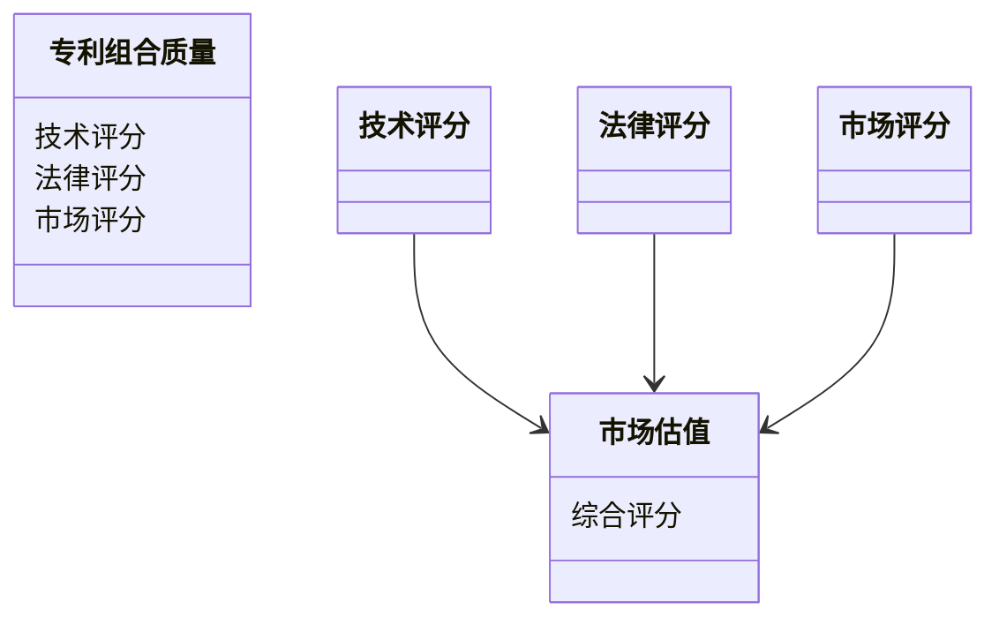
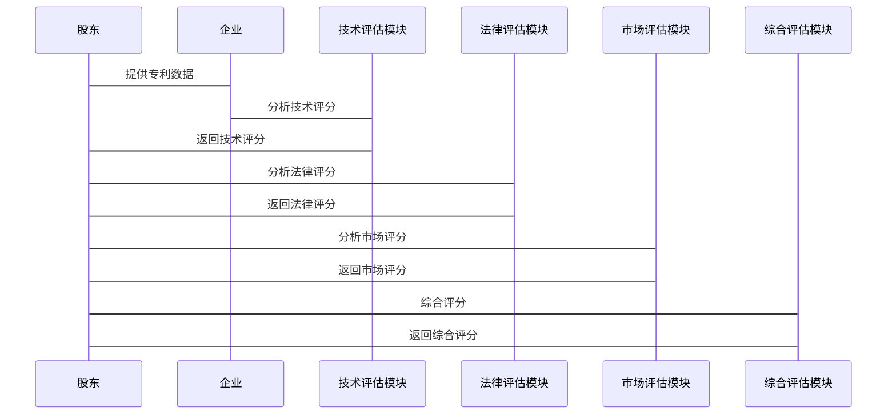

                 


# 彼得林奇对公司专利组合质量与市场估值关系的研究

> 关键词：专利组合质量、市场估值、彼得·林奇、知识产权、企业价值评估

> 摘要：本文探讨了彼得·林奇在分析公司专利组合质量与市场估值关系方面的研究。通过定义核心概念、构建评估模型、分析影响机制，并结合实际案例，详细阐述了专利组合质量如何影响市场估值。文章还提供了系统架构设计和项目实战，帮助读者深入理解这一关系，并为实际应用提供指导。

---

## 第一部分: 引言

### 1.1 研究背景与意义

#### 1.1.1 专利组合质量的重要性
在现代商业竞争中，专利不仅是技术保护的工具，更是企业市场价值的重要组成部分。一家公司拥有的专利数量和质量直接影响其市场地位和竞争对手的威胁。彼得·林奇在其投资分析中，将专利视为评估企业价值的关键因素之一。

#### 1.1.2 市场估值的核心要素
市场估值是投资者评估公司价值的重要指标，通常包括财务指标、市场地位、技术创新能力等多个维度。其中，专利组合的质量直接影响企业的技术壁垒和市场竞争优势，进而影响市场估值。

#### 1.1.3 专利组合与市场估值的关系
专利组合质量与市场估值之间存在密切关系。高质量的专利组合可以提升企业的市场地位，增强投资者信心，从而提高市场估值。反之，专利质量差或数量不足的公司，其市场估值可能受到限制。

### 1.2 研究目标与方法

#### 1.2.1 研究目标的设定
本文旨在通过分析彼得·林奇的理论，构建专利组合质量评估模型，并研究其对市场估值的影响机制。

#### 1.2.2 研究方法的选择
采用理论分析与实证研究相结合的方法，利用数学模型和实际案例分析，验证专利组合质量对市场估值的影响。

#### 1.2.3 数据来源与分析框架
数据来源包括公开的专利数据库和公司财务数据。分析框架基于彼得·林奇的理论，结合专利评估和市场估值模型。

### 1.3 本书结构概述

#### 1.3.1 各章节内容简要说明
- 第一部分：引言，介绍研究背景和意义。
- 第二部分：核心概念与理论基础，定义专利组合质量与市场估值。
- 第三部分：专利组合质量的评估模型，构建评估框架。
- 第四部分：市场估值与专利组合质量的关系分析，探讨影响机制。
- 第五部分：系统分析与架构设计，展示系统架构。
- 第六部分：项目实战，提供代码实现和案例分析。
- 第七部分：结论与展望，总结研究发现。

#### 1.3.2 核心概念与逻辑框架
核心概念包括专利组合质量、市场估值、专利评估模型。逻辑框架从理论到实践，层层递进，最终形成完整的分析体系。

#### 1.3.3 阅读本书的建议
建议读者从引言开始，逐步理解核心概念，再深入分析模型和案例，最后结合实际进行项目实战。

---

## 第二部分: 核心概念与理论基础

### 2.1 专利组合质量的定义与评估

#### 2.1.1 专利组合的基本概念
专利组合是指一组相互关联的专利，共同保护企业的技术创新。高质量的专利组合具有技术覆盖面广、法律稳定性高、市场应用性强等特点。

#### 2.1.2 专利组合质量的评估维度
- 技术相关性：专利是否围绕核心技术创新。
- 法律稳定性：专利的法律保护力度。
- 市场应用性：专利在市场中的实际应用价值。

#### 2.1.3 彼得·林奇的专利组合评估方法
彼得·林奇提出，专利组合质量应从技术、法律和市场三个维度进行评估，强调专利的商业价值。

### 2.2 市场估值的理论基础

#### 2.2.1 市场估值的核心要素
- 财务指标：收入、利润、资产等。
- 市场地位：市场份额、品牌影响力。
- 技术创新：专利数量与质量。

#### 2.2.2 专利价值对市场估值的影响
专利价值是市场估值的重要组成部分，高质量的专利组合可以显著提升企业估值。

#### 2.2.3 市场估值的计算模型
市场估值 = 财务价值 + 技术价值 + 市场地位价值。

### 2.3 专利组合质量与市场估值的关系

#### 2.3.1 专利组合质量对市场估值的影响路径
- 技术壁垒：降低竞争对手威胁，提升企业市场地位。
- 投资者信心：高质量专利组合增强投资者信心，提升估值。
- 市场应用：专利的实际应用价值直接影响企业收益。

#### 2.3.2 专利组合质量与市场估值的量化关系
通过数学模型，将专利评分与市场估值进行量化分析，验证两者的关系。

#### 2.3.3 彼得·林奇的理论贡献
彼得·林奇通过实证研究，证明了专利组合质量对市场估值的重要影响，为投资者提供了新的评估维度。

---

## 第三部分: 专利组合质量的评估模型

### 3.1 专利组合质量评估的理论框架

#### 3.1.1 专利组合质量的多维度评估
从技术、法律、市场三个维度进行综合评估。

#### 3.1.2 专利组合质量的权重分配
根据行业特点，为各维度分配不同权重。

#### 3.1.3 专利组合质量的综合评分模型
综合评分 = 技术评分 × 权重 + 法律评分 × 权重 + 市场评分 × 权重。

### 3.2 专利组合质量评估的数学模型

#### 3.2.1 专利组合质量的评分公式
$$ \text{专利评分} = \frac{\text{技术评分} + \text{法律评分} + \text{市场评分}}{3} $$

#### 3.2.2 专利组合质量的权重计算
$$ \text{权重} = \frac{\text{维度重要性}}{\sum \text{维度重要性}} $$

#### 3.2.3 综合评分模型的数学表达
$$ \text{综合评分} = \sum (\text{评分} \times \text{权重}) $$

### 3.3 专利组合质量评估的实践应用

#### 3.3.1 专利组合质量评估的步骤
1. 确定评估维度。
2. 收集专利数据。
3. 计算各维度评分。
4. 综合计算总评分。

#### 3.3.2 专利组合质量评估的工具与方法
- 专利分析工具：PatentScope、LexisNexis。
- 数据分析方法：因子分析、回归分析。

#### 3.3.3 实际案例分析与解读
以某公司为例，分析其专利组合质量评分，评估其市场估值影响。

---

## 第四部分: 市场估值与专利组合质量的关系分析

### 4.1 市场估值的影响因素

#### 4.1.1 财务指标对市场估值的影响
收入、利润等财务指标直接影响市场估值。

#### 4.1.2 专利组合质量对市场估值的影响
高质量专利组合提升市场估值。

#### 4.1.3 其他因素对市场估值的影响
包括行业竞争、宏观经济环境等。

### 4.2 专利组合质量对市场估值的影响机制

#### 4.2.1 专利组合质量与企业竞争力的关系
高质量专利组合增强企业竞争力，提升市场地位。

#### 4.2.2 专利组合质量与企业市场地位的关系
专利组合质量高的企业更容易获得高估值。

#### 4.2.3 专利组合质量与企业估值倍数的关系
高质量专利组合提高企业的市盈率和市净率。

### 4.3 专利组合质量与市场估值的实证分析

#### 4.3.1 实证数据来源
选取多家公司，收集其专利数据和市场估值数据。

#### 4.3.2 实证分析方法
采用回归分析，验证专利评分与市场估值的相关性。

#### 4.3.3 实证结果与解读
结果表明，专利评分与市场估值显著正相关。

---

## 第五部分: 系统分析与架构设计

### 5.1 系统功能设计

#### 5.1.1 领域模型


#### 5.1.2 系统架构设计


#### 5.1.3 系统交互设计


---

## 第六部分: 项目实战

### 6.1 环境安装

```bash
pip install numpy pandas matplotlib
```

### 6.2 系统核心实现源代码

#### 6.2.1 专利评分计算
```python
def calculate_patent_score(tech_score, legal_score, market_score):
    return (tech_score + legal_score + market_score) / 3
```

#### 6.2.2 市场估值计算
```python
def calculate_market_valuation(patent_score, financial_data):
    return financial_data * (1 + patent_score)
```

#### 6.2.3 实际案例分析
```python
# 假设数据
tech_score = 85
legal_score = 75
market_score = 90
financial_data = 1000000

# 计算专利评分
patent_score = calculate_patent_score(tech_score, legal_score, market_score)
# 计算市场估值
market_valuation = calculate_market_valuation(patent_score, financial_data)
print(f"专利评分: {patent_score}")
print(f"市场估值: {market_valuation}")
```

---

## 第七部分: 结论与展望

### 7.1 研究结论
本文通过理论分析和实证研究，验证了专利组合质量对市场估值的重要影响。彼得·林奇的理论为投资者提供了新的评估维度。

### 7.2 未来研究方向
未来可以进一步研究专利组合质量的动态变化及其对市场估值的长期影响。

### 7.3 致谢
感谢所有参与研究的人员和提供数据的机构。

---

## 附录

### 附录A: 数据来源与处理方法
详细说明数据来源和处理步骤。

### 附录B: 工具与软件
列出使用的工具和软件，如专利数据库、数据分析工具等。

### 附录C: 参考文献
列出所有引用的文献和资料。

---

## 作者

作者：AI天才研究院/AI Genius Institute & 禅与计算机程序设计艺术/Zen And The Art of Computer Programming

---

通过以上结构和内容，您可以逐步完成整篇文章的撰写。每个部分都需要详细展开，结合实际案例和数学模型，深入分析专利组合质量与市场估值之间的关系。希望对您有所帮助！

