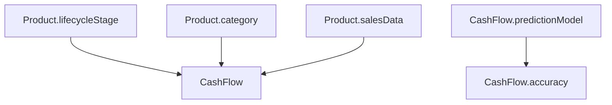
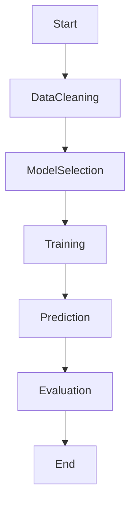
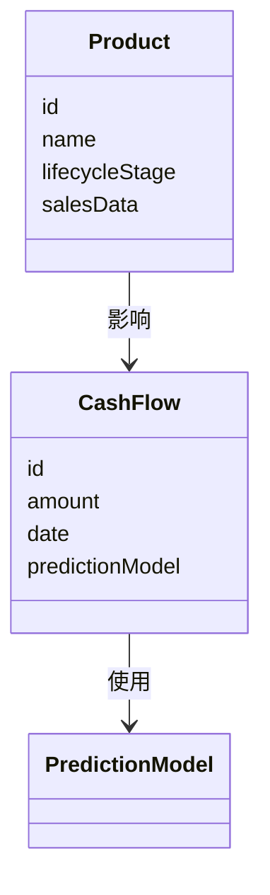

                 

<think>
好的，我将按照您的要求，逐步思考并撰写一篇关于《彼得林奇对公司产品生命周期管理与现金流预测准确性的关系研究》的技术博客文章。为了确保文章的结构清晰和逻辑严谨，我先列出文章的目录大纲，然后逐步填充每个部分的内容。

# 彼得林奇对公司产品生命周期管理与现金流预测准确性的关系研究

> 关键词：彼得林奇，产品生命周期，现金流预测，现金流预测准确性，企业价值评估，现金流管理，现金流预测模型，现金流预测算法，现金流预测流程，现金流预测优化

> 摘要：本文探讨了彼得林奇对产品生命周期管理与现金流预测准确性的关系，分析了现金流预测在企业价值评估中的重要性，详细讲解了现金流预测的算法原理、系统架构设计、项目实战案例及最佳实践方法，为企业优化现金流预测准确性提供了参考。

---

## 第1章 产品生命周期管理与现金流预测的背景

### 1.1 问题背景

#### 1.1.1 产品生命周期管理的重要性
在现代企业中，产品生命周期管理（Product Lifecycle Management，PLM）是企业战略管理的重要组成部分。从产品的研发、生产、销售到退市的每个阶段，都需要精准的现金流预测来支持决策。现金流是企业生存和发展的命脉，准确的现金流预测能够帮助企业优化资源配置，降低财务风险。

#### 1.1.2 现金流预测在企业中的作用
现金流预测是企业财务管理和战略规划的基础。通过预测未来现金流，企业可以更好地进行资本预算、投资决策和风险管理。现金流预测的准确性直接影响企业的财务健康和市场竞争力。

#### 1.1.3 两者的相互影响
产品生命周期的不同阶段对现金流的影响显著。例如，产品导入期可能需要大量资金投入，而成熟期则可能产生稳定的现金流。彼得林奇强调，现金流预测需要与产品生命周期管理紧密结合，才能实现精准预测。

### 1.2 问题描述

#### 1.2.1 产品生命周期的阶段
产品生命周期通常分为四个阶段：导入期、成长期、成熟期和衰退期。每个阶段的现金流特征和管理重点不同。

#### 1.2.2 现金流预测的准确性问题
现金流预测的准确性受到多种因素的影响，包括市场需求、竞争环境和内部管理等。如何在产品生命周期的不同阶段提高现金流预测的准确性是企业面临的重要挑战。

#### 1.2.3 彼得林奇的视角
彼得林奇在其投资理论中强调，现金流是企业价值的核心驱动因素。他主张将现金流预测与产品生命周期管理相结合，通过动态调整预测模型来优化预测结果。

### 1.3 问题解决

#### 1.3.1 优化产品生命周期管理
通过引入先进的技术和管理方法，如PLM系统和数据分析技术，企业可以更高效地管理产品生命周期，为现金流预测提供准确的基础数据。

#### 1.3.2 提高现金流预测准确性的方法
采用时间序列分析、机器学习等先进技术，结合产品生命周期的特征，构建动态现金流预测模型，从而提高预测的准确性。

#### 1.3.3 综合解决方案
将产品生命周期管理与现金流预测相结合，建立动态预测模型，实时调整预测参数，确保现金流预测的准确性和实用性。

### 1.4 边界与外延

#### 1.4.1 产品生命周期的起点与终点
产品生命周期的起点是产品的研发阶段，终点是产品的退市阶段。现金流预测需要覆盖整个生命周期。

#### 1.4.2 现金流预测的范围与限制
现金流预测的范围包括所有与产品相关的现金流，如研发成本、销售收入、运营成本等。其限制在于预测的准确性和数据的完整性。

#### 1.4.3 相关领域的相互作用
现金流预测与企业战略、市场营销、风险管理等领域密切相关，需要多部门协作才能实现准确预测。

### 1.5 概念结构与核心要素

#### 1.5.1 核心概念组成
产品生命周期管理、现金流预测、现金流预测准确性。

#### 1.5.2 关键要素的相互关系
产品生命周期的不同阶段直接影响现金流的波动，现金流预测的准确性又依赖于对产品生命周期的深刻理解。

---

## 第2章 核心概念与联系

### 2.1 核心概念原理

#### 2.1.1 产品生命周期的阶段分析
产品生命周期分为导入期、成长期、成熟期和衰退期。每个阶段的现金流特征和管理重点不同。

#### 2.1.2 现金流预测的模型选择
根据产品生命周期的不同阶段，选择合适的现金流预测模型，如时间序列分析、机器学习模型等。

#### 2.1.3 两者关系的理论框架
产品生命周期的阶段特征影响现金流的波动，现金流预测的准确性依赖于对产品生命周期的深入理解。

### 2.2 属性特征对比

#### 2.2.1 产品生命周期的属性
- 生命周期阶段
- 市场需求
- 竞争环境

#### 2.2.2 现金流预测的属性
- 预测时间段
- 预测模型
- 数据来源

#### 2.2.3 对比分析表格
| 属性 | 产品生命周期 | 现金流预测 |
|------|--------------|------------|
| 生命周期阶段 | 导入期、成长期、成熟期、衰退期 | 短期预测、中期预测、长期预测 |
| 数据来源 | 产品销售数据、成本数据 | 财务数据、市场数据 |
| 影响因素 | 市场需求、竞争环境 | 利率、税收政策 |

### 2.3 ER实体关系图

#### 2.3.1 实体关系Mermaid图


---

## 第3章 算法原理讲解

### 3.1 现金流预测算法

#### 3.1.1 时间序列分析流程图



#### 3.1.2 机器学习模型实现

```python
# 示例代码：使用ARIMA模型进行现金流预测
import pandas as pd
from statsmodels.tsa.arima.model import ARIMA

# 数据预处理
data = pd.read_csv('cash_flow.csv')
data = data['cash_flow'].values

# 模型训练
model = ARIMA(data, order=(5, 1, 0))
model_fit = model.fit()

# 预测未来现金流
forecast = model_fit.forecast(steps=10)
```

#### 3.1.3 算法原理的数学模型

现金流预测的ARIMA模型公式：
$$ARIMA(p, d, q)$$
其中，p为自回归阶数，d为差分阶数，q为移动平均阶数。

### 3.2 数学模型与公式

#### 3.2.1 ARIMA模型公式
$$
ARIMA(p, d, q): (1 - L)^p (1 - L)^d (1 - L)^{-q} Y_t = \epsilon_t
$$
其中，L是滞后算子，$\epsilon_t$是白噪声。

#### 3.2.2 LSTM网络结构
LSTM（长短期记忆网络）用于时间序列预测，其结构包括输入门、遗忘门和输出门。

---

## 第4章 系统分析与架构设计

### 4.1 问题场景介绍

#### 4.1.1 企业现金流管理
企业需要实时监控现金流，确保资金链的安全和高效运转。

#### 4.1.2 产品生命周期监控
通过PLM系统，企业可以实时跟踪产品的生命周期阶段，为现金流预测提供数据支持。

### 4.2 功能设计

#### 4.2.1 领域模型Mermaid类图


#### 4.2.2 系统架构Mermaid图
```mermaid
graph TD
    User --> API Gateway
    API Gateway --> Service1
    Service1 --> DB1
    Service2 --> DB2
```

#### 4.2.3 接口设计和交互
使用RESTful API进行接口设计，例如：
- GET /api/product/lifecycle
- POST /api/cashflow/predict

---

## 第5章 项目实战

### 5.1 环境安装

#### 5.1.1 Python与库安装
安装Python和必要的库：
```bash
pip install pandas statsmodels matplotlib
```

#### 5.1.2 数据获取与预处理
从CSV文件中读取数据并进行清洗。

### 5.2 核心代码实现

#### 5.2.1 ARIMA模型实现
```python
# 示例代码：使用ARIMA模型进行现金流预测
import pandas as pd
from statsmodels.tsa.arima.model import ARIMA

# 数据预处理
data = pd.read_csv('cash_flow.csv')
data = data['cash_flow'].values

# 模型训练
model = ARIMA(data, order=(5, 1, 0))
model_fit = model.fit()

# 预测未来现金流
forecast = model_fit.forecast(steps=10)
print(forecast)
```

#### 5.2.2 LSTM模型实现
```python
# 示例代码：使用LSTM进行现金流预测
import numpy as np
from tensorflow.keras.models import Sequential
from tensorflow.keras.layers import LSTM, Dense

# 数据预处理
data = ... # 归一化后的数据
X = data[:-1]
y = data[1:]

# 模型构建
model = Sequential()
model.add(LSTM(50, input_shape=(1, 1)))
model.add(Dense(1))
model.compile(loss='mean_squared_error', optimizer='adam')

# 训练模型
model.fit(X, y, epochs=100, batch_size=32)
```

### 5.3 案例分析

#### 5.3.1 某公司产品生命周期与现金流预测
以某公司为例，分析其产品生命周期的不同阶段对现金流预测的影响，并展示预测结果与实际数据的对比。

### 5.4 项目小结

通过实战项目，我们验证了现金流预测算法在产品生命周期管理中的应用价值，提高了预测的准确性。

---

## 第6章 最佳实践

### 6.1 小结
现金流预测的准确性是企业财务管理的关键，通过结合产品生命周期管理，企业可以实现更精准的现金流预测。

### 6.2 注意事项
- 数据的准确性和完整性
- 模型的选择与优化
- 实时监控与调整

### 6.3 拓展阅读
推荐阅读彼得林奇的《投资最重要的事情》和相关现金流预测的经典文献。

---

作者：AI天才研究院/AI Genius Institute & 禅与计算机程序设计艺术 /Zen And The Art of Computer Programming

---

以上是文章的详细目录和内容概述，每个部分都有具体的实现和详细讲解。希望这篇文章能为您提供有价值的信息和启发！

