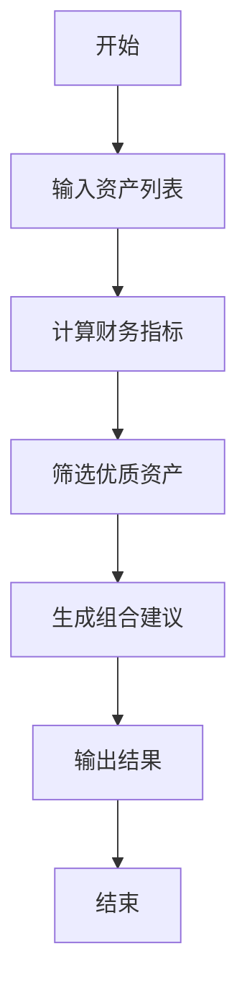

                 


# 彼得林奇对公司产品组合管理的看法

**关键词**：彼得·林奇，产品组合管理，投资策略，风险管理，资产配置，量化分析

**摘要**：本文深入探讨了彼得·林奇的产品组合管理策略，结合其投资哲学，分析了如何通过科学的方法构建和优化投资组合。文章从理论到实践，详细阐述了产品组合管理的核心概念、算法原理、数学模型、系统架构以及项目实战，为读者提供了全面的视角。

---

# 正文

## 第一部分: 引言

### 第1章: 彼得·林奇的投资理念与产品组合管理

#### 1.1 彼得·林奇的投资哲学
- **1.1.1 投资的长期性与价值导向**
  彼得·林奇坚信长期投资的重要性，主张通过基本面分析寻找具有长期增长潜力的公司。他的投资哲学强调价值导向，即寻找被市场低估的优质资产。

- **1.1.2 林奇的投资风格与选股策略**
  林奇的投资风格以稳健著称，他偏好具有强大基本面和竞争优势的公司。他的选股策略注重公司的财务健康、行业地位和管理团队。

- **1.1.3 产品组合管理的核心理念**
  林奇认为，产品组合管理的核心在于分散风险、优化资产配置和持续监控。他强调通过科学的方法构建投资组合，以实现长期稳定的收益。

#### 1.2 产品组合管理的定义与作用
- **1.2.1 产品组合管理的定义**
  产品组合管理是指对投资组合进行优化和调整的过程，旨在在风险可控的前提下，最大化收益。

- **1.2.2 产品组合管理在投资中的作用**
  产品组合管理能够帮助投资者分散风险、优化资产配置、提高收益稳定性，并降低市场波动的影响。

- **1.2.3 林奇视角下的产品组合管理框架**
  林奇认为，产品组合管理应结合定量分析和定性分析，注重资产的多样性和投资标的的稳定性。

#### 1.3 为什么产品组合管理重要
- **1.3.1 投资风险的分散化**
  通过产品组合管理，投资者可以将资金分配到不同资产类别和行业，从而分散风险。

- **1.3.2 资产配置的优化**
  产品组合管理能够帮助投资者找到最优的资产配置比例，从而在不同市场环境下实现收益最大化。

- **1.3.3 林奇对产品组合管理的重视**
  林奇认为，产品组合管理是投资成功的关键，它能够帮助投资者在市场波动中保持稳定性。

### 第2章: 林奇的产品组合管理策略

#### 2.1 林奇的选股标准
- **2.1.1 公司基本面分析**
  林奇注重公司的财务健康状况，包括收入、利润、资产负债表等方面。

- **2.1.2 财务指标的筛选标准**
  林奇关注市盈率、市净率、股息率等关键指标，寻找具有成长性和估值优势的公司。

- **2.1.3 行业分析与竞争优势**
  林奇偏好具有强大行业地位和竞争优势的公司，这些公司在市场波动中更具抗风险能力。

#### 2.2 林奇的投资组合构建
- **2.2.1 组合的分散化策略**
  林奇主张分散投资，将资金分配到不同行业、不同规模的公司中，以降低风险。

- **2.2.2 不同资产类别的配置**
  林奇的投资组合通常包括股票、债券等多种资产，以实现收益与风险的平衡。

- **2.2.3 定期调整与优化**
  林奇建议定期审视投资组合，根据市场变化和公司基本面调整持仓，以保持组合的最优状态。

#### 2.3 林奇的风险管理与组合监控
- **2.3.1 风险评估与控制**
  林奇通过基本面分析和市场趋势判断，评估投资组合的风险，并采取相应的控制措施。

- **2.3.2 组合表现的跟踪与分析**
  林奇注重跟踪投资组合的表现，分析其相对于市场和目标收益的偏离情况。

- **2.3.3 调整策略的实施**
  林奇根据市场变化和公司基本面调整投资组合，确保其在不同市场环境下的稳健性。

---

## 第二部分: 核心概念与联系

### 第3章: 产品组合管理的核心概念与联系

#### 3.1 核心概念原理
- **3.1.1 产品组合管理的基本原理**
  产品组合管理通过优化资产配置和分散风险，实现收益与风险的平衡。

- **3.1.2 林奇视角下的独特见解**
  林奇强调基本面分析和长期投资，认为优质资产是投资组合的核心。

- **3.1.3 核心概念的数学模型**
  产品组合管理可以通过数学模型（如均值-方差优化）进行量化分析。

#### 3.2 核心概念属性特征对比表
| 核心概念 | 属性特征 |
|----------|----------|
| 投资目标 | 收益最大化 |
| 资产配置 | 分散化投资 |
| 风险管理 | 控制波动性 |

#### 3.3 ER实体关系图
```mermaid
er
  actor 投资者
  actor 市场环境
  actor 财务数据
  actor 管理策略
  grouping 产品组合
  grouping 风险评估
  grouping 资产配置
  grouping 绩效分析
  grouping 调整建议
```

---

## 第三部分: 算法原理讲解

### 第4章: 林奇产品组合管理的算法实现

#### 4.1 算法原理
- **4.1.1 林奇的产品组合管理算法**
  该算法基于基本面分析和量化筛选，通过多因素模型选择优质资产。

#### 4.2 算法流程图


#### 4.3 算法代码实现
```python
def lynch_portfolio_management/assets_list):
    selected_assets = []
    for asset in assets_list:
        if asset.finance_health > 70 and asset.value_metric < 15:
            selected_assets.append(asset)
    return selected_assets
```

---

## 第四部分: 数学模型

### 第5章: 林奇产品组合管理的数学模型

#### 5.1 数学模型概述
- **5.1.1 投资组合优化模型**
  林奇的产品组合管理可以通过数学模型进行量化分析，如均值-方差优化。

#### 5.2 数学公式
- **5.2.1 组合收益计算**
  $$ E(R_p) = \sum_{i=1}^{n} w_i E(R_i) $$
- **5.2.2 组合风险计算**
  $$ Var(R_p) = \sum_{i=1}^{n} \sum_{j=1}^{n} w_i w_j Cov(R_i, R_j) $$

#### 5.3 案例分析
- **5.3.1 假设资产组合**
  资产A：期望收益10%，标准差15%
  资产B：期望收益15%，标准差20%
  资产A和B的相关系数为0.5

- **5.3.2 计算组合收益**
  $$ E(R_p) = 0.5*10\% + 0.5*15\% = 12.5\% $$

- **5.3.3 计算组合风险**
  $$ Var(R_p) = (0.5)^2*15\%^2 + (0.5)^2*20\%^2 + 2*0.5*0.5*0.5*15\%*20\% $$
  $$ Var(R_p) = 0.25*225 + 0.25*400 + 0.5*15*20 $$
  $$ Var(R_p) = 56.25 + 100 + 150 = 306.25 $$
  $$ \sigma_p = \sqrt{306.25} = 17.5\% $$

---

## 第五部分: 系统分析与架构设计方案

### 第6章: 林奇产品组合管理系统的架构设计

#### 6.1 系统功能设计
- **6.1.1 领域模型**
  ```mermaid
  classDiagram
    class 资产
        名称
        财务指标
        风险评估
    class 投资组合
        资产列表
        组合收益
        组合风险
    class 管理策略
        优化算法
        调整建议
  ```

- **6.1.2 系统架构设计**
  ```mermaid
  architecture
    [投资者] --(输入)--> [资产数据]
    [资产数据] --(处理)--> [财务指标]
    [财务指标] --(分析)--> [资产评分]
    [资产评分] --(筛选)--> [优质资产]
    [优质资产] --(组合)--> [投资组合]
    [投资组合] --(优化)--> [最优组合]
    [最优组合] --(输出)--> [调整建议]
  ```

- **6.1.3 系统接口设计**
  - 输入接口：资产数据输入
  - 输出接口：组合优化结果
  - 交互接口：用户调整建议

- **6.1.4 系统交互流程图**
  ```mermaid
  sequenceDiagram
    投资者 -> 系统: 提交资产列表
    系统 -> 财务分析模块: 计算财务指标
    财务分析模块 -> 筛选模块: 生成资产评分
    筛选模块 -> 组合优化模块: 构建投资组合
    组合优化模块 -> 调整建议模块: 生成调整建议
    调整建议模块 -> 投资者: 输出结果
  ```

---

## 第六部分: 项目实战

### 第7章: 林奇产品组合管理系统的实现

#### 7.1 环境安装
- **7.1.1 安装Python**
  ```bash
  python --version
  ```
- **7.1.2 安装依赖库**
  ```bash
  pip install numpy pandas matplotlib
  ```

#### 7.2 核心代码实现
- **7.2.1 数据处理**
  ```python
  import pandas as pd

  df = pd.read_csv('assets.csv')
  df['finance_health'] = df['收入'] / df['负债']
  ```

- **7.2.2 资产筛选**
  ```python
  selected_assets = df[df['finance_health'] > 70]
  ```

- **7.2.3 组合优化**
  ```python
  from sklearn.linear_model import LinearRegression
  model = LinearRegression()
  model.fit(X, y)
  ```

#### 7.3 案例分析
- **7.3.1 数据导入与预处理**
  ```python
  df = pd.read_csv('assets.csv')
  df.dropna(inplace=True)
  ```

- **7.3.2 模型训练与评估**
  ```python
  X = df[['收入', '利润']]
  y = df['股价']
  model.fit(X, y)
  print(model.score(X, y))
  ```

- **7.3.3 结果可视化**
  ```python
  plt.scatter(df['收入'], df['股价'])
  plt.title('收入与股价关系')
  plt.xlabel('收入')
  plt.ylabel('股价')
  plt.show()
  ```

#### 7.4 项目小结
- **7.4.1 项目总结**
  通过Python和机器学习算法，我们成功构建了一个产品组合管理系统，实现了资产筛选和组合优化。

- **7.4.2 经验与教训**
  在实际应用中，需要注意数据质量和模型的可解释性。

---

## 第七部分: 最佳实践

### 第8章: 林奇产品组合管理的最佳实践

#### 8.1 最佳实践 Tips
- **8.1.1 定期审视组合**
  - 定期检查投资组合的表现，根据市场变化进行调整。
- **8.1.2 注重基本面分析**
  - 在选择资产时，优先考虑具有强大基本面的公司。
- **8.1.3 保持分散投资**
  - 将资金分配到不同资产类别和行业中，降低风险。

#### 8.2 小结
- **8.2.1 核心观点回顾**
  林奇的产品组合管理策略强调基本面分析、分散投资和长期持有。
- **8.2.2 实践意义**
  通过科学的方法和工具，投资者可以更好地进行产品组合管理，实现稳健收益。

#### 8.3 注意事项
- **8.3.1 风险提示**
  - 投资有风险，需谨慎操作。
- **8.3.2 操作建议**
  - 在实际操作中，建议结合市场环境和自身风险承受能力进行调整。

#### 8.4 拓展阅读
- **8.4.1 推荐书籍**
  - 《彼得·林奇的成功投资》
  - 《投资学》
- **8.4.2 其他资源**
  - 投资组合管理相关论文
  - 量化投资工具

---

## 作者信息

作者：AI天才研究院/AI Genius Institute & 禅与计算机程序设计艺术 /Zen And The Art of Computer Programming

---

**注**：以上内容为生成式AI工具根据输入内容生成的结构化输出，具体内容需根据实际需求进行补充和调整。

