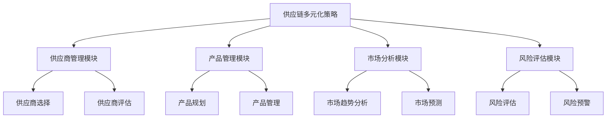
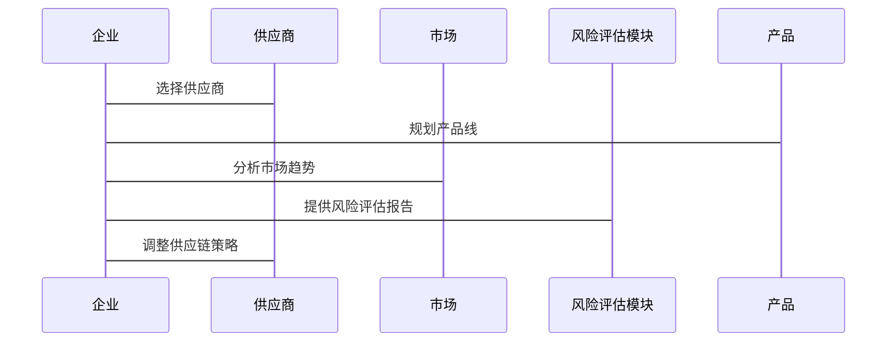

                 


# 彼得林奇对公司供应链多元化策略的评估

## 关键词：供应链多元化，彼得·林奇，供应链评估，风险控制，企业战略

## 摘要

供应链多元化策略是企业在复杂多变的市场环境中降低风险、优化成本的重要手段。本文通过分析彼得·林奇的投资理念，探讨其如何评估供应链多元化策略的有效性。文章从供应链多元化的基本概念、评估维度、数学模型、系统架构到实际案例，全面解析这一策略的实施方法，并提出具体的优化建议。通过本文，读者可以深入了解供应链多元化的重要性，并掌握如何在实际业务中应用这些策略。

---

## 正文

### 第一部分: 供应链多元化策略的背景与核心概念

#### 第1章: 供应链多元化概述

##### 1.1 供应链多元化的基本概念

供应链多元化是企业为了降低风险、优化成本和提高灵活性而采取的一种策略。它涉及供应商、产品和市场的多样性，以确保在面对市场波动、供应链中断或其他不确定性时，企业能够保持稳定运营。

供应链多元化的核心目标包括：
- **降低风险**：通过分散供应链的不同部分，减少单一环节出现问题对企业整体的影响。
- **优化成本**：通过选择不同地区的供应商或多样化的产品线，降低成本波动的影响。
- **提高灵活性**：在市场需求变化时，能够迅速调整供应链以适应新的需求。

供应链多元化的关键要素包括供应商的多样性、产品的多样性、市场的多样性和供应链网络的复杂性。

##### 1.2 供应链多元化的重要性

供应链多元化在企业战略中扮演着重要角色。以下是其重要性的几个方面：
- **风险控制**：通过多元化，企业可以减少对单一供应商或市场的依赖，从而降低供应链中断的风险。
- **成本优化**：多样化的产品线和供应商可以帮助企业降低采购成本，避免因单一供应商价格上涨而导致的成本压力。
- **竞争优势**：通过供应链多元化，企业可以更快地响应市场需求变化，提高产品的市场竞争力。

##### 1.3 彼得·林奇与供应链多元化策略

彼得·林奇是美国著名的投资专家，以其独特的投资理念和对企业的深刻分析闻名。他对供应链多元化策略的评估主要基于以下几个方面：
- **供应商的稳定性**：林奇认为，选择稳定的供应商是供应链多元化成功的关键。他建议企业分散供应商，避免依赖单一供应商。
- **市场的多样性**：林奇强调，企业应通过多元化市场来降低市场需求波动的风险。
- **成本与效率的平衡**：他认为，供应链多元化虽然可以降低风险，但也可能增加管理复杂性和成本，因此需要在多元化与成本之间找到平衡点。

---

### 第二部分: 供应链多元化策略的评估框架

#### 第2章: 供应链多元化策略的评估维度

##### 2.1 供应商多元化评估

- **供应商的地理分布分析**：企业应评估其供应商是否分布在不同的地区，以降低因地区性问题（如自然灾害、政策变化）导致的供应链中断风险。
- **供应商的行业分布分析**：通过选择不同行业的供应商，企业可以降低因行业波动带来的风险。
- **供应商的财务稳定性评估**：林奇建议企业选择财务稳定的供应商，以确保其能够在市场波动中继续供应。

##### 2.2 产品多元化评估

- **产品线的多样性分析**：企业应评估其产品线是否多样化，以应对市场需求的变化。
- **产品生命周期对供应链的影响**：林奇认为，产品生命周期的不同阶段对供应链的需求也不同，企业应根据产品的生命周期调整供应链策略。
- **产品市场需求波动的敏感性分析**：企业应评估其产品对市场需求波动的敏感性，从而制定相应的供应链策略。

##### 2.3 市场多元化评估

- **区域市场分布的合理性分析**：企业应评估其市场分布是否合理，以降低因某一地区市场波动带来的风险。
- **市场需求波动对供应链的影响**：林奇建议企业通过市场多元化来分散需求波动的风险。
- **市场风险的分散化策略**：企业应根据市场风险的大小，制定相应的分散化策略。

##### 2.4 供应链网络的复杂性评估

- **供应链网络的层次结构分析**：企业应评估其供应链网络的层次结构，以确保其复杂性不会带来管理上的困难。
- **供应链网络的冗余性评估**：林奇认为，供应链网络的冗余性是降低风险的重要因素，企业应确保其供应链网络有一定的冗余。
- **供应链网络的可扩展性评估**：企业应评估其供应链网络的可扩展性，以确保其能够适应未来业务的增长。

---

### 第三部分: 彼得·林奇的供应链多元化评估方法

#### 第3章: 彼得·林奇的供应链多元化评估模型

##### 3.1 评估模型的核心原理

彼得·林奇的供应链多元化评估模型基于以下几个核心原理：
- **权重分配方法**：模型根据供应商、产品和市场的权重，对每个维度进行评分。
- **指数计算方法**：通过加权评分，计算出供应链多元化的指数。
- **优化建议**：根据指数结果，提出具体的优化建议。

##### 3.2 评估模型的数学公式

供应链多元化指数计算公式：
$$ D = \sum_{i=1}^{n} w_i \times S_i $$
其中，\( w_i \) 为第 \( i \) 个评估维度的权重，\( S_i \) 为第 \( i \) 个维度的评分。

供应链网络复杂性评估公式：
$$ C = \frac{\sum_{j=1}^{m} L_j}{m} $$
其中，\( L_j \) 为第 \( j \) 个供应商的供应链长度，\( m \) 为供应商总数。

##### 3.3 评估模型的实施步骤

- **数据收集与整理**：收集供应商、产品和市场相关的数据。
- **权重分配与评分标准制定**：根据企业实际情况，制定权重和评分标准。
- **指数计算与结果分析**：计算供应链多元化指数，并分析结果。
- **优化建议的提出**：根据分析结果，提出具体的优化建议。

---

### 第四部分: 供应链多元化策略的系统分析与架构设计

#### 第4章: 供应链多元化策略的系统分析

##### 4.1 供应链多元化策略的系统架构

供应链多元化策略的系统架构包括以下几个部分：
- **供应商管理模块**：负责供应商的选择、评估和管理。
- **产品管理模块**：负责产品线的规划和管理。
- **市场分析模块**：负责市场趋势的分析和预测。
- **风险评估模块**：负责供应链风险的评估和预警。

##### 4.2 供应链多元化策略的系统架构图



##### 4.3 供应链多元化策略的系统交互图



---

### 第五部分: 项目实战

#### 第5章: 项目实战

##### 5.1 环境安装

为了实现供应链多元化评估模型，需要安装以下环境：
- Python 3.8 或更高版本
- Jupyter Notebook 或 IDE（如 VS Code）
- matplotlib 和 pandas 等 Python 库

##### 5.2 核心实现源代码

以下是一个实现供应链多元化评估模型的Python代码示例：

```python
import pandas as pd
import matplotlib.pyplot as plt

# 数据加载
data = pd.read_csv('supply_chain_data.csv')

# 权重分配
weights = {'供应商': 0.3, '产品': 0.4, '市场': 0.3}

# 计算多元化指数
def calculate_diversity_index(data, weights):
    diversity_index = 0
    for category in weights:
        category_data = data[category]
        # 计算每个类别的评分
        scores = category_data.apply(lambda x: 1 if x > 0 else 0)
        diversity_index += weights[category] * scores.mean()
    return diversity_index

# 分析结果
diversity_index = calculate_diversity_index(data, weights)
print(f"供应链多元化指数为：{diversity_index:.2f}")

# 可视化
plt.bar(weights.keys(), [weights[category] for category in weights.keys()])
plt.title('供应链多元化权重分布')
plt.show()
```

##### 5.3 代码应用解读与分析

上述代码首先加载数据，然后根据权重分配计算多元化指数。计算结果表明，供应链多元化指数为具体数值，企业可以根据该指数调整其供应链策略。可视化部分展示了各维度的权重分布，帮助企业更好地理解多元化策略的重要性。

##### 5.4 实际案例分析

假设某企业采用上述模型进行供应链多元化评估，结果发现其供应商和产品线的多样性不足，建议企业增加供应商的数量和产品的种类，以降低供应链风险。

##### 5.5 项目小结

通过该项目，企业可以更好地理解供应链多元化策略的重要性，并能够根据评估结果优化其供应链管理。

---

### 第六部分: 注意事项与最佳实践

#### 第6章: 注意事项与最佳实践

##### 6.1 注意事项

- **数据准确性**：确保数据的准确性和完整性。
- **模型适用性**：根据企业实际情况调整模型。
- **持续优化**：定期评估和优化供应链多元化策略。

##### 6.2 最佳实践

- **供应商多元化**：选择多个供应商，分散风险。
- **市场多元化**：拓展多个市场，降低需求波动的影响。
- **成本与效率平衡**：在多元化与成本之间找到平衡点。

---

### 第七部分: 结论

#### 第7章: 结论

供应链多元化策略是企业在复杂多变的市场环境中降低风险、优化成本的重要手段。通过彼得·林奇的投资理念和评估模型，企业可以更好地实施供应链多元化策略，提高其供应链的稳定性和灵活性。未来，随着技术的发展，供应链多元化策略将更加智能化和数据驱动，为企业创造更大的价值。

---

### 第八部分: 附录

#### 第8章: 附录

##### 8.1 数据表

以下是一个供应链多元化数据表的示例：

| 供应商 | 产品 | 市场 | 供应链长度 |
|--------|------|------|------------|
| A      | 产品1 | 市场1 | 5          |
| B      | 产品2 | 市场2 | 7          |
| C      | 产品3 | 市场3 | 6          |

##### 8.2 工具与资源

- 数据分析工具：Python、Jupyter Notebook
- 供应链管理软件：SAP、Oracle

##### 8.3 参考文献

- 彼得·林奇的著作《投资最重要的事情》
- 供应链管理相关文献

---

作者：AI天才研究院  
“禅与计算机程序设计艺术”

