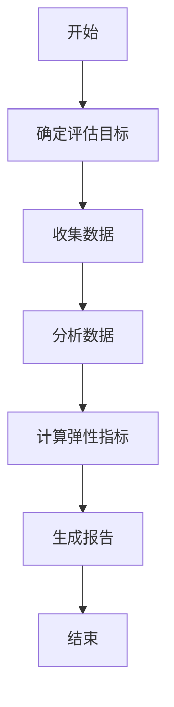
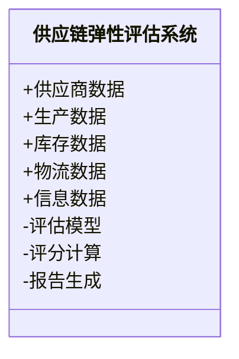
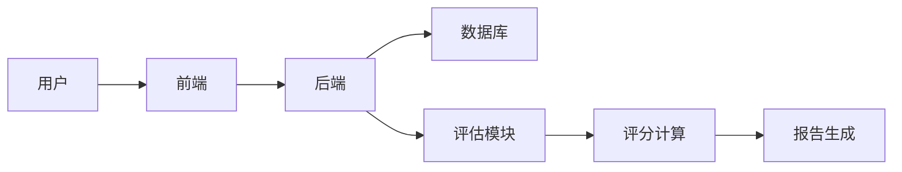

                 


# 彼得林奇对公司供应链弹性的评估

> 关键词：供应链弹性，彼得林奇，评估方法，风险管理，企业供应链

> 摘要：本文详细探讨了彼得林奇在供应链弹性评估方面的观点和方法。通过分析供应链弹性的核心概念、评估模型和实际应用，本文为企业的供应链管理提供了宝贵的见解和实践指导。

---

# 第一部分: 供应链弹性评估的背景与概念

## 第1章: 供应链弹性评估的背景介绍

### 1.1 供应链弹性的定义与重要性

#### 1.1.1 供应链弹性的基本概念
供应链弹性是指供应链在面对外部干扰、需求变化或内部问题时，能够灵活调整并维持稳定运营的能力。它涵盖了供应链的韧性、响应能力和恢复能力。

#### 1.1.2 供应链弹性的核心要素
供应链弹性涉及多个关键要素，包括：
- **多样性**：供应链的不同来源和供应商，以减少依赖单一来源的风险。
- **响应性**：快速适应市场变化和客户需求的能力。
- **冗余性**：在关键环节设置备用资源，以应对突发情况。
- **透明度**：对供应链各环节的实时监控和信息共享能力。

#### 1.1.3 供应链弹性对企业的战略意义
供应链弹性直接关系到企业的运营稳定性、成本控制和市场响应能力。在当今全球化和不确定性的商业环境中，拥有弹性供应链的企业能够更好地应对突发事件，保持竞争优势。

---

### 1.2 供应链弹性评估的必要性

#### 1.2.1 全球化背景下的供应链风险
全球化使得供应链更加复杂，同时也增加了风险。例如，全球疫情导致的供应链中断，暴露了许多企业在供应链管理上的脆弱性。

#### 1.2.2 企业供应链中断的潜在影响
供应链中断可能导致生产延迟、成本增加、客户满意度下降，甚至影响企业的声誉和长期发展。

#### 1.2.3 供应链弹性与企业竞争力的关系
具备弹性的供应链能够快速调整以适应市场变化，提高企业的灵活性和竞争力。相反，缺乏弹性的供应链可能导致企业在市场变化中措手不及，失去竞争优势。

---

## 第2章: 彼得林奇的供应链弹性评估方法

### 2.1 彼得林奇的供应链弹性评估框架

#### 2.1.1 供应链弹性评估的核心维度
彼得林奇提出的评估框架主要包括以下几个维度：
1. **供应商多样性**：评估供应商的数量、地域分布和行业分布。
2. **生产弹性**：评估生产过程的灵活性，包括生产能力和排产计划。
3. **库存管理**：评估库存的合理性和应急储备情况。
4. **物流网络**：评估物流渠道的多样性和可靠性。
5. **信息透明度**：评估供应链各环节的信息共享和实时监控能力。

#### 2.1.2 彼得林奇的评估模型
彼得林奇的评估模型是一个综合评分系统，通过加权评分法对供应链的弹性进行量化评估。

#### 2.1.3 评估模型的适用范围与边界
该模型适用于制造、零售和服务业等行业的企业供应链评估，特别适用于中大型企业。

---

### 2.2 供应链弹性评估的核心指标

#### 2.2.1 供应链弹性的关键绩效指标（KPI）
- **供应商交货准时率**：供应商按时交付的比例。
- **库存周转率**：库存的周转速度，反映库存管理效率。
- **物流成本占比**：物流成本占总成本的比例，反映物流效率。
- **供应链中断恢复时间**：在发生中断后，供应链恢复到正常运营所需的时间。

#### 2.2.2 不同供应链环节的弹性评估标准
- **供应商环节**：供应商的数量、地理位置分散程度、应急响应能力。
- **生产环节**：设备利用率、生产排期灵活性。
- **物流环节**：运输方式多样性、运输时间稳定性。

#### 2.2.3 供应链弹性评估的权重分配
根据企业战略和行业特点，各环节的权重可能不同。例如，对于制造企业，生产环节的权重可能更高；而对于零售企业，物流环节的权重可能更高。

---

# 第二部分: 供应链弹性评估的核心概念与联系

## 第3章: 供应链弹性评估的核心概念原理

### 3.1 供应链弹性的系统模型

#### 3.1.1 供应链系统的组成与功能
供应链系统由供应商、制造商、分销商、零售商和消费者组成，各环节协同工作以满足客户需求。

#### 3.1.2 供应链弹性的系统模型构建
通过构建系统模型，可以清晰地识别各环节的相互关系和潜在风险点。

#### 3.1.3 系统模型的动态特性分析
供应链的动态特性包括需求变化、市场波动和突发事件，这些因素会影响供应链的弹性。

---

### 3.2 供应链弹性评估的属性特征对比

#### 3.2.1 供应链弹性的属性特征表格
| 属性 | 弹性供应链 | 非弹性供应链 |
|------|------------|--------------|
| 供应商多样性 | 高 | 低 |
| 生产灵活性 | 高 | 低 |
| 库存管理 | 高 | 低 |
| 应急响应能力 | 高 | 低 |

#### 3.2.2 不同供应链弹性的特征对比分析
弹性供应链在供应商多样性、生产灵活性和应急响应能力等方面表现优于非弹性供应链。

---

### 3.3 供应链弹性评估的实体关系图


---

## 第4章: 供应链弹性评估的流程图



---

# 第三部分: 供应链弹性评估的算法与数学模型

## 第5章: 供应链弹性评估的算法原理

### 5.1 层次分析法（AHP）在供应链弹性评估中的应用

#### 5.1.1 层次分析法的基本原理
层次分析法是一种用于多准则决策分析的方法，通过构建层次结构模型，量化各准则的权重，进行综合评分。

#### 5.1.2 供应链弹性评估的层次结构模型
- **目标层**：供应链弹性评估。
- **准则层**：供应商多样性、生产弹性、库存管理、物流网络、信息透明度。
- **指标层**：具体的评估指标。

#### 5.1.3 供应链弹性评估的层次分析流程
1. 构建层次结构模型。
2. 确定各准则的权重。
3. 计算各指标的综合评分。
4. 根据评分结果进行排序和分析。

---

### 5.2 供应链弹性评估的数学模型

#### 5.2.1 供应链弹性综合评分公式
$$
\text{弹性综合评分} = \sum_{i=1}^{n} w_i \times s_i
$$
其中，\( w_i \) 是第 \( i \) 个准则的权重，\( s_i \) 是第 \( i \) 个准则的评分。

---

## 第6章: 供应链弹性评估的系统架构设计

### 6.1 系统功能设计

#### 6.1.1 系统功能模块
- **数据采集模块**：收集供应链各环节的数据。
- **评估模块**：根据评估模型计算弹性评分。
- **报告生成模块**：生成评估报告。

#### 6.1.2 系统功能的领域模型


---

### 6.2 系统架构设计

#### 6.2.1 系统架构图


---

## 第7章: 供应链弹性评估的项目实战

### 7.1 环境安装与配置

#### 7.1.1 安装Python和相关库
```bash
pip install numpy pandas scikit-learn
```

#### 7.1.2 安装Jupyter Notebook
```bash
pip install jupyter
```

---

### 7.2 核心代码实现

#### 7.2.1 数据预处理
```python
import pandas as pd
data = pd.read_csv('supply_chain_data.csv')
```

#### 7.2.2 应用层次分析法
```python
from sklearn.preprocessing import MinMaxScaler
scaler = MinMaxScaler()
scaled_data = scaler.fit_transform(data)
```

#### 7.2.3 计算综合评分
```python
weights = [0.3, 0.2, 0.2, 0.1, 0.2]  # 各准则权重
elasticity_scores = []
for i in range(len(scaled_data)):
    score = sum(weights[j] * scaled_data[i][j] for j in range(5))
    elasticity_scores.append(score)
```

---

### 7.3 案例分析与结果解读

#### 7.3.1 案例分析
以某制造企业为例，分析其供应链弹性评分。

#### 7.3.2 结果解读
根据评分结果，识别供应链中的薄弱环节，并提出改进建议。

---

# 第四部分: 供应链弹性评估的最佳实践与总结

## 第8章: 供应链弹性评估的最佳实践

### 8.1 小结
供应链弹性评估是企业供应链管理的重要组成部分，通过量化评估可以识别风险，优化供应链结构。

### 8.2 注意事项
- 数据收集的准确性和完整性。
- 评估模型的选择和参数调整。
- 结果解读和实际应用。

### 8.3 拓展阅读
推荐阅读相关书籍和文献，深入了解供应链弹性的理论与实践。

---

# 作者

作者：AI天才研究院/AI Genius Institute & 禅与计算机程序设计艺术 /Zen And The Art of Computer Programming

