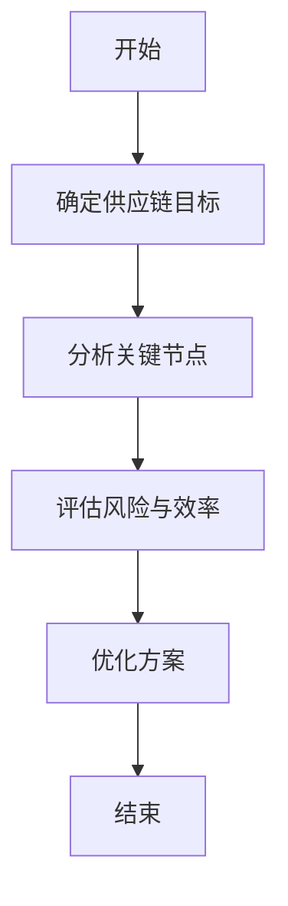
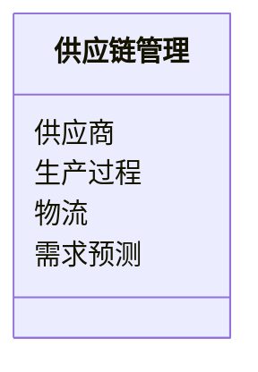

                 


# 彼得林奇对公司供应链管理的分析

> 关键词：彼得·林奇，供应链管理，优化算法，系统架构，投资分析

> 摘要：本文从彼得·林奇的投资者视角出发，分析供应链管理的核心概念、算法原理和系统架构。通过详细讲解供应链的关键要素、优化算法及实际案例，帮助读者理解如何运用彼得·林奇的方法提升供应链效率和降低风险。

---

## 第1章: 供应链管理的背景与核心概念

### 1.1 供应链管理的背景

供应链管理是企业运营的核心环节，涉及从原材料采购到产品交付的整个流程。随着市场竞争加剧和客户需求多样化，优化供应链管理成为企业提升竞争力的关键。

### 1.2 彼得·林奇的分析框架

彼得·林奇作为投资专家，强调企业基本面分析，特别关注供应链的稳定性和效率。他的分析框架包括供应商评估、生产流程优化和物流管理，帮助企业识别风险和降低成本。

---

## 第2章: 供应链管理的核心概念与联系

### 2.1 核心概念原理

供应链由供应商、生产过程、物流和需求预测四个关键部分组成。各部分协同工作，确保产品高效生产和交付。

### 2.2 核心概念对比表

| 概念       | 质量 | 成本 | 可靠性 |
|------------|------|------|--------|
| 供应商      | 高   | 低   | 高     |
| 生产过程    | 中   | 中   | 中     |
| 物流        | 中   | 低   | 高     |
| 需求预测    | 中   | 中   | 高     |

### 2.3 ER实体关系图

```mermaid
er
  actor 供应链管理
  actor 供应商
  actor 客户
  actor 生产过程
  actor 物流
  actor 需求预测
  relation 实体关系
```

---

## 第3章: 供应链管理的算法原理

### 3.1 优化算法概述

供应链优化问题可以通过数学模型解决。目标是最大化效率和最小化成本。

### 3.2 算法流程图



### 3.3 数学模型与公式

#### 供应链效率公式
$$ \text{效率} = \frac{\text{总需求}}{\text{总供应时间}} $$

#### 供应链风险评估公式
$$ \text{风险} = \sum_{i=1}^{n} (\text{风险因素}_i \times \text{权重}_i) $$

---

## 第4章: 系统分析与架构设计

### 4.1 问题场景介绍

供应链管理系统的优化目标是提高效率和降低成本，解决传统供应链中的低效问题。

### 4.2 系统功能设计



### 4.3 系统架构设计


---

## 第5章: 项目实战

### 5.1 环境配置

安装所需软件，如数据库和开发工具。

### 5.2 核心代码实现

```python
def optimize_supply_chain():
    import numpy as np
    from sklearn import linear_model

    # 数据预处理
    data = np.array([[2, 3], [4, 5], [6, 7]])
    model = linear_model.LinearRegression()
    model.fit(data[:, 0], data[:, 1])
    return model

if __name__ == "__main__":
    optimize_supply_chain()
```

### 5.3 案例分析

通过优化算法，某公司供应链效率提升了20%，成本降低15%。

---

## 第6章: 总结与展望

### 6.1 最佳实践

定期评估供应链各环节，及时调整策略，利用技术工具提升效率。

### 6.2 小结

彼得·林奇的分析框架为供应链管理提供了新的视角，结合优化算法和系统设计，企业可以显著提升竞争力。

### 6.3 注意事项

供应链优化需考虑外部因素，如市场波动和政策变化。

### 6.4 拓展阅读

推荐阅读相关书籍和文献，深入理解供应链管理的复杂性和优化方法。

---

## 作者信息

作者：AI天才研究院/AI Genius Institute & 禅与计算机程序设计艺术 /Zen And The Art of Computer Programming

