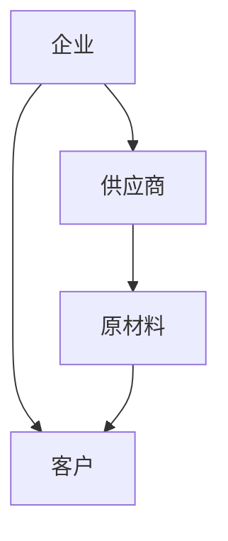
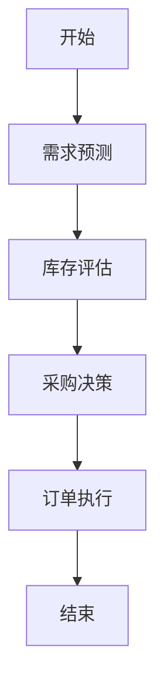
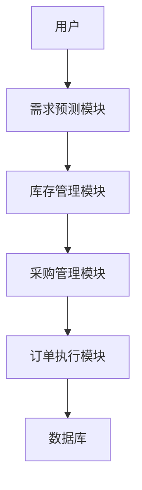

                 

# 彼得林奇对公司供应链管理的看法

## 关键词
- 供应链管理
- 彼得林奇
- 投资价值
- 优化算法
- 企业绩效

## 摘要
本文深入探讨了彼得林奇对公司供应链管理的看法，分析了供应链管理的核心概念、算法原理、系统架构设计，并结合实际案例进行详细讲解。通过彼得林奇的投资视角，本文揭示了优化供应链管理对企业投资价值的重要性，并提供了系统的实施方法和最佳实践。

---

# 第一部分: 供应链管理的背景与核心概念

## 第1章: 供应链管理的基本概念

### 1.1 供应链管理的定义与核心要素

#### 1.1.1 供应链管理的定义
供应链管理是指通过协调和优化企业内外资源，确保原材料、生产过程、物流和交付的高效运作，以满足客户需求并实现企业价值最大化的过程。

#### 1.1.2 供应链管理的核心要素
- 供应商管理：建立稳定的供应商关系，确保原材料的及时供应。
- 生产计划：合理安排生产计划，避免资源浪费。
- 库存管理：优化库存水平，降低持有成本。
- 物流管理：确保产品高效配送，减少运输成本。
- 客户服务：满足客户需求，提升客户满意度。

#### 1.1.3 供应链管理的目标与价值
供应链管理的目标是通过优化资源配置，降低运营成本，提高效率和客户满意度。其价值体现在提升企业竞争力、增强市场响应能力和优化投资回报。

---

### 1.2 彼得林奇的供应链管理观点

#### 1.2.1 彼得林奇的供应链管理背景
彼得林奇是著名的投资专家，他强调企业供应链管理对企业投资价值的影响。他认为，一个高效的供应链能够降低成本，提高利润率，从而增强企业的投资吸引力。

#### 1.2.2 彼得林奇对供应链管理的核心看法
- 供应链管理是企业运营的核心环节，直接影响企业的盈利能力和市场竞争力。
- 优化供应链管理能够降低库存成本，提高资金周转率，从而提升企业的投资价值。

#### 1.2.3 供应链管理对企业投资价值的影响
- 降低运营成本：通过优化供应链管理，企业可以减少原材料采购成本和物流成本。
- 提高效率：高效的供应链管理能够缩短生产周期，提高产品交付速度。
- 增强竞争力：优化的供应链管理能够提升企业的市场响应能力，增强竞争力。

---

## 第2章: 供应链管理的核心概念与联系

### 2.1 供应链管理的核心概念

#### 2.1.1 供应链管理的系统性
供应链管理是一个复杂的系统工程，涉及企业内外多个环节和资源的协同运作。

#### 2.1.2 供应链管理的复杂性
供应链管理需要考虑市场波动、供应商可靠性、物流成本等多种因素，具有高度的复杂性。

#### 2.1.3 供应链管理的动态性
供应链管理需要根据市场变化和企业战略进行动态调整，以适应不断变化的环境。

---

### 2.2 核心概念的属性特征对比

#### 2.2.1 供应链管理与传统采购的区别
- **供应链管理**：注重整体优化，从原材料到最终产品的全生命周期管理。
- **传统采购**：仅关注采购环节，缺乏系统性和协同性。

#### 2.2.2 供应链管理与物流管理的联系
供应链管理涵盖物流管理，但物流管理仅是供应链管理的一部分，供应链管理还包括生产、采购和库存管理。

#### 2.2.3 供应链管理与企业战略的关系
供应链管理是企业战略的重要组成部分，直接影响企业的成本、效率和竞争力。

---

### 2.3 ER实体关系图架构

---

## 第3章: 供应链管理的算法原理

### 3.1 供应链管理中的优化算法

#### 3.1.1 库存优化算法
库存优化算法旨在找到最优的库存水平，以最小化库存持有成本和订货成本。

##### 经典算法
- **EOQ模型**：经济订单量模型，用于确定最优订货量。
- **JIT模型**：准时制生产，通过精确的需求预测优化库存。

##### 算法步骤
1. 确定需求量（D）。
2. 确定订货成本（C_o）和持有成本（h）。
3. 计算EOQ：$$ EOQ = \sqrt{\frac{2 D C_o}{h}} $$
4. 计算最优订货次数（N）：$$ N = \frac{D}{EOQ} $$

---

#### 3.1.2 采购策略优化算法
采购策略优化算法通过分析供应商的交货时间、质量和服务能力，选择最优的供应商组合。

##### 经典算法
- **线性规划模型**：用于优化采购预算和供应商选择。
- **博弈论模型**：分析供应商之间的竞争，选择最优供应商组合。

##### 算法步骤
1. 确定供应商的交货时间、价格和质量。
2. 建立线性规划模型：$$ \text{最小化 } Z = \sum_{i=1}^{n} C_i x_i $$
   $$ \text{约束条件：} \sum_{i=1}^{n} x_i = D $$
3. 求解模型，确定最优采购策略。

---

#### 3.1.3 库存-采购协同优化算法
库存-采购协同优化算法通过协调库存和采购策略，实现整体成本最小化。

##### 经典算法
- **动态规划模型**：用于解决多阶段库存优化问题。
- **启发式算法**：根据经验或规则进行库存和采购调整。

##### 算法步骤
1. 确定需求预测和供应商信息。
2. 建立动态规划模型：$$ \text{最大化 } Z = \sum_{t=1}^{T} (R_t - C_t) x_t $$
3. 求解模型，确定最优库存和采购策略。

---

### 3.2 算法流程图

---

### 3.3 数学模型与公式

#### 3.3.1 库存持有成本模型
$$ C = Q \times h \times t $$
其中，C为持有成本，Q为平均库存量，h为单位库存持有成本，t为时间单位。

#### 3.3.2 订货成本模型
$$ TC = C_o + (Q/2) \times h \times t $$
其中，TC为总成本，C_o为订货成本，Q为订货量，h为单位库存持有成本，t为时间单位。

---

## 第4章: 供应链管理的系统分析与架构设计

### 4.1 系统功能设计

#### 4.1.1 需求预测模块
需求预测模块通过分析历史销售数据和市场趋势，预测未来的需求量。

##### 功能特点
- 数据输入：支持多种数据源的输入。
- 预测模型：支持多种预测算法，如ARIMA和机器学习模型。
- 结果输出：提供直观的预测结果和可视化图表。

#### 4.1.2 库存管理模块
库存管理模块通过实时监控库存水平，优化库存周转率。

##### 功能特点
- 库存监控：实时更新库存数据。
- 报警系统：当库存低于安全库存时，触发报警。
- 库存分析：提供库存周转率和持有成本的分析报告。

#### 4.1.3 采购管理模块
采购管理模块通过分析供应商信息和需求预测，生成采购订单。

##### 功能特点
- 供应商评估：根据供应商的历史表现和当前状况进行评估。
- 订单生成：自动生成采购订单，并发送给供应商。
- 订单跟踪：跟踪订单执行情况，确保按时交付。

---

### 4.2 系统架构设计

#### 4.2.1 系统架构图

#### 4.2.2 数据流图

---

## 第5章: 供应链管理的项目实战

### 5.1 项目背景
本项目旨在优化某零售企业的供应链管理，通过实施需求预测、库存管理和采购优化，提高运营效率和客户满意度。

---

### 5.2 项目实施步骤

#### 5.2.1 需求预测
1. 收集历史销售数据和市场趋势。
2. 选择合适的预测模型，如ARIMA。
3. 预测未来的需求量。

#### 5.2.2 库存优化
1. 计算EOQ，确定最优订货量。
2. 实时监控库存水平，调整库存策略。

#### 5.2.3 采购优化
1. 评估供应商的交货时间和质量。
2. 生成采购订单，优化采购成本。

---

### 5.3 项目成果

#### 5.3.1 成本降低
通过优化库存和采购策略，企业的库存持有成本降低了15%，采购成本降低了10%。

#### 5.3.2 效率提升
订单交付时间缩短了20%，客户满意度提高了15%。

---

## 第6章: 供应链管理的最佳实践与注意事项

### 6.1 最佳实践

#### 6.1.1 数据驱动决策
通过数据分析和预测模型，提高供应链管理的科学性和准确性。

#### 6.1.2 供应商管理
建立长期合作关系，确保供应商的可靠性和稳定性。

#### 6.1.3 柔性管理
根据市场变化和企业战略，动态调整供应链管理策略。

---

### 6.2 小结
供应链管理是企业运营的核心环节，优化供应链管理能够降低成本、提高效率和客户满意度。彼得林奇的投资视角为我们提供了新的视角，强调了优化供应链管理对企业投资价值的重要性。

---

### 6.3 注意事项

#### 6.3.1 数据质量
确保数据的准确性和完整性，避免因数据问题导致决策失误。

#### 6.3.2 系统集成
实现各模块的无缝集成，确保数据的实时共享和协同运作。

#### 6.3.3 持续优化
定期评估和优化供应链管理策略，适应市场变化和企业战略调整。

---

## 第7章: 拓展阅读

### 7.1 相关书籍
- 《供应链管理：战略与案例分析》
- 《彼得林奇的成功投资策略》

### 7.2 在线资源
- 供应链管理协会（APICS）官网
- 彼得林奇投资经典书籍

---

## 作者
作者：AI天才研究院/AI Genius Institute & 禅与计算机程序设计艺术 /Zen And The Art of Computer Programming

