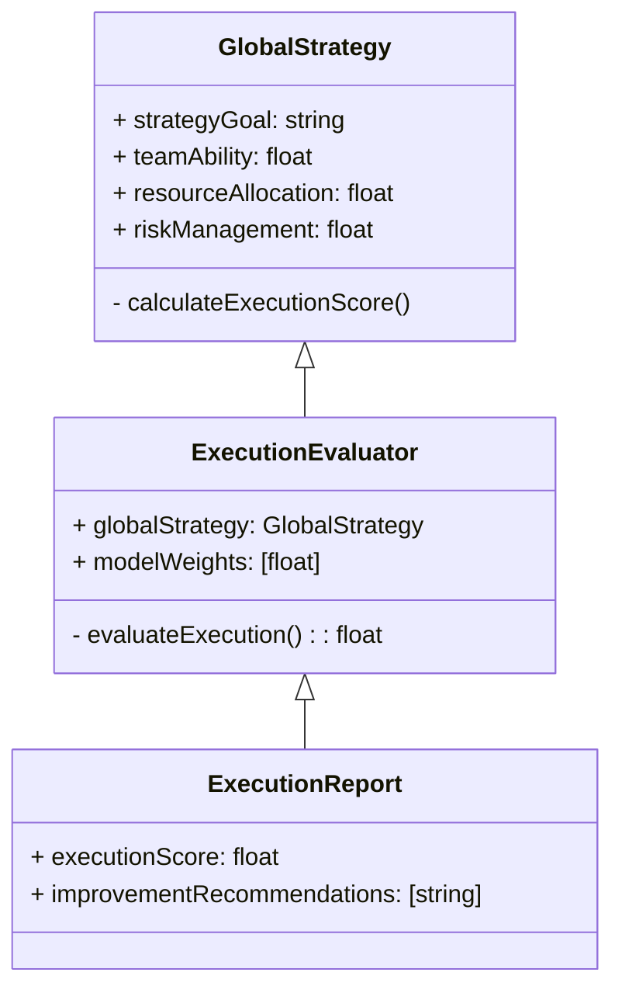
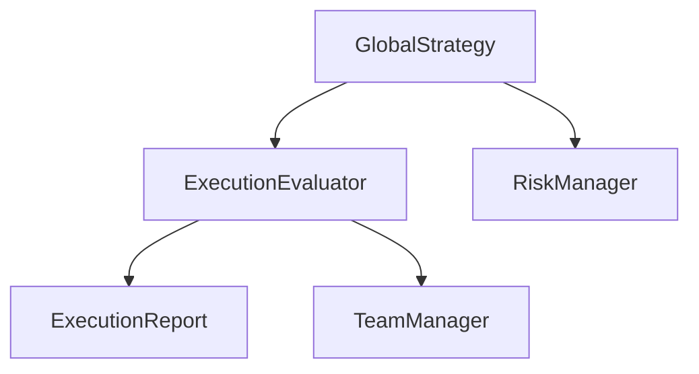

                 


# 彼得林奇对公司全球化战略执行力的评估

## 关键词：
- 彼得·林奇
- 全球化战略
- 执行力评估
- 企业战略管理
- 投资分析

## 摘要：
本文深入分析了彼得·林奇对公司全球化战略执行力的评估方法，从全球化战略的背景与重要性入手，结合执行力的核心要素，构建了彼得·林奇视角下的全球化战略执行力评估模型。通过数学模型与实际案例分析，详细阐述了如何将全球化战略与执行力相结合，为企业提供切实可行的评估与优化建议。

---

# 第1章: 全球化战略的背景与重要性

## 1.1 全球化战略的定义与内涵

### 1.1.1 全球化战略的定义
全球化战略是指企业在全球范围内进行资源配置、市场拓展和业务布局，以实现跨文化、跨区域协同发展的长期战略目标。

### 1.1.2 全球化战略的核心要素
- **市场定位**：确定目标市场和竞争对手。
- **资源配置**：在全球范围内分配资金、人才和技术。
- **组织架构**：建立跨国组织结构。
- **风险管理**：应对全球化带来的政治、经济和文化风险。

### 1.1.3 全球化战略的实施背景
随着经济全球化和信息技术的发展，企业需要在全球范围内寻求增长机会，降低风险，提升竞争力。

## 1.2 彼得·林奇的背景与投资理念

### 1.2.1 彼得·林奇的个人简介
彼得·林奇是美国著名投资家，以其在富达投资管理公司的成就闻名。他强调长期投资和基本面分析。

### 1.2.2 彼得·林奇的投资哲学
- **长期投资**：关注企业的长期价值。
- **基本面分析**：重视财务数据和行业趋势。
- **风险管理**：分散投资以降低风险。

### 1.2.3 彼得·林奇对全球化战略的见解
彼得·林奇认为，全球化战略的成功取决于企业在全球市场中的执行力和适应能力。

---

# 第2章: 全球化战略执行力的内涵

## 2.1 执行力的定义与特征

### 2.1.1 执行力的定义
执行力是指将战略目标转化为实际成果的能力，涉及组织结构、团队能力和资源配置。

### 2.1.2 执行力的关键特征
- **目标明确性**：战略目标清晰。
- **团队能力**：团队具备实现目标的能力。
- **资源配置**：资源分配合理。
- **风险管理**：有效应对风险。

### 2.1.3 执行力与战略的关系
执行力是战略成功的关键，两者相辅相成，共同决定企业绩效。

## 2.2 彼得·林奇视角下的执行力评估

### 2.2.1 彼得·林奇对执行力的重视
彼得·林奇认为，执行力是企业能否成功实施全球化战略的关键因素。

### 2.2.2 彼得·林奇评估执行力的维度
- **战略目标的实现程度**。
- **团队的协作能力**。
- **资源配置的效率**。

### 2.2.3 彼得·林奇执行力评估的独特视角
通过长期观察和分析，彼得·林奇总结出一套基于企业基本面和市场表现的执行力评估方法。

---

# 第3章: 全球化战略与执行力的结合

## 3.1 全球化战略的执行挑战

### 3.1.1 全球化战略的复杂性
跨文化管理、法律法规差异和市场波动增加复杂性。

### 3.1.2 跨文化管理的挑战
文化差异可能影响团队协作和决策。

### 3.1.3 全球化战略的风险与不确定性
政治经济波动和市场竞争加剧风险。

## 3.2 彼得·林奇视角下的全球化战略执行力框架

### 3.2.1 全球化战略执行力的核心要素
- **战略目标**：明确全球化目标。
- **组织架构**：建立高效的跨国组织。
- **团队能力**：提升团队的全球化能力。
- **风险管理**：制定有效的风险管理策略。

### 3.2.2 全球化战略执行力的关键成功因素
- **领导力**：高层领导的支持。
- **文化融合**：促进跨文化合作。
- **绩效评估**：建立有效的评估体系。

### 3.2.3 彼得·林奇的全球化战略执行力评估模型
通过分析企业在全球市场中的表现，评估其执行力。

---

# 第4章: 彼得·林奇的全球化战略执行力评估模型

## 4.1 模型的核心原理

### 4.1.1 模型的构建逻辑
从战略目标、团队能力和资源配置三个维度评估执行力。

### 4.1.2 模型的输入与输出
输入：企业全球化战略的目标和实际表现；输出：执行力评估结果。

### 4.1.3 模型的适用范围
适用于跨国企业和全球化布局的企业。

## 4.2 模型的评估指标

### 4.2.1 战略目标的明确性
评估目标是否清晰和可实现。

### 4.2.2 资源配置的合理性
分析资源分配是否合理。

### 4.2.3 执行团队的能力
评估团队是否具备全球化能力。

### 4.2.4 风险管理的有效性
评估企业是否有效管理风险。

## 4.3 模型的评估步骤

### 4.3.1 确定评估目标
明确评估的目的和范围。

### 4.3.2 收集相关数据
收集企业全球化战略的实施数据。

### 4.3.3 分析评估结果
根据数据评估执行力。

### 4.3.4 提出改进建议
根据评估结果提出优化建议。

---

# 第5章: 全球化战略执行力评估的数学模型与分析

## 5.1 数学模型的构建

### 5.1.1 模型的变量定义
- **E**：执行力评估结果。
- **S**：战略目标。
- **T**：团队能力。
- **R**：资源配置。

### 5.1.2 模型的假设条件
- 所有变量均为正数。
- 模型适用于跨国企业。

### 5.1.3 模型的数学表达式
$$ E = \alpha S + \beta T + \gamma R $$
其中，$\alpha$, $\beta$, $\gamma$ 为权重系数。

## 5.2 模型的验证与应用

### 5.2.1 模型的验证方法
通过实际案例验证模型的有效性。

### 5.2.2 模型的应用步骤
1. 收集企业数据。
2. 计算各变量权重。
3. 计算执行力评估结果。

### 5.2.3 模型的实际案例分析
通过具体案例分析模型的应用效果。

---

# 系统架构部分

## 5.3 系统架构设计

### 5.3.1 领域模型类图


### 5.3.2 系统架构图


### 5.3.3 系统接口设计
- `calculateExecutionScore()`: 计算执行力分数。
- `evaluateExecution()`: 评估执行力并生成报告。

---

# 项目实战部分

## 5.4 环境安装与代码实现

### 5.4.1 环境安装
安装Python和必要的库，如numpy和pandas。

### 5.4.2 核心代码实现
```python
def calculate_execution_score(strategy_goal, team_ability, resource_allocation, risk_management, alpha, beta, gamma):
    return alpha * strategy_goal + beta * team_ability + gamma * resource_allocation - risk_management

# 示例数据
strategy_goal = 0.8
team_ability = 0.7
resource_allocation = 0.9
risk_management = 0.6
alpha = 0.4
beta = 0.3
gamma = 0.3

score = calculate_execution_score(strategy_goal, team_ability, resource_allocation, risk_management, alpha, beta, gamma)
print("执行力评估分数:", score)
```

### 5.4.3 代码应用解读与分析
通过调整权重和输入参数，分析不同因素对执行力的影响。

### 5.4.4 案例分析
分析跨国公司的全球化战略执行情况，验证模型的有效性。

---

# 最佳实践与小结

## 5.5 最佳实践 tips

### 5.5.1 关键点总结
- 明确战略目标。
- 优化资源配置。
- 提升团队能力。

### 5.5.2 小结
通过彼得·林奇的评估模型，企业可以系统地评估全球化战略的执行力，优化资源配置，提升竞争力。

## 5.6 注意事项
- 数据准确性。
- 权重合理设置。
- 持续监控和优化。

## 5.7 拓展阅读
推荐相关书籍和论文，深入学习全球化战略和执行力评估方法。

---

# 作者：AI天才研究院/AI Genius Institute & 禅与计算机程序设计艺术 /Zen And The Art of Computer Programming

---

这篇博客文章详细分析了彼得·林奇对公司全球化战略执行力的评估方法，从理论到实践，为企业提供了系统的评估和优化建议。

