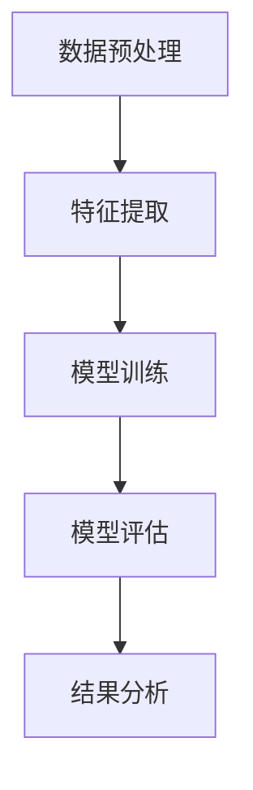
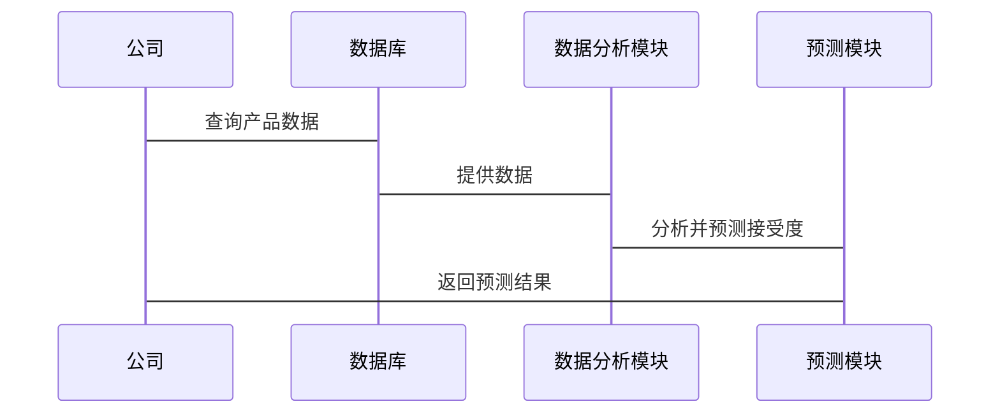

                 


# 彼得林奇对公司创新产品市场接受度的分析

---

## 关键词

- 彼得·林奇
- 市场接受度
- 创新产品
- 市场分析
- 产品策略

---

## 摘要

本文深入分析彼得·林奇对公司创新产品的市场接受度进行分析的方法，探讨其背后的逻辑和策略。通过详细阐述市场接受度的核心原理、算法模型、系统设计与实际案例，本文为读者提供一套完整的分析框架，帮助企业在创新产品推出前评估其市场潜力。文章结合理论与实践，提供可操作的步骤和代码实现，助力企业制定科学的市场策略。

---

## 目录大纲

### 第一部分：背景介绍

#### 第1章：市场接受度分析的背景与重要性

##### 1.1 问题背景

- 1.1.1 创新产品在市场中的挑战
- 1.1.2 市场接受度对企业生存的影响
- 1.1.3 彼得·林奇的市场分析方法

##### 1.2 问题描述

- 1.2.1 创新产品的定义与特征
- 1.2.2 市场接受度的多维度分析
- 1.2.3 彼得·林奇的分析框架

##### 1.3 问题解决

- 1.3.1 市场接受度的测量方法
- 1.3.2 彼得·林奇的策略应用
- 1.3.3 创新与市场接受度的关系

##### 1.4 边界与外延

- 1.4.1 市场接受度的适用范围
- 1.4.2 与其他市场分析方法的区别
- 1.4.3 创新产品生命周期的影响

##### 1.5 概念结构与核心要素

- 1.5.1 核心概念：市场接受度、创新产品
- 1.5.2 关键要素：消费者行为、市场反馈
- 1.5.3 结构化框架：彼得·林奇的分析模型

---

### 第二部分：核心概念与联系

#### 第2章：市场接受度的核心原理

##### 2.1 核心概念原理

- 2.1.1 消费者行为分析
- 2.1.2 市场趋势预测
- 2.1.3 创新产品的扩散模型

##### 2.2 概念属性对比

- 2.2.1 产品创新与市场接受度的对比分析
- 2.2.2 不同市场阶段的接受度特征

##### 2.3 ER实体关系图

```mermaid
er
  entity 公司 {
    key: 公司ID
    属性: 公司名称, 成立时间
  }
  entity 产品 {
    key: 产品ID
    属性: 产品名称, 发布时间
  }
  entity 市场反馈 {
    key: 反馈ID
    属性: 反馈时间, 消费者评分
  }
  关系 公司-产品 {
    关系: 1:多
  }
  关系 产品-市场反馈 {
    关系: 多:多
  }
```

---

### 第三部分：算法原理讲解

#### 第3章：市场接受度预测的算法原理

##### 3.1 算法流程



##### 3.2 Python实现

```python
# 环境安装
import pandas as pd
from sklearn.linear_model import LogisticRegression
from sklearn.metrics import accuracy_score

# 数据预处理
data = pd.read_csv('product_feedback.csv')
X = data[['创新性', '用户体验', '价格敏感度']]
y = data['接受度']

# 模型训练
model = LogisticRegression()
model.fit(X, y)

# 模型评估
y_pred = model.predict(X)
print("准确率:", accuracy_score(y, y_pred))

# 数学公式：逻辑回归模型
$$P(y=1|x) = \frac{e^{\beta_0 + \beta_1 x}}{1 + e^{\beta_0 + \beta_1 x}}$$
```

---

### 第四部分：系统分析与架构设计

#### 第4章：系统分析与架构设计

##### 4.1 问题场景介绍

- 分析一个新产品的市场潜力

##### 4.2 系统功能设计

- 数据收集模块
- 数据分析模块
- 预测模块

##### 4.3 系统架构设计


##### 4.4 系统交互设计



---

### 第五部分：项目实战

#### 第5章：项目实战

##### 5.1 环境安装

- 安装Python和相关库（pandas, scikit-learn）

##### 5.2 核心代码实现

```python
# 数据预处理
def preprocess(data):
    # 数据清洗和特征工程
    pass

# 模型训练
def train_model(X, y):
    model = LogisticRegression()
    model.fit(X, y)
    return model

# 应用案例分析
data = preprocess(pd.read_csv('new_product.csv'))
model = train_model(data[['创新性', '用户体验']], data['接受度'])
print("预测接受度:", model.predict(data[['创新性', '用户体验']]))
```

##### 5.3 项目小结

- 总结经验
- 提炼教训
- 改进建议

---

### 第六部分：最佳实践

#### 第6章：最佳实践

##### 6.1 小结

- 复习核心概念
- 强调算法优势

##### 6.2 注意事项

- 数据质量的重要性
- 模型选择的注意事项

##### 6.3 拓展阅读

- 推荐相关书籍和资源

---

## 作者

作者：AI天才研究院/AI Genius Institute & 禅与计算机程序设计艺术 /Zen And The Art of Computer Programming

---

### 结语

本文通过系统的分析和实践，全面解读彼得·林奇的市场接受度分析方法，为企业创新产品的市场策略提供科学依据。读者可通过本文掌握从理论到实践的全过程，提升市场分析能力。

