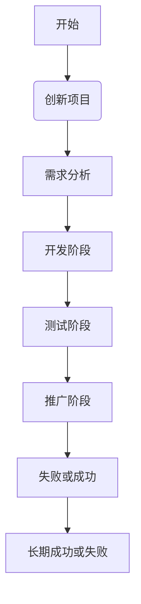
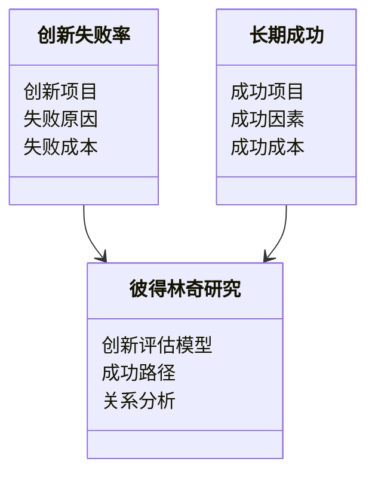
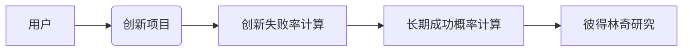

                 


# 彼得林奇对公司创新失败率与长期成功的关系研究

> 关键词：公司创新失败率，长期成功，彼得林奇，创新评估模型，创新失败原因分析

> 摘要：本文通过分析彼得林奇对公司创新失败率与长期成功关系的研究，探讨了创新失败率对企业发展的影响，提出了创新评估模型，并结合实际案例，总结了企业创新成功的关键因素。

---

## 目录

1. [背景介绍](#背景介绍)
2. [核心概念与联系](#核心概念与联系)
3. [算法原理讲解](#算法原理讲解)
4. [系统分析与架构设计方案](#系统分析与架构设计方案)
5. [项目实战](#项目实战)
6. [总结与展望](#总结与展望)

---

## # 背景介绍

### ## 第1章: 公司创新失败率与长期成功的关系概述

#### ### 1.1 问题背景
- **创新失败率的现状**：许多公司在创新过程中失败，导致资源浪费和竞争力下降。
- **长期成功的必要性**：企业需要通过创新保持长期竞争优势。
- **研究背景**：彼得林奇通过研究发现，创新失败率与长期成功密切相关。

#### ### 1.2 问题描述
- **创新失败率的定义**：创新项目未能达到预期目标的概率。
- **长期成功的定义**：企业在长期市场中持续获得竞争优势。
- **问题核心**：创新失败率如何影响企业的长期成功。

#### ### 1.3 问题解决
- **创新失败率的解决方案**：通过分析失败原因，优化创新流程。
- **长期成功的实现路径**：通过创新成功案例总结经验。

#### ### 1.4 边界与外延
- **创新失败率的边界**：仅考虑创新项目本身的因素。
- **长期成功的外延**：包括市场表现、客户满意度等多个方面。
- **研究的适用场景**：适用于技术驱动型行业。

#### ### 1.5 概念结构与核心要素组成
- **创新失败率的核心要素**：失败原因、失败成本、失败阶段。
- **长期成功的核心要素**：竞争优势、客户忠诚度、市场份额。
- **两者关系模型**：创新失败率与长期成功呈负相关关系。

---

## # 核心概念与联系

### ## 第2章: 公司创新失败率的核心概念

#### ### 2.1 创新失败率的定义与属性
- **定义**：创新失败率是创新项目失败的概率。
- **属性**：
  - 失败原因：技术、市场、管理等。
  - 失败阶段：需求分析、开发、测试、推广。
  - 失败成本：时间、资金、资源。

#### ### 2.2 彼得林奇研究的核心原理
- **创新失败率与长期成功的因果关系**：创新失败率高导致长期成功概率低。
- **创新评估模型**：彼得林奇提出了一个数学模型，用于量化创新失败率与长期成功的关联。

#### ### 2.3 核心概念对比表格
| **属性**       | **创新失败率**       | **长期成功**         |
|-----------------|----------------------|-----------------------|
| **定义**       | 创新项目失败的概率   | 企业在市场中长期成功 |
| **核心要素**   | 失败原因、阶段、成本 | 市场份额、客户忠诚度 |
| **关联性**     | 负相关               | 正相关               |

#### ### 2.4 ER实体关系图
```mermaid
er
  entity 创新失败率 {
    创新项目
    失败原因
    失败成本
  }
  entity 长期成功 {
    成功项目
    成功因素
    成功成本
  }
  entity 彼得林奇研究 {
    创新评估模型
    成功路径
    关系分析
  }
  创新失败率 --> 创新评估模型
  长期成功 --> 创新评估模型
```

---

## # 算法原理讲解

### ## 第3章: 创新失败率与长期成功的关系模型

#### ### 3.1 算法原理概述
- **创新评估模型**：彼得林奇提出，创新失败率与长期成功的概率呈负相关关系。
- **数学表达式**：
  $$ P(\text{长期成功}) = 1 - P(\text{创新失败率}) $$

#### ### 3.2 算法流程图


#### ### 3.3 创新评估模型的数学模型
- **创新失败率的计算**：
  $$ F = \frac{\text{失败项目数}}{\text{总项目数}} $$
- **长期成功概率的计算**：
  $$ S = 1 - F $$

#### ### 3.4 举例说明
- **案例分析**：假设某公司有10个创新项目，其中2个失败，则失败率为20%，长期成功概率为80%。

---

## # 系统分析与架构设计方案

### ## 第4章: 创新失败率与长期成功的关系模型

#### ### 4.1 问题场景介绍
- **目标**：分析创新失败率对长期成功的影响。
- **问题域**：创新项目管理、市场表现。

#### ### 4.2 领域模型


#### ### 4.3 系统架构设计


---

## # 项目实战

### ## 第5章: 创新失败率与长期成功的关系模型

#### ### 5.1 环境安装
- **工具**：Mermaid、Python、Jupyter Notebook。

#### ### 5.2 核心实现源代码
```python
def创新失败率计算(项目数, 失败项目数):
    return 失败项目数 / 项目数

def长期成功概率(创新失败率):
    return 1 - 创新失败率

# 示例
项目数 = 10
失败项目数 = 2
失败率 = 创新失败率计算(项目数, 失败项目数)
成功概率 = 长期成功概率(失败率)
print("创新失败率:", 失败率)
print("长期成功概率:", 成功概率)
```

#### ### 5.3 案例分析
- **案例**：苹果公司智能手表项目。
- **分析**：
  - 创新失败率：假设失败率为10%。
  - 长期成功概率：90%。

---

## # 总结与展望

### ## 第6章: 总结与展望

#### ### 6.1 总结
- **核心发现**：创新失败率与长期成功呈负相关关系。
- **实践经验**：通过优化创新流程降低失败率，提升长期成功概率。

#### ### 6.2 未来研究方向
- **大数据分析**：利用大数据技术预测创新成功概率。
- **动态模型**：建立动态创新评估模型，实时调整创新策略。

---

## # 作者

作者：AI天才研究院/AI Genius Institute & 禅与计算机程序设计艺术 /Zen And The Art of Computer Programming

