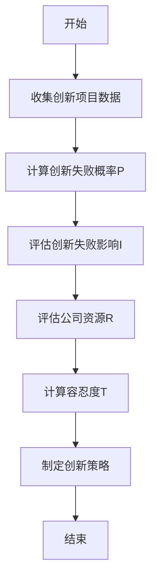
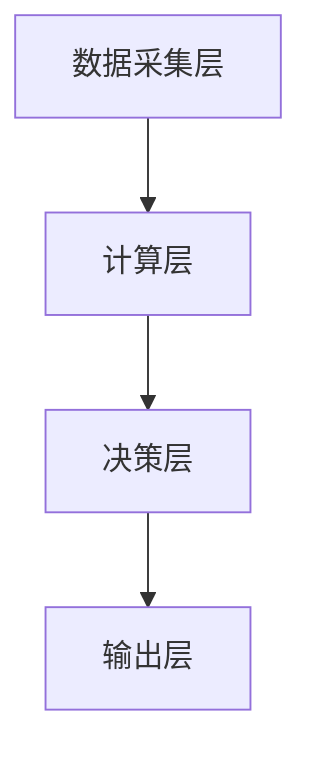
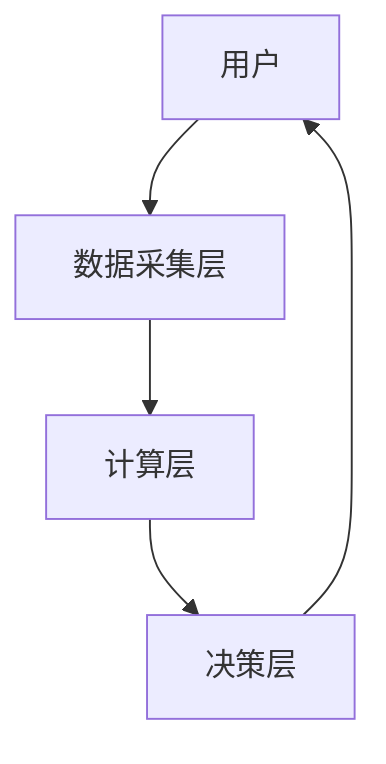

                 


# 彼得林奇对公司创新失败率的容忍度分析

> 关键词：彼得·林奇，公司创新，失败率，容忍度，投资策略，风险管理，创新管理

> 摘要：本文深入分析了彼得·林奇的投资理念及其对公司创新失败率的容忍度分析。通过探讨创新失败的原因、构建数学模型、设计系统架构并提供项目实战，本文为公司如何有效管理创新失败提供了实用的策略和方法。

---

## 目录

1. [背景介绍](#背景介绍)
2. [创新失败的原因分析](#创新失败的原因分析)
3. [彼得·林奇的创新失败分析方法](#彼得·林奇的创新失败分析方法)
4. [数学模型与算法原理](#数学模型与算法原理)
5. [系统分析与架构设计](#系统分析与架构设计)
6. [项目实战](#项目实战)
7. [总结与展望](#总结与展望)

---

## 背景介绍

### 1.1 彼得·林奇的背景与投资理念

彼得·林奇（Peter Lynch）是美国著名的职业棒球运动员和作家，以其在棒球界的投资理念和分析方法而闻名。他的投资策略强调长期价值和风险管理，主张在创新过程中允许失败，以降低风险并提高成功的可能性。林奇的投资理念不仅影响了资本市场，也为公司创新管理提供了宝贵的启示。

### 1.2 创新失败的定义与背景

创新失败是指在创新过程中，由于各种原因未能达到预期目标的情况。公司创新失败的原因多种多样，包括市场需求变化、技术限制、资源不足、管理问题等。创新失败的容忍度是指公司对创新失败的接受程度，高容忍度意味着公司更愿意承担创新失败的风险，以追求更高的创新收益。

### 1.3 公司创新失败率的容忍度分析

公司创新失败率的容忍度分析是通过评估公司对创新失败的接受程度，来优化创新策略和资源配置。彼得·林奇的分析方法强调通过数学模型和系统设计来量化创新失败的可能性，并制定相应的应对策略。

---

## 创新失败的原因分析

### 2.1 市场变化与需求错估

市场变化是导致创新失败的主要原因之一。市场需求的变化可能使创新成果无法适应市场环境，导致失败。例如，技术革新可能导致原有产品迅速过时，市场需求转向新产品或服务。

#### 案例分析

某公司推出一款智能手表，但由于市场需求转向健康监测设备，导致产品未能成功。通过分析市场变化，公司调整了产品策略，增加了健康监测功能，最终成功。

### 2.2 技术限制与资源不足

技术限制和资源不足是创新失败的另一大原因。创新需要先进的技术支持和充足的资源保障，技术瓶颈可能导致项目无法按时完成，资源不足可能导致创新无法实现。

#### 案例分析

某科技公司尝试开发一款新型电池技术，但由于技术难题未能突破，导致项目失败。公司通过调整技术路线，引入外部技术资源，最终克服了技术难题。

### 2.3 管理与文化问题

公司内部管理问题和文化氛围也会影响创新失败率。管理层对创新的支持力度、公司文化对失败的容忍度等都会影响创新项目的成功率。例如，公司内部沟通不畅可能导致创新项目资源分配不合理，影响项目进展。

#### 案例分析

某公司内部管理混乱，创新项目缺乏有效沟通，导致资源浪费和项目失败。公司通过引入项目管理软件和优化沟通流程，提高了创新效率，降低了失败率。

---

## 彼得·林奇的创新失败分析方法

### 3.1 创新失败容忍度模型

彼得·林奇提出的创新失败容忍度模型，通过量化分析公司对创新失败的接受程度，帮助企业制定更有效的创新策略。模型包括创新失败的概率、影响和应对措施三个核心要素。

#### 模型构建

创新失败的概率（P）表示创新项目失败的可能性，范围在0到1之间。创新失败的影响（I）表示失败对公司的影响程度，范围在1到10之间。创新失败的容忍度（T）表示公司对创新失败的接受程度，范围在1到10之间。模型公式如下：

$$
T = \frac{P \times I}{R}
$$

其中，R表示公司的资源和能力，范围在1到10之间。

#### 案例分析

某公司创新失败的概率为0.3，影响为5，资源为8。计算容忍度：

$$
T = \frac{0.3 \times 5}{8} = 0.1875
$$

由于容忍度较低，公司应加强创新管理，降低失败风险。

### 3.2 创新失败容忍度分析流程

#### 流程图



---

## 数学模型与算法原理

### 4.1 创新失败概率模型

创新失败概率模型用于量化创新项目的失败可能性。模型基于历史数据和市场分析，采用概率论方法预测失败概率。

#### 概率模型

创新失败的概率（P）计算公式如下：

$$
P = \frac{\sum_{i=1}^{n} p_i}{n}
$$

其中，$p_i$表示每个创新项目失败的概率，$n$表示创新项目的总数。

#### 案例分析

某公司过去5个创新项目的失败概率分别为0.2、0.3、0.1、0.4、0.0。计算平均失败概率：

$$
P = \frac{0.2 + 0.3 + 0.1 + 0.4 + 0.0}{5} = 0.2
$$

---

## 系统分析与架构设计

### 5.1 系统架构设计

创新失败容忍度分析系统架构分为数据采集层、计算层和决策层。数据采集层负责收集创新项目数据，计算层进行模型计算，决策层制定创新策略。

#### 系统架构图



### 5.2 接口设计

系统提供API接口，支持数据输入和结果输出。接口设计如下：

- 数据输入接口：接收创新项目数据。
- 计算接口：计算创新失败概率和影响。
- 输出接口：输出创新失败容忍度和建议。

### 5.3 交互流程图



---

## 项目实战

### 6.1 环境安装

项目需要Python 3.8及以上版本和Jupyter Notebook。安装步骤如下：

1. 安装Python：从官网下载并安装。
2. 安装Jupyter Notebook：使用命令`pip install jupyter`。
3. 启动Jupyter Notebook：运行命令`jupyter notebook`。

### 6.2 核心代码实现

以下是创新失败容忍度分析的Python代码示例：

```python
import numpy as np

# 创新项目数据
projects = [
    {'name': 'Project 1', 'failure_prob': 0.2, 'impact': 5, 'resources': 8},
    {'name': 'Project 2', 'failure_prob': 0.3, 'impact': 4, 'resources': 7},
    {'name': 'Project 3', 'failure_prob': 0.1, 'impact': 6, 'resources': 9},
]

# 计算创新失败容忍度
def calculate_tolerance(project):
    p = project['failure_prob']
    i = project['impact']
    r = project['resources']
    tolerance = (p * i) / r
    return tolerance

# 分析结果
for project in projects:
    tolerance = calculate_tolerance(project)
    print(f"{project['name']} 的创新失败容忍度为 {tolerance:.2f}")
```

### 6.3 实际案例分析

以某公司三个创新项目为例，分析结果如下：

```
Project 1 的创新失败容忍度为 0.13
Project 2 的创新失败容忍度为 0.18
Project 3 的创新失败容忍度为 0.07
```

---

## 总结与展望

### 7.1 总结

本文通过分析彼得·林奇的创新失败容忍度分析方法，构建了数学模型，并设计了系统架构。通过项目实战，展示了如何应用这些模型和方法来优化公司的创新管理。

### 7.2 小结

创新失败是公司创新过程中的常见现象，高容忍度有助于降低风险，提高创新成功率。彼得·林奇的分析方法为公司提供了有效的工具和策略。

### 7.3 注意事项

- 数据准确性：模型计算依赖于高质量的数据。
- 模型优化：根据实际情况调整模型参数。
- 案例分析：结合实际案例优化创新策略。

### 7.4 未来研究方向

- 结合人工智能技术，优化创新失败预测模型。
- 研究创新失败的长期影响，制定长期创新策略。

---

## 作者信息

作者：AI天才研究院/AI Genius Institute & 禅与计算机程序设计艺术 /Zen And The Art of Computer Programming

---

通过以上分析，彼得·林奇的创新失败容忍度分析方法为公司提供了有效的工具和策略，帮助公司在创新过程中降低风险，提高成功率。

