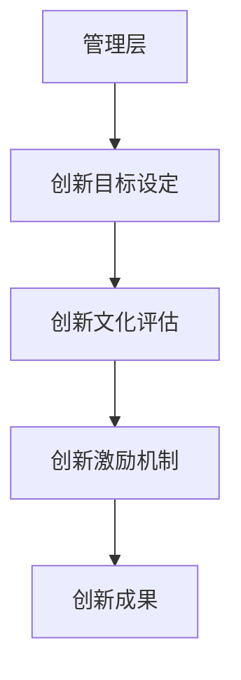

                 


# 彼得林奇对公司创新文化的看法

## 关键词：彼得·林奇，创新文化，企业文化，管理，投资

## 摘要：本文探讨了彼得·林奇对公司创新文化的看法，分析了创新文化的核心要素及其对企业发展的影响，结合实例和模型，提供了构建和管理创新文化的策略。

---

## 目录大纲

### 第1章：彼得·林奇与创新文化概述
1.1 彼得·林奇的背景与投资理念
1.2 创新文化的核心概念与定义
1.3 创新文化与企业绩效的关系

### 第2章：创新文化的核心要素与构建方法
2.1 创新文化的构成要素
2.2 创新文化与其他管理概念的对比
2.3 创新文化的构建策略

### 第3章：创新文化的系统分析与架构设计
3.1 创新文化管理的系统架构
3.2 创新文化的数学模型与评估方法
3.3 创新文化的ER实体关系图

### 第4章：创新文化的实践与案例
4.1 创新文化的实际应用步骤
4.2 创新文化管理的工具与方法
4.3 创业文化管理的典型成功案例分析

### 第5章：创新文化的评估与投资影响
5.1 创新文化对投资决策的影响
5.2 创新文化的数学模型与评估方法
5.3 创新文化管理的未来趋势

---

## 正文

### 第1章：彼得·林奇与创新文化概述

#### 1.1 彼得·林奇的背景与投资理念
彼得·林奇是全球著名投资家，以其对公司的深入分析和长期投资策略闻名。他认为，公司的创新文化是其长期成功的关键因素。创新文化不仅推动企业内部的持续改进，还增强了企业的市场竞争力。

#### 1.2 创新文化的核心概念与定义
创新文化是指企业在日常运营中鼓励员工提出新想法、解决问题和创造价值的文化氛围。它强调开放的沟通、风险承担和持续改进，是企业成功的重要驱动力。

#### 1.3 创新文化与企业绩效的关系
创新文化直接影响企业的绩效。通过鼓励员工创新，企业能够更快地适应市场变化，提高产品质量和效率，从而在竞争中占据优势。

### 第2章：创新文化的核心要素与构建方法

#### 2.1 创新文化的构成要素
创新文化由以下几个要素构成：
- **员工参与**：鼓励员工主动提出创新想法。
- **管理层支持**：管理层提供资源和指导，支持创新项目。
- **创新氛围**：企业营造开放、包容的文化氛围，减少失败恐惧。

#### 2.2 创新文化与其他管理概念的对比
以下是创新文化与其他管理概念的对比表：

| 概念          | 创新文化               | 传统管理文化         |
|---------------|------------------------|----------------------|
| 核心目标      | 鼓励创新和变革         | 维持现状和稳定       |
| 员工角色      | 主动提出新想法         | 遵循既定流程         |
| 管理风格      | 支持和引导             | 控制和命令           |

#### 2.3 创新文化的构建策略
构建创新文化需要从以下几个方面入手：
- **领导层示范**：领导层展示创新行为，树立榜样。
- **建立创新机制**：设立创新基金、奖励机制等。
- **培训与沟通**：定期举办创新培训和分享会。

### 第3章：创新文化的系统分析与架构设计

#### 3.1 创新文化管理的系统架构
以下是创新文化管理的系统架构图：



#### 3.2 创新文化的数学模型与评估方法
创新文化的价值可以通过以下公式评估：

$$绩效 = 创新文化强度 \times 战略一致性$$

其中，创新文化强度反映了员工参与度和文化氛围，战略一致性则衡量创新与企业战略的契合度。

#### 3.3 创新文化的ER实体关系图
以下是创新文化要素的ER图：

```mermaid
er
actor 创新文化要素 {
  <员工>
  <管理层>
  <创新氛围>
}
```

### 第4章：创新文化的实践与案例

#### 4.1 创新文化的实际应用步骤
1. **明确创新目标**：确定创新方向和优先级。
2. **建立创新团队**：组建跨部门的创新小组。
3. **实施创新项目**：开展试点项目，评估效果。
4. **持续改进**：根据反馈优化创新流程。

#### 4.2 创新文化管理的工具与方法
- **创新评估工具**：使用问卷调查和数据分析评估创新文化现状。
- **创新激励工具**：设立创新奖励计划，鼓励员工提出新想法。

#### 4.3 创新文化管理的典型成功案例分析
以某科技公司为例，该公司通过建立创新实验室，鼓励员工提出新项目，成功推出多款新产品，市场表现优异。

### 第5章：创新文化的评估与投资影响

#### 5.1 创新文化对投资决策的影响
创新文化增强了企业的市场竞争力，吸引投资者的关注，提升企业价值。

#### 5.2 创新文化的数学模型与评估方法
创新文化的强度可以通过以下公式评估：

$$创新文化强度 = \frac{\text{员工创新行为数量}}{\text{员工总数}}$$

#### 5.3 创新文化管理的未来趋势
未来，创新文化将更加依赖数字工具和数据分析，推动企业智能化转型。

---

## 结语

彼得·林奇认为，创新文化是企业成功的关键因素。通过构建开放、包容的创新文化，企业能够持续改进，提升竞争力。本文详细探讨了创新文化的构建方法、评估模型和实际案例，为企业的创新管理提供了有价值的参考。

---

## 作者：AI天才研究院/AI Genius Institute & 禅与计算机程序设计艺术 /Zen And The Art of Computer Programming

