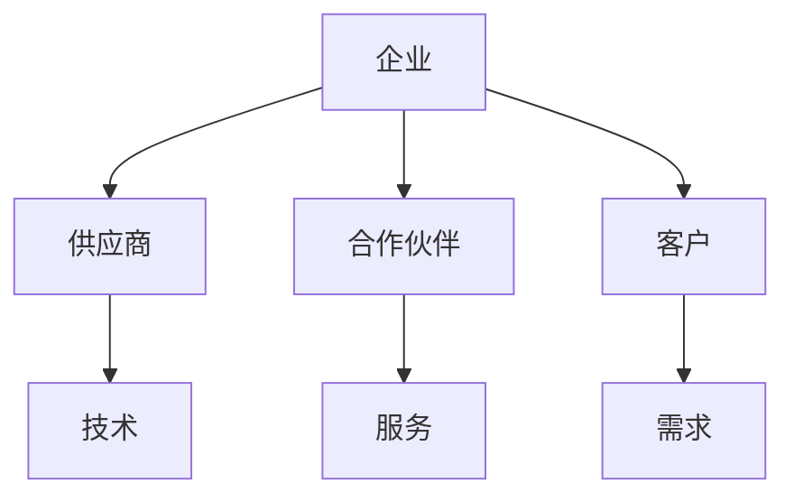
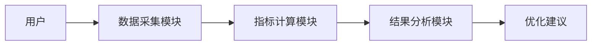
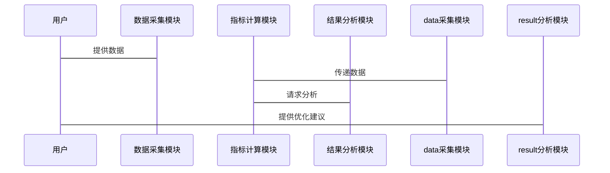

                 


# 彼得林奇对公司创新生态系统可持续性评估

> 关键词：彼得林奇，创新生态系统，可持续性评估，企业创新，系统架构

> 摘要：本文深入分析了彼得林奇的创新生态系统理论，并探讨了如何对其可持续性进行科学评估。通过系统化的分析方法，结合实际案例，详细阐述了创新生态系统的构成、评估指标的设计、数学模型的构建以及系统架构的设计。文章最后总结了最佳实践方法和未来研究方向。

---

# 第一部分: 创新生态系统与可持续性评估背景

# 第1章: 创新生态系统概述

## 1.1 创新生态系统的基本概念

### 1.1.1 创新生态系统的定义
创新生态系统是指由企业、供应商、合作伙伴、客户、技术、市场等多方利益相关者共同构成的动态网络系统。它通过协同创新和资源共享，实现价值共创和可持续发展。

### 1.1.2 创新生态系统的核心要素
创新生态系统的构成要素包括：
1. **企业**：核心创新主体。
2. **供应商**：提供技术和资源支持。
3. **合作伙伴**：提供互补性资源或服务。
4. **客户**：需求驱动创新方向。
5. **技术**：创新的核心驱动力。
6. **市场**：创新成果的商业化环境。

### 1.1.3 创新生态系统与传统管理模式的区别
传统管理模式强调企业内部效率，而创新生态系统强调多方协作和外部资源整合，注重动态性和系统性。

---

## 1.2 彼得林奇的创新生态系统理论

### 1.2.1 彼得林奇投资理论的核心观点
彼得林奇认为，企业的长期成功取决于其创新能力和生态系统构建能力。他强调，企业应通过与外部合作伙伴协同创新，构建可持续的生态系统。

### 1.2.2 创新生态系统在企业中的应用
彼得林奇提出，企业应关注生态系统中各参与方的利益平衡，通过合作共赢实现长期发展。

### 1.2.3 可持续性评估的必要性
可持续性评估是确保创新生态系统长期稳定运行的关键。通过评估，企业可以发现潜在风险，优化资源配置，提升整体竞争力。

---

## 1.3 可持续性评估的基本概念

### 1.3.1 可持续性评估的定义
可持续性评估是对创新生态系统在经济、社会和环境三个维度上的表现进行全面测量和分析。

### 1.3.2 可持续性评估的指标体系
常用的指标包括：
1. 经济指标：投资回报率、成本效益比。
2. 社会指标：社会影响力、就业机会。
3. 环境指标：碳排放、资源利用率。

### 1.3.3 可持续性评估的挑战与机遇
挑战包括数据获取难度、评估标准不统一；机遇包括提升企业竞争力、实现可持续发展目标。

---

## 1.4 本章小结
本章从创新生态系统的定义、构成要素和彼得林奇的理论出发，阐述了可持续性评估的必要性和基本概念。下一章将详细探讨创新生态系统的核心概念与联系。

---

# 第二部分: 创新生态系统的核心概念与联系

# 第2章: 创新生态系统的核心要素

## 2.1 创新生态系统的构成

### 2.1.1 企业内部要素
1. **组织结构**：扁平化、矩阵式结构更有利于创新。
2. **文化氛围**：鼓励创新、包容失败的企业文化。
3. **创新资源**：资金、技术、人才等。

### 2.1.2 企业外部要素
1. **供应商**：提供关键技术和原材料。
2. **合作伙伴**：提供互补性产品或服务。
3. **客户**：需求驱动创新方向。
4. **市场**：创新成果的商业化环境。

### 2.1.3 创新生态系统的核心驱动因素
1. **协同创新**：多方协作推动技术创新。
2. **资源整合**：优化资源配置，提升效率。
3. **利益平衡**：确保各方利益共赢。

---

## 2.2 创新生态系统中的关键角色

### 2.2.1 企业的角色
企业是创新生态系统的主导者，负责制定战略、协调各方资源。

### 2.2.2 供应商与合作伙伴的角色
供应商和合作伙伴提供技术和资源支持，是创新生态系统的重要组成部分。

### 2.2.3 客户与市场的角色
客户是创新的最终受益者，市场需求驱动创新方向。

---

## 2.3 创新生态系统中的实体关系

### 2.3.1 实体关系图（Mermaid流程图）


---

# 第3章: 可持续性评估的核心原理

## 3.1 可持续性评估的理论基础

### 3.1.1 系统论与复杂性理论
系统论认为，生态系统是一个复杂的整体，各部分相互依赖、相互作用。

### 3.1.2 可持续发展与企业责任
企业应承担社会责任，推动可持续发展。

### 3.1.3 创新与可持续性的关系
创新是实现可持续发展的核心动力。

---

## 3.2 可持续性评估的数学模型

### 3.2.1 综合评估模型
$$ S = \sum_{i=1}^{n} w_i x_i $$
其中，$S$ 是综合评分，$w_i$ 是指标权重，$x_i$ 是指标得分。

---

## 3.3 可持续性评估的算法流程

### 3.3.1 数据采集与处理
1. 收集各指标数据。
2. 数据清洗与标准化。

### 3.3.2 指标权重分配
1. 确定各指标的重要性。
2. 使用层次分析法（AHP）计算权重。

### 3.3.3 综合评分计算
1. 根据公式计算综合评分。
2. 分析评分结果，识别瓶颈。

### 3.3.4 结果分析与优化
1. 根据评分结果优化生态系统。
2. 实施改进措施，提升可持续性。

---

## 3.4 本章小结
本章介绍了可持续性评估的理论基础、数学模型和算法流程。下一章将从系统分析的角度，探讨创新生态系统可持续性评估的系统架构设计。

---

# 第三部分: 创新生态系统可持续性评估的系统分析与架构设计

# 第4章: 创新生态系统可持续性评估的系统分析

## 4.1 问题场景介绍
本文以一家科技公司为例，分析其创新生态系统中的问题，包括资源浪费、协作效率低下等。

---

## 4.2 项目介绍

### 4.2.1 项目目标
通过可持续性评估，优化创新生态系统，提升企业竞争力。

### 4.2.2 项目范围
涵盖企业内部和外部的创新生态系统。

---

## 4.3 系统功能设计

### 4.3.1 系统功能模块
1. 数据采集模块：采集各指标数据。
2. 指标计算模块：计算各指标评分。
3. 结果分析模块：分析评分结果，提出优化建议。

---

## 4.4 系统架构设计

### 4.4.1 系统架构图（Mermaid架构图）


---

## 4.5 系统接口设计

### 4.5.1 数据接口
1. 数据输入接口：接收各指标数据。
2. 数据输出接口：输出综合评分和优化建议。

---

## 4.6 系统交互设计

### 4.6.1 系统交互流程图（Mermaid序列图）


---

## 4.7 本章小结
本章通过系统分析，设计了创新生态系统可持续性评估的系统架构和交互流程。下一章将通过实际案例，展示系统的核心实现和应用效果。

---

# 第四部分: 创新生态系统可持续性评估的项目实战

# 第5章: 项目实战

## 5.1 环境安装

### 5.1.1 系统环境
1. 操作系统：Windows 10 或更高版本。
2. 开发工具：Python 3.8 或更高版本，Jupyter Notebook。

### 5.1.2 依赖安装
安装必要的库：
```bash
pip install numpy pandas scikit-learn matplotlib
```

---

## 5.2 核心代码实现

### 5.2.1 数据采集模块

```python
import pandas as pd

def collect_data():
    data = {
        '指标': ['技术投入', '合作伙伴数量', '客户满意度'],
        '得分': [0.8, 0.7, 0.9]
    }
    return pd.DataFrame(data)
```

---

### 5.2.2 指标计算模块

```python
from sklearn.preprocessing import MinMaxScaler

def calculate_scores(data):
    scaler = MinMaxScaler()
    normalized_data = scaler.fit_transform(data[['得分']])
    return normalized_data
```

---

### 5.2.3 结果分析模块

```python
import matplotlib.pyplot as plt

def analyze_results(scores):
    plt.bar(range(len(scores)), scores)
    plt.title('指标得分分布')
    plt.show()
```

---

## 5.3 代码应用解读与分析

### 5.3.1 数据采集模块
通过`collect_data`函数采集各指标数据，并返回DataFrame格式。

### 5.3.2 指标计算模块
使用`MinMaxScaler`对数据进行标准化处理，计算各指标的得分。

### 5.3.3 结果分析模块
通过柱状图展示各指标得分分布，帮助识别瓶颈。

---

## 5.4 实际案例分析

### 5.4.1 案例背景
某科技公司创新生态系统中，技术投入较高，但合作伙伴数量较少，客户满意度一般。

### 5.4.2 评估结果
通过代码计算，技术投入得分最高，客户满意度得分最低。

---

## 5.5 本章小结
本章通过实际案例展示了创新生态系统可持续性评估的核心实现和应用效果。下一章将总结最佳实践方法。

---

# 第五部分: 创新生态系统可持续性评估总结与展望

# 第6章: 总结与展望

## 6.1 最佳实践 tips

1. **数据质量**：确保数据准确性和完整性。
2. **利益平衡**：关注各方利益，确保合作共赢。
3. **持续优化**：定期评估并优化生态系统。

---

## 6.2 小结
本文从理论、系统设计和项目实战三个层面，全面探讨了彼得林奇创新生态系统可持续性评估的方法和实践。通过科学的评估体系和系统化的优化方案，企业可以显著提升创新生态系统的核心竞争力。

---

## 6.3 注意事项

1. **数据隐私**：注意保护各方数据隐私。
2. **模型优化**：根据实际需求不断优化评估模型。
3. **团队协作**：加强跨部门协作，确保评估结果的有效性。

---

## 6.4 拓展阅读

1. 《创新生态系统构建与管理》
2. 《可持续发展与企业责任》
3. 《系统论与复杂性理论》

---

# 作者：AI天才研究院/AI Genius Institute & 禅与计算机程序设计艺术 /Zen And The Art of Computer Programming

