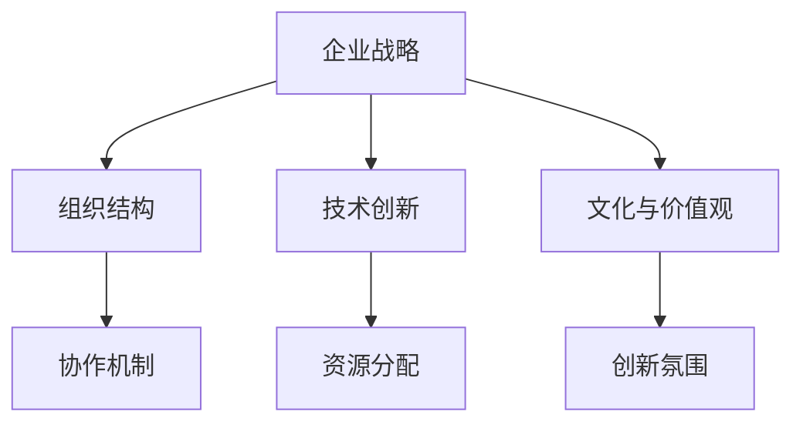
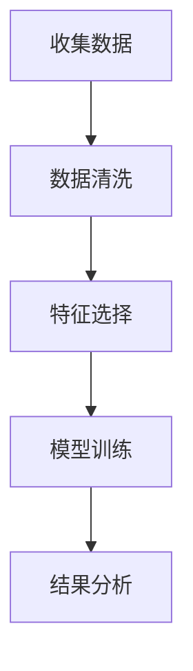
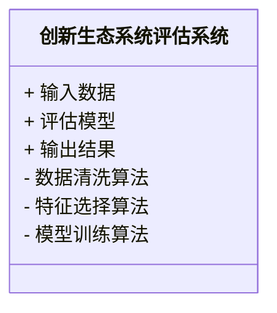
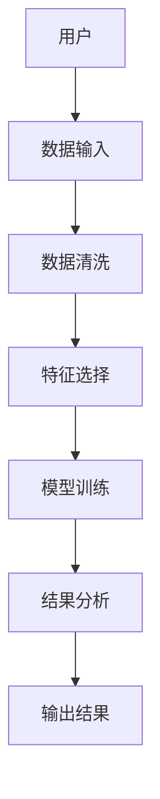
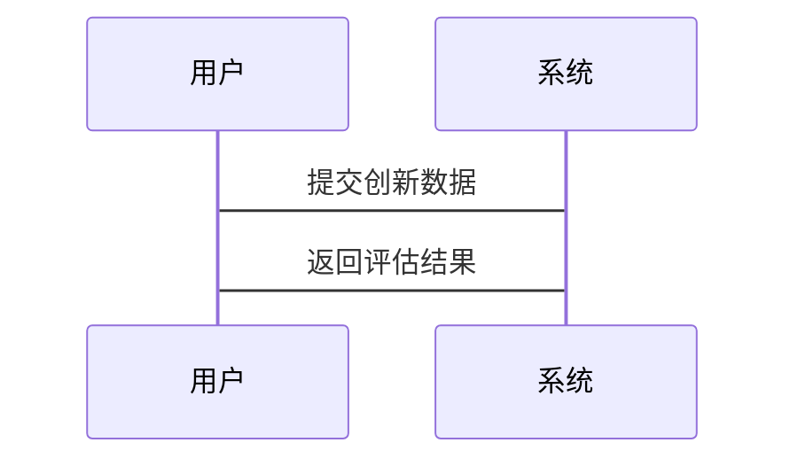

                 


# 彼得林奇对公司创新生态系统可持续性评估

> 关键词：创新生态系统, 可持续性评估, 企业战略, 技术创新, 组织结构, 文化与价值观, 系统架构

> 摘要：本文探讨彼得·林奇对公司创新生态系统可持续性评估的方法，分析其核心概念、算法原理、系统架构，并通过实战案例展示评估过程，最后总结最佳实践。

---

## 第一部分: 创新生态系统概述

### 第1章: 公司创新生态系统的核心概念

#### 1.1 创新生态系统的基本定义
- **创新生态系统的定义**: 创新生态系统是由企业内外部要素构成的网络，包括战略、组织结构、技术创新和文化等。
- **生态系统的特征**: 包括多样性、协作性和动态性。
- **可持续性评估的必要性**: 评估确保企业长期创新，避免资源浪费。

#### 1.2 创新生态系统的核心要素
- **企业战略**: 明确创新方向和目标。
- **组织结构**: 促进跨部门协作。
- **技术创新**: 引入新技术推动创新。
- **文化与价值观**: 鼓励创新和风险承担。

#### 1.3 创新生态系统与公司可持续发展的关系
- **创新生态系统对企业发展的影响**: 创新是企业持续增长的关键。
- **可持续性评估的指标**: 包括创新速度、资源效率、协作效果等。
- **评估对企业价值的影响**: 提高企业竞争力和抗风险能力。

### 第2章: 创新生态系统可持续性评估的背景与问题

#### 2.1 创新生态系统评估的背景
- **当前企业创新面临的挑战**: 包括竞争加剧和技术快速变化。
- **可持续性评估的重要性**: 确保企业创新的长期性。
- **企业创新生态系统的核心问题**: 创新资源分配不均和协作效率低下。

#### 2.2 创新生态系统评估的必要性
- **企业创新的不确定性**: 创新失败可能导致资源浪费。
- **可持续性评估的目标**: 优化创新过程，提高效率。
- **评估对企业价值的影响**: 帮助企业在复杂环境中保持竞争力。

### 第3章: 创新生态系统可持续性评估的核心概念

#### 3.1 创新生态系统评估的基本原理
- **评估的理论基础**: 基于系统论和复杂性理论。
- **评估的关键维度**: 包括创新速度、协作效率和资源利用。
- **评估的框架与模型**: 使用层次分析法和平衡记分卡。

#### 3.2 创新生态系统评估的核心要素
- **企业战略与创新方向**: 明确创新目标和优先级。
- **组织结构与协作机制**: 促进跨部门协作和知识共享。
- **技术创新与资源分配**: 合理分配资源，推动技术进步。
- **文化与价值观对创新的影响**: 鼓励创新思维和风险承担。

### 第4章: 创新生态系统可持续性评估的核心概念与联系

#### 4.1 创新生态系统的核心概念
- **创新生态系统的核心要素**: 包括企业战略、组织结构、技术创新和文化。
- **创新生态系统的动态性**: 创新过程不断变化，需灵活调整。
- **创新生态系统的复杂性**: 各要素相互关联，形成复杂网络。

#### 4.2 创新生态系统概念属性特征对比

| 核心要素      | 属性特征 |
|---------------|----------|
| 企业战略      | 战略性、目标性 |
| 组织结构      | 结构化、协作性 |
| 技术创新      | 技术性、先进性 |
| 文化与价值观   | 文化性、引导性 |

#### 4.3 创新生态系统概念结构与核心要素组成


---

## 第二部分: 创新生态系统可持续性评估的核心概念与联系

### 第5章: 创新生态系统可持续性评估的核心概念

#### 5.1 创新生态系统评估的基本原理
- **理论基础**: 系统论和复杂性理论。
- **评估的关键维度**: 包括创新速度、协作效率和资源利用。
- **评估的框架与模型**: 使用层次分析法和平衡记分卡。

#### 5.2 创新生态系统评估的核心要素
- **企业战略与创新方向**: 明确创新目标和优先级。
- **组织结构与协作机制**: 促进跨部门协作和知识共享。
- **技术创新与资源分配**: 合理分配资源，推动技术进步。
- **文化与价值观对创新的影响**: 鼓励创新思维和风险承担。

### 第6章: 创新生态系统可持续性评估的核心概念与联系

#### 6.1 创新生态系统的核心概念
- **创新生态系统的核心要素**: 包括企业战略、组织结构、技术创新和文化。
- **创新生态系统的动态性**: 创新过程不断变化，需灵活调整。
- **创新生态系统的复杂性**: 各要素相互关联，形成复杂网络。

#### 6.2 创新生态系统概念属性特征对比

| 核心要素      | 属性特征 |
|---------------|----------|
| 企业战略      | 战略性、目标性 |
| 组织结构      | 结构化、协作性 |
| 技术创新      | 技术性、先进性 |
| 文化与价值观   | 文化性、引导性 |

#### 6.3 创新生态系统概念结构与核心要素组成


---

## 第三部分: 创新生态系统可持续性评估的算法原理

### 第7章: 创新生态系统可持续性评估的算法原理

#### 7.1 创新生态系统评估的数学模型
- **线性回归模型**: 用于预测创新成功的概率。
  $$ y = \beta_0 + \beta_1x_1 + \beta_2x_2 + ... + \beta_nx_n + \epsilon $$
  其中，$y$ 是创新成功的指标，$x_i$ 是各个创新要素，$\epsilon$ 是误差项。

#### 7.2 创新生态系统评估的评分系统
- **评分系统**: 对各创新要素进行评分，计算综合得分。
  $$ \text{总分} = \sum (\text{评分}_i \times \text{权重}_i) $$

#### 7.3 创新生态系统评估的流程


#### 7.4 创新生态系统评估的Python代码示例
```python
import pandas as pd
from sklearn.linear_model import LinearRegression

# 假设我们有创新生态系统各要素的数据
data = pd.DataFrame({
    '企业战略': [8, 7, 9, 6],
    '组织结构': [7, 8, 6, 9],
    '技术创新': [9, 6, 8, 7],
    '文化与价值观': [6, 8, 7, 8]
})

# 定义目标变量（假设创新成功的概率）
target = [0.8, 0.7, 0.9, 0.6]

# 创建线性回归模型
model = LinearRegression()

# 训练模型
model.fit(data, target)

# 预测结果
predictions = model.predict(data)
print("预测结果:", predictions)
```

---

## 第四部分: 创新生态系统可持续性评估的系统架构

### 第8章: 创新生态系统可持续性评估的系统架构

#### 8.1 创新生态系统评估的系统功能设计


#### 8.2 创新生态系统评估的系统架构


#### 8.3 创新生态系统评估的系统接口设计
- **输入接口**: 收集企业战略、组织结构、技术创新和文化与价值观的数据。
- **输出接口**: 提供创新生态系统可持续性评估的综合得分和改进建议。

#### 8.4 创新生态系统评估的系统交互


---

## 第五部分: 创新生态系统可持续性评估的项目实战

### 第9章: 创新生态系统可持续性评估的项目实战

#### 9.1 创新生态系统评估的实战环境配置
- **工具安装**: 安装Python、Pandas、Scikit-learn等库。
  ```bash
  pip install numpy pandas scikit-learn
  ```

#### 9.2 创新生态系统评估的核心代码实现
```python
import pandas as pd
from sklearn.linear_model import LinearRegression
from sklearn.metrics import mean_squared_error

# 数据加载
data = pd.read_csv('innovation.csv')

# 定义目标变量
target = data['创新成功概率']

# 定义特征变量
features = data[['企业战略', '组织结构', '技术创新', '文化与价值观']]

# 创建模型
model = LinearRegression()

# 训练模型
model.fit(features, target)

# 预测结果
predictions = model.predict(features)

# 计算均方误差
mse = mean_squared_error(target, predictions)
print("均方误差:", mse)
```

#### 9.3 创新生态系统评估的案例分析
- **案例背景**: 评估一家科技公司的创新生态系统。
- **数据收集**: 收集公司战略、组织结构、技术创新和文化与价值观的数据。
- **模型训练**: 使用线性回归模型进行训练。
- **结果分析**: 分析模型输出的评估结果，提出改进建议。

#### 9.4 创新生态系统评估的项目小结
- **小结**: 创新生态系统评估是一个复杂但重要的任务，需要综合考虑多个因素。
- **改进建议**: 根据评估结果，优化企业的创新策略和组织结构。

---

## 第六部分: 创新生态系统可持续性评估的最佳实践

### 第10章: 创新生态系统可持续性评估的最佳实践

#### 10.1 创新生态系统评估的小结
- **总结**: 创新生态系统评估需要综合考虑企业战略、组织结构、技术创新和文化与价值观等多个方面。
- **经验总结**: 使用系统的方法和工具，能够有效提高评估的准确性和效率。

#### 10.2 创新生态系统评估的注意事项
- **数据质量**: 确保数据的准确性和完整性。
- **模型选择**: 根据实际情况选择合适的评估模型。
- **持续优化**: 定期评估和优化创新生态系统。

#### 10.3 创新生态系统评估的拓展阅读
- **推荐书籍**: 《创新者的窘境》、《创新生态系统》。
- **推荐文章**: 关于创新管理、可持续性评估的最新研究。

---

## 作者：AI天才研究院/AI Genius Institute & 禅与计算机程序设计艺术 /Zen And The Art of Computer Programming

---

这篇文章通过系统地介绍创新生态系统可持续性评估的核心概念、算法原理、系统架构和项目实战，全面分析了彼得·林奇在该领域的观点和方法，为企业提供了一个科学的评估框架和实践指南。

