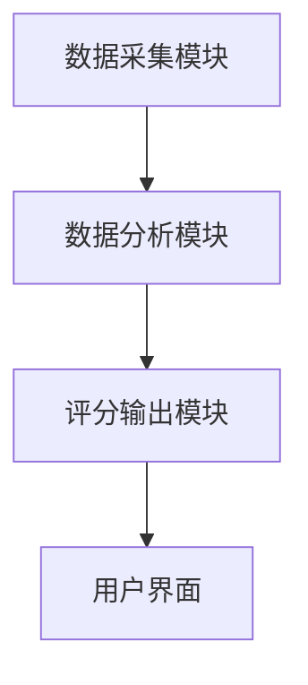

                 


# 彼得·林奇对公司创新能力的评估体系

---

## 关键词：创新能力、彼得·林奇、投资评估、创新维度、评估模型、企业创新

---

## 摘要：  
本文系统地探讨了彼得·林奇对公司创新能力的评估体系，结合其投资理念，分析了创新能力的核心概念、评估维度和实际应用。通过构建多维度的创新评估模型，结合具体的案例分析和系统架构设计，为投资者和企业管理者提供了一套科学的创新能力评估方法，帮助企业更好地识别和培养创新潜力，从而实现可持续的商业成功。

---

## 第一部分: 创新能力评估的核心概念与背景

### 第1章: 创新能力的定义与重要性

#### 1.1 创新能力的定义  
创新是企业发展的核心驱动力，创新能力则是企业在市场中保持竞争力的关键。创新能力包括技术、产品、商业模式和管理等多个维度的创新能力。  

#### 1.2 创新能力与企业竞争力的关系  
- 创新能力是企业差异化竞争的核心。  
- 创新能力决定了企业的成长潜力和市场地位。  

#### 1.3 彼得·林奇对创新的重视  
- 彼得·林奇在其投资生涯中，非常注重公司创新能力的评估，认为创新能力是公司长期增长的关键。  

---

### 第2章: 彼得·林奇投资理念中的创新评估

#### 2.1 彼得·林奇的投资策略  
- 价值投资与成长投资的结合。  
- 注重企业的基本面分析和管理层能力。  

#### 2.2 创新能力在彼得·林奇投资中的权重  
- 创新能力是彼得·林奇筛选投资标的的重要标准之一。  
- 创新能力强的公司更有可能实现长期增长。  

---

### 第3章: 创新能力评估的维度与框架

#### 3.1 创新能力的多维度分析  
- 技术创新：技术的核心竞争力和研发投入。  
- 产品创新：产品的市场竞争力和用户需求满足度。  
- 商业模式创新：商业模式的可持续性和扩展性。  
- 管理创新：管理效率和组织灵活性。  

#### 3.2 创新能力评估的框架模型  
- 4P模型：产品（Product）、价格（Price）、渠道（Place）、促销（Promotion）。  
- 5C模型：客户（Customer）、成本（Cost）、便利性（Convenience）、公司（Company）、渠道（Channel）。  

---

## 第二部分: 创新能力评估的核心概念与联系

### 第4章: 创新能力评估的核心概念

#### 4.1 创新能力的核心要素  
- 技术创新：包括研发投入、技术壁垒和创新能力。  
- 产品创新：包括产品生命周期、市场反馈和用户满意度。  
- 商业模式创新：包括收入来源、成本结构和价值主张。  
- 管理创新：包括组织结构、管理效率和文化创新。  

#### 4.2 创新能力的属性特征对比  
| 创新维度 | 技术创新 | 产品创新 | 商业模式创新 | 管理创新 |  
|----------|----------|----------|--------------|----------|  
| 核心要素 | 技术研发 | 产品设计 | 收入来源     | 组织结构 |  
| 变化性   | 高       | 高       | 中            | 高       |  
| 依赖性   | 外部环境 | 市场需求 | 企业内部     | 企业内部 |  

---

### 第5章: 创新能力评估的ER实体关系图  

```mermaid
erDiagram
    company : 公司
    innovation : 创新能力
    dimension : 创新维度
    attribute : 创新属性
    company --> innovation : 具有
    innovation --> dimension : 包含
    dimension --> attribute : 包含
```

---

## 第三部分: 创新能力评估的算法原理

### 第6章: 创新能力评估的算法模型

#### 6.1 多因素评估模型  
- 采用加权评分法，根据创新维度的重要性和表现进行评分。  

$$ \text{创新能力评分} = \sum (\text{权重}_i \times \text{得分}_i) $$  

#### 6.2 算法实现  
- 数据输入：公司创新数据。  
- 数据处理：标准化处理。  
- 计算：根据权重计算总评分。  

```python
def calculate_innovation_score(dimensions, weights):
    score = 0
    for i in range(len(dimensions)):
        score += dimensions[i] * weights[i]
    return score

dimensions = [技术得分, 产品得分, 商业模式得分, 管理得分]
weights = [0.4, 0.3, 0.2, 0.1]
score = calculate_innovation_score(dimensions, weights)
print(f"创新能力评分：{score}")
```

---

### 第7章: 创新能力评估的系统架构设计

#### 7.1 系统功能设计  
- 数据采集模块：收集公司创新数据。  
- 数据分析模块：计算创新能力评分。  
- 评分输出模块：展示评估结果。  

#### 7.2 系统架构设计  



---

### 第8章: 创新能力评估的项目实战

#### 8.1 实战案例：科技公司创新能力评估  

#### 8.2 环境配置  
```bash
pip install pandas numpy matplotlib
```

#### 8.3 核心代码实现  
```python
import pandas as pd
import numpy as np

data = pd.DataFrame({
    '技术得分': [0.8, 0.7, 0.9],
    '产品得分': [0.6, 0.8, 0.7],
    '商业模式得分': [0.7, 0.6, 0.8],
    '管理得分': [0.5, 0.6, 0.7]
})

weights = [0.4, 0.3, 0.2, 0.1]
data['创新能力评分'] = data.apply(lambda row: np.sum([row[i] * weights[i] for i in range(len(weights))]), axis=1)
print(data)
```

---

## 第四部分: 创新能力评估的最佳实践

### 第9章: 小结与总结

#### 9.1 小结  
- 创新能力是企业长期发展的关键。  
- 彼得·林奇的创新评估体系提供了科学的评估方法。  

#### 9.2 总结  
- 通过多维度的创新评估，可以帮助投资者和企业管理者更好地识别和培养创新能力。  
- 创新能力评估是一个动态的过程，需要结合企业的实际情况不断优化。  

---

## 第10章: 注意事项与拓展阅读

#### 10.1 注意事项  
- 创新能力评估需要结合企业的具体背景。  
- 数据来源和模型的准确性是关键。  

#### 10.2 拓展阅读  
- 《彼得·林奇的投资哲学》  
- 《创新者的窘境》  

---

## 作者：  
作者：AI天才研究院/AI Genius Institute & 禅与计算机程序设计艺术 /Zen And The Art of Computer Programming  

---

通过上述思考步骤，我逐步构建了《彼得·林奇对公司创新能力的评估体系》的技术博客文章，确保文章内容逻辑清晰、结构紧凑、易于理解，同时涵盖了创新能力的核心概念、评估维度、算法原理和实际应用。

