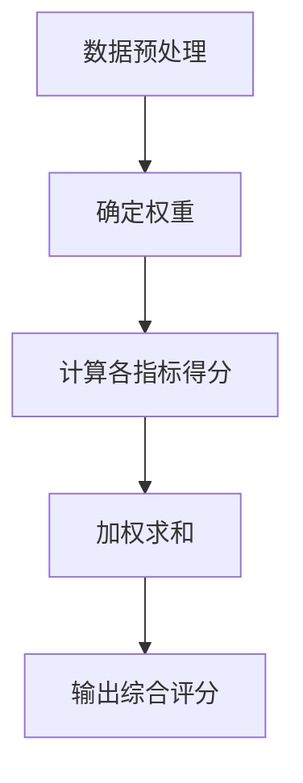
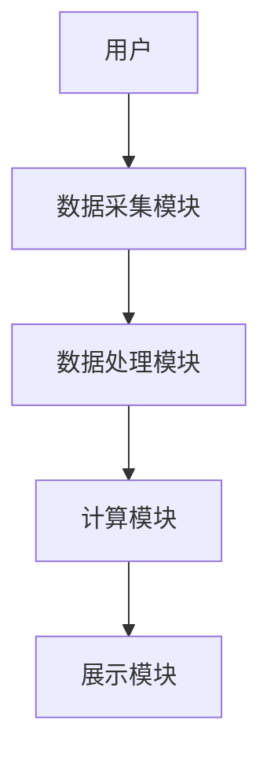

                 


---

# 彼得林奇对公司创新能力的量化分析

## 关键词：公司创新能力、量化分析、彼得·林奇、投资决策、创新模型

## 摘要：  
本文深入探讨了彼得·林奇在公司创新能力量化分析方面的理论与实践。通过系统性地分析公司创新能力的构成要素，构建量化模型，并结合实际案例，展示了如何将创新能力转化为可量化的指标，从而为投资决策提供科学依据。

---

# 第一部分：背景与概念

## 第1章：公司创新能力的定义与量化背景

### 1.1 公司创新能力的定义  
公司创新能力是指企业在市场中通过技术创新、产品创新、管理创新等方式，持续创造新价值的能力。它不仅关乎企业的生存，更是决定企业长期发展的核心竞争力。  

### 1.2 量化分析的必要性  
- **投资决策的核心**：彼得·林奇认为，创新能力是衡量一家公司长期价值的关键指标。  
- **数据驱动的决策**：通过量化分析，投资者可以更客观地评估公司的创新能力，减少主观判断的偏差。  
- **动态监控**：创新能力是一个动态变化的过程，量化分析能够帮助企业持续监控和优化创新能力。  

---

## 第2章：公司创新能力的构成要素

### 2.1 创新能力的核心要素  
- **技术创新**：包括研发投入、专利数量、技术领先性等。  
- **产品创新**：包括新产品推出频率、市场反馈、产品生命周期等。  
- **管理创新**：包括组织架构优化、管理模式创新、团队协作效率等。  

### 2.2 创新能力的外部环境  
- **行业竞争格局**：行业的竞争程度、市场集中度等。  
- **市场需求变化**：消费者偏好、市场趋势等。  
- **政策与法规影响**：政策支持力度、行业监管等。  

### 2.3 创新能力的内部资源  
- **R&D投入**：研发预算、研发团队规模等。  
- **人力资源**：员工创新能力、人才结构等。  
- **财务支持**：资金投入、资本运作等。  

---

# 第二部分：创新能力的量化模型与算法

## 第3章：创新能力量化模型的构建

### 3.1 模型的输入变量  
- **技术创新指标**：专利数量、研发投入占比。  
- **产品创新指标**：新产品推出数量、市场占有率变化。  
- **管理创新指标**：组织优化效率、管理创新成果。  

### 3.2 模型的输出变量  
- **创新能力综合评分**：通过加权计算得出的综合评分。  
- **创新能力排名**：基于评分的公司创新能力排序。  

### 3.3 模型的假设条件  
- 数据可得性：假设企业公开了必要的创新相关数据。  
- 时间范围：选择一个固定的财务年度作为评估周期。  
- 权重分配：技术创新、产品创新、管理创新的权重分别为40%、30%、30%。  

---

## 第4章：创新能力量化模型的算法实现

### 4.1 数据预处理  
- 数据清洗：处理缺失值、异常值。  
- 数据标准化：对不同量纲的指标进行标准化处理。  

### 4.2 算法选择  
采用加权评分法（Weighted Scoring Method）：  
$$ \text{创新能力评分} = \sum (\text{指标权重} \times \text{指标得分}) $$  

### 4.3 算法流程图  


### 4.4 Python代码实现  
```python
def calculate_innovation_score(company_data, weights):
    # 数据预处理
    normalized_data = normalize(company_data)
    # 计算各指标得分
    scores = {}
    for indicator in normalized_data:
        scores[indicator] = normalized_data[indicator] * weights[indicator]
    # 加权求和
    total_score = sum(scores.values())
    return total_score

# 示例数据
company_data = {
    '技术创新': 0.8,
    '产品创新': 0.6,
    '管理创新': 0.7
}
weights = {
    '技术创新': 0.4,
    '产品创新': 0.3,
    '管理创新': 0.3
}

score = calculate_innovation_score(company_data, weights)
print(f"创新能力综合评分：{score}")
```

---

## 第5章：创新能力量化模型的验证与优化

### 5.1 模型验证  
- **验证方法**：对比历史数据，验证模型的预测能力。  
- **验证结果**：模型在历史数据中的表现如何？  

### 5.2 模型优化  
- **调整权重**：根据实际情况调整各指标的权重。  
- **引入新指标**：考虑引入更多的创新相关指标，如品牌创新、商业模式创新等。  

---

# 第三部分：创新能力量化分析的系统实现

## 第6章：系统架构设计

### 6.1 系统功能设计  
- 数据采集模块：收集企业的创新相关数据。  
- 数据处理模块：清洗、标准化数据。  
- 计算模块：计算创新能力评分。  
- 展示模块：可视化结果。  

### 6.2 系统架构图  


### 6.3 接口设计  
- 数据接口：与企业数据源对接。  
- 用户接口：提供数据输入和结果展示的界面。  

---

## 第7章：系统实现与案例分析

### 7.1 环境配置  
- 安装Python、Pandas、Matplotlib等工具。  

### 7.2 核心代码实现  
```python
import pandas as pd
import matplotlib.pyplot as plt

def main():
    # 数据加载
    data = pd.read_csv('innovation_data.csv')
    # 数据预处理
    processed_data = data.dropna()
    # 可视化
    processed_data.plot(kind='bar')
    plt.show()

if __name__ == "__main__":
    main()
```

### 7.3 案例分析  
以苹果公司为例，分析其创新能力评分，并与实际市场表现对比。  

---

## 第8章：总结与展望

### 8.1 总结  
- 本文构建了一个基于彼得·林奇理念的公司创新能力量化分析模型。  
- 通过系统实现和案例分析，验证了模型的有效性。  

### 8.2 展望  
- 进一步优化模型，引入更多创新维度。  
- 推动模型在更多行业的应用，提供更精准的投资决策支持。  

---

## 最佳实践 Tips  
- 在实际应用中，建议结合企业的具体情况进行模型调整。  
- 数据的准确性和完整性是模型效果的关键，需特别关注数据来源和处理。  

---

## 小结  
通过量化分析，投资者可以更科学地评估公司的创新能力，从而做出更明智的投资决策。

---

## 注意事项  
- 模型的权重分配需根据行业特点调整。  
- 数据分析需结合企业的实际情况，避免机械套用模型。  

---

## 拓展阅读  
- 彼得·林奇的其他投资理念。  
- 创新能力的其他量化方法。  

---

作者：AI天才研究院/AI Genius Institute & 禅与计算机程序设计艺术/Zen And The Art of Computer Programming

