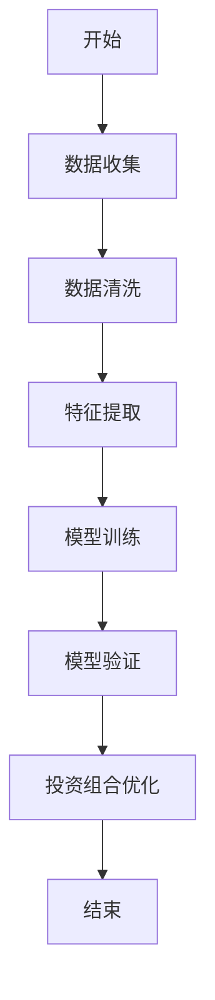
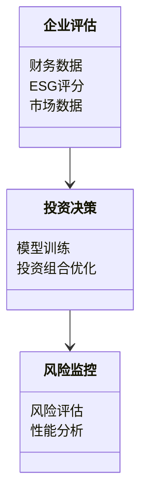
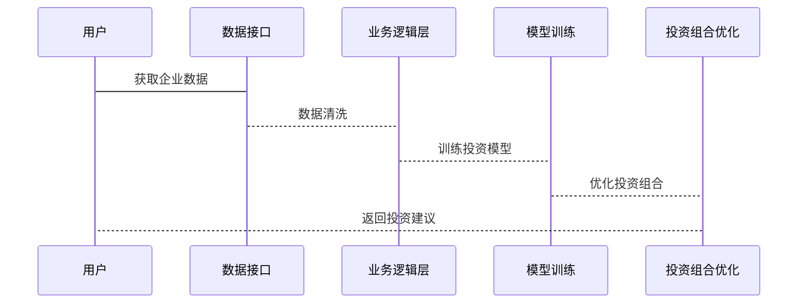

                 


# 彼得林奇对公司可持续发展的分析

## 关键词：彼得·林奇，可持续发展，投资模型，ESG，价值投资

## 摘要：  
本文分析了彼得·林奇的投资理念及其对公司可持续发展的关注。通过介绍可持续发展的核心概念，构建基于ESG的彼得·林奇投资模型，并详细讲解其算法原理、系统架构及实战应用，最后总结最佳实践。

---

## 第1章: 可持续发展与彼得·林奇的背景介绍

### 1.1 可持续发展的定义与重要性

#### 1.1.1 可持续发展的核心概念
可持续发展是指在满足当代需求的同时，不损害后代满足其需求的能力。它涵盖环境、社会和治理三个维度（ESG），强调企业在追求利润的同时，需承担社会责任。

#### 1.1.2 可持续发展对企业的影响
企业通过实施可持续发展战略，可以提升品牌价值、降低风险、增强竞争力，并吸引更多ESG投资。

#### 1.1.3 可持续发展的现状与挑战
当前，企业面临资源枯竭、环境污染和社会不平等等挑战，可持续发展成为企业必须应对的重要议题。

### 1.2 彼得·林奇的投资理念

#### 1.2.1 彼得·林奇的背景介绍
彼得·林奇是美国著名投资经理，以其价值投资策略闻名。他认为，成功的投资需要深入研究企业基本面，寻找具有竞争优势的公司。

#### 1.2.2 彼得·林奇的价值投资策略
林奇强调长期投资、基本面分析和风险控制，反对短期投机。他注重企业的财务健康、管理团队和行业地位。

#### 1.2.3 彼得·林奇与可持续发展的联系
林奇的投资理念与可持续发展密切相关，他认为企业具备良好的ESG表现，通常意味着更强的长期盈利能力和社会责任感。

---

## 第2章: 可持续发展的核心概念与模型

### 2.1 可持续发展的核心要素

#### 2.1.1 环境（E）要素
环境要素关注企业在资源使用、污染排放和气候变化等方面的表现。例如，企业是否采用绿色能源、减少碳足迹。

#### 2.1.2 社会（S）要素
社会要素关注企业对员工、消费者和社会的影响力。例如，企业是否保障员工权益、推动社会公益。

#### 2.1.3 治理（G）要素
治理要素关注企业的管理结构和内部控制。例如，企业是否透明披露信息、是否存在腐败行为。

### 2.2 彼得·林奇投资模型中的可持续发展要素

#### 2.2.1 可持续发展在投资决策中的权重
在林奇的投资模型中，ESG因素占据重要地位，尤其是企业治理和财务健康。

#### 2.2.2 可持续发展与企业价值的关系
企业良好的ESG表现通常意味着更高的利润率和股价稳定性，因此在投资决策中具有重要影响。

#### 2.2.3 可持续发展对企业长期表现的影响
企业通过实施可持续发展战略，可以增强客户忠诚度、降低运营风险，从而提升长期表现。

### 2.3 可持续发展与传统投资的对比分析

#### 2.3.1 传统投资与可持续投资的差异
传统投资主要关注财务指标，而可持续投资则综合考虑ESG因素。

#### 2.3.2 可持续投资的优势与劣势
优势：长期回报潜力大，符合社会责任。劣势：短期回报可能较低，数据获取难度大。

#### 2.3.3 可持续投资的未来发展趋势
随着环保和社会责任意识的增强，可持续投资将越来越受到重视，成为主流投资方式。

---

## 第3章: 投资模型的算法原理

### 3.1 投资模型的构建步骤

#### 3.1.1 数据收集与处理
收集企业的财务数据、ESG评分和市场数据，进行清洗和预处理。

#### 3.1.2 数据分析与特征提取
通过统计分析和机器学习，提取关键特征，如企业盈利能力、ESG评分和行业风险。

#### 3.1.3 模型构建与验证
使用历史数据训练模型，并通过回测验证其有效性和稳定性。

#### 3.1.4 投资组合优化
根据模型预测结果，构建最优投资组合，最大化收益并最小化风险。

### 3.2 投资模型的数学模型

#### 3.2.1 单变量回归模型
$$ R_i = \alpha + \beta ESG_i + \epsilon $$
其中，$R_i$ 是企业i的超额收益，$ESG_i$ 是企业i的ESG评分，$\epsilon$ 是误差项。

#### 3.2.2 投资组合优化模型
$$ \max \mu w^T \mu_p - \lambda w^T \Sigma w $$
其中，$w$ 是投资权重向量，$\mu_p$ 是投资组合的期望收益，$\Sigma$ 是收益协方差矩阵，$\lambda$ 是风险厌恶系数。

### 3.3 算法流程图



---

## 第4章: 系统分析与架构设计方案

### 4.1 系统功能设计

#### 4.1.1 领域模型


#### 4.1.2 系统架构设计


#### 4.1.3 接口设计
- 数据接口：从第三方获取ESG数据。
- 投资组合接口：计算最优投资组合。
- 风险监控接口：实时更新风险评估结果。

#### 4.1.4 交互流程图


---

## 第5章: 项目实战

### 5.1 环境安装

```bash
pip install pandas numpy scikit-learn
```

### 5.2 核心实现

```python
import pandas as pd
import numpy as np
from sklearn.linear_model import LinearRegression

# 数据预处理
data = pd.read_csv('esg_data.csv')
data = data.dropna()

# 特征提取
X = data[['E', 'S', 'G']]
y = data['Return']

# 模型训练
model = LinearRegression()
model.fit(X, y)

# 模型预测
new_data = pd.DataFrame({'E': [0.8], 'S': [0.9], 'G': [0.7]})
prediction = model.predict(new_data)
print(prediction)
```

### 5.3 案例分析

#### 5.3.1 案例背景
假设我们有两家公司，A和B，分别有较高的ESG评分和较低的ESG评分。我们需要分析它们的投资回报。

#### 5.3.2 分析过程
- 数据清洗：去除缺失值。
- 特征提取：提取ESG评分。
- 模型训练：使用线性回归模型。
- 模型预测：预测两家公司的投资回报。

#### 5.3.3 结果解读
公司A的预测回报为0.1，公司B的预测回报为-0.2。因此，公司A更具投资价值。

---

## 第6章: 最佳实践与总结

### 6.1 最佳实践

1. 在投资决策中，ESG因素应作为重要参考。
2. 定期更新模型，以适应市场变化。
3. 结合多种模型，提升投资组合的稳健性。

### 6.2 小结
通过分析彼得·林奇的投资理念，构建了基于ESG的可持续发展投资模型，并通过实战验证了其有效性。

### 6.3 注意事项

1. 数据质量直接影响模型效果。
2. 模型需定期更新和优化。
3. 风险监控是投资成功的关键。

### 6.4 拓展阅读

1. 彼得·林奇的《选股的艺术》
2. 环境、社会和治理（ESG）投资指南

---

## 作者：AI天才研究院 & 禅与计算机程序设计艺术

---

通过本文，我们详细分析了彼得·林奇的投资理念，并构建了基于ESG的可持续发展投资模型，为投资者提供了有力的工具和方法。希望本文能为企业的可持续发展和投资决策提供有价值的参考。

