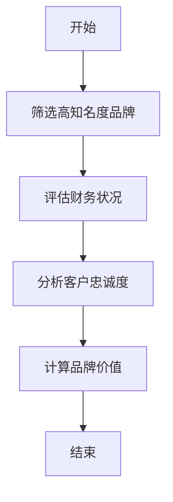
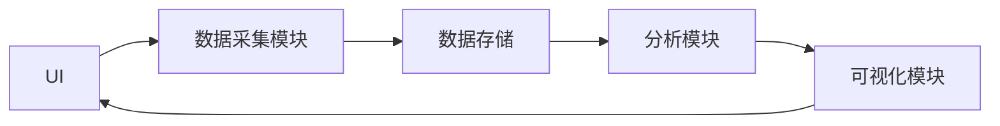

                 


# 彼得林奇对公司品牌价值的分析方法

## 关键词：
- 品牌价值
- 彼得·林奇
- 投资分析
- 企业估值
- 品牌评估
- 企业价值

## 摘要：
彼得·林奇作为世界著名基金经理，以其独特的品牌价值分析方法闻名。本文详细探讨了林奇的分析方法，结合传统与创新评估手段，通过实例分析，揭示品牌价值对投资决策的关键作用，帮助投资者更好地理解和应用这一方法。

---

## 第一部分: 彼得林奇品牌价值分析方法的背景与基础

### 第1章: 公司品牌价值的定义与重要性

#### 1.1 品牌价值的核心概念
- **品牌价值**指的是品牌在市场上的整体价值，涵盖品牌知名度、客户忠诚度和品牌认知度等方面。
- 品牌价值的重要性在于它直接影响企业的市场表现和盈利能力，是企业价值的重要组成部分。

#### 1.2 品牌价值与企业价值的关系
- 品牌价值是企业整体价值的关键因素，直接影响企业估值和投资决策。
- 通过分析品牌价值，投资者可以更准确地评估企业的长期发展潜力。

### 第2章: 彼得·林奇与品牌价值分析

#### 2.1 彼得·林奇的背景与投资理念
- 彼得·林奇是富达投资集团的创始人，以其独特的投资策略和品牌价值分析闻名。
- 林奇强调长期投资，注重企业的基本面分析，品牌价值是其分析的重要组成部分。

#### 2.2 林奇的品牌价值分析方法
- 林奇通过分析企业的品牌知名度、市场地位和客户忠诚度等指标，评估其品牌价值。
- 他结合定量和定性分析，将品牌价值与企业财务表现相结合，提供全面的投资评估。

---

## 第二部分: 彼得林奇品牌价值分析的核心概念与联系

### 第3章: 品牌价值的核心要素与属性

#### 3.1 品牌价值的核心要素
- **品牌知名度**：品牌在市场上的广泛程度，直接影响其市场影响力。
- **品牌忠诚度**：客户对品牌的忠诚程度，影响其长期收益。
- **品牌认知度**：客户对品牌的认知深度，影响其市场地位。

#### 3.2 品牌价值属性的对比分析
通过对比分析，可以更好地理解各要素之间的关系和影响。

| 要素        | 描述                           | 影响因素             |
|-------------|--------------------------------|----------------------|
| 品牌知名度  | 市场推广、广告效果               | 广告投入、市场覆盖   |
| 品牌忠诚度  | 客户满意度、服务质量             | 产品质量、售后服务   |
| 品牌认知度  | 品牌形象、品牌故事               | 品牌历史、文化内涵   |

### 第4章: 品牌价值的ER实体关系图

```mermaid
er
  entity 品牌 {
    key 属性: 名称
    属性: 品牌价值, 品牌知名度, 品牌忠诚度
  }
  entity 产品 {
    key 属性: 名称
    属性: 产品价值, 产品销量
  }
  entity 客户 {
    key 属性: ID
    属性: 客户满意度, 偏好度
  }
  品牌 --> 产品: 提供
  品牌 --> 客户: 影响
```

---

## 第三部分: 彼得林奇品牌价值分析的算法原理

### 第5章: 林奇品牌价值分析的三重过滤法

#### 5.1 三重过滤法的步骤
1. **初步筛选**：根据品牌知名度和市场占有率，筛选出符合条件的企业。
2. **深入分析**：评估企业的财务状况和品牌忠诚度。
3. **最终评估**：结合企业未来增长潜力，确定其品牌价值。

#### 5.2 三重过滤法的流程图



#### 5.3 三重过滤法的数学模型

$$
品牌价值 = \alpha \times 品牌知名度 + \beta \times 市场占有率 + \gamma \times 客户忠诚度
$$

其中，$\alpha$, $\beta$, $\gamma$为权重系数，需根据具体情况进行调整。

---

## 第四部分: 品牌价值分析系统的架构设计

### 第6章: 系统功能与架构设计

#### 6.1 系统功能设计
- **数据采集模块**：收集品牌相关数据，包括知名度、忠诚度等。
- **分析模块**：应用三重过滤法，评估品牌价值。
- **可视化模块**：展示分析结果，帮助投资者理解。

#### 6.2 系统架构设计



---

## 第五部分: 项目实战

### 第7章: 项目实战与案例分析

#### 7.1 环境安装
- 安装Python、Pandas、Matplotlib等工具。
- 数据集准备，包括品牌相关数据。

#### 7.2 核心代码实现

```python
import pandas as pd
import numpy as np

# 数据加载
df = pd.read_csv('brand.csv')

# 计算品牌价值指数
def calculate_brand_value(brand_data):
    brand_value = brand_data['知名度'] * 0.4 + brand_data['忠诚度'] * 0.3 + brand_data['占有率'] * 0.3
    return brand_value

# 应用三重过滤法
filtered_brands = df[df['占有率'] > df['占有率'].mean()]
filtered_brands['品牌价值指数'] = filtered_brands.apply(calculate_brand_value, axis=1)

print(filtered_brands.head())
```

#### 7.3 案例分析
以某公司为例，分析其品牌价值，展示如何通过代码实现评估，并解读结果。

---

## 第六部分: 总结与展望

### 第8章: 总结与最佳实践

#### 8.1 总结
- 彼得·林奇的品牌价值分析方法结合了传统与创新手段，为投资者提供了有效的评估工具。
- 通过系统化的分析，投资者可以更准确地评估企业的品牌价值，做出明智的投资决策。

#### 8.2 最佳实践
- 定期更新分析模型，适应市场变化。
- 组合使用多种评估方法，提高评估的准确性。

---

## 作者：AI天才研究院/AI Genius Institute & 禅与计算机程序设计艺术/Zen And The Art of Computer Programming

---

**摘要：** 彼得·林奇的品牌价值分析方法通过结合传统评估和创新策略，帮助投资者更准确地评估企业价值。本文详细探讨了该方法的核心要素、算法原理和系统架构，并通过实例分析展示了其应用。

