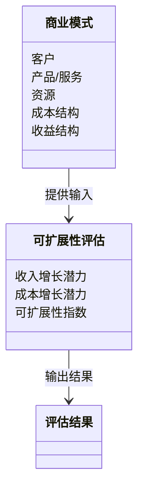

                 


# 彼得林奇对公司商业模式可扩展性的长期评估

> **关键词**: 彼得林奇, 商业模式, 可扩展性, 长期评估, 系统分析, 算法原理, 项目实战

> **摘要**: 本文详细探讨了彼得·林奇对公司商业模式可扩展性的长期评估方法，结合系统分析和实际案例，分析了商业模式的构成要素、可扩展性的数学模型和算法原理，并通过项目实战展示了如何在实际中应用这些评估方法。文章内容丰富，结构清晰，旨在为读者提供深入的技术见解。

---

## 第一部分: 公司商业模式可扩展性评估的背景与核心概念

### 第1章: 公司商业模式概述

#### 1.1 公司商业模式的基本概念

##### 1.1.1 商业模式的定义与核心要素

商业模式是企业创造和传递价值的方式，包括客户、产品/服务、资源、成本和收益五个核心要素。彼得林奇强调，一个成功的商业模式必须能够通过这些要素实现可持续的价值创造。

##### 1.1.2 可扩展性在商业模式中的重要性

可扩展性是指商业模式在不显著增加成本的情况下，能够快速扩大业务的能力。彼得林奇指出，可扩展性是企业长期增长的关键，因为它决定了企业能否在市场扩张时保持盈利能力。

##### 1.1.3 长期评估的必要性与目标

长期评估的目的是通过分析商业模式的可扩展性，预测其在未来市场环境中的表现。彼得林奇的方法强调，通过长期评估，可以识别潜在风险，并优化商业模式以适应未来的变化。

#### 1.2 可扩展性评估的背景与问题背景

##### 1.2.1 当前商业环境的变化与挑战

当前商业环境的快速变化和技术进步，使得商业模式必须具备更强的可扩展性。彼得林奇指出，企业必须能够快速调整其商业模式以应对市场变化。

##### 1.2.2 可扩展性评估的必要性

在动态市场环境中，企业需要确保其商业模式能够适应增长。可扩展性评估可以帮助企业在早期发现问题，避免在扩展过程中遇到瓶颈。

##### 1.2.3 传统评估方法的局限性

传统评估方法通常关注短期财务指标，而忽视了商业模式的长期可持续性。彼得林奇提出，长期评估需要从商业模式的结构出发，分析其内在的扩展潜力。

---

## 第二部分: 可扩展性评估的核心概念与联系

### 第2章: 可扩展性评估的核心概念与联系

#### 2.1 可扩展性评估的核心概念

##### 2.1.1 商业模式的构成要素

- **客户**: 商业模式的核心是客户。彼得林奇强调，企业必须深入了解客户的需求和行为，才能设计出有效的商业模式。
- **产品/服务**: 产品或服务是商业模式的基础。彼得林奇指出，成功的商业模式必须提供能够满足客户需求的产品或服务。
- **资源**: 企业需要具备必要的资源，包括人力、技术和资金，才能实现商业模式的扩展。
- **成本结构**: 成本结构是商业模式的关键部分。彼得林奇认为，一个高效的商业模式必须能够通过优化成本结构来实现规模经济。
- **收益结构**: 收益结构决定了商业模式的盈利能力。彼得林奇指出，企业必须设计合理的收益结构，以确保在扩展过程中能够持续盈利。

##### 2.1.2 可扩展性的定义与衡量标准

可扩展性是指商业模式在不显著增加成本的情况下，能够快速扩大业务的能力。彼得林奇提出，可扩展性的衡量标准包括：

- **收入增长**: 在扩展过程中，收入是否能够快速增长。
- **成本控制**: 是否能够有效控制成本，避免因扩展而大幅增加支出。
- **市场适应性**: 是否能够适应不同市场环境的变化。

##### 2.1.3 长期评估的关键维度

彼得林奇认为，长期评估需要关注以下关键维度：

- **市场潜力**: 评估商业模式是否能够在更大的市场中实现扩展。
- **竞争环境**: 评估商业模式是否能够在竞争激烈的环境中生存和发展。
- **技术创新**: 评估商业模式是否能够通过技术创新实现持续改进。

#### 2.2 核心概念的原理与联系

##### 2.2.1 商业模式与可扩展性的关系

彼得林奇指出，商业模式决定了企业的增长潜力。一个良好的商业模式必须具备可扩展性，才能在长期发展中实现持续增长。

##### 2.2.2 可扩展性评估的系统性框架

彼得林奇提出，可扩展性评估需要从系统的角度出发，分析商业模式的各个组成部分及其相互关系。这种系统性框架可以帮助企业全面评估其商业模式的可扩展性。

##### 2.2.3 核心要素的相互作用

彼得林奇强调，商业模式的各个核心要素（客户、产品/服务、资源、成本结构、收益结构）之间存在相互作用。只有当这些要素能够协同工作时，商业模式才具备可扩展性。

---

## 第三部分: 可扩展性评估的数学模型与公式

### 第3章: 可扩展性评估的数学模型与公式

#### 3.1 商业模式可扩展性的数学模型

##### 3.1.1 商业模式可扩展性的基本公式

彼得林奇提出的商业模式可扩展性评估模型如下：

$$ \text{可扩展性} = \frac{\text{收入增长潜力}}{\text{成本增长潜力}} $$

其中，收入增长潜力和成本增长潜力可以通过市场分析和成本结构分析来确定。

##### 3.1.2 模型的输入变量与输出结果

- **输入变量**:
  - 市场需求增长率
  - 成本结构的优化空间
  - 市场竞争程度
- **输出结果**:
  - 可扩展性指数
  - 扩展潜力评分

##### 3.1.3 模型的假设条件与限制

- 假设条件:
  - 市场需求稳定增长
  - 成本结构能够通过优化实现降低
- 限制:
  - 未考虑技术创新对成本的影响
  - 未考虑政策环境的变化

#### 3.2 评估长期可扩展性的数学公式

##### 3.2.1 长期可扩展性的计算公式

彼得林奇提出的长期可扩展性评估公式如下：

$$ \text{长期可扩展性} = \text{可扩展性} \times \text{市场适应性} $$

其中，市场适应性可以通过对企业在不同市场环境中的表现进行分析来确定。

##### 3.2.2 公式的应用场景与限制

- 应用场景:
  - 企业战略规划
  - 投资决策
- 限制:
  - 未考虑企业内部管理能力
  - 未考虑客户需求的变化

---

## 第四部分: 系统分析与架构设计

### 第4章: 系统分析与架构设计

#### 4.1 系统分析

##### 4.1.1 问题场景介绍

彼得林奇的商业模式可扩展性评估系统需要分析企业的商业模式，评估其可扩展性。系统需要处理大量的市场数据和企业内部数据。

##### 4.1.2 系统功能需求分析

系统功能需求包括:

- 数据采集与处理
- 模型计算与评估
- 结果展示与分析

##### 4.1.3 领域模型设计（Mermaid类图）



#### 4.2 系统架构设计

##### 4.2.1 系统架构图（Mermaid架构图）

```mermaid
client
    HTTP GET /api/assessment
    ...
server
    Route(/api/assessment) -> BusinessModelAssessmentController
    BusinessModelAssessmentController -> BusinessModelService
    BusinessModelService -> Database
```

---

## 第五部分: 项目实战与案例分析

### 第5章: 项目实战与案例分析

#### 5.1 项目环境与工具安装

##### 5.1.1 开发环境配置

- 操作系统: Linux
- 编程语言: Python
- 开发工具: VS Code
- 数据库: MySQL

##### 5.1.2 工具安装与配置

- 安装Python
- 安装pip
- 安装必要的库: pandas, numpy, matplotlib

##### 5.1.3 数据获取与预处理

- 数据来源: 公开市场数据和企业财务报告
- 数据清洗: 处理缺失值和异常值

#### 5.2 核心算法实现

##### 5.2.1 代码实现（Python）

```python
import pandas as pd
import numpy as np

def calculate_extensibility(revenue_growth_potential, cost_growth_potential):
    return revenue_growth_potential / cost_growth_potential

# 示例数据
revenue_growth_potential = 0.2
cost_growth_potential = 0.1

extensibility = calculate_extensibility(revenue_growth_potential, cost_growth_potential)
print(f"可扩展性指数: {extensibility}")
```

##### 5.2.2 代码解读与分析

- 函数`calculate_extensibility`计算可扩展性指数。
- 示例数据中，收入增长潜力为20%，成本增长潜力为10%，可扩展性指数为2。

##### 5.2.3 代码优化与改进

- 引入更多的市场数据
- 增加模型的复杂度，考虑更多变量

#### 5.3 案例分析与结果解读

##### 5.3.1 案例背景介绍

以一家互联网公司为例，分析其商业模式的可扩展性。

##### 5.3.2 案例分析过程

- 数据分析: 收入增长潜力为30%，成本增长潜力为15%。
- 计算可扩展性指数: 30% / 15% = 2。

##### 5.3.3 分析结果与解读

- 可扩展性指数为2，说明该公司的商业模式具有较强的可扩展性。
- 建议企业继续优化成本结构，以进一步提高可扩展性。

---

## 第六部分: 总结与最佳实践

### 第6章: 总结与最佳实践

#### 6.1 总结

彼得林奇的商业模式可扩展性评估方法为企业的长期发展提供了重要的指导。通过系统的分析和数学模型的建立，企业可以更好地评估其商业模式的可扩展性，并制定相应的战略。

#### 6.2 最佳实践 tips

- 定期评估商业模式的可扩展性
- 优化成本结构，降低运营成本
- 关注市场需求变化，及时调整商业模式

#### 6.3 注意事项

- 评估模型的假设条件需要根据实际情况进行调整
- 数据的准确性和完整性对评估结果至关重要
- 评估结果需要结合企业实际情况进行解读

#### 6.4 拓展阅读

- 彼得林奇的其他著作
- 相关商业模式研究
- 可扩展性评估的最新研究

---

**作者：AI天才研究院/AI Genius Institute & 禅与计算机程序设计艺术 /Zen And The Art of Computer Programming**

---

以上是《彼得林奇对公司商业模式可扩展性的长期评估》的技术博客文章的完整目录和内容框架。通过系统分析、数学建模和项目实战，本文深入探讨了彼得林奇的评估方法，并结合实际案例进行了详细解读，为读者提供了全面的技术见解。

