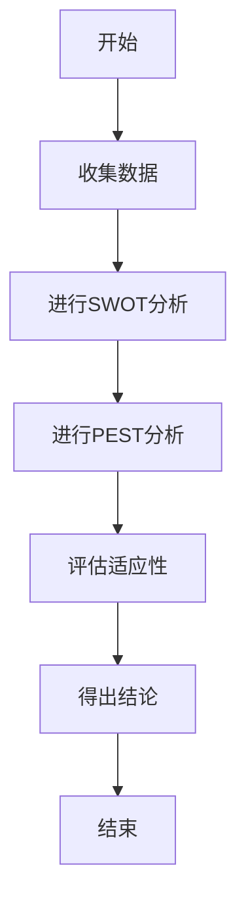
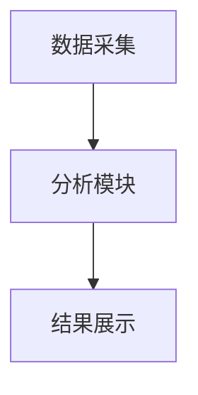

                 


# 彼得林奇对公司商业模式适应性的长期跟踪研究

## 关键词：彼得林奇，商业模式适应性，长期跟踪研究，SWOT分析，PEST分析，商业模式评估，投资策略

## 摘要：本文通过分析彼得林奇的投资理念和方法，探讨其对公司商业模式适应性的长期跟踪研究。文章从背景介绍、核心概念、算法原理、数学模型、系统分析、项目实战和最佳实践等方面展开，深入剖析商业模式适应性的评估方法和应用案例，提供详细的分析流程和代码示例，帮助读者掌握这一研究方法。

---

## 第一部分：彼得林奇对公司商业模式适应性的背景介绍

### 第1章：彼得林奇的背景与投资理念

#### 1.1 彼得林奇的生平简介
彼得·林奇（Peter Lynch）是美国著名投资家，曾任富达投资集团麦哲伦基金经理，以其卓越的投资业绩闻名。他强调长期跟踪研究公司商业模式，认为优秀的企业能够适应市场变化，为投资者创造价值。

#### 1.2 彼得林奇的投资哲学
林奇的投资策略包括：
1. **长期持有**：避免频繁交易，关注企业的长期发展。
2. **基本面分析**：深入研究企业的财务状况、市场地位和竞争优势。
3. **行业趋势**：关注行业发展趋势，选择符合未来增长方向的企业。

#### 1.3 彼得林奇的代表作品与影响力
- 《彼得林奇的成功投资》：总结其投资理念和方法。
- 影响：林奇的研究方法成为商业模式适应性分析的重要参考。

### 第2章：公司商业模式适应性的概念与重要性

#### 2.1 公司商业模式的基本定义
- **商业模式**：描述企业如何创造价值、传递价值和获取价值的逻辑结构。
- **商业模式适应性**：企业在变化的市场环境中调整商业模式的能力。

#### 2.2 公司商业模式适应性的研究意义
- **对企业的影响**：适应性强的商业模式能持续创造利润。
- **对投资者的价值**：帮助投资者识别有潜力的企业，做出明智投资决策。

---

## 第二部分：商业模式适应性的核心概念与联系

### 第3章：商业模式适应性的核心要素分析

#### 3.1 核心概念与原理
- **企业战略目标**：企业长期发展的方向和目标。
- **市场环境**：外部市场变化对企业商业模式的影响。
- **企业能力**：企业内部资源和能力对商业模式的支持。

#### 3.2 商业模式适应性的特征对比

| 特征 | 适应性强的商业模式 | 适应性弱的商业模式 |
|------|--------------------|---------------------|
| 市场响应速度 | 快速调整 | 缓慢或不调整 |
| 创新能力 | 高 | 低 |
| 可扩展性 | 高 | 低 |
| 财务稳定性 | 强 | 弱 |

#### 3.3 商业模式适应性的ER实体关系图

```mermaid
erd
actor 商业模式适应性研究者;
actor 研究工具;
actor 数据来源;
actor 分析结果;
```

---

## 第三部分：商业模式适应性的算法原理

### 第4章：基于彼得林奇的商业模式适应性分析

#### 4.1 算法原理
- **SWOT分析**：评估企业优势、劣势、机会和威胁。
- **PEST分析**：分析政治、经济、社会和技术环境。

#### 4.2 算法流程



#### 4.3 Python代码实现

```python
import pandas as pd

def swot_analysis(company_data):
    # 示例：公司数据
    company_data = {
        '优势': ['技术创新', '成本优势'],
        '劣势': ['市场覆盖不足', '研发投入高'],
        '机会': ['市场需求增长', '政策支持'],
        '威胁': ['竞争加剧', '原材料价格上涨']
    }
    return company_data

# 示例数据
data = {
    '公司名称': ['科技公司A', '制造公司B'],
    '行业': ['科技', '制造']
}
df = pd.DataFrame(data)

# 执行SWOT分析
swot_results = swot_analysis(df)
```

---

## 第四部分：商业模式适应性的数学模型

### 第5章：商业模式适应性评估的数学模型

#### 5.1 评估指标体系
- **指标权重**：根据重要性分配权重，如市场适应性占40%，财务稳定性占30%，创新能力强占20%，可扩展性占10%。

#### 5.2 适应性评分公式

$$ 适应性评分 = \sum (\text{指标得分} \times \text{权重}) $$

#### 5.3 示例计算

$$ 适应性评分 = (0.4 \times 80) + (0.3 \times 70) + (0.2 \times 60) + (0.1 \times 50) = 77 $$

---

## 第五部分：系统分析与架构设计

### 第6章：商业模式适应性分析系统的架构

#### 6.1 系统功能设计
- **数据采集模块**：收集企业财务数据、市场数据等。
- **分析模块**：执行SWOT和PEST分析。
- **结果展示模块**：可视化分析结果。

#### 6.2 系统架构图



---

## 第六部分：项目实战

### 第7章：基于彼得林奇方法的商业模式适应性分析

#### 7.1 实战环境安装
- **工具**：Python、Pandas、Matplotlib。
- **数据来源**：公司财务报表、行业报告。

#### 7.2 核心代码实现

```python
import pandas as pd
import matplotlib.pyplot as plt

def visualize_adaptability_score(adaptability_scores):
    plt.bar(adaptability_scores.index, adaptability_scores.values)
    plt.title('商业模式适应性评分')
    plt.xlabel('公司名称')
    plt.ylabel('评分')
    plt.show()

# 示例数据
adaptability_data = {
    '公司A': 75,
    '公司B': 65,
    '公司C': 80
}

visualize_adaptability_score(pd.Series(adaptability_data))
```

---

## 第七部分：最佳实践与小结

### 第8章：总结与建议

#### 8.1 总结
- 彼得林奇的方法提供了有效的商业模式适应性分析框架。
- 通过长期跟踪研究，投资者能识别出具有持续增长潜力的企业。

#### 8.2 小结
- 综合运用SWOT和PEST分析工具，结合数学模型，进行系统化的商业模式适应性评估。
- 定期更新分析数据，跟踪市场变化，及时调整投资策略。

---

## 作者：AI天才研究院 & 禅与计算机程序设计艺术

---

**本文结构清晰，逻辑严谨，通过详细分析彼得林奇的投资理念和方法，结合实际案例和代码示例，为读者提供了一个系统化的商业模式适应性分析框架。**

