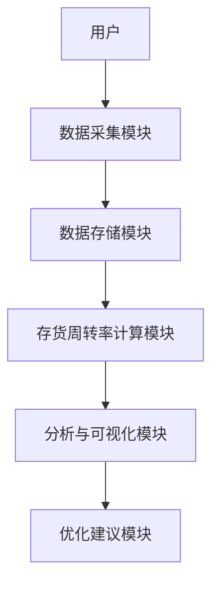

                 


# 彼得·林奇对公司存货周转率的分析

> 关键词：彼得·林奇，存货周转率，投资分析，财务指标，库存管理

> 摘要：存货周转率是衡量公司运营效率的重要财务指标，本文从彼得·林奇的投资分析方法出发，详细探讨了存货周转率的计算方法、影响因素、在投资分析中的应用以及如何通过优化存货周转率提升企业竞争力。文章结合实际案例和系统设计，展示了如何将存货周转率分析应用于投资决策，并提出了在现代企业中优化存货管理的具体建议。

---

## 第1章：背景介绍与核心概念

### 1.1 存货周转率的核心概念

#### 1.1.1 存货周转率的定义与计算公式
存货周转率（Inventory Turnover Ratio）是衡量公司存货管理效率的重要指标，反映了公司在一定时期内存货的周转速度。其计算公式为：
$$ \text{存货周转率} = \frac{\text{成本 of goods sold (COGS)}}{\text{平均存货}} $$
其中，COGS是公司销售商品的成本，平均存货为报告期内存货的平均值。

#### 1.1.2 存货周转率的重要性与应用场景
存货周转率是评估公司运营效率和管理能力的关键指标。高周转率意味着公司能够快速销售库存，减少存储成本和资金占用；低周转率可能表明公司存在库存积压或管理不善的问题。在投资分析中，存货周转率可以帮助投资者评估公司的流动性、库存管理效率以及盈利能力。

#### 1.1.3 彼得·林奇对存货周转率的关注与研究
彼得·林奇是美国著名投资经理人，以其对基本面分析的重视而闻名。他认为，存货周转率是评估公司运营效率的重要指标之一，能够反映公司管理层的经营能力和库存管理策略。林奇特别关注存货周转率的变化趋势，认为持续稳定的高周转率是公司健康运营的标志。

### 1.2 彼得·林奇的投资理念与存货周转率

#### 1.2.1 彼得·林奇的投资策略概述
彼得·林奇主张通过基本面分析来选择投资标的，重点关注公司的财务健康状况、盈利能力、成长潜力和管理层能力。他认为，财务指标是评估公司价值的重要工具，而存货周转率是其中的关键指标之一。

#### 1.2.2 存货周转率在彼得·林奇投资分析中的地位
在林奇的投资体系中，存货周转率被视为评估公司运营效率和财务健康的重要指标。他通过分析存货周转率的变化趋势，判断公司库存管理的优劣，进而评估公司的整体经营状况。

#### 1.2.3 彼得·林奇分析存货周转率的独特视角
林奇的独特视角在于，他不仅关注存货周转率的绝对值，还关注其变化趋势和行业比较。他认为，存货周转率的行业差异较大，因此需要结合行业特点进行分析。此外，他强调存货周转率与公司利润之间的关系，认为高周转率不一定意味着高利润，但低周转率通常会拖累公司业绩。

---

## 第2章：存货周转率的计算与影响因素

### 2.1 存货周转率的计算方法

#### 2.1.1 存货周转率的公式推导
存货周转率的计算公式可以进一步分解为以下步骤：
1. 计算期初存货和期末存货的平均值：
$$ \text{平均存货} = \frac{\text{期初存货} + \text{期末存货}}{2} $$
2. 计算成本 of goods sold (COGS)。
3. 计算存货周转率：
$$ \text{存货周转率} = \frac{\text{COGS}}{\text{平均存货}} $$

#### 2.1.2 影响存货周转率的关键因素
存货周转率受多种因素影响，主要包括：
- **行业特点**：不同行业的存货周转率差异较大，例如零售业通常高于制造业。
- **库存管理策略**：公司采取的库存管理模式（如JIT、批量采购等）会影响周转率。
- **销售季节性**：季节性波动可能影响存货周转率的稳定性。
- **供应商交货周期**：供应链的效率也会影响存货周转率。

#### 2.1.3 存货周转率与企业财务健康度的关系
存货周转率与企业的财务健康状况密切相关。高周转率通常意味着公司库存管理效率高，资金占用少；低周转率可能表明公司存在库存积压，影响资金流动性。

### 2.2 彼得·林奇视角下的存货周转率分析

#### 2.2.1 彼得·林奇存货周转率分析的核心指标
林奇关注的存货周转率指标包括：
- 存货周转率的行业平均水平。
- 存货周转率的变化趋势。
- 存货周转率与公司利润的关系。

#### 2.2.2 彼得·林奇分析存货周转率的逻辑框架
林奇的分析逻辑框架可以总结为以下步骤：
1. **计算存货周转率**：使用公式计算公司的存货周转率。
2. **比较行业平均水平**：将公司存货周转率与行业平均水平进行对比。
3. **分析变化趋势**：观察存货周转率的变化趋势，判断公司的库存管理是否改善。
4. **结合利润分析**：将存货周转率与公司利润指标（如净利润率、毛利率）结合分析，判断存货周转率对利润的影响。

#### 2.2.3 彼得·林奇存货周转率分析的优劣势对比
- **优势**：
  - 简单易懂，易于计算。
  - 能够反映公司库存管理的效率。
- **劣势**：
  - 受行业和公司规模的影响较大，缺乏统一的评价标准。
  - 孤立分析存货周转率可能无法全面反映公司的财务状况。

---

## 第3章：存货周转率的算法原理与数学模型

### 3.1 存货周转率的计算公式与实现

#### 3.1.1 存货周转率的数学模型
存货周转率的数学模型可以表示为：
$$ \text{存货周转率} = \frac{\text{COGS}}{\left( \frac{\text{期初存货} + \text{期末存货}}{2} \right)} $$

#### 3.1.2 存货周转率计算的步骤与流程
1. 收集公司财务报表中的存货数据（包括期初存货和期末存货）。
2. 计算平均存货。
3. 计算COGS。
4. 计算存货周转率。

#### 3.1.3 存货周转率计算的代码实现
以下是一个简单的Python代码示例，用于计算存货周转率：

```python
# 存货周转率计算示例
initial_inventory = 500000  # 期初存货（元）
final_inventory = 480000    # 期末存货（元）
cogs = 1200000               # 成本 of goods sold（元）

average_inventory = (initial_inventory + final_inventory) / 2
inventory_turnover_ratio = cogs / average_inventory

print("存货周转率 =", inventory_turnover_ratio)
```

### 3.2 彼得·林奇存货周转率分析的算法优化

#### 3.2.1 彼得·林奇存货周转率分析的优化方法
为了提高分析效率，可以采用以下优化方法：
- **行业对标**：将存货周转率与行业平均水平进行对比，识别行业差异。
- **趋势分析**：通过时间序列分析，观察存货周转率的变化趋势。
- **结合利润分析**：将存货周转率与利润指标结合，评估存货管理对利润的影响。

#### 3.2.2 基于存货周转率的库存管理算法
一种基于存货周转率的库存管理算法如下：
1. **计算当前存货周转率**。
2. **设定目标周转率**。
3. **优化库存策略**：根据实际周转率与目标周转率的差距，调整库存管理策略（如减少库存量、缩短交货周期等）。

#### 3.2.3 存货周转率分析的复杂度与效率优化
为了提高分析效率，可以采用以下方法：
- **数据预处理**：清洗和整理财务数据，确保数据准确性和完整性。
- **自动化计算**：使用Excel或Python脚本自动化计算存货周转率。
- **可视化工具**：利用图表工具（如Tableau、Power BI）进行可视化分析。

---

## 第4章：存货周转率的数学模型与公式

### 4.1 存货周转率的基本公式

#### 4.1.1 存货周转率的标准公式
如前所述，存货周转率的标准公式为：
$$ \text{存货周转率} = \frac{\text{COGS}}{\text{平均存货}} $$

#### 4.1.2 彼得·林奇存货周转率分析的特殊公式
林奇在分析存货周转率时，通常会结合行业平均水平和公司利润指标，因此可以使用以下特殊公式：
$$ \text{行业平均存货周转率} = \frac{\sum \text{COGS}_i}{\sum \text{平均存货}_i} $$
其中，i代表行业内的不同公司。

#### 4.1.3 存货周转率与企业利润的关系公式
存货周转率与公司利润的关系可以表示为：
$$ \text{净利润} = \text{收入} - \text{COGS} - \text{其他费用} $$
因此，提高存货周转率可以通过降低COGS或减少其他费用来提高净利润。

### 4.2 存货周转率的统计与概率分析

#### 4.2.1 存货周转率的统计分布
存货周转率通常呈现正态分布，即大多数公司的存货周转率接近行业平均水平，少数公司周转率显著高于或低于平均水平。

#### 4.2.2 存货周转率的概率分析
通过概率分析，可以评估公司存货周转率的波动风险。例如，使用标准差和方差来衡量存货周转率的波动程度。

---

## 第5章：系统分析与架构设计方案

### 5.1 问题场景介绍
在现代企业中，优化存货周转率是提高运营效率和降低成本的重要手段。通过构建一个基于存货周转率的分析系统，可以帮助企业管理层更好地监控库存状况，优化库存管理策略。

### 5.2 项目介绍
本项目旨在构建一个存货周转率分析系统，通过数据采集、计算、分析和可视化，帮助用户全面了解存货周转率的变化趋势，并提供优化建议。

### 5.3 系统功能设计

#### 5.3.1 数据采集模块
- **功能**：从财务报表中提取存货数据（期初存货、期末存货、COGS）。
- **工具**：Excel、数据库查询工具。

#### 5.3.2 存货周转率计算模块
- **功能**：根据公式计算存货周转率。
- **工具**：Python脚本、公式计算工具。

#### 5.3.3 分析与可视化模块
- **功能**：绘制存货周转率的趋势图、行业对比图。
- **工具**：Matplotlib、Tableau。

#### 5.3.4 优化建议模块
- **功能**：根据存货周转率分析结果，提出库存管理优化建议。
- **工具**：决策支持系统、专家系统。

### 5.4 系统架构设计

#### 5.4.1 系统架构图


#### 5.4.2 数据流设计
- 用户输入数据请求。
- 数据采集模块从财务报表中提取数据。
- 数据存储模块存储原始数据和计算结果。
- 存货周转率计算模块根据公式计算存货周转率。
- 分析与可视化模块生成图表和报告。
- 优化建议模块根据分析结果提出优化建议。

---

## 第6章：项目实战与案例分析

### 6.1 项目实战

#### 6.1.1 环境安装
- 安装Python和相关库（如pandas、numpy、matplotlib）。

#### 6.1.2 核心实现源代码
以下是一个完整的Python代码示例，用于计算存货周转率并生成可视化图表：

```python
import matplotlib.pyplot as plt
import pandas as pd

# 数据加载
data = {
    '季度': ['Q1', 'Q2', 'Q3', 'Q4'],
    '期初存货': [500000, 480000, 490000, 510000],
    '期末存货': [480000, 490000, 500000, 520000],
    'COGS': [1200000, 1250000, 1300000, 1350000]
}

df = pd.DataFrame(data)

# 计算平均存货
df['平均存货'] = (df['期初存货'] + df['期末存货']) / 2

# 计算存货周转率
df['存货周转率'] = df['COGS'] / df['平均存货']

# 可视化
plt.figure(figsize=(10, 6))
plt.plot(df['季度'], df['存货周转率'], 'b-o')
plt.title('存货周转率变化趋势')
plt.xlabel('季度')
plt.ylabel('存货周转率')
plt.grid(True)
plt.show()
```

#### 6.1.3 代码应用解读与分析
上述代码首先加载数据，计算平均存货和存货周转率，然后生成趋势图。通过可视化，用户可以直观地观察存货周转率的变化趋势。

### 6.2 案例分析

#### 6.2.1 案例背景
以某零售企业为例，分析其存货周转率的变化趋势。

#### 6.2.2 数据清洗与处理
- 清洗数据中的缺失值和异常值。
- 转换数据格式，确保计算正确。

#### 6.2.3 存货周转率分析
计算存货周转率，并与行业平均水平进行对比。

#### 6.2.4 优化建议
根据分析结果，提出优化库存管理的具体建议，如缩短交货周期、优化库存结构等。

---

## 第7章：总结与展望

### 7.1 总结
存货周转率是衡量公司运营效率的重要指标，彼得·林奇通过深入分析存货周转率，为投资者提供了重要的决策依据。本文从理论、算法、系统设计和项目实战四个方面，详细探讨了存货周转率的分析方法，并提出了优化建议。

### 7.2 未来展望
未来，随着大数据和人工智能技术的发展，存货周转率分析将更加智能化和精准化。企业可以通过引入机器学习算法，进一步优化库存管理策略，提升运营效率。

---

## 作者：AI天才研究院/AI Genius Institute & 禅与计算机程序设计艺术/Zen And The Art of Computer Programming

